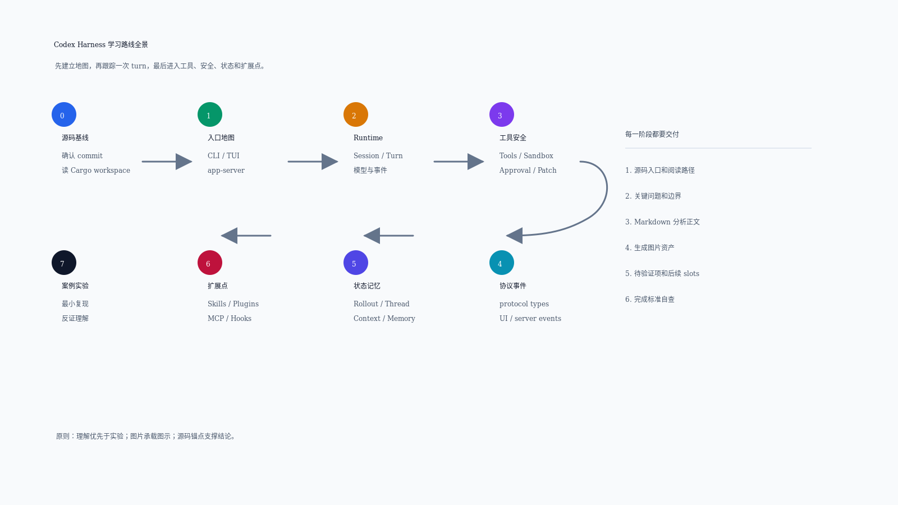
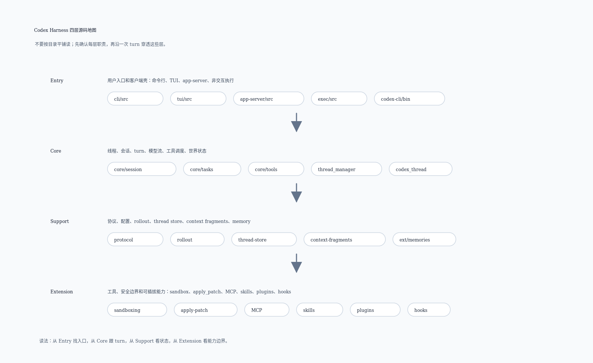

# Codex Harness 学习路线全景

这份路线面向刚开始读 Codex harness 的读者。目标不是先背目录，也不是马上改代码，而是建立一条可复用的阅读路径：先知道系统分几层，再沿着一次用户请求的生命周期读源码，最后把工具、安全、状态、扩展点放回同一张图里。

本文基于本地源码快照：`repo/codex/`。版本锚点见 [source-snapshot.md](source-snapshot.md)。

## 1. 先建立全局心智模型

可以先把 Codex harness 理解成四层：

| 层级 | 你要理解的问题 | 先看的源码入口 |
| --- | --- | --- |
| Entry | 用户从哪里进入系统，请求如何变成内部会话动作 | `repo/codex/codex-rs/cli/src/main.rs`、`repo/codex/codex-rs/tui/src/app.rs`、`repo/codex/codex-rs/app-server/src/lib.rs` |
| Core | 一次 turn 如何被驱动，模型、工具、事件如何串起来 | `repo/codex/codex-rs/core/src/session/`、`repo/codex/codex-rs/core/src/tasks/`、`repo/codex/codex-rs/core/src/tools/` |
| Support | 会话、上下文、配置、rollout、memory 如何支撑主循环 | `repo/codex/codex-rs/protocol/src/`、`repo/codex/codex-rs/rollout/src/`、`repo/codex/codex-rs/context-fragments/src/`、`repo/codex/codex-rs/ext/memories/src/` |
| Extension | skills、plugins、MCP、hooks、connectors 如何声明、装载、过滤并接入 Core | `repo/codex/codex-rs/skills/src/`、`repo/codex/codex-rs/plugin/src/`、`repo/codex/codex-rs/core-plugins/src/`、`repo/codex/codex-rs/codex-mcp/src/`、`repo/codex/codex-rs/hooks/src/`、`repo/codex/codex-rs/connectors/src/` |

学习时不要一开始就从最大文件逐行读。更好的方式是先跟踪“一次用户输入如何变成一个 turn”，再逐步打开工具执行、安全审批、上下文恢复这些分支。

## 2. 给小白的阅读方法

这套代码不是按“一个文件讲完一个功能”的方式组织的。更实用的读法是带着一个请求在系统里走一遍：

1. 先问入口问题：用户从 CLI、TUI、app-server 哪个入口进来？
2. 再问对象问题：这个请求在内部被表示成 thread、session、turn，还是 tool call？
3. 再问循环问题：模型输出之后，系统是直接返回，还是继续执行工具并把结果喂回模型？
4. 再问边界问题：什么时候需要 sandbox、approval、policy、hook？
5. 最后问恢复问题：如果会话被中断、压缩、恢复，哪些状态从 rollout 或 thread store 回来？

每次只跟一条链路。不要同时研究 TUI 渲染、模型协议、sandbox 和 memory；这些概念会互相引用，但学习时要分层拆开。

## 3. 学习路线总览

### Stage 0：环境和源码基线

**目标：** 确认你读的是哪一版 Codex，以及本地目录怎么组织。

**预计投入：** 0.5 天。

**先看文件：**

- `docs/source-snapshot.md`
- `repo/codex/README.md`
- `repo/codex/AGENTS.md`
- `repo/codex/codex-rs/Cargo.toml`

**关键问题：**

- 当前源码来自哪个 commit 或 release？
- Rust workspace 里有哪些 crate？
- 哪些目录是入口，哪些目录是核心逻辑，哪些目录是支撑能力？

**产出：**

- 源码快照确认记录。
- 顶层模块地图草稿。

**完成标准：**

- 能说清 `repo/codex/codex-rs/Cargo.toml` 为什么是第一张源码地图。
- 能解释后续所有分析为什么必须绑定 commit。

### Stage 1：入口层，先知道请求从哪里来

**目标：** 理解 Codex 有哪些入口面，以及这些入口如何把用户请求送进 harness。

**预计投入：** 1-2 天。

**先看文件：**

- `repo/codex/codex-rs/cli/src/main.rs`
- `repo/codex/codex-rs/cli/src/app_cmd.rs`
- `repo/codex/codex-rs/tui/src/app.rs`
- `repo/codex/codex-rs/tui/src/app/startup.rs`
- `repo/codex/codex-rs/app-server/src/lib.rs`
- `repo/codex/codex-rs/app-server/src/message_processor.rs`

**关键问题：**

- CLI、TUI、app-server 分别服务什么场景？
- 用户输入在哪里变成 session 或 thread？
- 本地和远程 app-server 的边界在哪里？

**产出：**

- `docs/entry/README.md`
- `docs/entry/00-entry-map.md`
- `docs/entry/01-cli-tui-app-server-flow.md`
- `docs/entry/02-cli-command-surface.md`
- `docs/entry/03-tui-thread-event-routing.md`
- `docs/entry/04-app-server-json-rpc-control-plane.md`
- `image/architecture/harness-entry-layer-v1.png`
- `image/architecture/entry-cli-tui-app-server-flow-v1.png`
- `image/architecture/entry-cli-command-surface-v1.png`
- `image/architecture/entry-tui-thread-event-routing-v1.png`
- `image/architecture/entry-app-server-json-rpc-control-plane-v1.png`

**完成标准：**

- 能画出 CLI/TUI/app-server 到 core session 的路径。
- 能说明 `app-server` 是控制面入口之一，不只是 CLI 包装。
- 能复盘 CLI dispatch、TUI `AppServerSession`、app-server `thread/start` / `turn/start` 到 Core 的入口链路。
- 能分别解释 CLI 命令面、TUI 线程事件路由和 app-server JSON-RPC 控制面的分工。

### Stage 2：Core runtime，一次 turn 如何跑完

**目标：** 跟踪一次用户请求进入 core 后，如何构造上下文、发起模型调用、接收响应、驱动下一步动作。

**预计投入：** 3-4 天。

**先看文件：**

- `repo/codex/codex-rs/core/src/session/mod.rs`
- `repo/codex/codex-rs/core/src/session/session.rs`
- `repo/codex/codex-rs/core/src/session/turn.rs`
- `repo/codex/codex-rs/core/src/session/turn_input.rs`
- `repo/codex/codex-rs/core/src/tasks/regular.rs`
- `repo/codex/codex-rs/core/src/event_mapping.rs`
- `repo/codex/codex-rs/protocol/src/protocol.rs`

**关键问题：**

- 一次 turn 的输入结构是什么？
- session 如何保存当前世界状态？
- 模型输出如何映射成事件或工具调用？
- 什么时候继续推理，什么时候结束 turn？

**产出：**

- `docs/runtime-loop-analysis.md`
- `image/runtime-loop/runtime-loop-main-v1.png`

**完成标准：**

- 能用源码锚点解释“一次用户输入到一次模型响应”的主路径。
- 能列出主路径之外至少 3 个必须单独看的分支，例如中断、压缩、错误恢复。

### Stage 3：工具执行、sandbox 和审批

**目标：** 理解 harness 如何安全执行命令、补丁、MCP 工具，以及何时需要审批。

**预计投入：** 3-4 天。

**先看文件：**

- `repo/codex/codex-rs/core/src/tools/mod.rs`
- `repo/codex/codex-rs/core/src/tools/orchestrator.rs`
- `repo/codex/codex-rs/core/src/tools/router.rs`
- `repo/codex/codex-rs/core/src/tools/handlers/unified_exec/exec_command.rs`
- `repo/codex/codex-rs/core/src/apply_patch.rs`
- `repo/codex/codex-rs/apply-patch/src/lib.rs`
- `repo/codex/codex-rs/core/src/safety.rs`
- `repo/codex/codex-rs/sandboxing/src/`

**关键问题：**

- Tool 是如何被注册、选择和执行的？
- `exec_command` 与 `apply_patch` 为什么不是同一条路径？
- sandbox policy、approval policy 和用户授权如何共同决定能不能执行？
- 失败、超时、被拒绝时如何回到模型上下文？

**产出：**

- `docs/tool-sandbox-analysis.md`
- `image/tool-sandbox/tool-execution-approval-v1.png`
- Stage 3 之后才开始在 `examples/` 写最小实验。

**完成标准：**

- 能分清工具定义、工具路由、工具执行、审批、安全检查、结果回传这几件事。
- 能解释 `apply_patch` 为什么要单独分析，而不是当作普通 shell 命令。

### Stage 4：协议、事件和 UI 反馈

**目标：** 理解 core、TUI、app-server 之间传递什么事件，哪些状态是用户可见的。

**预计投入：** 2-3 天。

**先看文件：**

- `repo/codex/codex-rs/protocol/src/protocol.rs`
- `repo/codex/codex-rs/protocol/src/items.rs`
- `repo/codex/codex-rs/protocol/src/config_types.rs`
- `repo/codex/codex-rs/tui/src/app_event.rs`
- `repo/codex/codex-rs/tui/src/app/app_server_events.rs`
- `repo/codex/codex-rs/app-server/src/outgoing_message.rs`
- `repo/codex/codex-rs/app-server/src/request_processors/`

**关键问题：**

- 哪些类型是跨 crate 的稳定协议？
- core 事件如何变成 TUI 展示或 app-server 响应？
- 哪些事件属于用户输入、模型输出、工具输出、状态更新？

**产出：**

- `docs/protocol-and-events.md`
- `image/protocol-events/protocol-event-flow-v1.png`

**完成标准：**

- 能把一次 turn 的关键事件从 protocol 类型映射到 UI/app-server 处理入口。
- 能说明哪些协议变更可能是 breaking change。

### Stage 5：状态、rollout、上下文和 memory

**目标：** 理解 Codex 如何保存、恢复和压缩上下文。

**预计投入：** 3-4 天。

**先看文件：**

- `repo/codex/codex-rs/rollout/src/`
- `repo/codex/codex-rs/core/src/rollout.rs`
- `repo/codex/codex-rs/core/src/context/`
- `repo/codex/codex-rs/core/src/context_manager/`
- `repo/codex/codex-rs/context-fragments/src/`
- `repo/codex/codex-rs/ext/memories/src/`
- `repo/codex/codex-rs/core/src/session/rollout_reconstruction.rs`
- `repo/codex/codex-rs/tui/src/app_server_session/rollout_history.rs`

**关键问题：**

- rollout JSONL 记录了什么？
- Thread/session/turn 的边界如何划分？
- context fragment 是如何进入模型上下文的？
- memory 的读写链路和普通上下文注入有什么区别？
- compact/resume 如何避免上下文无限增长？

**产出：**

- `docs/support/README.md`
- `docs/support/00-support-map.md`
- `docs/support/01-protocol-rollout-thread-store.md`
- `image/state-memory/harness-support-layer-v1.png`
- `image/state-memory/support-protocol-rollout-thread-store-v1.png`

**完成标准：**

- 能分清 rollout、thread store、context fragments、memory extension 的职责。
- 能解释恢复会话时哪些信息来自持久化，哪些来自即时上下文。
- 能复盘 `Submission` / `Op` / `EventMsg`、`RolloutItem`、JSONL 解码和 `ThreadStore` 的支撑链路。

### Stage 6：扩展点，理解 Codex 如何被定制

**目标：** 理解 skills、plugins、MCP、hooks、connectors 如何扩展 harness 能力。

**预计投入：** 2-3 天。

**先看文件：**

- `repo/codex/codex-rs/core/src/skills.rs`
- `repo/codex/codex-rs/core/src/plugins/`
- `repo/codex/codex-rs/core/src/mcp.rs`
- `repo/codex/codex-rs/core/src/session/mcp.rs`
- `repo/codex/codex-rs/core/src/hook_runtime.rs`
- `repo/codex/codex-rs/app-server/src/plugin_config_reload.rs`
- `repo/codex/codex-rs/app-server/src/skills_watcher.rs`

**关键问题：**

- Skill 和 AGENTS.md 分别解决什么问题？
- Plugin 如何把 skills、MCP、hooks、apps 组合起来？
- MCP 工具如何进入工具列表，又如何返回给模型？
- Hook 在生命周期里拦截什么？

**产出：**

- `docs/extension/README.md`
- `docs/extension/00-extension-map.md`
- `docs/extension/01-skills-plugins-mcp-hooks.md`
- `image/extension-points/harness-extension-layer-v1.png`
- `image/extension-points/extension-skills-plugins-mcp-hooks-v1.png`

**完成标准：**

- 能区分 prompt/thread context、AGENTS.md、skill、plugin、MCP、hook 的作用范围。
- 能给出一个插件或 skill 从发现到注入上下文的源码路径。
- 能复盘 skill 选择、plugin bundle、MCP binding / prepared call、hook result 和 connector projection 的扩展链路。

### Stage 7：案例复盘和最小实验

**目标：** 用小实验验证前面形成的理解，而不是让实验替代源码阅读。

**预计投入：** 3-5 天。

**建议案例：**

- `apply_patch` 执行链路。
- `exec_command` sandbox/approval 分流。
- compact/resume 上下文恢复。
- MCP tool call 注册与调用。
- multi-agent 状态展示与线程恢复。

**产出：**

- `docs/case-studies/apply-patch-flow.md`
- `docs/case-studies/exec-command-flow.md`
- `docs/case-studies/compact-resume-flow.md`
- `examples/` 下的最小复现实验。

**完成标准：**

- 每个实验都有输入、命令、期望输出、实际结果和源码解释。
- 每个实验只验证一个机制，不混合多个未确认变量。

## 4. 小白学习节奏

建议按 3 周推进：

| 周期 | 重点 | 推荐节奏 |
| --- | --- | --- |
| 第 1 周 | 建图和主路径 | 每天 1 个阶段，先读 README/Cargo/workspace，再读入口和 runtime loop |
| 第 2 周 | 工具、安全、状态 | 每 2 天一个专题，重点画图和补源码锚点 |
| 第 3 周 | 扩展点和案例 | 用小实验复盘前两周结论，补齐不确定项 |

每个阶段的最小动作是：读入口文件、回答关键问题、写 Markdown、生成图片、补源码锚点、列待验证项。

## 5. 推荐沉淀物

后续每个阶段都应产生一个“能被复查”的交付物：

| 阶段 | Markdown 产物 | 图片产物 |
| --- | --- | --- |
| Stage 1 | `docs/entry/00-entry-map.md`、`docs/entry/01-cli-tui-app-server-flow.md`、`docs/entry/02-cli-command-surface.md`、`docs/entry/03-tui-thread-event-routing.md`、`docs/entry/04-app-server-json-rpc-control-plane.md` | `image/architecture/harness-entry-layer-v1.png`、`image/architecture/entry-cli-tui-app-server-flow-v1.png`、`image/architecture/entry-cli-command-surface-v1.png`、`image/architecture/entry-tui-thread-event-routing-v1.png`、`image/architecture/entry-app-server-json-rpc-control-plane-v1.png` |
| Stage 2 | `docs/runtime-loop-analysis.md` | `image/runtime-loop/runtime-loop-main-v1.png` |
| Stage 3 | `docs/tool-sandbox-analysis.md` | `image/tool-sandbox/tool-execution-approval-v1.png` |
| Stage 4 | `docs/protocol-and-events.md` | `image/protocol-events/protocol-event-flow-v1.png` |
| Stage 5 | `docs/support/00-support-map.md`、`docs/support/01-protocol-rollout-thread-store.md` | `image/state-memory/harness-support-layer-v1.png`、`image/state-memory/support-protocol-rollout-thread-store-v1.png` |
| Stage 6 | `docs/extension/00-extension-map.md`、`docs/extension/01-skills-plugins-mcp-hooks.md` | `image/extension-points/harness-extension-layer-v1.png`、`image/extension-points/extension-skills-plugins-mcp-hooks-v1.png` |
| Stage 7 | `docs/case-studies/*.md` | 按案例放入对应主题目录 |

## 6. 不建议一开始做什么

- 不建议直接读完 `core/src/session/` 下所有文件；先从 `turn`、`tasks`、`tools` 的主链路切入。
- 不建议一上来改源码做实验；Stage 3 之前先建立稳定概念图。
- 不建议把官方文档或 README 当作实现真相；它们只能辅助理解，最终以源码为准。
- 不建议把所有内容塞进一篇大文档；每个专题独立成文，并各自维护图片。

## 7. 每篇专题的验收清单

- 是否说明研究问题和非目标。
- 是否列出源码入口、核心类型/函数和关键测试。
- 是否解释输入、状态变化、输出和失败处理。
- 是否引用至少一张生成图片，如果该专题包含流程或架构关系。
- 是否把不确定结论标成待验证。
- 是否给出后续 Follow-up Slots。

## 8. 后续任务建议

当前四层入口已经具备：`docs/entry/README.md`、`docs/core/README.md`、`docs/support/README.md`、`docs/extension/README.md`。下一轮最适合从 Stage 4 的 `docs/protocol-and-events.md` 或 Entry/app-server 子专题继续深挖，把 UI/app-server 事件投影与 Core event stream 进一步串起来。
