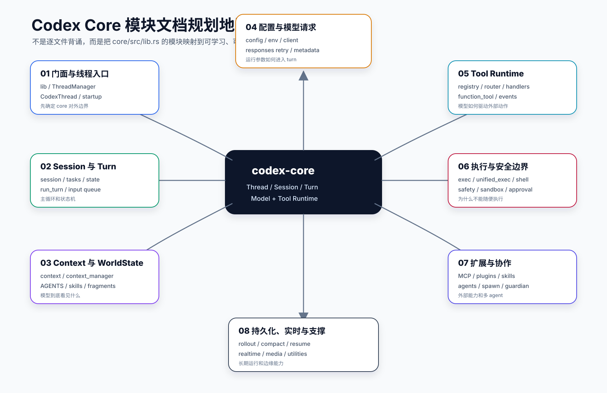
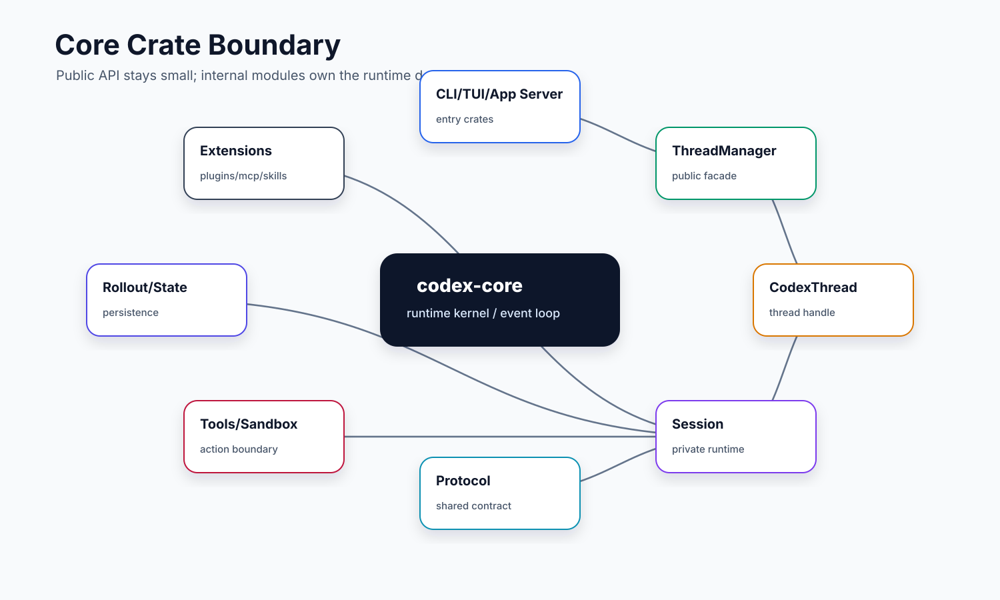
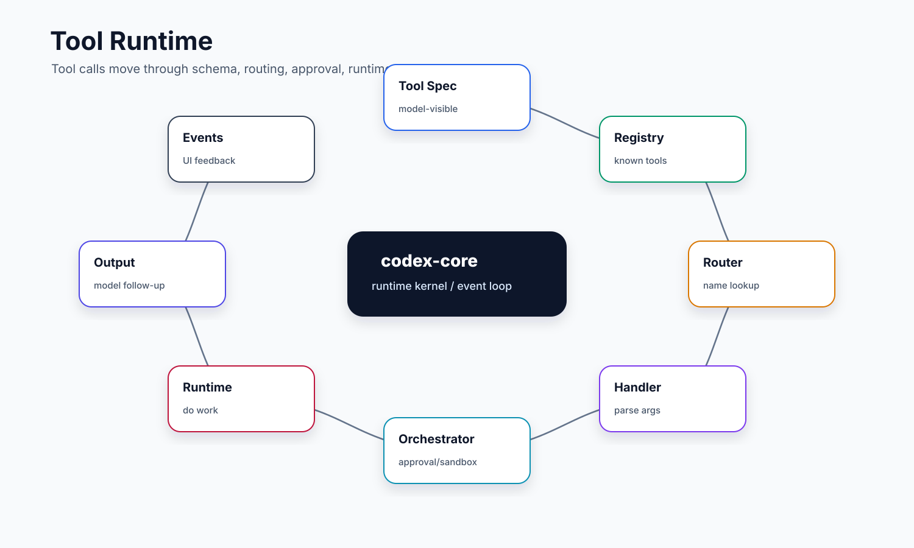
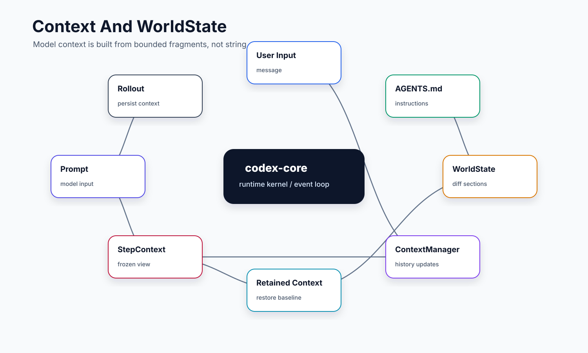
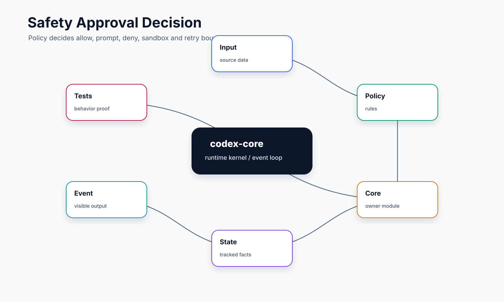

# 00. Core 总览与模块地图

本文是 `codex-rs/core` 文档集的入口。读完这一篇，你应该先建立一个判断：`codex-core` 不是“CLI 的一层封装”，而是 Codex harness 的运行内核。CLI、TUI、app-server、exec 等入口都会把请求交给 core，由 core 负责线程、会话、turn、模型请求、工具执行、安全策略、上下文和恢复。

## 读完你应掌握什么



开篇全局图：这张图先给出 `codex-core` 的系统位置、核心实体和主流程边界。读图时从外部入口进入 `ThreadManager` / `CodexThread`，再沿 `Session -> Turn -> Step -> ToolRuntime -> Event/Rollout` 的主轴看，最后把 context、safety、extensions 当成横切能力叠到主轴上。对应源码入口是 `repo/codex/codex-rs/core/src/lib.rs`、`repo/codex/codex-rs/core/src/thread_manager.rs`、`repo/codex/codex-rs/core/src/codex_thread.rs` 和 `repo/codex/codex-rs/core/src/session/turn.rs`。

- 能解释 `codex-core` 在整个 Codex 仓库中的位置。
- 能从 `core/src/lib.rs` 区分 public API、crate 内部模块和外部依赖。
- 能把 `core/src` 的大量文件归入几个稳定职责区。
- 能理解后续每篇 core 专题为什么按“职责链路”而不是“文件列表”组织。
- 能自己设计一个简化版 agent core crate 的模块边界。

## 这个模块解决什么问题

如果从 `core/src` 直接看，会看到几十个文件和一批子目录：`session`、`tasks`、`tools`、`context`、`config`、`guardian`、`agent`、`plugins`、`unified_exec` 等。小白最容易犯的错误是把这些文件当成平铺功能点：今天读一个 `client.rs`，明天读一个 `safety.rs`，最后仍然不知道一次请求怎么跑完。

正确切入点是：先把 core 看成一个运行内核，它要同时回答五个问题：

1. 外部如何创建或恢复一个 thread？
2. 一次用户输入如何进入 session 和 turn？
3. 模型如何被调用，流式事件如何回到系统？
4. 模型发起工具调用时，core 如何执行、审批、隔离和回传结果？
5. 长会话如何保存、压缩、恢复和扩展？

本节使用上方开篇全局图作为系统位置图，不另放第二张模块图；它把这些问题映射到 core 内部的稳定职责区：入口和 thread 生命周期在外圈收口，session/turn 是执行主轴，tools/safety/context/rollout/extensions 则作为横切能力参与每次运行。

## 源码锚点

- `repo/codex/codex-rs/core/src/lib.rs`：core crate 的门面，定义 `mod`、`pub mod` 和 `pub use`。
- `repo/codex/codex-rs/core/Cargo.toml`：core crate 的依赖边界。
- `repo/codex/codex-rs/Cargo.toml`：整个 Rust workspace 的 crate 地图。
- `repo/codex/codex-rs/core/src/thread_manager.rs`：对外 thread 生命周期入口。
- `repo/codex/codex-rs/core/src/codex_thread.rs`：外部提交输入和读取事件的对象。
- `repo/codex/codex-rs/core/src/session/`：session、turn 和 step 的运行主体。
- `repo/codex/codex-rs/core/src/tools/`：工具注册、路由、执行和事件。

## 核心抽象

| 抽象 | 小白视角 | 设计意义 |
| --- | --- | --- |
| `ThreadManager` | “线程工厂和总管” | 负责创建、恢复、fork、关闭 thread，并连接持久化和执行环境。 |
| `CodexThread` | “外部能拿到的会话句柄” | 提供 `submit`、`next_event` 等方法，隐藏 session 内部实现。 |
| `Session` | “一次对话的运行容器” | 管输入队列、turn、工具、上下文、状态和事件输出。 |
| `SessionTask` | “可被 session 调度的工作单元” | regular、compact、review、user shell 等任务通过同一接口运行。 |
| `TurnContext` | “一次用户 turn 的上下文快照” | 固定环境、权限、模型、工具、MCP、telemetry 和 metadata。 |
| `StepContext` | “一次模型采样的上下文快照” | 一次 turn 里可能多次采样，每个 step 需要冻结工具和配置视图。 |
| `ToolRegistry` | “工具目录” | 收集内置工具、动态工具、MCP 工具，并执行统一 handler。 |
| `RolloutRecorder` | “执行现场记录器” | 把关键事件写入可恢复、可审计的历史。 |

本节是总览表，核心结构定义不在表内展开；具体实体代码证据紧跟在下一节，覆盖 `lib.rs` public API、`ThreadManagerState`、sampling request 和 `WorldStateSection`。

## 核心代码片段

### 1. core crate 的 public API 门面

Source: `repo/codex/codex-rs/core/src/lib.rs::public re-exports`
Line range: `repo/codex/codex-rs/core/src/lib.rs:44-51, 121-125`

```rust
pub use codex_thread::BackgroundTerminalInfo;
pub use codex_thread::CodexThread;
pub use codex_thread::CodexThreadSettingsOverrides;
pub use codex_thread::GuardianAuthorizationVersion;
pub use codex_thread::GuardianRootMessage;
pub use codex_thread::GuardianRootSnapshot;
pub use codex_thread::ThreadConfigSnapshot;
pub use session::turn_context::TurnContext;
// ...
pub use thread_manager::ForkSnapshot;
pub use thread_manager::NewThread;
pub use thread_manager::StartThreadOptions;
pub use thread_manager::ThreadManager;
pub use thread_manager::ThreadShutdownReport;
```

这段说明 `codex-core` 的对外边界不是整个 `core/src` 目录，而是经过 `pub use` 收口的一组稳定对象。入口层主要拿到 `ThreadManager`、`CodexThread`、启动/恢复参数和少量状态快照；`session` 虽然是运行主体，但只通过受控类型暴露必要信息。



这张图对应上面的 `lib.rs` 证据：public API 通过 `pub use` 汇出，crate 内部模块继续服务 session、tools、context、config 和扩展系统，入口层不需要直接依赖这些内部文件。

### 2. ThreadManager 持有运行内核的共享服务

Source: `repo/codex/codex-rs/core/src/thread_manager.rs::ThreadManagerState`
Line range: `repo/codex/codex-rs/core/src/thread_manager.rs:342-370`

```rust
/// Shared, `Arc`-owned state for [`ThreadManager`]. This `Arc` is required to have a single
/// `Arc` reference that can be downgraded to by `AgentControl` while preventing every single
/// function to require an `Arc<&Self>`.
pub(crate) struct ThreadManagerState {
    threads: Arc<RwLock<HashMap<ThreadId, Arc<CodexThread>>>>,
    thread_created_tx: broadcast::Sender<ThreadId>,
    thread_id_generator: ThreadIdGenerator,
    auth_manager: Arc<AuthManager>,
    models_manager: SharedModelsManager,
    git_root_discovery: Arc<GitRootDiscovery>,
    environment_manager: Arc<EnvironmentManager>,
    starting_mcp_runtimes: std::sync::Mutex<Vec<std::sync::Weak<AtomicBool>>>,
    skills_service: Arc<HostSkillsService>,
    plugins_manager: Arc<PluginsManager>,
    mcp_manager: Arc<McpManager>,
    code_mode_session_provider: Arc<dyn CodeModeSessionProvider>,
    extensions: Arc<ExtensionRegistry<Config>>,
    user_instructions_provider: Arc<dyn UserInstructionsProvider>,
    image_store: Arc<dyn AttachmentStore>,
    thread_store: Arc<dyn ThreadStore>,
    agent_graph_store: Option<Arc<dyn AgentGraphStore>>,
    attestation_provider: Option<Arc<dyn AttestationProvider>>,
    external_time_provider: Option<Arc<dyn TimeProvider>>,
    session_source: SessionSource,
    installation_id: String,
    analytics_events_client: Option<AnalyticsEventsClient>,
    // Captures submitted ops for testing purpose when test mode is enabled.
    ops_log: Option<SharedCapturedOps>,
}
```

这段把“运行内核”的横切资源摊开了：thread store、模型管理、环境管理、MCP、skills、plugins、extensions、image store、agent graph 和 analytics 都由 `ThreadManagerState` 统一挂接。后续 `Session` 和工具运行能共享这些服务，而不是让每个入口各自初始化一套。

### 3. 一次 sampling request 连接 prompt、工具 runtime 和模型会话

Source: `repo/codex/codex-rs/core/src/session/turn.rs::run_sampling_request`
Line range: `repo/codex/codex-rs/core/src/session/turn.rs:1425-1466`

```rust
let turn_context = Arc::clone(&step_context.turn);
let base_instructions = sess.get_prompt_base_instructions().await;

let tool_runtime = ToolCallRuntime::new(
    Arc::clone(&sess),
    Arc::clone(&step_context),
    Arc::clone(&turn_diff_tracker),
);
let _code_mode_worker = sess.services.code_mode_service.start_turn_worker(
    &sess,
    Arc::clone(&step_context),
    Arc::clone(&turn_diff_tracker),
);
let max_retries = turn_context.provider.info().stream_max_retries();
let mut retry_state = ResponsesStreamRetryState::default();
// ...
loop {
    // A retry must not attribute the next tool call to the previous response.
    turn_context
        .extension_data
        .remove::<codex_api::ResponseId>();
    let prompt_input = if let Some(input) = initial_input.take() {
        input
    } else {
        sess.clone_history()
            .await
            .for_prompt(&step_context.settings.model_info.input_modalities)
    };
    let mut prompt_input = prompt_input;
    if let Some(executed_tool_calls) = sess.services.executed_tool_calls.as_ref()
        && executed_tool_calls
            .attach_pending_to_prompt(&mut prompt_input, &mut executed_tool_calls_by_output)
    {
        codex_protocol::models::bound_executed_tool_calls_for_prompt(&mut prompt_input);
    }
    let prompt = build_prompt(
        prompt_input,
        step_context.as_ref(),
        base_instructions.clone(),
    );
```

这段显示 core 的主轴不是单纯“转发给模型”：在 sampling 前会创建 `ToolCallRuntime`，启动 code mode worker，读取 history 构造 prompt，并把已执行工具调用补回 prompt。模型请求、工具系统、历史上下文在这里合流。

## 主流程


这张总览图要和下面五段主流程一起读：外部入口先进入 thread 生命周期，再进入 session/turn 主轴；工具、安全、context、rollout 和扩展能力围绕这条主轴提供执行、约束和恢复能力。更细的 session、工具、context 和 rollout 流程图会在后续专题就近展开。本节无需新增代码片段；流程对应的 public API、`ThreadManagerState`、sampling request 和 `WorldStateSection` 已在上一节以 Source/Line range 固定。

### 1. 外部入口进入 core

CLI、TUI、app-server 不直接实现 agent 主循环。它们负责解析参数、展示 UI、承接外部协议，然后调用 core 暴露出来的 `ThreadManager`、`CodexThread`、`StartThreadOptions` 等 API。

这一层的设计思想是：入口可以很多，但运行内核只有一套。否则 CLI、TUI、app-server 会各自实现一份对话状态机，后续工具、安全和恢复会互相漂移。

无需代码片段：本小节是入口层定位，具体 public API 证据已在上方 `core/src/lib.rs` 和 `ThreadManagerState` 片段中给出。

### 2. core 建立 thread 和 session

`ThreadManager` 是第一层生命周期对象。它创建 thread store、rollout recorder、model client、environment manager、agent control 等服务，再创建 `CodexThread`。`CodexThread` 对外暴露 submit/event 接口，内部把输入交给 `Session`。

这个边界让上层只关心“给 thread 输入”和“从 thread 拿事件”，不需要知道 turn 怎么被拆成 step，也不需要自己管理工具执行。

### 3. session 执行 task 和 turn

`Session` 维护输入队列和运行状态。不同任务通过 `SessionTask` 抽象进入，例如普通对话、压缩、review、用户 shell。普通任务最终会进入 `run_turn`：构造 prompt，调用模型，处理输出，如果有工具调用就执行工具并继续下一轮采样。

### 4. 工具和安全横切主流程



这张工具运行图在总览层只看横切关系：模型输出 tool call 后，core 先经过 router/handler，再进入统一执行外壳；安全审批和 sandbox 不是某个工具的私有逻辑，而是横跨 shell、patch、MCP 和 multi-agent 的公共路径。

工具系统不是 session 的附属函数。工具要先被 registry 暴露给模型，再被 router 找到 handler，再由 orchestrator 接入审批、sandbox 和执行。`exec_command`、`apply_patch`、MCP tool、multi-agent tool 都需要走类似的统一生命周期，但每种工具有自己的参数和安全判断。

无需代码片段：本节只做总览级横切定位；工具实体和 orchestrator 分支在 `04-tool-runtime.md` 与 `06-safety-sandbox-approval.md` 中展开。

### 5. 状态和扩展支撑长期运行



这张状态图在总览层用来串起 context/world state、rollout 和扩展能力：模型看到的环境、权限、插件、工具等不是散落在历史里的普通文本，而是可以 snapshot、diff 和恢复的结构化状态。

context/world state 控制模型看到什么，rollout/compaction 控制历史如何持久化和压缩，MCP/plugins/skills/hooks 控制外部能力如何注入，guardian/attestation 控制高风险动作如何被审查。这些模块不一定在每个 turn 都显眼，但它们决定了 harness 是否能长期、可靠、安全地运行。

Source: `repo/codex/codex-rs/core/src/context/world_state/mod.rs::WorldStateSection`
Line range: `repo/codex/codex-rs/core/src/context/world_state/mod.rs:228-262`

```rust
pub(crate) trait WorldStateSection: Send + Sync + 'static {
    const ID: &'static str;
    type Snapshot: DeserializeOwned + Serialize;

    fn snapshot(&self) -> Self::Snapshot;

    /// Whether the section contributes comparison state to persisted rollouts.
    fn should_persist(&self) -> bool {
        true
    }

    fn matches_legacy_fragment(_role: &str, _text: &str) -> bool {
        false
    }

    fn has_retained_fragment_matcher() -> bool {
        false
    }

    fn render_diff(
        &self,
        previous: PreviousSectionState<'_, Self::Snapshot>,
    ) -> Option<Box<dyn ContextualUserFragment>>;
}
```

这段实体定义说明 world state 不是普通字符串拼接，而是有稳定 `ID`、可序列化 `Snapshot`、持久化开关、legacy/retained 匹配和 diff 渲染能力的结构化 section。理解这个类型形态后，再看 context、rollout 和恢复逻辑才知道“模型看到的状态”如何被保存和重放。

## 失败模式与边界条件



这张安全判定图用来定位下面失败模式中“入口绕过、工具失控、权限漂移”的共同风险：只要请求离开 thread/session 主轴，就会绕过统一的 approval、sandbox、context 和 rollout 记录。

无需代码片段：本节是总览级 failure checklist，具体失败分支的代码证据分散在 `01` 的 lifecycle、`04` 的 tool orchestrator、`06` 的 approval/sandbox 和 `07` 的 patch safety 专题中。

- 如果入口层绕过 core 直接实现状态机，CLI/TUI/app-server 行为会分叉。
- 如果 `CodexThread` 暴露过多 session 内部细节，上层会开始依赖不稳定状态。
- 如果工具系统直接嵌在 `run_turn` 里，审批、sandbox、MCP、multi-agent 会快速失控。
- 如果上下文只是字符串拼接，就无法做大小限制、增量 diff、恢复和安全标注。
- 如果 rollout 只做日志而不能恢复，长会话和 fork 会缺少可靠基线。
- 如果所有模块都塞进 `codex-core` public API，会让 core 变成不可维护的巨型依赖。

## 图示

本篇图示已放在对应解释附近：`Codex core 模块地图` 位于开篇和“主流程”，`Core crate 边界` 位于 `lib.rs` public API 代码证据之后，`Tool runtime`、`Context 与 WorldState`、`Safety 与审批判定链` 分别贴近横切能力和失败边界。这里仅保留图示章节作为本地文档契约入口，避免把图片重新集中成远离正文的索引。

## 复设计练习

假设你要设计一个简化版 coding agent core crate，请写出你的模块划分：

1. 哪个对象负责创建/恢复会话？
2. 哪个对象负责接收用户输入和输出事件？
3. 哪个对象负责一次模型请求？
4. 工具注册、工具执行、安全审批分别放在哪？
5. 长会话历史和上下文压缩由谁负责？
6. 哪些类型应该成为 public API，哪些只能留在 crate 内部？

一个合格设计应该能画出 `Client Entry -> ThreadManager -> CodexThread -> Session -> Turn -> ToolRuntime -> Event` 的主路径。

## 检查题

1. `core/src/lib.rs` 中 `pub use` 的作用是什么？
2. 为什么 `ThreadManager` 和 `CodexThread` 不能合并成一个对象？
3. 为什么 `SessionTask` 比直接调用 `run_turn` 更适合长期演进？
4. 哪些模块属于主流程，哪些模块属于横切支撑？
5. 如果以后新增一个工具，至少会经过哪些 core 模块？

### 答案要点

1. `pub use` 定义 core 对外暴露的稳定 API，例如 `ThreadManager`、`CodexThread`、`ModelClient`；普通 `mod` 更多是 crate 内部实现边界。
2. `ThreadManager` 持有全局服务和创建/恢复/fork 能力，`CodexThread` 是单个 thread 的提交输入和读取事件句柄；合并后上层会被迫感知 session 内部状态。
3. `SessionTask` 让 regular、compact、review、user shell 等任务共享调度/abort/状态收口，而不是把所有任务写进一个 `run_turn` 分支树。
4. 主流程包括 `thread_manager`、`codex_thread`、`session`、`tasks`、`tools`；横切支撑包括 config、context/world state、rollout/compaction、safety、MCP/plugins/skills、guardian、observability。
5. 新工具通常要经过 tool spec/handler、registry/router、orchestrator、approval/sandbox、runtime output、event/history 回传这些边界。

## Follow-up Slots

- 补一张 `core/src/lib.rs` public API 与 private module 的详细边界图。
- 把 `core/Cargo.toml` 依赖按 runtime、protocol、tools、security、extension、observability 分类。
- 对照 `repo/codex/AGENTS.md` 中 “resist adding code to codex-core” 的规则，分析 core crate 膨胀风险。
