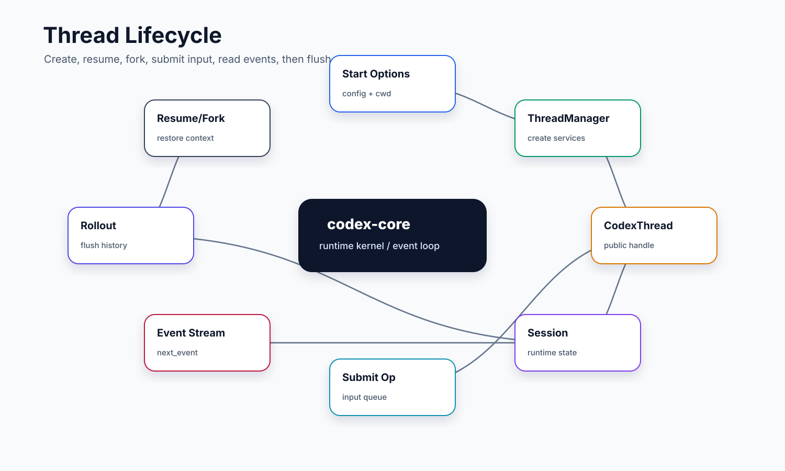

# 01. ThreadManager 与 CodexThread

本文讲 `codex-core` 最外层的会话对象。小白可以先把它理解为两层：`ThreadManager` 是“线程工厂和总管”，`CodexThread` 是“调用方拿到的线程句柄”。外部入口不应该直接操作 `Session`，而是通过这两个对象启动、恢复、fork、提交输入和接收事件。

## 读完你应掌握什么



开篇全局图：这张图先把本文压缩成一个 thread 生命周期模型：入口只接触 `ThreadManager` 和 `CodexThread`，启动路径会把 config、history、environment、rollout 和 session 组装起来，恢复和 fork 则从持久化历史重新进入同一条运行边界。对应源码入口是 `repo/codex/codex-rs/core/src/thread_manager.rs`、`repo/codex/codex-rs/core/src/codex_thread.rs` 和 `repo/codex/codex-rs/core/src/session/session.rs`。

- 能解释 `ThreadManager`、`CodexThread`、`Session` 三者的职责边界。
- 能说清 start、resume、fork 的差异。
- 能理解为什么 `CodexThread` 对外只暴露提交输入和读取事件这样的窄接口。
- 能知道 thread store、rollout recorder、agent control、environment manager 在创建 thread 时如何被接上。
- 能设计一个简化版 thread 生命周期管理器。

## 这个模块解决什么问题

一个 coding agent 不是一次函数调用。它有长期会话、有历史、有多个 turn、有可能 fork、有可能恢复，也可能被 TUI、CLI、app-server 等不同入口使用。如果每个入口都自己管理这些状态，系统会很快分裂。

`ThreadManager` 解决的是“全局资源和线程生命周期”的问题：它知道怎么创建新的 thread、从历史恢复 thread、为 thread 配置 model client、rollout、环境和 agent registry。`CodexThread` 解决的是“给上层一个稳定句柄”的问题：上层可以 `submit` 一个 `Op`，可以 `next_event` 读取事件，但不需要知道 session 内部队列和 turn 执行细节。

## 源码锚点

- `repo/codex/codex-rs/core/src/lib.rs`：re-export `ThreadManager`、`CodexThread`、`NewThread`、`StartThreadOptions`。
- `repo/codex/codex-rs/core/src/thread_manager.rs`：`NewThread`、`ThreadManager`、`ThreadManagerState`、thread store 和 agent graph 相关初始化。
- `repo/codex/codex-rs/core/src/codex_thread.rs`：`CodexThread`、`submit`、`submit_with_trace`、`next_event`、rollout flush、thread settings override。
- `repo/codex/codex-rs/core/src/session/session.rs`：`Session` 的内部运行状态。
- `repo/codex/codex-rs/core/src/thread_manager_tests.rs`：thread 生命周期、resume/fork 和状态恢复测试。
- `repo/codex/codex-rs/core/src/client_tests.rs`：部分 client/thread 行为测试。

## 核心抽象

| 抽象 | 小白视角 | 关键职责 |
| --- | --- | --- |
| `ThreadManager` | “总工厂” | 负责创建、恢复、fork thread，持有共享服务和全局状态。 |
| `ThreadManagerState` | “工厂内部状态” | 保存 thread store、环境管理、模型管理、agent graph store、image store 等共享资源。 |
| `NewThread` | “启动后的返回包” | 返回新 thread 的句柄、id、初始配置和必要元信息。 |
| `CodexThread` | “上层可操作的会话句柄” | 暴露 `submit`、`next_event`、flush、shutdown 等接口。 |
| `CodexThreadSettingsOverrides` | “线程级动态设置覆盖” | 用于运行中调整 thread settings，而不是重建整个 session。 |
| `Session` | “真正执行 turn 的内部引擎” | 不直接暴露给入口层，避免上层耦合内部状态机。 |

本节无需单独新增图；开篇生命周期图已经覆盖这些抽象的拥有关系，下一节的 `ThreadManager`、`CodexThread` 和 resume/fork 源码片段负责证明这些边界。

## 核心代码片段

### 1. ThreadManager 是创建 thread 的外层生命周期对象

Source: `repo/codex/codex-rs/core/src/thread_manager.rs::ThreadManager / StartThreadOptions`
Line range: `repo/codex/codex-rs/core/src/thread_manager.rs:224-245`

无需图：本片段是实体定义局部证据，开篇 lifecycle 图已经展示 `ThreadManager` 在整体生命周期中的位置。

```rust
/// [`ThreadManager`] is responsible for creating threads and maintaining
/// them in memory.
pub struct ThreadManager {
    state: Arc<ThreadManagerState>,
    _test_codex_home_guard: Option<TempCodexHomeGuard>,
}

pub struct StartThreadOptions {
    pub config: Config,
    pub allow_provider_model_fallback: bool,
    pub initial_history: InitialHistory,
    pub history_mode: Option<ThreadHistoryMode>,
    pub session_source: Option<SessionSource>,
    pub thread_source: Option<ThreadSource>,
    pub dynamic_tools: Vec<codex_protocol::dynamic_tools::DynamicToolSpec>,
    pub metrics_service_name: Option<String>,
    pub parent_trace: Option<W3cTraceContext>,
    pub environments: Option<Vec<TurnEnvironmentSelection>>,
    pub thread_extension_init: ExtensionDataInit,
    pub client_mcp_extensions: ClientMcpExtensions,
    /// Thread ID reserved before startup so the caller can associate host-owned state with it.
    pub reserved_thread_id: Option<ThreadId>,
```

这段证明 `ThreadManager` 自己只持有共享状态的 `Arc`，真正的启动差异通过 `StartThreadOptions` 表达。`initial_history`、`session_source`、`thread_source`、`dynamic_tools` 和环境选择都在启动边界一次性传入，避免上层直接拼装 `Session`。

### 2. CodexThread 对外保持提交与事件读取的窄接口

Source: `repo/codex/codex-rs/core/src/codex_thread.rs::CodexThread`
Line range: `repo/codex/codex-rs/core/src/codex_thread.rs:177-224, 569-570`

```rust
pub struct CodexThread {
    pub(crate) session: Arc<Session>,
    pub(crate) io: SessionIo,
    pub(crate) session_source: SessionSource,
    session_configured: SessionConfiguredEvent,
    rollout_path: Option<PathBuf>,
    out_of_band_elicitations: Mutex<OutOfBandElicitations>,
    _diagnostics_guard: GaugeGuard,
}

// ...

/// Conduit for the bidirectional stream of messages that compose a thread
/// (formerly called a conversation) in Codex.
impl CodexThread {
    pub(crate) fn new(
        session: Arc<Session>,
        io: SessionIo,
        session_configured: SessionConfiguredEvent,
        rollout_path: Option<PathBuf>,
        session_source: SessionSource,
    ) -> Self {
        Self {
            session,
            io,
            session_source,
            session_configured,
            rollout_path,
            out_of_band_elicitations: Mutex::new(OutOfBandElicitations::default()),
            _diagnostics_guard: LIVE_THREADS.track(),
        }
    }

    pub async fn submit(&self, op: Op) -> CodexResult<String> {
        self.io.submit(op).await
    }
```

这段说明 `CodexThread` 是句柄而不是执行器本体：它内部持有 `Session` 和 `SessionIo`，但 public 提交和读取路径只是转交给 IO 层。调用方不需要知道 active turn、input queue 或工具调度细节。

### 3. resume 和 fork 都先形成历史，再启动新的运行实例

Source: `repo/codex/codex-rs/core/src/thread_manager.rs::resume_thread_from_rollout / fork_thread`
Line range: `repo/codex/codex-rs/core/src/thread_manager.rs:1046-1063, 1255-1282`

无需图：本片段只证明 resume/fork 的共同历史入口和不同调用分支，生命周期图已在开篇和主流程中覆盖这条分支。无需代码片段补充：当前片段已经覆盖该持久化入口的关键代码。

```rust
pub async fn resume_thread_from_rollout(
    &self,
    config: Config,
    rollout_path: PathBuf,
    auth_manager: Arc<AuthManager>,
    parent_trace: Option<W3cTraceContext>,
    client_mcp_extensions: ClientMcpExtensions,
) -> CodexResult<NewThread> {
    let initial_history = self.initial_history_from_rollout_path(rollout_path).await?;
    Box::pin(self.resume_thread_with_history(
        config,
        initial_history,
        auth_manager,
        parent_trace,
        client_mcp_extensions,
    ))
    .await
}

// ...

/// Fork an existing thread by snapshotting rollout history according to
/// `snapshot` and starting a new thread with identical configuration
/// (unless overridden by the caller's `config`). The new thread will have
/// a fresh id.
pub async fn fork_thread<S>(
    &self,
    snapshot: S,
    config: Config,
    path: PathBuf,
    thread_source: Option<ThreadSource>,
    parent_trace: Option<W3cTraceContext>,
) -> CodexResult<NewThread>
where
    S: Into<ForkSnapshot>,
{
    let snapshot = snapshot.into();
    let history = self.initial_history_from_rollout_path(path).await?;
```

这段把 resume/fork 的共同点和差异同时暴露出来：两者都从 rollout 读取 `InitialHistory`，resume 直接继续该历史，fork 还要结合 `ForkSnapshot` 决定复制哪一段。随后它们都会走创建 thread 的路径，生成新的 `NewThread` 返回给调用方。

## 主流程


这张图先看上半段 start/resume/fork 入口，再看 `ThreadManager` 如何把 thread store、rollout、environment 和 `Session` 接成一个新的 `CodexThread`。下方事件出口对应 `CodexThread` 给 UI/CLI 暴露的稳定交互边界。无需代码片段：生命周期入口、句柄接口和恢复/fork 分支已在上一节用 Source/Line range 固定。

### 1. 入口准备启动参数

CLI/TUI/app-server 入口先把用户参数、配置、环境、resume/fork 目标整理成 `StartThreadOptions` 或相近结构。入口层关心的是用户体验和协议，不应该承担核心生命周期。

无需代码片段：本小节只是入口职责定位，`StartThreadOptions` 定义已经在核心代码片段 1 中展示。

### 2. ThreadManager 创建资源

`ThreadManager` 根据配置创建或复用一组服务：thread store、rollout recorder、model client、environment manager、MCP manager、agent control 等。这里的重点不是“new 一个对象”，而是把一次长期会话需要的资源全部接好。

### 3. CodexThread 暴露窄接口

`CodexThread` 对上层暴露的核心是提交和读取：调用方提交 `Op`，再从 `next_event` 拿 `Event`。这个接口设计让 TUI、CLI、app-server 可以共享 core 行为，而不是各自实现事件循环。

### 4. Session 在内部运行

`CodexThread` 内部持有 session 相关通道。输入进入 session 队列后，session 再决定是启动普通 turn、steer 当前 turn、暂停、恢复、执行 user shell，还是触发其它 task。

无需代码片段：本文只讲 thread 外层生命周期，session 内部状态机的代码证据集中到 `02-session-turn-loop.md`。

### 5. 恢复和 fork 依赖持久化

resume/fork 不是重新开始，而是从 thread store 和 rollout 里恢复历史、上下文、配置和必要状态。这个设计让长期任务可以跨进程继续，也让 fork 可以继承一个已有现场。

无需代码片段：本小节的实现证据是上方 `resume_thread_from_rollout` / `fork_thread` 片段；不再重复粘贴。无需图：开篇 lifecycle 图已经覆盖 resume/fork 分支。

## 失败模式与边界条件


本节复用 thread 生命周期图定位失败点：失败通常发生在 start/resume/fork 的历史来源、`CodexThread` 对外句柄、事件出口或 flush/shutdown 边界。无需代码片段：具体可复查上一节的 `resume_thread_from_rollout`、`fork_thread` 和 `CodexThread::submit` / `next_event` 片段。

- 恢复目标不存在：thread store 找不到对应 thread，需要返回明确错误，而不是创建空会话冒充恢复。
- fork 时权限/环境覆盖不当：可能把父会话的安全策略污染到子会话，或反过来覆盖远端保存设置。
- 上层持有过多内部状态：如果 TUI 直接操作 session，就会绕开 rollout、event 和安全边界。
- event 读取消费不及时：后台任务仍可能继续运行，但 UI 体验和用户反馈会滞后。
- shutdown/flush 不完整：会影响 resume 时的历史完整性。

## 图示

`Thread lifecycle` 已作为开篇全局图和主流程/失败边界图放在正文附近；这里仅保留图示章节说明，不再重复集中展示。

## 复设计练习

请设计一个最小 thread 管理系统，满足：

1. 可以 start 新 thread。
2. 可以 resume 已有 thread。
3. 可以 fork thread。
4. 上层只能提交 input 和读取 event。
5. 内部 session 可以更换实现，不影响入口层。

你的设计里至少要说明 thread id、event channel、input queue、history store 和 shutdown 由谁持有。

## 检查题

1. 为什么 `ThreadManager` 比 `Session` 更适合作为上层入口？
2. `CodexThread::submit` 和 `CodexThread::next_event` 形成了什么边界？
3. start、resume、fork 的状态来源有什么不同？
4. 如果没有 rollout flush，恢复时会丢什么？
5. 如果你要接一个新 UI，应该依赖 `CodexThread` 还是 `Session`？

### 答案要点

1. `ThreadManager` 管全局资源、thread store、environment manager、agent graph 和 start/resume/fork；`Session` 是单个 thread 内部执行引擎，不适合暴露给多入口。
2. `submit` 是输入进入 core 的窄入口，`next_event` 是上层观察 core 的事件出口；上层不直接触碰 turn 队列、tool runtime 或 rollout 细节。
3. start 从 `StartThreadOptions` 和当前配置创建新会话；resume 从 thread store / rollout 恢复已有历史；fork 先 flush 父 thread，再按策略裁剪和继承父历史。
4. 未 flush 的模型输出、事件、上下文 checkpoint 或工具事实可能只在内存中，resume/fork 会拿不到可靠基线。
5. 新 UI 应依赖 `CodexThread` / `ThreadManager`，因为它们提供稳定协议边界；直接依赖 `Session` 会耦合内部状态机并绕过事件、rollout 和安全收口。

## Follow-up Slots

- 逐行分析 `ThreadManager::new_thread` 和 resume/fork 相关函数。
- 对照 app-server 的 thread request processor，看远端入口如何调用 core。
- 画出 thread store、rollout recorder 和 session channel 的对象所有权图。
