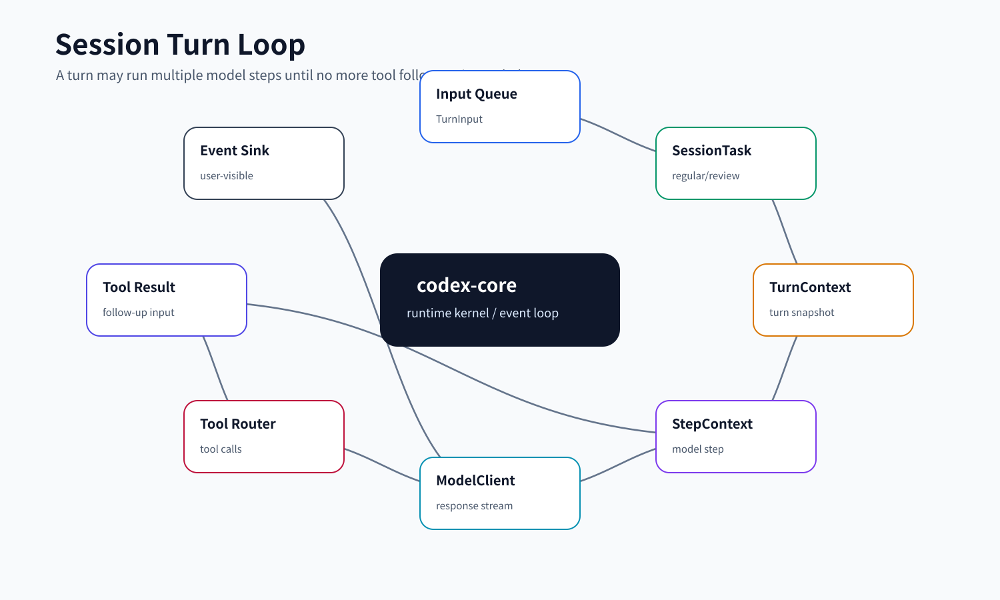
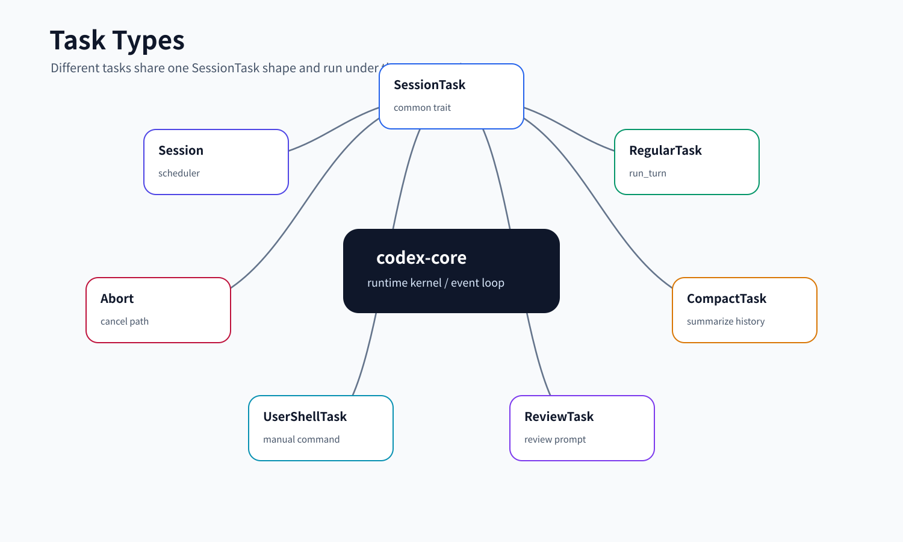

# 02. Session / Turn / Task 主循环

本文讲 Codex core 的主干：一次用户输入如何进入 session，被包装成 task，形成 turn context，调用模型，处理流式响应，遇到工具调用后继续下一步。理解这条链路后，再看工具、安全、上下文、rollout 都会更清楚。

## 读完你应掌握什么



开篇全局图：这张图先建立本文的执行主轴：`TurnInputRequest` 进入 session 队列，被包装成 `SessionTask`，再在 `TurnContext` / `StepContext` 边界中调用模型、执行工具、写回事件和 rollout。对应源码入口是 `repo/codex/codex-rs/protocol/src/turn_input.rs`、`repo/codex/codex-rs/core/src/tasks/mod.rs`、`repo/codex/codex-rs/core/src/session/turn.rs` 和 `repo/codex/codex-rs/core/src/session/mod.rs`。

- 能解释 `Session`、`SessionTask`、`TurnContext`、`StepContext` 的分工。
- 能描述一次普通用户输入从 `TurnInput` 到 `run_turn` 的主路径。
- 能说明为什么一次 turn 内可能包含多个 step。
- 能区分 regular、compact、review、user shell 等 task 类型。
- 能设计一个简化版 agent runtime loop。

## 这个模块解决什么问题

模型对话看起来像“一问一答”，但 coding agent 的真实运行更像一个循环：

1. 用户输入进入队列。
2. runtime 为本轮固定配置、环境、权限、工具和上下文。
3. 模型开始采样并流式返回。
4. 如果模型要求工具，core 调度工具执行。
5. 工具结果再回到模型输入，模型继续采样。
6. 没有后续动作或被中断时，turn 结束。

`Session` 负责把这个循环组织起来，`SessionTask` 让不同类型的任务都能进入同一调度框架，`TurnContext`/`StepContext` 则保证每轮和每次模型请求有稳定快照。

## 源码锚点

- `repo/codex/codex-rs/protocol/src/turn_input.rs`：`TurnInput`、`TurnInputRequest`、`TurnInputMode`、`TurnInputSubmission`。
- `repo/codex/codex-rs/core/src/session/session.rs`：`Session` 内部状态和服务集合。
- `repo/codex/codex-rs/core/src/session/mod.rs`：session 主实现、turn 启动、事件发送、上下文贡献和持久化。
- `repo/codex/codex-rs/core/src/session/turn.rs`：`run_turn`、模型采样循环、工具执行和 follow-up。
- `repo/codex/codex-rs/core/src/session/turn_context.rs`：`TurnContext`、`NewTurnContextOptions`、turn 环境快照。
- `repo/codex/codex-rs/core/src/session/step_context.rs`：`StepContext`，单次 sampling request 的冻结视图。
- `repo/codex/codex-rs/core/src/session/step_settings.rs`：`StepSettings`、`ResolvedStepSettings` 和 runtime 更新约束。
- `repo/codex/codex-rs/core/src/session/input_queue.rs`：输入队列和 steer/start-if-idle 行为。
- `repo/codex/codex-rs/core/src/tasks/mod.rs`：`SessionTask` trait 和 task 生命周期。
- `repo/codex/codex-rs/core/src/tasks/regular.rs`：普通用户 turn 如何调用 `run_turn`。
- `repo/codex/codex-rs/core/src/tasks/compact.rs`、`tasks/review.rs`、`tasks/user_shell.rs`：特殊 task 类型。
- `repo/codex/codex-rs/core/src/session/tests.rs`、`session/turn_tests.rs`、`tasks/mod_tests.rs`：主循环行为测试。

## 核心抽象

| 抽象 | 小白视角 | 关键职责 |
| --- | --- | --- |
| `TurnInput` | “用户或系统塞进 turn 的输入” | 表示用户文本、响应项、工具输出、agent 通信等输入类型。 |
| `TurnInputMode` | “这次输入怎么进入当前运行状态” | start if idle、steer、start or steer 等模式。 |
| `InputQueue` | “session 的入口队列” | 管理排队、steer、唤醒和 activity 标记。 |
| `SessionTask` | “session 可调度任务” | 统一 regular、compact、review、user shell 等任务的 run/abort 行为。 |
| `Session` | “运行容器” | 持有状态、工具、上下文、rollout、事件 channel 和服务集合。 |
| `TurnContext` | “一次 turn 的长生命周期快照” | 固定 turn id、环境、配置、工具、metadata、telemetry。 |
| `StepContext` | “一次模型采样的短生命周期快照” | 固定 step settings、MCP/tool router、环境和 telemetry。 |
| `run_turn` | “主循环函数” | 构造 prompt、调用模型、处理 response、执行工具、决定是否继续。 |

本节无需单独新增图；开篇的 session turn loop 图已经覆盖这些抽象的先后关系，下一节的 `TurnInput`、`SessionTask` 和 `run_turn` 片段负责证明协议形态、任务接口和执行循环。

## 核心代码片段

### 1. turn 输入协议先区分内容、启动参数和提交结果

Source: `repo/codex/codex-rs/protocol/src/turn_input.rs::TurnInput / TurnInputRequest / TurnInputSubmission`
Line range: `repo/codex/codex-rs/protocol/src/turn_input.rs:32-53, 133-140, 183-194`

```rust
#[derive(Clone, Debug, PartialEq, Serialize, Deserialize)]
pub enum TurnInput {
    UserInput {
        content: Vec<UserInput>,
        client_id: Option<String>,
    },
    ResponseItem(ResponseItem),
    InterAgentCommunication(InterAgentCommunication),
}

#[derive(Clone, Debug)]
pub struct TurnInputRequest {
    pub input: TurnInput,
    pub thread_settings: ThreadSettingsOverrides,
    pub start: TurnStartOptions,
    pub additional_context: BTreeMap<String, AdditionalContextEntry>,
    pub responsesapi_client_metadata: Option<HashMap<String, String>>,
    pub trace: Option<W3cTraceContext>,
}

// ...

#[derive(Clone, Debug, Eq, PartialEq)]
pub enum TurnInputMode {
    StartOrSteer,
    StartIfIdle,
    Steer { expected_turn_id: String },
}

// ...

#[derive(Clone, Debug, Eq, PartialEq)]
pub enum TurnInputSubmission {
    Started { turn_id: String },
    Steered { turn_id: String },
    NotSubmitted { reason: NotSubmittedReason },
}
```

这段证明“提交输入”本身就是协议层状态机：`TurnInput` 只是内容，`TurnInputRequest` 附带设置、上下文和 trace，`TurnInputMode` 决定 start/steer 语义，`TurnInputSubmission` 只表示 core 是否接收了输入，不表示模型采样已经完成。

### 2. SessionTask 把 regular、compact、review 等任务压到同一调度接口

Source: `repo/codex/codex-rs/core/src/tasks/mod.rs::SessionTask`
Line range: `repo/codex/codex-rs/core/src/tasks/mod.rs:171-219`

```rust
/// Async task that drives a [`Session`] turn.
///
/// Implementations encapsulate a specific Codex workflow (regular chat,
/// reviews, ghost snapshots, etc.). Each task instance is owned by a
/// [`Session`] and executed on a background Tokio task. The trait is
/// intentionally small: implementers identify themselves via
/// [`SessionTask::kind`], perform their work in [`SessionTask::run`], and may
/// release resources in [`SessionTask::abort`].
pub(crate) trait SessionTask: Send + Sync + 'static {
    /// Describes the type of work the task performs so the session can
    /// surface it in telemetry and UI.
    fn kind(&self) -> TaskKind;

    /// Returns the tracing name for a spawned task span.
    fn span_name(&self) -> &'static str;

    /// Executes the task until completion or cancellation.
    ///
    /// Implementations typically stream protocol events using `session` and
    /// `ctx`, returning an optional final agent message when finished. The
    /// provided `cancellation_token` is cancelled when the session requests an
    /// abort; implementers should watch for it and terminate quickly once it
    /// fires. Returning [`Some`] yields a final message that
    /// [`Session::on_task_finished`] will emit to the client. Returning
    /// [`CodexErr::TurnAborted`] completes the task through the aborted-turn
    /// lifecycle instead.
    fn run(
        self: Arc<Self>,
        session: Arc<Session>,
        ctx: Arc<TurnContext>,
        input: Vec<TurnInput>,
        cancellation_token: CancellationToken,
    ) -> impl std::future::Future<Output = SessionTaskResult> + Send;
```

这段说明 session 调度的是任务接口，而不是把所有工作都塞进一个巨大分支。任务必须声明 `kind`、span 名称、`run` 和可选 `abort`，因此 regular turn、review、compact、user shell 能共享生命周期、取消和事件收尾逻辑。

### 3. run_turn 在每次采样前冻结 step、记录 world state，再调用模型

Source: `repo/codex/codex-rs/core/src/session/turn.rs::run_turn`
Line range: `repo/codex/codex-rs/core/src/session/turn.rs:366-443`

无需图：本片段是 `run_turn` 局部循环证据，开篇和主流程中的 session turn loop 图已经覆盖 step 捕获、world state 记录和 model request 的相对位置。无需代码片段新增实体定义：本节证明的是执行顺序，不是新的协议或状态实体；输入协议实体已在片段 1 展示，任务接口已在片段 2 展示。

```rust
// Capture once so context, advertised tools, and tool calls share one request view.
let step_context = match next_step_context.take() {
    Some(step_context) if pending_input.is_empty() => step_context,
    None if pending_input.is_empty() => {
        sess.capture_step_context_with_required_mcp_servers(
            Arc::clone(&turn_context),
            &cancellation_token,
            required_servers,
            required_plugins,
        )
        .await?
    }
    // ...
    Some(_) | None => {
        sess.capture_step_context_with_required_mcp_servers(
            Arc::clone(&turn_context),
            &cancellation_token,
            required_servers,
            required_plugins,
        )
        .await?
    }
};
// ...
let sampling_request_result: CodexResult<_> = async {
    world_state = sess
        .record_step_world_state_if_changed(&world_state, step_context.as_ref())
        .await?;

    // ...

    // Construct the input that we will send to the model.
    let sampling_request_input: Vec<ResponseItem> = async {
        sess.clone_history()
            .await
            .for_prompt(&step_context.settings.model_info.input_modalities)
    }
    .instrument(trace_span!("run_turn.prepare_sampling_request_input"))
    .await;

    let responses_metadata = sess
        .responses_metadata(turn_context.as_ref(), CodexResponsesRequestKind::Turn)
        .await;
    run_sampling_request(
        Arc::clone(&sess),
        Arc::clone(&step_context),
        Arc::clone(&turn_context.extension_data),
        Arc::clone(&turn_diff_tracker),
        &mut client_session,
        &responses_metadata,
        sampling_request_input,
        cancellation_token.child_token(),
    )
    .await
```

这段是 session/turn/step 分层最直接的执行证据。一次 turn 可以有多个 sampling step；每个 step 都重新捕获工具、MCP、设置和 world state 的一致视图，然后基于历史构造模型输入并进入 `run_sampling_request`。

## 协议面速查

无需代码片段：本节是协议边界表，结构定义已在上一节 `TurnInput` / `TurnInputRequest` / `TurnInputSubmission` 代码片段中贴近展示，因此不重复摘录。主流程图中的 input/control 面对应下表第一列。

理解主循环时要先分清两层协议：

| 协议面 | 源码锚点 | 作用 | 读者应记住的边界 |
| --- | --- | --- | --- |
| 输入命令 `Op` | `repo/codex/codex-rs/protocol/src/protocol.rs` | 上层入口向 core 发送 interrupt、turn input、realtime、approval、settings 等命令 | `Op` 是控制面入口，不等于模型输入本身 |
| turn 输入 `TurnInputRequest` | `repo/codex/codex-rs/protocol/src/turn_input.rs` | 承载用户消息、response item、tool output、agent communication 等 turn 内容 | 它必须再经过 `TurnInputMode` 判断是 start、steer 还是 reject |
| 提交结果 `TurnInputSubmission` | `repo/codex/codex-rs/protocol/src/turn_input.rs` | 告诉调用方输入是否被 core 接收 | `Started` / `Steered` 只代表进入处理队列，不代表模型已完成 |
| 输出事件 `Event` / `EventMsg` | `repo/codex/codex-rs/protocol/src/protocol.rs` | core 给 UI、app-server、调用方的统一事件出口 | UI 应消费事件，而不是窥探 `Session` 内部状态 |

## 主流程


这张图按 `input -> task -> turn -> step -> model stream -> tool follow-up -> event/rollout` 阅读。下面 1 到 6 步对应图中的主链路节点；特殊 task 类型可再对照 `task-types-v1.png`。无需代码片段：主流程总述引用上一节的协议、任务接口和 `run_turn` 代码证据。

### 1. 输入先进入队列

外部通过 `CodexThread::submit` 提交 `Op`。用户输入最终会变成 `TurnInputRequest`，并按 `TurnInputMode` 决定行为：

- 当前 idle 时启动新 turn。
- 当前有运行中 turn 时 steer 当前任务。
- start-or-steer 根据状态自动选择。
- 某些输入可能因为状态不允许而返回 not submitted。

这一步的核心设计是：输入不是直接调用模型，而是先经过 session 队列和状态判断。

### 2. SessionTask 统一任务类型



这张任务类型图用于区分 regular、compact、review、user shell 等 task 如何共享 session 调度和 abort 边界；读图时不要把所有任务都理解成普通用户 turn。

普通对话只是 task 的一种。`tasks/regular.rs` 会调用 `run_turn`；compact task 会运行压缩；review task 会构造审查 prompt；user shell task 会把用户命令纳入 task 生命周期。

如果没有 `SessionTask` 抽象，session 会被不同任务类型的 if/else 塞满。现在每类任务只需要实现自己的 run/abort，session 负责调度。

### 3. TurnContext 固定本轮大环境

一个 turn 开始前，session 创建 `TurnContext`。它记录本轮 environment、permission profile、model/provider、available tools、MCP、telemetry、metadata、world state 等信息。

这一步的设计目的很明确：turn 运行过程中，外部配置可能变化，但本轮不能边跑边漂移。

### 4. StepContext 固定一次模型请求

一次 turn 可能不止一次模型请求。第一次模型返回 tool call 后，core 执行工具，再把工具结果作为 follow-up 输入继续请求模型。每次请求都有 `StepContext`，用于冻结当前 step 的 settings、tool router 和 MCP 视图。

这就是为什么只靠 `TurnContext` 不够：turn 是长生命周期，step 是一次采样的短生命周期。

### 5. run_turn 驱动模型和工具循环

`run_turn` 是核心主循环。它把历史、上下文、工具定义整理成 `Prompt`，交给 `ModelClient` 获取 `ResponseStream`。流式事件进入后，core 会：

- 把可见文本或 reasoning 转成事件。
- 把模型输出 item 持久化。
- 遇到 tool call 时路由到 tool runtime。
- 把 tool output 放回模型输入。
- 根据完成事件、错误、中断或 token 限制决定是否结束。

### 6. 结束、取消和恢复都要写回状态

turn 结束不只是返回一句话。session 还要更新 world state、token usage、rollout、diff tracker、metadata 和 thread status。取消、中断、压缩、恢复也都通过这些状态边界回到系统。

无需图：状态写回是主流程图最后一段的收尾节点；rollout/compaction 的细节在 `11-rollout-compaction-resume.md` 专题展开。无需代码片段：本文已在 `run_turn` 片段展示 step world state 记录，完整收尾函数分散在 `session/mod.rs` 的任务完成和事件发送路径。

## 端到端 Trace


这张图在 trace 章节中作为执行链路图复用：表格每一行都能映射到图中的一个节点，尤其是 step 建立、工具 follow-up 和收尾事件三个容易漏掉的边界。无需代码片段：trace 表格引用的是前文 `TurnInput`、`SessionTask` 和 `run_turn` 片段。

以一次“用户让 agent 执行 shell 工具，然后模型根据结果继续回答”的普通 turn 为例，主链路可以按下面复盘：

| 阶段 | 输入/状态 | 执行动作 | 输出/副作用 | 关键锚点 |
| --- | --- | --- | --- | --- |
| 提交 | 上层发送 `Op::TurnInput`，携带 `TurnInputRequest` 和 `TurnInputMode` | `session/turn_input.rs` 判断 start、steer 或拒绝 | 返回 `TurnInputSubmission::Started` / `Steered` / `NotSubmitted` | `repo/codex/codex-rs/protocol/src/protocol.rs`、`repo/codex/codex-rs/core/src/session/turn_input.rs` |
| 建立 turn | session 空闲并接受输入 | 创建 `TurnContext`，固定 model、environment、permissions、metadata、MCP 等 turn 级视图 | 发出 `TurnStarted`，后续步骤共享这个 turn id | `repo/codex/codex-rs/core/src/session/turn_context.rs`、`repo/codex/codex-rs/core/src/session/mod.rs` |
| 建立 step | 即将请求模型 | 创建 `StepContext`，冻结本次 sampling 的 settings、tool router、MCP binding、environment selection | 本次模型请求看到的工具集合和执行环境稳定 | `repo/codex/codex-rs/core/src/session/step_context.rs`、`repo/codex/codex-rs/core/src/tools/spec_plan.rs` |
| 采样 | history、world state、tool specs、base instructions | `run_turn` 构造 `Prompt`，调用 `ModelClient` 得到 `ResponseStream` | 流式 `ResponseEvent` 被逐项处理 | `repo/codex/codex-rs/core/src/session/turn.rs`、`repo/codex/codex-rs/core/src/client_common.rs` |
| 工具调用 | 模型输出 function/custom tool call | `handle_output_item_done` 先记录完成的 response item，再通过 `ToolRouter` 构造工具 future | 工具开始事件进入事件流，模型请求事实进入 history/rollout | `repo/codex/codex-rs/core/src/stream_events_utils.rs`、`repo/codex/codex-rs/core/src/tools/router.rs` |
| 工具执行 | `ToolInvocation` 绑定 session、step context、call id、参数和取消 token | handler 解析参数，`ToolOrchestrator` 处理审批/sandbox，runtime 执行动作 | 生成 tool output 或错误 output；失败不等于整个 session 必须失败 | `repo/codex/codex-rs/core/src/tools/context.rs`、`repo/codex/codex-rs/core/src/tools/orchestrator.rs` |
| follow-up | tool output 回到模型输入 | `run_turn` 将工具结果加入下一次 sampling input，必要时新建下一个 `StepContext` | 模型可以基于结果继续推理，直到没有待处理工具或被中断 | `repo/codex/codex-rs/core/src/session/turn.rs` |
| 收尾 | 模型完成、用户中断、错误或 token/context 限制 | session 更新 world state、token usage、diff tracker、thread status，并 flush 必要持久化 | 发 `TurnComplete` / `TurnAborted` / `Error` 等事件，rollout 留下恢复材料 | `repo/codex/codex-rs/core/src/session/mod.rs`、`repo/codex/codex-rs/protocol/src/protocol.rs` |

这个 trace 的关键不在“调用了模型”这一点，而在每一层都冻结或记录了自己的边界：`TurnInputSubmission` 只说明输入是否被接收，`TurnContext` 固定 turn 级大环境，`StepContext` 固定本次模型请求视图，工具结果进入下一次模型输入，事件和 rollout 则让 UI 与恢复路径都能看到同一个事实。

## 失败模式与边界条件


本节用 task 类型图定位失败边界：输入模式、普通 turn、compact/review/user-shell 等任务共享调度和 abort 机制，但失败原因会落在不同 task 的 run/abort 语义上。无需代码片段：`SessionTask` trait 和 `run_turn` 片段已经给出可复查实现形态。

- 输入模式不匹配：正在运行时 start-if-idle 可能不会提交，steer 则需要当前 turn 存在。
- turn 内配置漂移：如果 step 没有冻结设置，工具列表和模型看到的工具可能不一致。
- 工具调用失败：不能直接结束整个 session，需要把失败作为工具结果或事件交回模型/用户。
- 上下文过长：需要 compaction 或 token budget 介入。
- 用户中断：任务必须能 abort，并把状态和事件保持一致。
- 并发输入：输入队列要避免多个 turn 同时修改同一 session 状态。

## 图示

`Session turn loop` 已放在开篇、主流程和端到端 trace 附近；`Task types` 已放在任务类型和失败边界附近。这里仅保留图示章节说明，不再把图集中成远离正文的索引。

## 复设计练习

请设计一个最小 agent runtime loop：

1. 定义 `Input`、`Task`、`TurnContext`、`StepContext`、`Event`。
2. 支持普通用户输入、工具输出和中断。
3. 一次 turn 内可以多次调用模型。
4. 工具调用失败时可以继续把结果交给模型。
5. 上下文过长时可以触发 compact task。

设计完成后，用 5 步画出：用户输入、模型响应、工具调用、工具结果、最终回答。

## 检查题

1. 为什么用户输入不能直接传给 `run_turn`？
2. `TurnContext` 和 `StepContext` 的边界差在哪里？
3. `SessionTask` 解决了哪类扩展问题？
4. 工具结果为什么要回到模型输入？
5. compact task 和 regular task 的相同点、不同点分别是什么？
6. 如果用户在 turn 运行中继续输入，系统应该 start 新 turn 还是 steer 当前 turn？

### 答案要点

1. 用户输入要先经过 `TurnInputMode` 和 session 状态判断；正在运行、schema 不匹配、目标 turn 不存在等情况可能被 steer 或拒绝。
2. `TurnContext` 是 turn 级长期快照，保存本轮模型、权限、环境和 metadata；`StepContext` 是一次 sampling 的短生命周期快照，冻结工具路由、MCP binding 和 step settings。
3. `SessionTask` 让 regular、compact、review、user shell 等任务共享调度和 abort 协议，避免 session 主体被任务类型分支撑爆。
4. 工具结果是模型下一步推理的输入；如果只发给 UI，模型无法根据命令输出、patch 结果或错误继续修正计划。
5. 二者都由 session 调度、使用 turn context 并发事件；regular task 驱动普通模型/工具循环，compact task 生成或安装压缩后的 history。
6. 取决于 `TurnInputMode`：`StartIfIdle` 在忙时拒绝，`Steer` 只追加到指定 active turn，`StartOrSteer` 根据当前状态自动选择。

## Follow-up Slots

- 深入 `session/mod.rs` 中 turn 创建、事件发送和 rollout 持久化的关键函数。
- 从 `session/tests.rs` 选 5 个测试反推状态机规则。
- 画出 `TurnInputSubmission` 的完整状态图。
