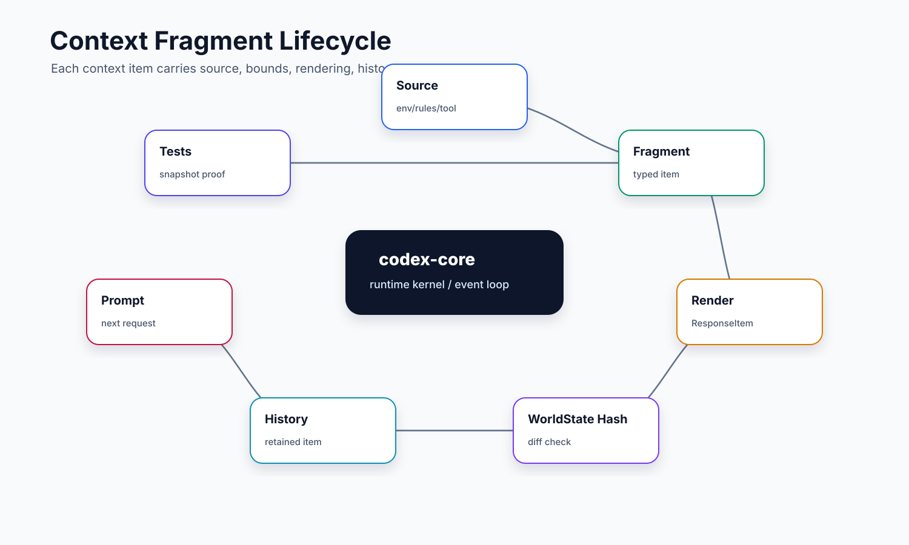

# 03. Context / ContextManager / WorldState

本文讲 Codex core 如何决定“模型这一轮到底能看到什么”。小白容易把上下文理解成一段拼接字符串，但在 Codex 里，上下文是一组有来源、有生命周期、有大小边界、可增量更新的结构化片段。

## 读完你应掌握什么


开篇全局图：这张图先把本文的心智模型放在最前面：不同来源先变成 `ContextualUserFragment`，`WorldStateSection` 用 snapshot/diff 表示模型可见状态，`Session` 在 step 边界把渲染结果写入 history 与 rollout。对应源码入口是 `repo/codex/codex-rs/context-fragments/src/fragment.rs`、`repo/codex/codex-rs/core/src/context/world_state/mod.rs`、`repo/codex/codex-rs/core/src/session/mod.rs` 和 `repo/codex/codex-rs/core/src/session/step_context.rs`。

- 能解释 `ContextualUserFragment` 为什么是上下文系统的基础接口。
- 能区分普通 user message、系统注入片段、world state、retained context 和 history。
- 能理解 `ContextManager` 为什么要处理 normalize、history 和 updates。
- 能说明 AGENTS.md、plugins、permissions、environment、multi-agent mode 等如何进入模型上下文。
- 能设计一个带大小上限、可 diff、可恢复的上下文注入系统。

## 这个模块解决什么问题

Agent 不只需要用户刚输入的一句话。它还需要知道：

- 当前工作目录和环境。
- 用户/开发者/AGENTS.md 指令。
- 可用工具、插件和 MCP。
- 当前权限、sandbox、网络策略。
- 历史消息、压缩摘要和 retained context。
- 多 agent、realtime、apps 等模式状态。

如果把这些都拼成一大段文本，系统会遇到三个问题：内容无限增长、重复注入导致 cache miss、来源不清导致安全边界混乱。Codex 的做法是把上下文拆成可管理片段，并让 world state 负责渲染“当前状态的变化”。

## 源码锚点

- `repo/codex/codex-rs/core/src/context/mod.rs`：core 上下文模块出口，re-export `ContextualUserFragment`。
- `repo/codex/codex-rs/context-fragments/src/fragment.rs`：`ContextualUserFragment` trait。
- `repo/codex/codex-rs/core/src/context/contextual_user_message.rs`：把用户消息和上下文片段组合成模型输入。
- `repo/codex/codex-rs/core/src/context/world_state/mod.rs`：`WorldState`、`WorldStateSection`、diff/history rendering。
- `repo/codex/codex-rs/core/src/context/world_state/agents_md.rs`：AGENTS.md 状态注入。
- `repo/codex/codex-rs/core/src/context/world_state/plugins_instructions.rs`：插件可用性说明注入。
- `repo/codex/codex-rs/core/src/context/world_state/permissions.rs`：权限状态注入。
- `repo/codex/codex-rs/core/src/context_manager/mod.rs`：上下文管理入口。
- `repo/codex/codex-rs/core/src/context_manager/history.rs`：历史上下文处理。
- `repo/codex/codex-rs/core/src/context_manager/normalize.rs`：上下文规范化。
- `repo/codex/codex-rs/core/src/session/step_context.rs`：step 级上下文快照。
- `repo/codex/codex-rs/core/src/session/retained_context.rs`：retained context。
- `repo/codex/codex-rs/core/src/context/contextual_user_message_tests.rs`、`context/world_state/world_state_tests.rs`、`context_manager/history_tests.rs`：测试锚点。

## 核心抽象

| 抽象 | 小白视角 | 关键职责 |
| --- | --- | --- |
| `ContextualUserFragment` | “可放进模型输入的一块上下文” | 统一把不同来源的上下文转成 ResponseItem。 |
| `WorldState` | “当前世界状态集合” | 跟踪环境、权限、插件、工具、多 agent 等状态，并按变化渲染。 |
| `WorldStateSection` | “世界状态中的一个分区” | 每类状态自己决定 snapshot、diff 和 history 恢复策略。 |
| `ContextManager` | “上下文整理器” | 管理历史、normalize、updates，避免重复和失控增长。 |
| `RetainedContext` | “需要跨 turn 保留的上下文” | 避免重要系统片段在历史裁剪或恢复时丢失。 |
| `StepContext` | “模型请求看到的固定视图” | 冻结本次 sampling 的上下文、工具、MCP 和环境。 |

本节无需单独新增图；开篇 world-state 图已经给出抽象关系，下面的矩阵和 `ContextualUserFragment` / `WorldStateSection` / `record_step_world_state_if_changed` 源码片段会贴近证明实体形态与持久化边界。

## WorldState Section 矩阵


这张图先看 context fragment 如何被组织成模型可见内容，再看 `WorldStateSection` 如何通过 snapshot/diff 参与后续 turn 和 rollout 恢复。下表中的每个 section 都对应图里的一个状态来源。

`WorldStateSection` 的关键约束在 `context/world_state/mod.rs`：每个 section 都有稳定 `ID`、可序列化 `Snapshot`、`render_diff`，并可选择是否持久化或匹配 retained/legacy fragment。`session/world_state.rs::build_world_state_for_step` 是装配入口，按当前 `StepContext` 和 `TurnContext` 把这些 section 加入本次模型请求。

无需代码片段：本节是 section 清单矩阵，实体定义紧跟在下一节 `WorldStateSection` 代码片段中展示；表格中的每行都保留源码锚点供复查。

| Section | 源码锚点 | 何时加入 | 持久化/恢复语义 | 读者应得结论 |
| --- | --- | --- | --- | --- |
| `model` | `repo/codex/codex-rs/core/src/context/world_state/model.rs` | 每个 step 都基于当前 model instructions 构造 | 用 previous model/context 比较，避免重复渲染不变说明 | 模型提示不是静态字符串，可能随 model 和 base instructions 变化 |
| `personality` | `repo/codex/codex-rs/core/src/context/world_state/personality.rs` | `Feature::Personality` 开启且 model 有 personality message | snapshot 记录前后 personality 状态 | personality 是模型上下文片段，不应混进业务历史 |
| `context_window` | `repo/codex/codex-rs/core/src/context/token_budget_context.rs` | token budget feature 开启且模型有 context window | 记录 window id，服务压缩和预算提醒 | 长会话窗口是显式状态，不是隐式 token 计数 |
| `context_window_guidance` | `repo/codex/codex-rs/core/src/context/world_state/context_window_guidance.rs` | token budget 配置有 guidance message | 跟随 guidance 内容变化渲染 | 窗口压力提示属于模型可见状态 |
| `realtime` | `repo/codex/codex-rs/core/src/context/world_state/realtime.rs` | realtime active 或配置了 realtime start/end instructions | 跟随 realtime mode 变化 | 语音/实时模式不是另一个 session，它通过 world state 改变模型上下文 |
| `agents_md` | `repo/codex/codex-rs/core/src/context/world_state/agents_md.rs` | 当前 step 已加载 AGENTS.md | 可匹配 legacy/retained 内容 | 项目规则进入模型前有独立 section，便于恢复和去重 |
| `permissions` / `approved_command_prefixes` | `repo/codex/codex-rs/core/src/context/world_state/permissions.rs`、`repo/codex/codex-rs/core/src/context/world_state/compact_permissions.rs` | `include_permissions_instructions` 开启时用完整权限说明，否则用 compact 形式 | 权限变化通过 diff 告知模型 | 权限上下文是模型可见约束，但不是授权本身 |
| `collaboration_mode` | `repo/codex/codex-rs/core/src/context/world_state/collaboration_mode.rs` | 配置允许 collaboration mode instructions | 跟随 collaboration mode 和 plan/model-catalog 能力变化 | 协作模式通过上下文改变 agent 行为边界 |
| `persistent_mode` | `repo/codex/codex-rs/core/src/context/world_state/persistent_mode.rs` | 非 basic session source 时加入 | 记录 reasoning effort 和持久模式提示 | 长周期/非根会话需要额外持久行为约束 |
| `environments` | `repo/codex/codex-rs/core/src/context/world_state/environment.rs` | `include_environment_context` 开启 | snapshot/diff 记录环境、cwd、日期和 subagents | 模型看到的工作区/环境不是直接读 OS，而是由 core 渲染 |
| `environments_instructions` | `repo/codex/codex-rs/core/src/context/world_state/environments_instructions.rs` | deferred executor feature 与环境上下文开启 | 随执行环境能力变化 | 多环境/远端执行的使用规则通过独立 section 注入 |
| `apps_instructions` | `repo/codex/codex-rs/core/src/context/world_state/apps_instructions.rs` | apps enabled、connector accessible 且 model 允许 apps instructions | 只在 app 可用性成立时渲染 | app connector 是上下文和工具入口，但不能绕过 MCP/tool 权限 |
| `plugins_instructions` | `repo/codex/codex-rs/core/src/context/world_state/plugins_instructions.rs` | MCP binding 有可用插件且 model 允许 plugin usage instructions | 跟随 selected/available plugin 状态 | plugin 提示告诉模型能力边界，不等于授予执行权限 |
| `tools` | `repo/codex/codex-rs/core/src/context/world_state/tools.rs` | `Feature::DeferredToolWorldState` 开启 | 记录 deferred tool namespace | deferred tools 通过 world state 告知可发现范围 |
| `multi_agent_usage_hint` / `multi_agent_mode` | `repo/codex/codex-rs/core/src/context/world_state/multi_agent_usage_hint.rs`、`repo/codex/codex-rs/core/src/context/world_state/multi_agent_mode.rs` | 当前 turn 有 multi-agent mode 或 usage hint | 作为模型可见协作约束 | 多 agent 能力先进入上下文，再由工具调用真正执行 |
| `managed_developer_instructions` | `repo/codex/codex-rs/core/src/context/world_state/managed_developer_instructions.rs` | 非 basic session source 且 requirements 提供额外 developer instructions | 跟随 requirements 变化 | 托管约束是 developer 级上下文，不能被普通历史替代 |

## 核心代码片段

### 1. ContextualUserFragment 是上下文片段的统一渲染接口

Source: `repo/codex/codex-rs/context-fragments/src/fragment.rs::ContextualUserFragment`
Line range: `repo/codex/codex-rs/context-fragments/src/fragment.rs:64-99`

```rust
pub trait ContextualUserFragment {
    fn role(&self) -> &'static str;

    /// Returns a stable `<feature>.<name>` classification, using `generic` for shared fragments.
    fn content_kind(&self) -> ContentItemKind;

    /// Whether this fragment must be recorded as its own response item.
    fn requires_separate_message(&self) -> bool {
        false
    }

    fn markers(&self) -> (&'static str, &'static str);

    fn body(&self) -> String;

    fn type_markers() -> (&'static str, &'static str)
    where
        Self: Sized;

    fn matches_text(text: &str) -> bool
    where
        Self: Sized,
    {
        let (start_marker, end_marker) = Self::type_markers();
        matches_marked_text(start_marker, end_marker, text)
    }

    fn render(&self) -> String {
        let (start_marker, end_marker) = self.markers();
        let body = self.body();
        if start_marker.is_empty() && end_marker.is_empty() {
            return body;
        }

        format!("{start_marker}{body}{end_marker}")
    }
```

这段说明上下文不是任意字符串拼接：每个片段都要声明 role、`content_kind`、markers 和 body，并通过统一的 `render()` 生成模型可见文本。`matches_text` 也让历史恢复和 retained context 可以识别已经注入过的上下文。

### 2. WorldStateSection 用稳定 ID、snapshot 和 render_diff 表达状态变化

Source: `repo/codex/codex-rs/core/src/context/world_state/mod.rs::PreviousSectionState / WorldStateSection`
Line range: `repo/codex/codex-rs/core/src/context/world_state/mod.rs:209-261`

无需图：本片段是 world-state trait 的局部实体定义；开篇和矩阵处的 world-state 图已经展示 section 与 snapshot/diff 的系统关系。

```rust
/// What is known about a section's previously model-visible state.
pub(crate) enum PreviousSectionState<'a, T> {
    /// No persisted snapshot or matching fragment exists in retained history.
    Absent,
    /// Retained history contains the section, but its typed snapshot is unavailable.
    Unknown,
    /// The exact persisted snapshot is available.
    Known(&'a T),
}

/// A typed portion of the state visible to the model.
///
/// Implementations own how their current state is rendered relative to an
/// earlier snapshot of the same section. `ID` is persisted in rollouts and
/// must remain stable. `Snapshot` should contain only the comparison data
/// needed to decide what the model must be told next, and must not serialize
/// to null because merge-patch nulls represent deletion. Sections migrated
/// from older context can recognize their previous fragments through
/// `matches_legacy_fragment`.
pub(crate) trait WorldStateSection: Send + Sync + 'static {
    const ID: &'static str;
    type Snapshot: DeserializeOwned + Serialize;

    fn snapshot(&self) -> Self::Snapshot;

    /// Whether the section contributes comparison state to persisted rollouts.
    fn should_persist(&self) -> bool {
        true
    }

    // ...

    fn render_diff(
        &self,
        previous: PreviousSectionState<'_, Self::Snapshot>,
    ) -> Option<Box<dyn ContextualUserFragment>>;
}
```

这段是 world state 的核心契约：每个 section 必须有稳定 `ID` 和可序列化 `Snapshot`，再根据上一份状态决定是否渲染 diff。`Absent`、`Unknown`、`Known` 三态避免把“没见过”“见过但无法类型化”“有精确快照”混为一谈。

### 3. Session 在 step 边界记录模型可见 world state 和 rollout patch

Source: `repo/codex/codex-rs/core/src/session/mod.rs::record_step_world_state_if_changed`
Line range: `repo/codex/codex-rs/core/src/session/mod.rs:3418-3450`

无需图：本片段只证明一次 step 的记录顺序；主流程中的 world-state 图已经覆盖 `build -> diff -> history -> rollout patch` 的整体位置。无需代码片段新增实体定义：本节消费的是上一段 `WorldStateSection` trait 的状态合约，当前片段只展示 session 如何在 step 边界使用它。

```rust
pub(crate) async fn record_step_world_state_if_changed(
    &self,
    previous_world_state: &Arc<WorldState>,
    step_context: &step_context::StepContext,
) -> CodexResult<Arc<WorldState>> {
    let turn_context = step_context.turn.as_ref();
    // Render model-visible state from the same step used to build and run tools.
    let world_state = Arc::new(self.build_world_state_for_step(step_context).await?);
    // Derive the model update and persisted patch from the same two snapshots.
    let previous_snapshot = previous_world_state.snapshot();
    let world_state_snapshot = world_state.snapshot();
    let world_state_item = world_state_snapshot
        .merge_patch_from(&previous_snapshot)
        .map(WorldStateItem::patch);
    let items = crate::context_manager::updates::merge_contextual_fragments(
        world_state.render_diff(&previous_snapshot),
    );
    if !items.is_empty() {
        self.record_conversation_items(turn_context, &items).await;
    }

    // ContextManager remembers this for later turns; run_turn owns the live value.
    self.state
        .lock()
        .await
        .history
        .set_world_state_baseline(world_state_snapshot);
    // Record the patch after the context it describes is present in model history.
    if let Some(world_state_item) = world_state_item {
        self.persist_rollout_items(&[RolloutItem::WorldState(world_state_item)])
            .await;
    }
    Ok(world_state)
}
```

这段把“当前模型看到什么”和“之后如何恢复”连接起来：同一个 `StepContext` 先构建 `WorldState`，再生成模型可见 diff，同时把 merge patch 写入 rollout。这样 history、world state baseline 和持久化补丁保持同源。

## 主流程


这张图在主流程中作为状态流图复用：先看 fragment 渲染，再看 world state diff，最后看 session 在 step 边界记录模型可见项和 rollout patch。无需代码片段：对应实现已在上一节三个代码证据中展示。

### 1. 各来源先变成上下文片段



这张片段生命周期图要从“来源进入 fragment”读起，再看 marker、body、history 识别和 retained context 如何把一段上下文从当前 step 延续到后续 turn。

AGENTS.md、developer instructions、plugin instructions、permissions、environment、time reminder、unsupported media、multi-agent mode 等，都不是随手拼进 prompt。它们先实现或转换为 `ContextualUserFragment`。

这个设计让每类上下文都有自己的渲染逻辑，也方便测试单个片段是否符合预期。

### 2. WorldState 管理状态变化

`WorldState` 把当前状态拆成多个 section。每个 section 可以根据上一个 snapshot 判断是否需要渲染 diff，或者是否需要在历史缺失时补回 retained item。

这解决了一个关键问题：有些状态在每个 turn 都不变，如果每次全量注入，会浪费 token 并破坏缓存；但如果完全不注入，恢复或新 turn 又可能缺少必要背景。

无需图：本段是对前面矩阵和 `WorldStateSection` trait 的解释，不引入新的状态形态。无需代码片段：`WorldStateSection` 定义已经展示 `ID`、`Snapshot`、`render_diff` 和 retained/legacy 匹配接口。

### 3. ContextManager 处理历史和规范化

context manager 负责把历史输入整理成模型可消费形态。它要处理重复、顺序、normalize、history updates 等问题。对初学者来说，可以把它理解成“模型输入的排版和去重层”。

### 4. Session 在 turn/step 中冻结上下文

`TurnContext` 保存一次 turn 的大环境，`StepContext` 保存一次模型采样请求的短生命周期快照。每次采样前，session 会把当前 world state、history、tool list 等组装到 prompt。这样工具执行和模型看到的上下文可以对齐。

### 5. 历史、压缩和恢复会影响上下文

长会话中，历史可能被 compact 或从 rollout 恢复。上下文系统必须能区分“原始用户输入”“系统补充上下文”“压缩摘要”“世界状态变化”。否则恢复后模型看到的内容可能重复、缺失或顺序错误。

无需图：压缩和恢复的完整时序在 `11-rollout-compaction-resume.md` 中展开；本文只说明它们为什么依赖上下文分层。无需代码片段：本段使用上方 `record_step_world_state_if_changed` 片段作为本专题内证据。

## 失败模式与边界条件


本节复用 fragment 生命周期图定位失败来源：增长、重复注入、来源混淆和恢复缺失都发生在 fragment 渲染、history/retained 匹配或 world-state diff 边界。无需代码片段：`ContextualUserFragment` 和 `WorldStateSection` 定义已经给出这些边界的源码证据。

- 上下文无限增长：没有 size cap 和 compaction 会耗尽 context window。
- 重复注入：每轮重复塞 AGENTS.md、插件说明、权限说明会造成 cache miss 和噪音。
- 来源混淆：把工具输出、用户输入、系统策略混成一段文本，会放大 prompt injection 风险。
- 状态过期：environment、permissions、plugins 变化后，如果 world state 没有 diff，模型会看到旧信息。
- 恢复缺失：resume 时如果 retained context 没恢复，模型可能缺少关键约束。
- 过度抽象：所有上下文都走同一个字符串模板，会让测试和调试很困难。

## 图示

`Context 与 WorldState` 已作为开篇图、矩阵图和主流程状态图放在正文附近；`Context Fragment 生命周期` 已放在片段流程和失败边界附近。这里仅保留图示章节说明，不再重复集中展示。

## 复设计练习

请设计一个上下文注入系统：

1. 输入包括用户消息、项目规则、权限说明、工具列表和历史摘要。
2. 每类输入都必须标记来源。
3. 每类输入都有大小上限。
4. 不变的状态不应每轮重复注入。
5. 恢复会话时能重建必要的 retained context。

你的设计里至少要有 `Fragment`、`WorldState`、`HistoryManager`、`PromptBuilder` 四个角色。

## 检查题

1. 为什么上下文不能只是一个不断追加的字符串？
2. `ContextualUserFragment` 解决了什么一致性问题？
3. `WorldStateSection` 为什么需要 snapshot？
4. `TurnContext` 和 `StepContext` 哪个更适合保存当前工具列表？
5. retained context 和普通历史消息有什么区别？
6. 如果插件状态变化，模型如何知道？

### 答案要点

1. 单一追加字符串没有来源、生命周期、大小上限和恢复语义，无法安全地区分用户输入、系统约束、工具结果和环境状态。
2. `ContextualUserFragment` 让不同来源的上下文都能以统一接口渲染成模型输入，同时保留 role、markers 和内容类型。
3. snapshot 是 diff 的基线；没有它就无法判断本轮是否需要重复渲染，也无法在 resume 时安全应用 world-state patch。
4. `StepContext` 更适合保存当前工具列表，因为工具集合必须和一次 sampling request 一致；`TurnContext` 是更长生命周期的大环境。
5. retained context 是系统认为跨 turn 仍必须保留的上下文片段，普通历史消息是对话事实；压缩或恢复时二者不能混用。
6. 插件状态会通过 `PluginsInstructionsState`、`PluginInstructions` 或 MCP binding 变化进入 world state / step context，模型在后续请求中看到的是更新后的上下文片段。

## Follow-up Slots

- 深入 `context/world_state/mod.rs` 的 diff rendering 算法。
- 对照 `contextual_user_message_tests.rs` 梳理不同输入如何变成 ResponseItem。
- 画出 AGENTS.md 从文件读取到模型可见上下文的完整链路。
