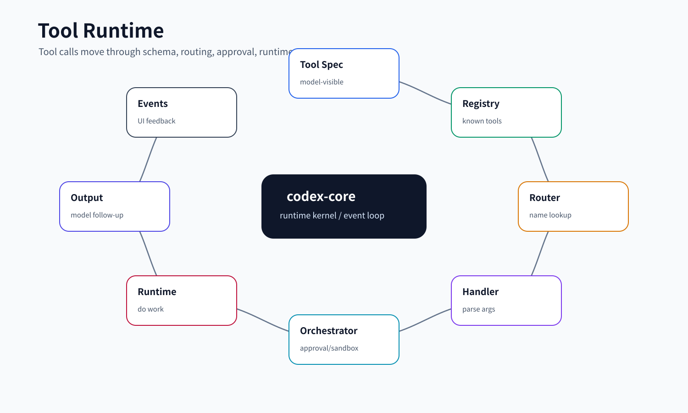
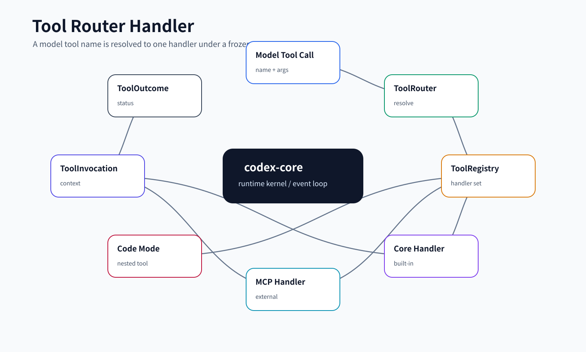
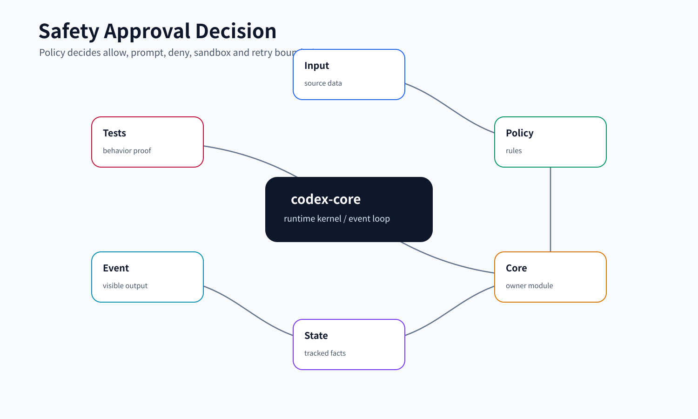

# 04. Tools 与 Tool Runtime

本文讲 Codex core 如何把模型提出的工具调用变成真实动作。小白可以先把工具系统理解成一条流水线：工具定义告诉模型“能调什么”，router 找到对应 handler，handler 解析参数，orchestrator 处理审批和 sandbox，runtime 执行动作，最后把结果变成模型能继续理解的输出。

## 读完你应掌握什么



开篇全局图：这张图先把本文压缩成工具调用流水线：模型看到的 tool spec 来自 `ToolRegistry`，调用时由 `ToolRouter` 找到 handler，`ToolInvocation` 绑定 session/step/source/payload，`ToolOrchestrator` 再统一接入 approval、sandbox、network approval 和 runtime。对应源码入口是 `repo/codex/codex-rs/core/src/tools/registry.rs`、`repo/codex/codex-rs/core/src/tools/router.rs`、`repo/codex/codex-rs/core/src/tools/context.rs` 和 `repo/codex/codex-rs/core/src/tools/orchestrator.rs`。

- 能区分工具定义、工具注册、工具路由、工具 handler、工具 runtime。
- 能解释为什么工具调用需要统一生命周期，而不是每个工具自己随便执行。
- 能说清 direct tool、code mode tool、MCP tool、multi-agent tool 的差异。
- 能理解工具结果如何进入事件流和后续模型输入。
- 能设计一个可扩展且可审计的工具系统。

## 这个模块解决什么问题

模型能提出很多动作：执行 shell、改文件、读图、请求用户输入、调用 MCP、spawn agent、等待 agent、安装插件等。它们输入格式不同、执行方式不同、权限不同，但都需要回答同一组问题：

- 这个工具是否对模型可见？
- 这个工具名应该路由到哪个 handler？
- 参数是否合法？
- 是否需要审批？
- 是否需要 sandbox？
- 执行中如何发事件？
- 结果如何返回给模型？
- 失败如何表达？

Codex core 用 `tools/` 把这些问题收束起来，避免每个工具重复实现一套安全和事件逻辑。

## 源码锚点

- `repo/codex/codex-rs/core/src/tools/mod.rs`：工具模块入口。
- `repo/codex/codex-rs/core/src/tools/context.rs`：`ToolInvocation`、`ToolCallSource` 和工具输出转换。
- `repo/codex/codex-rs/core/src/tools/registry.rs`：`ToolRegistry`、`CoreToolRuntime`、工具注册和统一执行。
- `repo/codex/codex-rs/core/src/tools/router.rs`：tool call 路由。
- `repo/codex/codex-rs/core/src/tools/orchestrator.rs`：审批、sandbox、network approval 和 runtime 执行编排。
- `repo/codex/codex-rs/core/src/tools/lifecycle.rs`：工具生命周期事件。
- `repo/codex/codex-rs/core/src/tools/events.rs`：工具事件辅助。
- `repo/codex/codex-rs/core/src/tools/handlers/`：内置工具 handler。
- `repo/codex/codex-rs/core/src/function_tool.rs`：function tool 适配。
- `repo/codex/codex-rs/core/src/mcp_tool_exposure.rs`：MCP 工具如何对模型暴露。
- `repo/codex/codex-rs/core/src/tools/router_tests.rs`、`tools/registry_tests.rs`、`tools/hosted_spec_tests.rs`、`tools/tool_dispatch_trace_tests.rs`：测试锚点。

## 核心抽象

| 抽象 | 小白视角 | 关键职责 |
| --- | --- | --- |
| `ToolRegistry` | “工具表” | 注册 handler，生成模型可见工具定义，执行匹配到的工具。 |
| `CoreToolRuntime` | “core 工具 handler 的统一接口” | 在共享 `ToolExecutor` 基础上补 core 侧搜索、telemetry、exposure 等能力。 |
| `ToolInvocation` | “一次工具调用订单” | 绑定 session、step context、call id、参数、来源和取消 token。 |
| `ToolRouter` | “工具名到 handler 的路由器” | 根据模型返回的工具名找到内置、MCP、code mode 或动态工具。 |
| `ToolOrchestrator` | “安全执行总控” | 在 handler runtime 周围包审批、sandbox、网络审批和失败重试。 |
| `ToolCallSource` | “调用来源标签” | 区分 direct、code mode 等来源，影响结果包装和事件表达。 |
| `ToolExposure` | “工具是否曝光给模型” | 控制哪些工具进入 prompt，哪些只能内部调用。 |
| `ToolCallOutcome` | “工具最终状态” | completed、failed、blocked 等结果进入 analytics 和后续上下文。 |

本节无需单独新增图；开篇工具 runtime 图已经覆盖这些抽象的流水线位置，下一节的 `ToolInvocation`、`ToolRegistry` 和 `ToolOrchestrator` 片段负责证明实体、注册和执行外壳。

## 工具注册矩阵

`tools/spec_plan.rs::build_tool_router` 是本次 step 的工具总装配入口。它先注册 core 内置工具，再追加 MCP、extension、dynamic、hosted tool specs，最后 `finalize_tool_router` 根据 `ToolMode`、tool search、code mode 等配置生成本次请求可见的 `ToolRouter`。

| 工具来源 | 代表 handler / spec | 主要 gate | 曝光方式 | 执行边界 |
| --- | --- | --- | --- | --- |
| shell / unified exec | `ExecCommandHandler`、`WriteStdinHandler` | 有可用 environment、`Feature::ShellTool`、`Feature::UnifiedExec`、model shell type 未 disabled | direct 或 code-mode nested | 走 `ExecPolicyManager`、`ToolOrchestrator`、sandbox 和 output buffer |
| apply_patch | `ApplyPatchHandler` | environment 存在且 model 支持 apply_patch tool type | direct | 先 parse patch，再走 patch safety、approval/sandbox、delta 记录 |
| utility tools | `PlanHandler`、`CurrentTimeHandler`、`SleepHandler`、`GetContextRemainingHandler`、`NewContextWindowHandler` | 对应 feature、model clock、token budget 或配置开关 | 多数 direct；部分 direct-model-only | 不一定触碰文件系统，但仍通过统一 tool registry 产出结果 |
| user interaction | `RequestUserInputHandler`、`RequestUserInputAsyncHandler`、`SendMessageToUserAsyncHandler` | root thread、model supported tools、available modes | direct-model-only | 暂停或异步联系用户，不能由子 agent 任意替代 |
| MCP resources | `ListMcpResourcesHandler`、`ReadMcpResourceHandler` | `McpBinding` 中存在 server | direct | 只读资源访问，不等于任意 MCP tool call |
| MCP tools | `McpHandlerCache::append_mcp_tools` | MCP runtime ready、apps policy、tool search、plugin budget | direct / deferred / hidden | 调用时走 MCP approval、metadata 注入、结果清洗和截断 |
| collaboration tools | multi-agent V1/V2 handlers | multi-agent feature、版本、深度/数量限制 | direct、direct-model-only 或 deferred | 进入 `AgentControl`，不是普通函数调用 |
| extension tools | `ExtensionToolAdapter` | host extension contributor、web/image availability | external registered runtime | 适配到 core tool runtime，带 conversation history、environment 和 sandbox context |
| dynamic tools | `DynamicToolHandler` | `TurnContext.dynamic_tools` | external registered runtime | 本 step 动态注入，仍通过 registry/router 执行 |

这张表的读法是：模型最终看到的不是“所有实现过的 handler”，而是 `StepContext` 捕获那一刻经过 feature、environment、MCP、extension、tool mode 和 exposure 共同筛选后的工具集合。

## 核心代码片段

### 1. ToolInvocation 把一次调用绑定到 session、step、来源和 payload

Source: `repo/codex/codex-rs/core/src/tools/context.rs::ToolCallSource / ToolInvocation`
Line range: `repo/codex/codex-rs/core/src/tools/context.rs:44-70`

```rust
#[derive(Clone, Debug, Eq, PartialEq)]
pub enum ToolCallSource {
    Direct,
    DirectPlaintextMessage,
    CodeMode {
        /// Runtime cell that issued the nested tool request.
        cell_id: String,
        /// Code-mode's per-cell tool invocation id. This is useful for
        /// debugging the JS/runtime bridge, but it is not the Codex tool call id
        /// because the runtime id only needs to be unique within one cell.
        runtime_tool_call_id: String,
    },
}

#[derive(Clone)]
pub struct ToolInvocation {
    pub session: Arc<Session>,
    // ...
    pub turn: Arc<TurnContext>,
    pub(crate) step_context: Arc<StepContext>,
    pub cancellation_token: CancellationToken,
    pub tracker: SharedTurnDiffTracker,
    pub call_id: String,
    pub tool_name: ToolName,
    pub source: ToolCallSource,
    pub payload: ToolPayload,
}
```

这段说明工具调用不是裸参数。一次调用会携带 session、turn、step 快照、取消 token、diff tracker、call id、工具名、来源和 payload；因此 direct tool、plaintext direct tool、code mode nested tool 可以共享生命周期，但在结果包装和归因上保留差异。

### 2. ToolRegistry 负责注册 runtime 并处理命名冲突

Source: `repo/codex/codex-rs/core/src/tools/registry.rs::ToolRegistry`
Line range: `repo/codex/codex-rs/core/src/tools/registry.rs:280-338`

```rust
/// A tool runtime together with its effective exposure for the current step.
pub(crate) struct RegisteredTool {
    pub(crate) runtime: Arc<dyn CoreToolRuntime>,
    pub(crate) exposure: ToolExposure,
}

#[derive(Default)]
pub struct ToolRegistry {
    tools: IndexMap<ToolName, RegisteredTool>,
    first_collision: Option<ToolName>,
}

impl ToolRegistry {
    pub(crate) fn add<T>(&mut self, handler: T)
    where
        T: CoreToolRuntime + 'static,
    {
        self.register_trusted(Arc::new(handler));
    }

    pub(crate) fn add_with_exposure<T>(&mut self, handler: T, exposure: ToolExposure)
    where
        T: CoreToolRuntime + 'static,
    {
        self.register_trusted_with_exposure(Arc::new(handler), exposure);
    }

    pub(crate) fn register_trusted(&mut self, runtime: Arc<dyn CoreToolRuntime>) {
        let exposure = runtime.exposure();
        self.register_trusted_with_exposure(runtime, exposure);
    }

    // ...

    pub(crate) fn register_trusted_with_exposure(
        &mut self,
        runtime: Arc<dyn CoreToolRuntime>,
        exposure: ToolExposure,
    ) {
        let tool_name = runtime.tool_name().with_default_namespace();
        match self.tools.entry(tool_name) {
            Entry::Vacant(entry) => {
                entry.insert(RegisteredTool { runtime, exposure });
            }
            Entry::Occupied(entry) => {
                let tool_name = entry.key();
                error_or_panic(format!("tool {tool_name} already registered"));
            }
        }
    }
```

这段证明 registry 保存的是“runtime + exposure”的组合，而不是只保存 schema。`first_collision` 也说明工具命名冲突是 registry 层的显式状态，后续 `finalize_tool_router` 可以据此决定报错或降级。

### 3. Orchestrator 在 handler 外统一执行审批、sandbox 和运行尝试

Source: `repo/codex/codex-rs/core/src/tools/orchestrator.rs::ToolOrchestrator::run`
Line range: `repo/codex/codex-rs/core/src/tools/orchestrator.rs:121-176`

```rust
pub async fn run<Rq, Out, T>(
    &mut self,
    tool: &mut T,
    req: &Rq,
    tool_ctx: &ToolCtx,
) -> Result<OrchestratorRunResult<Out>, ToolError>
where
    T: ToolRuntime<Rq, Out>,
{
    let turn_ctx = tool_ctx.step_context.turn.as_ref();
    let approval_policy = tool_ctx.step_context.settings.approval_policy();
    let otel = turn_ctx.session_telemetry.clone();
    let otel_tn = flat_tool_name(&tool_ctx.tool_name).into_owned();
    let otel_ci = &tool_ctx.call_id;
    // ...
    // 1) Approval
    let mut already_approved = false;

    let environment = tool.turn_environment(req);
    let sandbox_manager = SandboxManager::new();
    let sandbox_config = environment.config();
    let owner_network_policy = sandbox_config.network_policy.is_some();
    if owner_network_policy
        && tool
            .sandbox_permissions(req)
            .requires_escalated_permissions()
    {
        return Err(ToolError::Rejected(
            "attachment-owned network policy cannot be bypassed by sandbox escalation"
                .to_string(),
        ));
    }
    let workspace_roots = environment.workspace_roots();
    // ...
    let permission_profile = environment.permission_profile();
    let permissions = environment.permission_profile_with_workspace_roots();
    let file_system_sandbox_policy = permissions.file_system_sandbox_policy();
    let requirement = tool.exec_approval_requirement(req).unwrap_or_else(|| {
        default_exec_approval_requirement(approval_policy, &file_system_sandbox_policy)
    });
```

这段说明审批和 sandbox 不属于具体 handler 的私有逻辑。`ToolOrchestrator::run` 从 step settings 读取 approval policy，从工具请求解析执行环境和权限，再计算 `ExecApprovalRequirement`；这样 shell、patch、MCP 或扩展工具都能走同一套安全外壳。

## 主流程


这张图展示模型 tool call 从 `ToolRouter` 进入 handler，再经过 `ToolOrchestrator`、runtime 和 tool output 回到下一次模型输入。下面的步骤按图中的执行顺序展开。无需代码片段：本节是对前一节三个代码证据的流程化复盘，具体实体和执行外壳已用 Source/Line range 固定。

### 1. 工具先注册再曝光

core 启动或 step 创建时，会把内置工具、MCP 工具、动态工具注册到 `ToolRegistry`。注册不等于模型一定看得见，`ToolExposure` 和 tool spec 决定工具是否进入本次 prompt。

这个设计让“系统有哪些工具”和“本次模型能用哪些工具”分离。比如某些工具可以只给 code mode 用，某些工具需要在权限或插件满足时才出现。

### 2. 模型输出 tool call



这张 router/handler 图要从模型输出的 tool name 读起，再看 `ToolRouter` 如何定位 handler、构造 `ToolInvocation`，最后把结果包装回模型输入。

模型返回的 tool call 经过 protocol/event mapping 后，会进入 tool router。router 根据工具名、namespace 和 source 找到对应 handler。如果工具不存在，core 不能静默忽略，必须生成明确失败结果交回模型或用户。

### 3. handler 解析参数

handler 负责把模型给的 JSON 或 freeform 参数变成结构化请求。例如 shell handler 解析 `cmd/workdir/tty`，apply_patch handler 解析 patch 文本，MCP handler 解析 server/tool/params。

参数解析必须早失败。否则错误会在 runtime 深处才出现，模型很难知道该如何修正。

### 4. orchestrator 接管执行外壳

真正执行前，`ToolOrchestrator` 会处理审批、sandbox 和网络审批。这样 handler 不需要各自重复“是否要问用户”“是否要降级权限”“sandbox denial 是否重试”等逻辑。

这是工具系统最重要的架构取舍：业务 handler 管“怎么做”，orchestrator 管“能不能做、在哪做、失败怎么回传”。

### 5. runtime 执行动作并产生结果

runtime 执行完成后，结果会被转换为 `ResponseInputItem` 或事件。对于长期工具，还可能先返回 in-progress，再通过后续轮询或 stdin 更新状态。对于失败工具，要明确区分 rejected、blocked、handler failed、sandbox denied 等结果。

### 6. 结果回到模型循环

工具结果不是终点。它会进入后续模型输入，让模型基于执行结果继续推理。正因为如此，工具输出必须可读、有限、结构化，并保留足够错误信息。

## 端到端 Trace


这张图在 trace 章节中作为路由图复用：表格从工具可见性走到模型发起调用、handler 解析和 runtime 执行，每一步都能映射到 router/handler/orchestrator 边界。无需代码片段：trace 表格引用的是前文 `ToolInvocation`、`ToolRegistry`、`ToolOrchestrator::run` 片段和对应源码锚点。

以一次 `exec_command` 为例，工具运行链路可以这样复盘：

| 阶段 | 输入/状态 | 执行动作 | 输出/副作用 | 关键锚点 |
| --- | --- | --- | --- | --- |
| 工具可见性 | `StepContext` 中的 model、feature、environment、MCP binding | `build_tool_router` 调用 `add_shell_tools`，注册 `ExecCommandHandler` 和 `WriteStdinHandler` | 本次模型请求包含可见的 shell 工具 schema | `repo/codex/codex-rs/core/src/tools/spec_plan.rs` |
| 模型发起调用 | `ResponseItem::FunctionCall` 或等价 tool item | `ToolRouter` 找到 handler，构造 `ToolInvocation` | call id、arguments、source、session、step context 被绑定 | `repo/codex/codex-rs/core/src/tools/router.rs`、`repo/codex/codex-rs/core/src/tools/context.rs` |
| 参数解析 | JSON 参数 `cmd/workdir/tty/yield_time_ms/sandbox_permissions` | `ExecCommandHandler` 解析请求并选择 `TurnEnvironment` | 生成 `ExecCommandRequest`，错误会变成可读 tool result | `repo/codex/codex-rs/core/src/tools/handlers/unified_exec/exec_command.rs` |
| 审批与 sandbox | approval policy、exec policy、permission profile、network policy | `ToolOrchestrator::run` 判断 skip/approval/forbidden 和 sandbox attempt | 可能发审批事件、sandbox 执行、拒绝或二次重试 | `repo/codex/codex-rs/core/src/tools/orchestrator.rs` |
| runtime 执行 | 已确定 argv/env/cwd/sandbox/network | runtime 启动进程或调用 executor，收集输出 | 生成 `ToolRuntimeOutput`、过程事件和最终状态 | `repo/codex/codex-rs/core/src/unified_exec/process_manager.rs` |
| 回到模型 | tool output 或错误 output | session 把结果放入下一次 sampling input | 模型基于真实执行结果继续回答或修正 | `repo/codex/codex-rs/core/src/session/turn.rs` |

如果某一步失败，失败也要走同一条可解释通道：参数错误返回给模型，审批拒绝返回 blocked/rejected，sandbox denial 由 orchestrator 决定是否可升级，runtime 错误进入 tool output 或事件，而不是在 handler 内部 panic 或静默吞掉。

## 失败模式与边界条件



这张安全判定图用来读下面的失败模式：大多数工具失败不是 handler 内部 panic，而是在 routing、参数解析、approval、sandbox、network 或 output bound 中被结构化表达。无需代码片段：具体失败分支的安全实现放在 `06-safety-sandbox-approval.md`，本节只把它们映射回工具流水线。

- 工具名冲突：内置、动态、MCP、插件工具如果命名冲突，需要明确 namespace 和 exposure。
- 参数不合法：handler 必须返回可理解的错误，而不是 panic。
- 工具不可见：模型请求里没有暴露该工具时，后续 tool call 可能无法路由。
- 权限不足：orchestrator 需要把审批或 sandbox denial 转成明确结果。
- 输出过大：工具结果必须截断或摘要化，否则污染上下文。
- 工具长跑：需要 process/session id 和后续查询/写入机制。
- MCP 工具不可信：外部工具输出不能被当作系统指令。
- 动态工具变化：step 中工具列表必须冻结，否则模型看到和 runtime 可用的工具会不一致。

## 图示

`Tool runtime` 已作为开篇图和主流程图放在正文附近；`Tool router handler` 已放在模型调用和端到端 trace 附近；`Safety 与审批判定链` 已放在失败边界附近。这里仅保留图示章节说明，不再重复集中展示。

## 复设计练习

请设计一个工具系统，要求支持 shell、patch、MCP 和自定义插件工具：

1. 如何描述工具 schema，让模型知道怎么调用？
2. 如何让工具名不会冲突？
3. 参数解析失败怎么返回？
4. 审批和 sandbox 放在 handler 内还是 handler 外？
5. 工具结果如何进入下一次模型请求？
6. 如何给长跑工具分配 id 并支持后续轮询？

一个合格设计应包含 `ToolSpec`、`ToolRegistry`、`ToolRouter`、`ToolInvocation`、`ToolOrchestrator`、`ToolRuntimeOutput`。

## 检查题

1. `ToolRegistry` 和 `ToolRouter` 的职责有什么不同？
2. 为什么 handler 不应该各自实现审批和 sandbox？
3. `ToolCallSource` 会影响哪些结果包装？
4. MCP tool 和内置 tool 在安全边界上有什么差异？
5. 为什么工具输出需要截断或结构化？
6. 如果模型调用了不存在的工具，core 应该怎么处理？

### 答案要点

1. `ToolRegistry` 保存可执行 handler 和生成工具定义；`ToolRouter` 使用本次 step 的 registry/exposure 结果把模型 tool call 定位到具体 runtime。
2. 审批和 sandbox 是横切策略，放在 handler 内会导致 shell、patch、MCP、extension 各自实现不同安全语义；统一放在 `ToolOrchestrator` 才能共享 approval cache、sandbox retry 和事件表达。
3. `ToolCallSource` 会影响结果包装、事件归因、code mode nested tool 名称和 analytics；同一个 handler 在 direct/code-mode/deferred 场景下呈现方式可能不同。
4. MCP tool 是外部 server 提供的能力，必须考虑 server metadata、approval template、connector/account、结果清洗和截断；内置 tool 的 schema 和 runtime 由 core 直接控制。
5. 工具输出会进入后续模型输入和事件/rollout；不截断会污染上下文、拖慢恢复，并可能把外部工具的大 payload 当成长期事实保存。
6. 不能静默忽略；router/handler 应生成明确错误或 skipped/completed 事件，让模型或用户知道该工具不可用并能调整下一步。

## Follow-up Slots

- 逐行分析 `ToolRegistry::handle` 和 `ToolOrchestrator::run`。
- 挑一个内置工具 handler，反推从 tool spec 到 tool output 的完整路径。
- 单独分析 code mode nested tool 和普通 direct tool 的区别。
