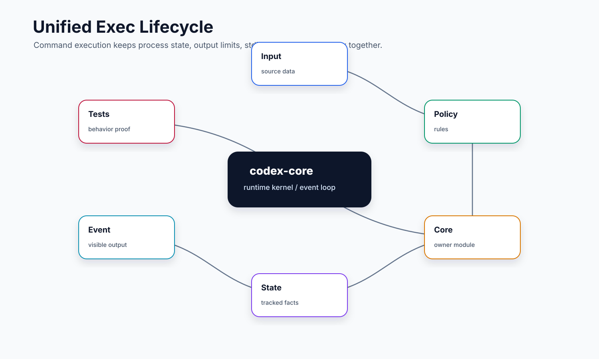
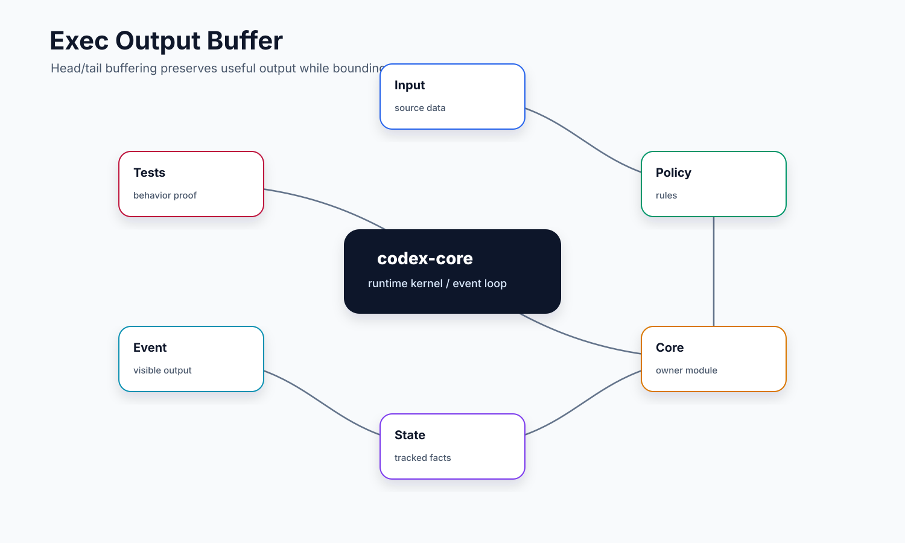

# 05. Exec / Shell / UnifiedExec

## 读完你应掌握什么



开篇全局图：这张图先给出本文的命令执行模型：模型工具参数进入 handler，shell 文本被展开成 argv，`ToolOrchestrator` 决定 approval/sandbox，`UnifiedExecProcessManager` 启动或保留进程，输出通过 head/tail buffer 回到模型和事件流。对应源码入口是 `repo/codex/codex-rs/core/src/shell.rs`、`repo/codex/codex-rs/core/src/unified_exec/mod.rs`、`repo/codex/codex-rs/core/src/unified_exec/process_manager.rs` 和 `repo/codex/codex-rs/core/src/unified_exec/head_tail_buffer.rs`。

- 能解释为什么 `exec_command` 不是简单包一层 `std::process::Command`。
- 能区分一次性 shell 执行、Unified Exec 交互终端、PTY、exec-server 远端执行各自解决的问题。
- 能从模型发起 `exec_command` 追踪到 shell 参数构造、审批、sandbox 选择、进程启动、输出收集、后台进程保留和后续 `write_stdin`。
- 能说明输出为什么要流式发送、限量保留，并用 head/tail 策略保留开头和结尾。
- 能设计一个简化版命令执行器，覆盖超时、取消、stdin、进程复用、输出截断和 sandbox denial。

## 这个模块解决什么问题

对 coding agent 来说，命令执行是最危险也最有价值的工具。它既要跑 `rg`、`cargo test`、`npm run dev` 这类短命令，也要支撑需要持续交互的进程，比如开发服务器、测试 watch、REPL 或 TTY 程序。最直接的实现是调用 `std::process::Command`，但 Codex core 要解决更多约束：

- 命令通常由模型给出，需要先映射到用户 shell，例如 zsh/bash/sh 使用 `-c` 或 `-lc`，PowerShell 使用 `-Command`。
- 执行可能在本地，也可能在远端 executor。路径、环境变量、shell、sandbox 上下文都不能默认等同于当前宿主进程。
- 初次调用可能没结束，要返回 `process_id`，后续通过 `write_stdin` 写入输入或轮询输出。
- 输出可能无限增长，需要一边流式发事件，一边在工具结果里给模型一个有限摘要。
- 执行前后必须接入审批、sandbox、网络代理、插件归因、hook 事件和 telemetry。
- 被 sandbox 拒绝、超时、取消、进程已退出、stdin 已关闭等情况，都要转成模型能理解的错误。

因此 Codex 把 exec 拆成两层：`exec.rs` 提供“给定 argv/env/cwd 后启动子进程并收集输出”的低层能力；`unified_exec/` 和 `tools/handlers/unified_exec*` 提供面向模型工具的交互式会话管理。

## 源码锚点

- `repo/codex/codex-rs/core/src/shell.rs`：`Shell`、`derive_exec_args`、`default_user_shell`，负责把一段 shell 文本变成真实 argv。
- `repo/codex/codex-rs/core/src/exec.rs`：`ExecParams`、`ExecCapturePolicy`、`ExecExpiration`、`process_exec_tool_call`、`build_exec_request`、`execute_exec_request`、`consume_output`、`finalize_exec_result`。
- `repo/codex/codex-rs/core/src/shell_snapshot.rs`：`ShellSnapshot::build`、`ShellSnapshot::try_create`，负责本地 shell 环境快照。
- `repo/codex/codex-rs/core/src/unified_exec/mod.rs`：`UnifiedExecContext`、`ExecCommandRequest`、`WriteStdinRequest`、`ProcessStore`、输出和超时常量。
- `repo/codex/codex-rs/core/src/unified_exec/process.rs`：`UnifiedExecProcess`、`ProcessHandle`、`OutputHandles`，统一本地 PTY 和 exec-server 进程。
- `repo/codex/codex-rs/core/src/unified_exec/process_manager.rs`：`exec_command`、`exec_command_inner`、`write_stdin`、`open_session_with_sandbox`、`collect_output_until_deadline`。
- `repo/codex/codex-rs/core/src/unified_exec/head_tail_buffer.rs`：`HeadTailBuffer`，保留输出头尾并记录中间省略字节数。
- `repo/codex/codex-rs/core/src/tools/handlers/unified_exec.rs`：`ExecCommandArgs`、`get_command`、`shell_mode_for_environment`。
- `repo/codex/codex-rs/core/src/tools/handlers/unified_exec/exec_command.rs`：`ExecCommandHandler`，把模型工具参数变成 `ExecCommandRequest`。
- `repo/codex/codex-rs/core/src/tools/handlers/unified_exec/write_stdin.rs`：`WriteStdinHandler`，把后续输入或轮询转给已存在进程。
- `repo/codex/codex-rs/core/src/user_shell_command.rs`：把用户 shell 命令和输出整理为模型上下文记录。
- `repo/codex/codex-rs/core/src/unified_exec/process_manager_tests.rs`、`repo/codex/codex-rs/core/src/unified_exec/head_tail_buffer_tests.rs`：覆盖进程管理和输出截断行为。

## 核心代码片段

Source: `repo/codex/codex-rs/core/src/shell.rs::Shell::derive_exec_args`
Line range: `repo/codex/codex-rs/core/src/shell.rs:20-49`

```rust
/// Takes a string of shell and returns the full list of command args to
/// use with `exec()` to run the shell command.
pub fn derive_exec_args(&self, command: &str, use_login_shell: bool) -> Vec<String> {
    match self.shell_type {
        ShellType::Zsh | ShellType::Bash | ShellType::Sh => {
            let arg = if use_login_shell { "-lc" } else { "-c" };
            vec![
                self.shell_path.to_string_lossy().to_string(),
                arg.to_string(),
                command.to_string(),
            ]
        }
        ShellType::PowerShell => {
            let mut args = vec![self.shell_path.to_string_lossy().to_string()];
            if !use_login_shell {
                args.push("-NoProfile".to_string());
            }

            args.push("-Command".to_string());
            args.push(command.to_string());
            args
        }
        ShellType::Cmd => {
            let mut args = vec![self.shell_path.to_string_lossy().to_string()];
            args.push("/c".to_string());
            args.push(command.to_string());
            args
        }
    }
}
```

**解释：** 这段代码证明 `exec_command` 的输入不是直接交给 `std::process::Command`，而是先按 shell 类型展开为真实 argv。POSIX shell 的 `-c/-lc`、PowerShell 的 `-NoProfile/-Command` 和 cmd 的 `/c` 都在这里被固定，后续审批和执行看到的是这组参数。

Source: `repo/codex/codex-rs/core/src/unified_exec/mod.rs::ExecCommandRequest`
Line range: `repo/codex/codex-rs/core/src/unified_exec/mod.rs:107-126`

```rust
#[derive(Debug)]
pub(crate) struct ExecCommandRequest {
    pub command: Vec<String>,
    pub shell_type: ShellType,
    pub hook_command: String,
    pub process_id: i32,
    pub yield_time_ms: u64,
    pub max_output_tokens: Option<usize>,
    pub cwd: PathUri,
    pub sandbox_cwd: PathUri,
    pub turn_environment: TurnEnvironment,
    pub shell_mode: UnifiedExecShellMode,
    pub network: Option<NetworkProxy>,
    pub tty: bool,
    pub sandbox_permissions: SandboxPermissions,
    pub additional_permissions: Option<AdditionalPermissionProfile>,
    pub additional_permissions_preapproved: bool,
    pub justification: Option<String>,
    pub prefix_rule: Option<Vec<String>>,
}
```

**解释：** `ExecCommandRequest` 把命令执行所需的 runtime 信息一次性带齐：命令 argv、进程 id、cwd、sandbox cwd、turn 环境、网络代理、TTY 和审批相关字段都在同一个结构中。这样 `process_manager` 不需要从全局状态临时猜测权限或路径。

Source: `repo/codex/codex-rs/core/src/unified_exec/head_tail_buffer.rs::HeadTailBuffer`
Line range: `repo/codex/codex-rs/core/src/unified_exec/head_tail_buffer.rs:5-19, 40-48, 104-124`

```rust
/// A capped buffer that preserves a stable prefix ("head") and suffix ("tail"),
/// dropping the middle once it exceeds the configured maximum. The buffer is
/// symmetric meaning 50% of the capacity is allocated to the head and 50% is
/// allocated to the tail.
#[derive(Debug, Default)]
#[cfg_attr(test, derive(Eq, PartialEq))]
pub(crate) struct HeadTailBuffer<const MAX_BYTES: usize = UNIFIED_EXEC_OUTPUT_MAX_BYTES> {
    head: Vec<u8>,
    tail: VecDeque<u8>,
    omitted_bytes: usize,
}

impl<const MAX_BYTES: usize> HeadTailBuffer<MAX_BYTES> {
    const HEAD_BUDGET: usize = MAX_BYTES / 2;
    const TAIL_BUDGET: usize = MAX_BYTES.saturating_sub(Self::HEAD_BUDGET);

    // ...

    /// Append a chunk of bytes to the buffer.
    ///
    /// Bytes are first added to the head until the head budget is full; any
    /// remaining bytes are added to the tail, with older tail bytes being
    /// dropped to preserve the tail budget.
    pub(crate) fn push_chunk(&mut self, chunk: &[u8]) {
        let chunk = self.fill_head(chunk);
        self.push_tail(chunk);
    }

    // ...

    /// Return the retained output with an explicit marker between the head and
    /// tail when bytes were omitted.
    pub(crate) fn to_bytes_with_omission_marker(&self) -> Vec<u8> {
        if self.omitted_bytes == 0 {
            return self.to_bytes();
        }

        let marker = format_output_omission_marker(self.omitted_bytes);
        let marker_delimiter_bytes = 2;
        let mut out = Vec::with_capacity(
            self.retained_bytes()
                .saturating_add(marker.len())
                .saturating_add(marker_delimiter_bytes),
        );
        out.extend_from_slice(&self.head);
        out.push(b'\n');
        out.extend_from_slice(marker.as_bytes());
        out.push(b'\n');
        out.extend(self.tail.iter().copied());
        out
    }
    // ...
```

**解释：** Unified Exec 的输出不是无限保存，也不是只保留最后一段。`HeadTailBuffer` 明确把容量分成 head/tail，并在生成结果时插入省略标记，这支撑了文档中“保留开头和结尾、丢弃中间噪声”的输出模型。

## 核心抽象

| 抽象 | 小白视角 | 关键职责 |
| --- | --- | --- |
| `Shell` | “用哪个 shell、怎么传入命令” | 根据 zsh/bash/sh/PowerShell/cmd 生成 argv，决定 `-c`、`-lc`、`-Command` 等差异。 |
| `ExecParams` | “低层进程启动订单” | 包含 argv、cwd、env、超时、输出策略、网络代理和 sandbox 权限。 |
| `ExecRequest` | “已按 sandbox 转换后的执行请求” | 由 `SandboxManager` 转换产生，带平台 sandbox、Windows 覆盖、网络禁用标记等运行材料。 |
| `ExecCapturePolicy` | “输出怎么收” | shell 工具默认限量并受超时控制；内部 helper 可用 full buffer。 |
| `ExecExpiration` | “什么时候强制结束” | 支持默认超时、指定超时、取消 token 或二者竞争。 |
| `UnifiedExecContext` | “一次工具调用的运行上下文” | 绑定 `Session`、`StepContext`、取消 token 和 call id。 |
| `ExecCommandRequest` | “模型的一次 exec_command 请求” | 记录 command、cwd、environment、TTY、权限请求、yield 时间、输出 token 上限。 |
| `UnifiedExecProcess` | “一个可交互终端进程” | 统一本地 PTY 与 exec-server 进程，支持写 stdin、interrupt、terminate、状态和输出订阅。 |
| `ProcessStore` | “后台终端表” | 用 `process_id` 保存仍在运行的进程，供 `write_stdin` 后续访问。 |
| `HeadTailBuffer` | “有限输出盒子” | 固定保留开头和结尾，中间过大时插入省略标记。 |

本节无需单独新增图；开篇 Unified Exec 生命周期图已经覆盖这些抽象的执行位置，上一节 `Shell::derive_exec_args`、`ExecCommandRequest` 和 `HeadTailBuffer` 片段分别证明 shell 参数、请求实体和输出保留策略。

## 主流程


这张图按 `tool args -> shell argv -> approval/sandbox -> process -> output buffer -> tool result` 阅读。下面 1 到 6 步分别展开参数解析、sandbox 执行、后台进程保留和后续 stdin。无需代码片段：主流程依赖的 shell argv、执行请求和输出 buffer 结构已在上一节贴近展示。

### 1. 模型调用 `exec_command`

模型发出 `exec_command` 时，`ExecCommandHandler::handle_call` 先解析 JSON 参数。它不仅取 `cmd`，还解析 `workdir`、`environment_id`、`tty`、`yield_time_ms`、`timeout_ms`、`sandbox_permissions`、`additional_permissions`、`justification` 和 `prefix_rule`。这些字段决定命令在哪个环境跑、是否允许 TTY、是否要申请提升权限，以及工具结果最多回给模型多少输出。

随后 handler 通过 `resolve_tool_environment` 选择 `TurnEnvironment`。如果是远端环境，路径保持 `PathUri` 语义；如果本地 sandbox 需要宿主路径，则会要求路径能按当前平台惯例转换为本地绝对路径。这个设计避免把 Windows executor 的 `file:///C:/repo` 在 POSIX 宿主上误当成 `/C:/repo`。

### 2. shell 文本变成真实 argv

`get_command` 决定 shell 模式。`UnifiedExecShellMode::Direct` 会使用用户 shell 或模型指定 shell，再调用 `Shell::derive_exec_args`。zsh/bash/sh 会变成：

```text
<shell_path> -c <cmd>
<shell_path> -lc <cmd>
```

PowerShell 和 cmd 则走自己的参数规则。`UnifiedExecShellMode::ZshFork` 是本地 zsh-fork 的特殊模式，不接受模型随意传 `shell`，远端环境则回落到 `Direct`，因为远端 executor 自己报告 shell 能力。

### 3. 进入统一审批和 sandbox 编排

`UnifiedExecProcessManager::open_session_with_sandbox` 会构造执行环境变量，注入 `CODEX_THREAD_ID`、`CODEX_SESSION_ID`、`CODEX_VERSION`、`CODEX_PERMISSION_PROFILE` 和 apply-patch 相关特性变量，再创建 `ToolOrchestrator` 和 `UnifiedExecRuntime`。

审批要求由 `ExecPolicyManager::create_exec_approval_requirement_for_shell` 生成。这里会结合命令内容、approval policy、permission profile、环境级 exec policy、Windows sandbox 设置、`sandbox_permissions` 和 `prefix_rule`。最后 `ToolOrchestrator::run` 统一做：

1. 判断是否跳过审批、需要审批或禁止执行。
2. 选择第一次 sandbox 尝试。
3. 调用 runtime 启动进程。
4. 如果 sandbox denial 且策略允许，申请无 sandbox 或网络访问审批后重试。

### 4. runtime 启动 PTY 或 exec-server 进程

`UnifiedExecRuntime::run` 接收 `SandboxAttempt` 后，会准备环境变量、网络代理、shell snapshot、PowerShell UTF-8 前缀、插件 metrics sidecar 和 `SandboxCommand`。如果是本地执行，最后会调用 `spawn_process` 启动 PTY；如果是远端或 shell snapshot 路径，则走 exec-server 管理的 sandbox 上下文。

`UnifiedExecProcess` 把本地 PTY 和 exec-server 返回的进程统一成一个接口：`write`、`interrupt`、`terminate`、`exit_code`、`output_handles`。这样上层不用关心底层传输。

### 5. 初次输出、后台保留和后续 stdin

`exec_command_inner` 启动进程后会立即开启输出流事件，然后等待 `yield_time_ms`。如果进程还活着，它会存入 `ProcessStore` 并在工具结果里返回 `process_id`；如果已经退出，则立即发送完成事件并释放进程 id。

后续 `write_stdin` 有两种用途：

- `chars` 非空：向 TTY 进程写入输入；非 TTY 只能接受 interrupt 控制字符，否则返回 `StdinClosed`。
- `chars` 为空：作为轮询，等待一段时间并返回新输出或最终退出状态。

为了避免同一个终端同时读写，`write_stdin` 会拿 `interaction_lock`。在审批之后还会重新确认 `process_id` 对应的仍然是同一个 `UnifiedExecProcess`，防止进程 id 被释放后复用。

### 6. 输出如何返回给模型



这张输出缓冲图要从 head/tail 两段保留策略读起：开头保留命令上下文和早期错误，结尾保留最终摘要，中间大段日志用 omitted marker 表达。

低层 `exec.rs::consume_output` 从 stdout/stderr pipe 读取并按 `ExecCapturePolicy` 截断。Unified Exec 的后台进程则用 `HeadTailBuffer`：前半容量给稳定开头，后半容量给最新结尾，中间丢弃并记录 `omitted_bytes`。返回给模型时会插入类似 `... N bytes omitted ...` 的标记。

这个策略对 coding agent 很重要：命令开头通常有参数、启动错误和上下文，结尾通常有最终失败信息或测试摘要，中间的大量日志最容易膨胀上下文。

## 失败模式与边界条件


本节复用 Unified Exec 生命周期图定位失败点：参数解析、approval/sandbox、进程启动、后台保留、stdin 和输出截断都是不同故障边界。无需代码片段：具体实现证据可回到上一节三个片段，以及 `repo/codex/codex-rs/core/src/unified_exec/process_manager.rs` 与 `repo/codex/codex-rs/core/src/exec.rs`。

- 空 command：`exec.rs::build_exec_request` 和 `UnifiedExecRuntime::build_unified_exec_sandbox_command` 都会拒绝空 argv。
- login shell 被禁用：`get_command` 在 `allow_login_shell=false` 且模型传 `login=true` 时直接返回可解释错误。
- TTY 被禁用：`ExecCommandHandler` 会在 feature 未开启时拒绝 `tty=true`。
- native path 不匹配：需要本地 sandbox 时，非宿主路径惯例会被拒绝，避免跨平台路径误判。
- sandbox denial：`finalize_exec_result` 和 `UnifiedExecProcess::check_for_sandbox_denial_with_text` 会识别并记录 sandbox 违规，再交给 orchestrator 判断是否可重试。
- 网络策略阻断：managed network 会通过 `DeferredNetworkApproval` 监听网络审批结果；如果审批拒绝或请求被 policy deny，进程会被失败化并终止。
- 超时和取消：低层 exec 会杀进程组或尝试先 terminate 再 kill；Unified Exec completion 模式超时后标记 `timed_out` 并确认终止。
- 输出过大：普通 exec 有 retained bytes cap；Unified Exec 用 head/tail buffer，模型只看到有限摘要。
- `write_stdin` 找不到进程：返回 `UnknownProcessId`，通常说明进程已结束、被释放或 id 不属于当前会话。
- 非 TTY stdin：普通非 TTY 进程不接受任意输入，只支持 interrupt 这种控制动作。
- shell snapshot 失败：快照写入或验证失败会被记录，执行路径仍可不使用 snapshot 继续运行。

## 图示

`Unified Exec 生命周期` 已作为开篇图、主流程图和失败边界图放在正文附近；`Exec 输出缓冲模型` 已贴近输出返回章节。这里仅保留图示章节说明，不再重复集中展示。

## 复设计练习

请设计一个最小命令执行器，要求支持“短命令”和“长命令”两种模式。你至少要回答：

1. 请求结构里应该包含哪些字段，哪些字段必须由外层 session 注入，而不是让模型随便填？
2. 如何给仍在运行的命令分配、保存和释放 `process_id`？
3. 如果命令输出 200 MB，你准备给用户和模型分别展示什么？
4. 如果 sandbox 内失败但看起来是权限问题，系统应该自动重试、请求审批，还是直接失败？
5. `stdin` 为什么不能只按字符串追加到某个全局进程？

一个合理答案应该能画出：`tool args -> shell argv -> approval -> sandbox attempt -> process -> output buffer -> tool result`。

## 检查题

1. `exec.rs` 和 `unified_exec/process_manager.rs` 的职责有什么差异？
2. `Shell::derive_exec_args` 为什么要区分 zsh/bash/sh、PowerShell 和 cmd？
3. `ExecCommandRequest` 里的 `cwd` 和 `sandbox_cwd` 为什么可能都需要存在？
4. 为什么 `write_stdin` 在审批后还要重新检查进程身份？
5. `HeadTailBuffer` 为什么比“只截断最后 N 字节”更适合给模型看？
6. sandbox denial 发生后，谁决定是否重试：进程执行层、handler，还是 orchestrator？

### 答案要点

1. `exec.rs` 更接近低层一次性进程执行和输出捕获；`unified_exec/process_manager.rs` 管模型可交互的 exec session、后台进程、stdin、轮询和 `ProcessStore`。
2. 不同 shell 的命令参数、login 语义、quoting 和平台行为不同；统一当作 `std::process::Command` 会在 zsh、bash、PowerShell、cmd 之间改变语义。
3. `cwd` 是模型请求的工作目录语义，`sandbox_cwd` 是 sandbox policy 解析和执行隔离的宿主路径语义；远端 executor 或跨平台路径时二者不能混同。
4. 审批期间进程可能已经退出、被释放或 id 被复用；重新检查能避免把输入写到错误进程。
5. 开头通常包含命令、环境和早期错误，结尾通常包含最终失败或测试摘要；head/tail 比只保留最后部分更适合模型诊断。
6. 决策在 `ToolOrchestrator`，因为它同时掌握 approval policy、sandbox attempt、network approval 和工具 runtime 的可升级能力。

## Follow-up Slots

- 深入 `unified_exec/process_manager_tests.rs`，按测试用例补一张状态转移图。
- 单独分析 `zsh_fork` 和 execve escalation，把本地 shell 优化路径拆成后续专题。
- 对比 `exec.rs` 的一次性捕获和 Unified Exec 的交互式输出缓冲，补充测试级案例。
- 复查远端 exec-server 的 `ShellSnapshotRequest` 与本地 shell snapshot 的差异。
