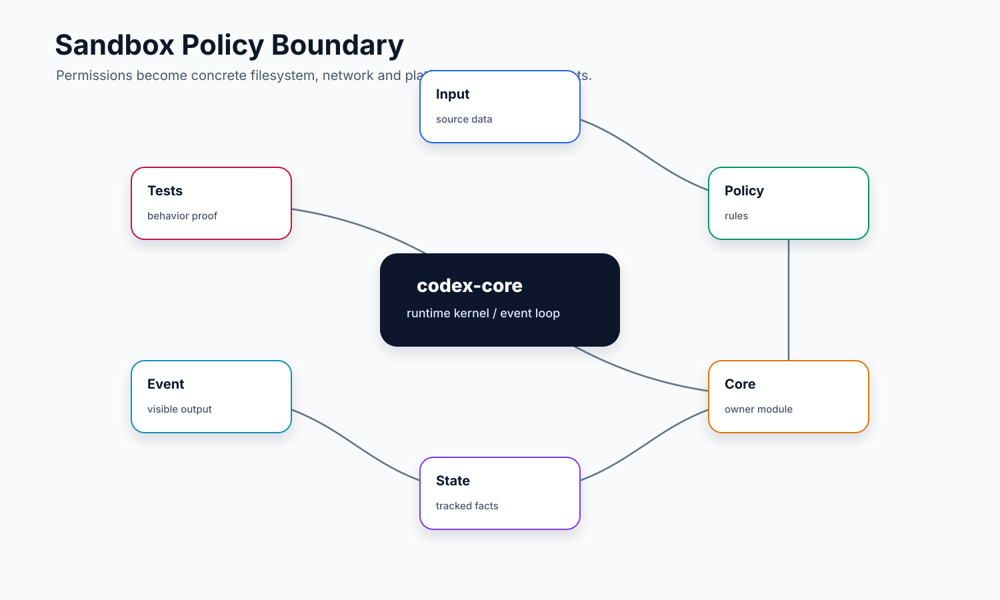

# 06. Safety / Sandbox / Approval

## 读完你应掌握什么


开篇全局图：这张图先给出本文的安全判定链：配置和 exec policy 先给出执行要求，`ToolOrchestrator` 把要求转成 approval、sandbox attempt 或拒绝，运行期网络访问再通过 `DeferredNetworkApproval` 独立处理，patch 则由 `assess_patch_safety` 走结构化路径判断。对应源码入口是 `repo/codex/codex-rs/core/src/config/mod.rs`、`repo/codex/codex-rs/core/src/exec_policy.rs`、`repo/codex/codex-rs/core/src/tools/orchestrator.rs`、`repo/codex/codex-rs/core/src/tools/sandboxing.rs`、`repo/codex/codex-rs/core/src/tools/network_approval.rs` 和 `repo/codex/codex-rs/core/src/safety.rs`。

- 能把“审批策略”“sandbox 策略”“exec policy 规则”“网络策略”分开讲清楚。
- 能解释一条命令为什么会直接执行、请求审批、在 sandbox 里执行、被拒绝，或 sandbox 失败后再次请求升级。
- 能理解 patch 为什么走独立 safety 判断，但仍复用工具审批和 sandbox 编排。
- 能知道 Windows sandbox、managed network、deny-read、permission profile 这些概念分别限制什么。
- 能设计一个小型 agent 的命令审批系统，支持默认策略、临时授权和可持久化前缀规则。

## 这个模块解决什么问题

模型能调用 shell、patch 和外部工具。如果没有安全层，agent 可能误删文件、写出工作区、绕过只读限制、访问网络或调用高风险外部动作。Codex core 的安全系统不是一个单点 `if`，而是一条判定链：

1. 配置层给出 `approval_policy`、`PermissionProfile`、Windows sandbox 和网络代理等基础约束。
2. `exec_policy` 根据命令内容和规则文件判断是 allow、prompt 还是 forbidden。
3. `ToolOrchestrator` 统一处理审批、sandbox 首次尝试、sandbox denial 和二次升级。
4. `network_approval` 在 managed network 模式下把运行时网络访问转成可审批事件。
5. `safety.rs` 对 patch 做路径级别预判，防止 `apply_patch` 绕过命令审批语义。
6. `sandbox_tags` 只记录诊断标签，不参与授权，避免“观测字段反向变成权限判断”。

小白容易误解的是：审批不是 sandbox，sandbox 也不是审批。审批回答“这件事能不能让用户/审查器确认后做”；sandbox 回答“进程实际能碰哪些文件和网络”；exec policy 回答“这条命令按规则属于哪类风险”。

## 源码锚点

- `repo/codex/codex-rs/core/src/exec_policy.rs`：`ExecPolicyManager`、`ExecApprovalRequest`、`create_exec_approval_requirement_for_shell`、`prompt_is_rejected_by_policy`。
- `repo/codex/codex-rs/core/src/tools/sandboxing.rs`：`ExecApprovalRequirement`、`default_exec_approval_requirement`、`sandbox_override_for_first_attempt`、`SandboxAttempt`、`ToolRuntime`。
- `repo/codex/codex-rs/core/src/tools/orchestrator.rs`：`ToolOrchestrator::run`，串起审批、sandbox 选择、网络审批和失败重试。
- `repo/codex/codex-rs/core/src/tools/approvals.rs`：`ApprovalAction`、`ApprovalContext`、`ApprovalCacheKey`，定义可提交给 reviewer 的动作。
- `repo/codex/codex-rs/core/src/tools/network_approval.rs`：`NetworkApprovalSpec`、`DeferredNetworkApproval`、`NetworkApprovalService` 相关逻辑。
- `repo/codex/codex-rs/core/src/network_policy_decision.rs`：把网络 proxy 的 `ask/deny` payload 转成审批上下文或拒绝消息。
- `repo/codex/codex-rs/core/src/safety.rs`：`SafetyCheck`、`PatchSandboxRoute`、`assess_patch_safety`，patch 专用安全预判。
- `repo/codex/codex-rs/core/src/sandboxing/mod.rs`：`ExecRequest`、`ExecOptions`，core 与 `codex-sandboxing` crate 的适配层。
- `repo/codex/codex-rs/core/src/windows_sandbox.rs`：Windows sandbox mode 解析和 elevated/unelevated setup。
- `repo/codex/codex-rs/core/src/windows_sandbox_read_grants.rs`：Windows 非 elevated read root 临时授权。
- `repo/codex/codex-rs/core/src/sandbox_tags.rs`：sandbox 诊断标签。
- `repo/codex/codex-rs/core/src/safety_tests.rs`、`repo/codex/codex-rs/core/src/exec_policy_tests.rs`、`repo/codex/codex-rs/core/src/tools/approvals_tests.rs`：安全策略测试证据。

## 核心代码片段

Source: `repo/codex/codex-rs/core/src/tools/sandboxing.rs::ExecApprovalRequirement`
Line range: `repo/codex/codex-rs/core/src/tools/sandboxing.rs:150-171`

```rust
// Specifies what tool orchestrator should do with a given tool call.
#[derive(Clone, Debug, PartialEq, Eq)]
pub(crate) enum ExecApprovalRequirement {
    /// No approval required for this tool call.
    Skip {
        /// The first attempt should skip sandboxing (e.g., when explicitly
        /// greenlit by policy).
        bypass_sandbox: bool,
        /// Proposed execpolicy amendment to skip future approvals for similar commands
        /// Only applies if the command fails to run in sandbox and codex prompts the user to run outside the sandbox.
        proposed_execpolicy_amendment: Option<ExecPolicyAmendment>,
    },
    /// Approval required for this tool call.
    NeedsApproval {
        reason: Option<String>,
        /// Proposed execpolicy amendment to skip future approvals for similar commands
        /// See core/src/exec_policy.rs for more details on how proposed_execpolicy_amendment is determined.
        proposed_execpolicy_amendment: Option<ExecPolicyAmendment>,
    },
    /// Execution forbidden for this tool call.
    Forbidden { reason: String },
}

```

**解释：** 这里把安全判定从 bool 提升为三态：跳过审批、需要审批、禁止执行。`Skip` 仍保留 `bypass_sandbox`，说明“无需审批”和“无需 sandbox”是两件事；`proposed_execpolicy_amendment` 则承载用户可能持久化的命令前缀规则。

Source: `repo/codex/codex-rs/core/src/tools/sandboxing.rs::sandbox_override_for_first_attempt / unsandboxed_execution_allowed`
Line range: `repo/codex/codex-rs/core/src/tools/sandboxing.rs:238-279`

```rust
pub(crate) fn sandbox_override_for_first_attempt(
    sandbox_permissions: SandboxPermissions,
    exec_approval_requirement: &ExecApprovalRequirement,
    file_system_sandbox_policy: &FileSystemSandboxPolicy,
) -> SandboxOverride {
    // Deny-read restrictions are part of the active permission policy. Running
    // without a filesystem sandbox would discard them, even if the command was
    // otherwise approved by rules or explicit escalation.
    if !unsandboxed_execution_allowed(file_system_sandbox_policy) {
        return SandboxOverride::NoOverride;
    }

    // ExecPolicy `Allow` can intentionally imply full trust (Skip + bypass_sandbox=true),
    // which supersedes `with_additional_permissions` sandboxed execution hints.
    if matches!(
        exec_approval_requirement,
        ExecApprovalRequirement::Skip {
            bypass_sandbox: true,
            ..
        }
    ) {
        return SandboxOverride::BypassSandboxFirstAttempt;
    }

    if sandbox_permissions.requires_escalated_permissions() {
        SandboxOverride::BypassSandboxFirstAttempt
    } else {
        SandboxOverride::NoOverride
    }
}

/// Returns true when the active filesystem policy can be represented by
/// running without a filesystem sandbox.
///
/// Denied reads only exist inside the sandbox. If a policy contains any
/// denied-read paths, bypassing the sandbox would silently grant those reads,
/// so escalation must keep the command sandboxed with the denied reads intact.
pub(crate) fn unsandboxed_execution_allowed(
    file_system_sandbox_policy: &FileSystemSandboxPolicy,
) -> bool {
    !file_system_sandbox_policy.has_denied_read_restrictions()
}
```

**解释：** 首次 sandbox 是否能被绕过由独立函数决定，并且 deny-read 是硬边界：只要存在禁止读取路径，即使命令命中 allow 或请求了 escalated permissions，也不能直接无 sandbox 运行。这正是文档里“审批不能替代隔离”的实现证据。

Source: `repo/codex/codex-rs/core/src/safety.rs::assess_patch_safety`
Line range: `repo/codex/codex-rs/core/src/safety.rs:54-84`

```rust
let rejects_sandbox_approval = matches!(policy, AskForApproval::Never)
    || matches!(
        policy,
        AskForApproval::Granular(granular_config) if !granular_config.sandbox_approval
    );
let sandbox_available = match sandbox_route {
    PatchSandboxRoute::ExecutorManaged => true,
    PatchSandboxRoute::Platform(windows_sandbox_level) => {
        get_platform_sandbox(windows_sandbox_level != WindowsSandboxLevel::Disabled).is_some()
    }
};

// Even though the patch appears to be constrained to writable paths, it is
// possible that paths in the patch are hard links to files outside the
// writable roots, so we should still run `apply_patch` in a sandbox in that case.
// Disabled and External profiles intentionally do not apply an outer sandbox.
if is_write_patch_constrained_to_writable_paths(action, file_system_sandbox_policy, context)
    && (matches!(
        permission_profile,
        PermissionProfile::Disabled | PermissionProfile::External { .. }
    ) || sandbox_available)
{
    SafetyCheck::AutoApprove
} else if rejects_sandbox_approval {
    SafetyCheck::Reject {
        reason: patch_rejection_reason(permission_profile, file_system_sandbox_policy, context)
            .to_string(),
    }
} else {
    SafetyCheck::AskUser
}
```

**解释：** patch 安全不是解析 shell 字符串，而是看结构化 action、当前 approval policy、文件系统 sandbox policy 和 sandbox route。这里还显式说明 hard link 风险：即使路径在可写根内，仍应依赖 sandbox 执行来防止文件系统绕界。

## 核心抽象

| 抽象 | 解决的问题 | 注意点 |
| --- | --- | --- |
| `AskForApproval` | 当前会话是否允许弹出审批 | `Never` 表示不能问，不等于危险操作自动通过。 |
| `PermissionProfile` | 文件系统、网络和 sandbox enforcement 的权限画像 | 可从 legacy sandbox mode、命名 profile、requirements 和 runtime roots 合成。 |
| `ExecApprovalRequirement` | 某次工具调用的审批结论 | `Skip`、`NeedsApproval`、`Forbidden` 三态，比 bool 更清楚。 |
| `ExecPolicyManager` | 命令规则引擎 | 将解析后的命令片段交给 policy，并根据 unmatched heuristics 兜底。 |
| `ApprovalAction` | 审批界面/guardian 看到的结构化动作 | 覆盖 `ExecCommand`、`WriteStdin`、`ApplyPatch`、`McpToolCall`、`NetworkAccess` 等。 |
| `ApprovalStore` | 会话内审批缓存 | `ApprovedForSession` 会按 key 复用，避免重复弹同类请求。 |
| `SandboxAttempt` | 一次实际尝试的 sandbox 快照 | 包含 backend、是否请求 sandbox、permission、workspace roots、网络代理和 Windows 设置。 |
| `NetworkApprovalSpec` | 网络访问可审批的触发材料 | 把 host/protocol/command/environment 传给网络审批流程。 |
| `PatchSandboxRoute` | patch 是平台 sandbox 还是 executor-managed sandbox | patch 安全需要知道实际谁负责隔离写入。 |
| `SandboxTags` | 观测标签 | 只能写 metadata/metrics，源码注释明确禁止用于授权。 |

本节无需单独新增图；开篇安全判定图已经覆盖抽象间的判定关系，上一节的 `ExecApprovalRequirement`、sandbox override 和 patch safety 片段负责证明核心实体和状态转换。

## 安全决策矩阵


这张图从配置、exec policy、approval、sandbox attempt 到网络审批展示安全判定链。下表把图中的节点拆成可审计条件，便于判断某条命令为什么执行、审批、重试或被拒绝。

安全链路的关键是分清“策略判断”“审批动作”“执行隔离”和“运行期网络阻断”四件事。`exec_policy.rs` 先把命令风险转成 `ExecApprovalRequirement`，`ToolOrchestrator::run` 再根据这个结论、sandbox 能力和 runtime 结果决定是否执行、询问、重试或拒绝。

无需代码片段：本节是决策矩阵，矩阵行映射到上一节 `ExecApprovalRequirement`、`sandbox_override_for_first_attempt` 和 `assess_patch_safety`，网络审批实体会在“网络审批是运行时事件”小节给出。

| 输入条件 | 主要判定点 | 执行路线 | 用户/模型可见结果 | 关键锚点 |
| --- | --- | --- | --- | --- |
| 命令命中 allow 规则，且没有要求额外权限 | `ExecApprovalRequirement::Skip { bypass_sandbox }` | 可跳过审批；`bypass_sandbox=false` 时仍进 sandbox，`true` 时可直接执行 | 正常 exec 事件和 tool result | `repo/codex/codex-rs/core/src/exec_policy.rs`、`repo/codex/codex-rs/core/src/tools/orchestrator.rs` |
| 命令需要 prompt，且 `approval_policy` 允许 | `NeedsApproval` + `ApprovalAction::ExecCommand` | 先向用户或 reviewer 请求审批，通过后执行 | 审批请求事件；通过后继续，拒绝后返回 blocked/rejected | `repo/codex/codex-rs/core/src/tools/approvals.rs` |
| 命令需要 prompt，但 `AskForApproval::Never` 或 granular 禁止 | `prompt_is_rejected_by_policy` | 不弹审批，直接转 forbidden | 模型收到明确拒绝原因 | `repo/codex/codex-rs/core/src/exec_policy.rs` |
| 命令或 patch 要写出可写根之外 | file-system sandbox policy / `assess_patch_safety` | 若可询问则走审批，否则拒绝 | patch/exec 被拒绝或等待审批 | `repo/codex/codex-rs/core/src/safety.rs` |
| sandbox 内执行失败且 runtime 允许升级 | `sandbox_override_for_first_attempt` / denial detection | orchestrator 判断是否请求无 sandbox 或附加权限重试 | 用户看到升级审批；模型看到最终成功或拒绝 | `repo/codex/codex-rs/core/src/tools/sandboxing.rs` |
| deny-read 约束存在 | `sandbox_permissions_preserving_denied_reads` | 不允许简单切到 unsandboxed | 避免通过升级丢失读隔离 | `repo/codex/codex-rs/core/src/tools/sandboxing.rs` |
| managed network 运行期发现未知 host | `NetworkApprovalSpec` + `DeferredNetworkApproval` | 进程等待网络审批；拒绝时取消/失败化进程 | 网络审批事件或明确 deny 消息 | `repo/codex/codex-rs/core/src/tools/network_approval.rs`、`repo/codex/codex-rs/core/src/network_policy_decision.rs` |
| 只是 sandbox/telemetry 标签变化 | `SandboxTags` | 只写 metadata/metrics，不参与授权 | 不改变执行权限 | `repo/codex/codex-rs/core/src/sandbox_tags.rs` |

## 主流程


这张图在主流程中作为安全执行链复用：先看配置和 exec policy，再看 orchestrator 如何处理审批、sandbox attempt、网络审批和拒绝/重试。无需代码片段：主流程总述依赖的关键状态定义和分支实现已放在相邻小节。

### 1. 配置先定大边界

最终 `Config` 里有 `permissions.approval_policy`、`permissions.permission_profile_state`、`permissions.network`、`permissions.shell_environment_policy`、`permissions.windows_sandbox_mode` 和 `approvals_reviewer`。这些字段由 `Config::load_config_with_layer_stack` 合成，来源可能是默认值、用户配置、项目配置、requirements、CLI/harness overrides。

这些配置不会直接执行命令，而是成为每个 `TurnEnvironment` 和 `StepContext` 的输入。也就是说，安全策略是 turn/step 的上下文，不是 shell handler 自己临时猜出来的。

Source: `repo/codex/codex-rs/core/src/config/mod.rs::Permissions / Config`
Line range: `repo/codex/codex-rs/core/src/config/mod.rs:303-330, 607-659`

```rust
/// Application configuration loaded from disk and merged with overrides.
#[derive(Debug, Clone, PartialEq)]
pub struct Permissions {
    /// Approval policy for executing commands.
    pub approval_policy: Constrained<AskForApproval>,
    /// Constrained permission profile plus its selected profile identity, if
    /// the profile came from a built-in or named config profile.
    permission_profile_state: PermissionProfileState,
    /// Managed deny-read rules retained independently from user-defined denies.
    managed_deny_read_policy: Option<Arc<FileSystemSandboxPolicy>>,
    /// Thread-scoped runtime workspace roots. Symbolic `:workspace_roots`
    /// entries in the permission profile are materialized against these roots.
    workspace_roots: Vec<AbsolutePathBuf>,
    /// Effective network configuration applied to all spawned processes.
    pub network: Option<NetworkProxySpec>,
    // ...
}

pub struct Config {
    /// Provenance for how this [`Config`] was derived (merged layers + enforced
    /// requirements).
    pub config_layer_stack: ConfigLayerStack,
    // ...
    /// Effective permission configuration for shell tool execution.
    pub permissions: Permissions,
    /// Configures who approval requests are routed to for review once they have
    /// been escalated.
    pub approvals_reviewer: ApprovalsReviewer,
}
```

这段把安全配置的所有权放在 `Config.permissions` 下：approval policy、permission profile state、managed deny-read、workspace roots、network proxy 和 shell environment policy 都是配置合成后的执行材料。后续工具只读取这个快照，不应该在 handler 内自造一套权限来源。

### 2. exec policy 先判断“这条命令属于哪类”

`ExecPolicyManager::create_exec_approval_requirement_for_shell` 会处理 shell 包装后的命令。它先从顶层 shell 命令中提取可评估片段，再结合 policy rules 和 fallback heuristics，得到 `Decision::Allow`、`Decision::Prompt` 或 `Decision::Forbidden`。

然后它把 policy decision 转成 core 的 `ExecApprovalRequirement`：

- `Forbidden`：直接拒绝，并附带原因。
- `Prompt`：如果当前 `approval_policy` 允许提示，则返回 `NeedsApproval`；如果 `Never` 或 granular 禁止该类提示，则转成 `Forbidden`。
- `Allow`：返回 `Skip`。如果每个解析出的命令片段都是显式 allow rule 命中，`bypass_sandbox` 可以为 true。

`prefix_rule` 也是在这里处理的。它不是简单追加字符串，而是先检查现有 policy、命令匹配和允许自动 amendment 的条件，再生成 `ExecPolicyAmendment`。

### 3. ToolOrchestrator 统一执行审批和 sandbox

`ToolOrchestrator::run` 是最关键的中枢。它对任何实现 `ToolRuntime` 的工具都按同样逻辑处理：

1. 从当前 `TurnEnvironment` 取得 permission profile 和 workspace roots。
2. 读取工具自己的 `exec_approval_requirement`，如果没有就用 `default_exec_approval_requirement`。
3. 对 `NeedsApproval` 构造 `ApprovalAction` 和 `ApprovalContext`，调用 `Session::request_approval`。
4. 根据 `sandbox_permissions`、`ExecApprovalRequirement` 和文件系统策略决定首次尝试是否绕过 sandbox。
5. 构造 `SandboxAttempt` 并调用工具 runtime。
6. 如果出现 sandbox denial，再判断是否允许无 sandbox 或网络审批重试。
7. 若可重试，则再次请求审批或复用审批，构造第二次 `SandboxAttempt`。

这个设计让 shell、patch 等不同工具共享一套审批和 sandbox 语义，不需要每个 handler 各自写一遍安全流程。

### 4. sandbox 边界真正落在执行请求上



这张 sandbox 边界图要从 `PermissionProfile` 和 workspace roots 读起，重点看文件系统 sandbox、Windows sandbox、deny-read 和 executor-managed sandbox 如何共同决定一次执行尝试能触碰哪些资源。

`core/src/sandboxing/mod.rs` 是 core 和 `codex-sandboxing` crate 之间的适配层。`ExecRequest::from_sandbox_exec_request` 会接收转换后的 `SandboxExecRequest`，记录 `SandboxType`、permission profile、Windows sandbox 文件系统覆盖、workspace roots、网络禁用环境变量等。

本地命令最终由 sandbox 变换后的 argv/env/cwd 执行。远端 executor 或 shell snapshot 场景会把 sandbox 上下文交给 executor 管理，所以 `ToolRuntime::uses_executor_managed_process_sandbox` 需要告诉 orchestrator：当前宿主不一定直接套 sandbox wrapper，但权限意图仍要传过去。

### 5. 网络审批是运行时事件，不只是启动前判断

文件系统写入通常可以在启动前通过路径和 policy 预判；网络请求不一定。命令启动后才可能访问某个 host。managed network 会通过 proxy/decider 发现 `ask` 或 `deny`，并通过 `network_approval_context_from_payload` 转成 `NetworkApprovalContext`。

`DeferredNetworkApproval` 让工具运行和网络审批解耦：命令可能已经启动，网络阻断后来才到。因此 `process_manager` 里会监听网络 cancellation token；如果网络审批拒绝，会把进程标记失败并终止。

Source: `repo/codex/codex-rs/core/src/tools/network_approval.rs::NetworkApprovalSpec / DeferredNetworkApproval`
Line range: `repo/codex/codex-rs/core/src/tools/network_approval.rs:53-95`

```rust
#[derive(Debug)]
pub(crate) struct NetworkApprovalSpec {
    pub network: Option<NetworkProxy>,
    pub trigger: GuardianNetworkAccessTrigger,
    /// Preserve the typed identity independently of Guardian's display-name payload.
    pub tool_name: ToolName,
    pub command: String,
    pub environment_id: String,
    pub permission_profile: PermissionProfile,
    pub network_policy: Option<EnvironmentNetworkPolicy>,
}

#[derive(Clone, Debug)]
pub(crate) struct DeferredNetworkApproval {
    registration_id: String,
    cancellation_token: CancellationToken,
    finish_outcome: Arc<OnceCell<Option<String>>>,
    _execution_proxy: Option<NetworkProxy>,
}

impl DeferredNetworkApproval {
    pub(crate) fn is_cancelled(&self) -> bool {
        self.cancellation_token.is_cancelled()
    }

    async fn finish(&self, service: &NetworkApprovalService) -> Result<(), ToolError> {
        let outcome = self
            .finish_outcome
            .get_or_init(|| async { service.finish_call_outcome(&self.registration_id).await })
            .await
            .clone();
        let outcome =
            outcome.or_else(|| abandoned_network_approval_outcome(&self.cancellation_token));
        network_approval_outcome_to_result(outcome)
    }
}
```

这段说明网络审批不是启动前的静态布尔值：`NetworkApprovalSpec` 描述要问什么，`DeferredNetworkApproval` 用 registration id、cancellation token 和一次性结果缓存把运行期网络事件接回工具生命周期。

### 6. patch safety 是特殊入口

`apply_patch` 不靠 shell 文本判断风险。`safety.rs::assess_patch_safety` 直接看解析后的 `ApplyPatchAction` 和每个目标路径。如果 patch 为空，直接拒绝；如果所有写入都在可写路径内，并且 sandbox 可用或当前 profile 本来就不需要外层 sandbox，则自动通过；否则根据 approval policy 决定问用户还是拒绝。

这里的关键点是 hard link 和 symlink 风险：即使路径看起来在可写目录内，运行时仍尽量在 sandbox 中落盘，防止文件系统特性绕过边界。

无需代码片段：patch safety 的关键分支已在上方 `assess_patch_safety` 片段展示，完整结构化 patch 执行链路在 `07-apply-patch.md` 展开。

## 失败模式与边界条件


这张 sandbox 边界图用于阅读下面的失败列表：拒绝、重试和升级都必须回到 permission profile、workspace roots、deny-read、Windows sandbox、managed network 这些执行边界。无需代码片段：本节逐项映射前文 `ExecApprovalRequirement`、sandbox override、network approval 和 patch safety 证据。

- `approval_policy=Never`：需要用户审批的命令不会自动越权，而是被拒绝。
- granular 策略关闭某类审批：`prompt_is_rejected_by_policy` 会把对应 prompt 转成 forbidden。
- exec policy parse 失败：会形成启动 warning 或格式化错误，不应静默忽略规则文件。
- owner network policy 存在时请求 sandbox escalation：`ToolOrchestrator` 直接拒绝，因为 attachment-owned network policy 不能被权限升级绕过。
- deny-read 限制存在：`unsandboxed_execution_allowed` 返回 false，避免绕过 sandbox 时丢掉“禁止读取”的唯一执行机制。
- sandbox denial 但工具不允许升级：`ToolRuntime::escalate_on_failure=false` 时不会二次尝试。
- sandbox denial 且当前策略不允许无 sandbox 审批：直接把拒绝结果返回给模型。
- 网络 proxy 返回 `deny`：`denied_network_policy_message` 会生成明确 host 和原因，不能用普通 sandbox retry 模糊处理。
- Windows sandbox 未配置或平台不支持：`windows_sandbox.rs` 会在非 Windows 上返回 unsupported；sandbox 选择需要看平台能力。
- `SandboxTags` 只能用于 telemetry/metadata：源码注释明确说它不检查文件系统，也不能用于授权判断。

## 图示

`Safety 与审批判定链` 已作为开篇图、决策矩阵图和主流程图放在正文附近；`Sandbox 策略边界` 已放在 sandbox 边界和失败模式附近。这里仅保留图示章节说明，不再重复集中展示。

## 复设计练习

请设计一个命令审批系统。它支持三种规则：默认安全命令直接执行、危险命令必须审批、禁止命令直接拒绝；同时支持“本次允许”和“本会话允许相同前缀”。你至少要说明：

1. 命令规则和 sandbox 权限分别放在哪个模块？
2. 如何避免 `approval_policy=Never` 时仍然弹审批？
3. 如果 sandbox 内失败，什么条件下可以请求无 sandbox 重试？
4. 为什么 deny-read 存在时不能简单绕过 sandbox？
5. 网络访问为什么需要运行时审批，而不是只靠启动前扫描命令字符串？

## 检查题

1. `ExecApprovalRequirement::Skip { bypass_sandbox: false }` 和 `Skip { bypass_sandbox: true }` 有什么差异？
2. `ToolOrchestrator::run` 为什么要统一服务 shell 和 patch，而不是让每个 handler 自己做审批？
3. `AskForApproval::Never` 在需要审批的场景下意味着什么？
4. `sandbox_permissions_preserving_denied_reads` 保护了哪类边界？
5. `NetworkApprovalSpec` 和 `DeferredNetworkApproval` 为什么都需要存在？
6. `SandboxTags` 为什么不能被业务逻辑当作权限判断依据？

### 答案要点

1. `bypass_sandbox=false` 表示审批可跳过但仍按 sandbox 执行；`bypass_sandbox=true` 表示命令被规则允许且可在首次尝试绕过 sandbox。
2. shell、patch、MCP 等工具都需要一致的审批、sandbox、网络审批和 retry 语义；若 handler 自己实现，会出现权限边界漂移。
3. `Never` 表示不能向用户请求这类审批；需要审批的动作应被拒绝，而不是自动放行。
4. deny-read 依赖 sandbox 执行来真正阻止读取；如果绕过 sandbox，就会丢失“禁止读取”的唯一执行约束。
5. `NetworkApprovalSpec` 描述可审批的网络访问材料，`DeferredNetworkApproval` 处理进程运行中才出现的网络访问请求；二者分别对应“问什么”和“何时等结果”。
6. `SandboxTags` 是 telemetry/metadata，用来观测执行环境；如果把它当授权依据，会把诊断字段变成安全决策，破坏权限模型。

## Follow-up Slots

- 深入 `exec_policy_tests.rs`，整理 allow/prompt/forbidden 的测试案例表。
- 补充 `ApprovalAction` 到 Guardian review 的完整 UI/协议路径。
- 单独分析 managed network proxy 的请求生命周期和 host 级 approval cache。
- 对 Windows elevated/unelevated sandbox 做平台专题，区分配置、setup 和执行期覆盖。
