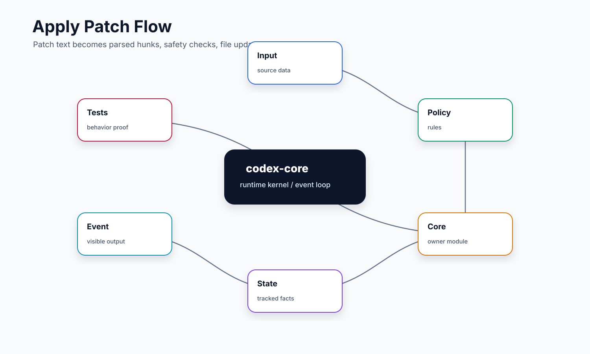
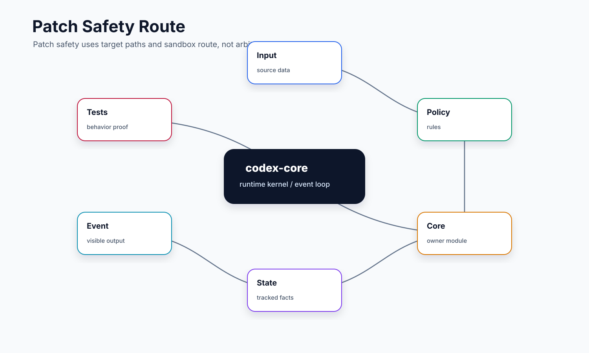

# 07. ApplyPatch

## 读完你应掌握什么



开篇全局图：这张图先给出本文的结构化 patch 模型：freeform 输入先进入 parser，形成 `Hunk` / `ApplyPatchAction`，再经路径权限、patch safety、通用 orchestrator 和 sandbox runtime 落盘，最后回传 output 与 `AppliedPatchDelta`。对应源码入口是 `repo/codex/codex-rs/apply-patch/src/parser.rs`、`repo/codex/codex-rs/core/src/tools/handlers/apply_patch.rs`、`repo/codex/codex-rs/core/src/safety.rs`、`repo/codex/codex-rs/core/src/tools/runtimes/apply_patch.rs` 和 `repo/codex/codex-rs/apply-patch/src/lib.rs`。

- 能解释 `apply_patch` 为什么是独立工具，而不是让模型随便运行 shell heredoc。
- 能从 patch 文本追踪到 parser、`ApplyPatchAction`、安全判定、审批、文件系统写入和结果事件。
- 能区分“计划变更”“实际已提交 delta”和“用户/模型看到的 summary”。
- 能说明 add、delete、update、move 在文件系统上分别怎么处理。
- 能理解 patch 失败时为什么不能假设没有副作用，也不能盲目重试。

## 这个模块解决什么问题

文件修改是 coding agent 的核心能力，但它比普通命令更需要结构化约束。一个 shell 命令可以做任何事，而 patch 的目标是“只表达文本文件变更”。Codex 把 patch 单独做成工具，有几个好处：

- 输入格式是受控 grammar，而不是任意 shell 脚本。
- 修改文件前可以先解析出目标路径和变更类型。
- 安全系统可以按目标路径做写权限判定。
- UI 可以在模型还没完整输出 patch 时，通过 streaming parser 展示“准备改哪些文件”。
- 执行结果能返回精确 delta，后续可用于事件、diff tracker、回滚提示或审计。

这里最重要的设计判断是：patch 不是“命令字符串”，而是“结构化文件操作计划”。它仍然复用工具审批和 sandbox 编排，但风险判断的输入是 `ApplyPatchAction`，不是 shell 里的文本片段。

## 源码锚点

- `repo/codex/codex-rs/core/src/tools/handlers/apply_patch.rs`：`ApplyPatchHandler`、`ApplyPatchArgumentDiffConsumer`、`effective_patch_permissions`、`write_permissions_for_paths`。
- `repo/codex/codex-rs/core/src/apply_patch.rs`：`prepare_apply_patch`、`convert_apply_patch_to_protocol`。
- `repo/codex/codex-rs/core/src/safety.rs`：`assess_patch_safety`、`PatchSandboxRoute`、`SafetyCheck`。
- `repo/codex/codex-rs/core/src/tools/runtimes/apply_patch.rs`：`ApplyPatchRuntime`、`ApplyPatchRequest`、`ApplyPatchRuntimeOutput`、`file_system_sandbox_context_for_attempt`、`run`。
- `repo/codex/codex-rs/apply-patch/src/parser.rs`：`parse_patch`、`Hunk`、`UpdateFileChunk` 和 patch grammar 注释。
- `repo/codex/codex-rs/apply-patch/src/file_update.rs`：`derive_new_contents_from_chunks`、`compute_replacements`、`apply_replacements`。
- `repo/codex/codex-rs/apply-patch/src/lib.rs`：`ApplyPatchArgs`、`ApplyPatchAction`、`ApplyPatchFileChange`、`AppliedPatchDelta`、`apply_patch_with_options`、`apply_hunks_to_files`。
- `repo/codex/codex-rs/core/src/apply_patch_tests.rs`：core 侧 patch 准备和协议转换测试。
- `repo/codex/codex-rs/core/src/tools/handlers/apply_patch_tests.rs`：handler 参数、流式变更事件、环境选择和额外权限测试。
- `repo/codex/codex-rs/core/src/tools/runtimes/apply_patch_tests.rs`：runtime 审批 key、sandbox cwd、executor workspace 权限测试。
- `repo/codex/codex-rs/apply-patch/src/file_update_tests.rs`：文件更新和 diff 生成测试。

## 核心代码片段

Source: `repo/codex/codex-rs/apply-patch/src/parser.rs::Hunk / UpdateFileChunk`
Line range: `repo/codex/codex-rs/apply-patch/src/parser.rs:64-82, 114-143`

```rust
#[derive(Debug, PartialEq, Clone)]
#[allow(clippy::enum_variant_names)]
pub enum Hunk {
    AddFile {
        path: PathBuf,
        contents: String,
    },
    DeleteFile {
        path: PathBuf,
    },
    UpdateFile {
        path: PathBuf,
        move_path: Option<PathBuf>,

        /// Chunks should be in order, i.e. the `change_context` of one chunk
        /// should occur later in the file than the previous chunk.
        chunks: Vec<UpdateFileChunk>,
    },
}

// ...

#[derive(Debug, Default, PartialEq, Clone)]
pub struct UpdateFileChunk {
    /// A single line of context used to narrow down the position of the chunk
    /// (this is usually a class, method, or function definition.)
    pub change_context: Option<String>,

    /// A contiguous block of lines that should be replaced with `new_lines`.
    /// `old_lines` must occur strictly after `change_context`.
    pub old_lines: Vec<String>,
    pub new_lines: Vec<String>,

    /// Pairs of indices into `old_lines` and `new_lines` that identify lines
    /// parsed as context rather than inferred to be equal by their contents.
    pub context_line_indices: Vec<(usize, usize)>,

    /// If set to true, `old_lines` must occur at the end of the source file.
    /// (Tolerance around trailing newlines should be encouraged.)
    pub is_end_of_file: bool,
}
```

**解释：** parser 的输出已经是结构化文件操作，而不是 shell 字符串。`Hunk` 区分 add/delete/update/move，`UpdateFileChunk` 保存上下文、旧行、新行和 EOF 约束，为后续路径审批、预览事件和精确替换提供稳定输入。

Source: `repo/codex/codex-rs/core/src/tools/handlers/apply_patch.rs::file_paths_for_action`
Line range: `repo/codex/codex-rs/core/src/tools/handlers/apply_patch.rs:223-236`

```rust
fn file_paths_for_action(action: &ApplyPatchAction) -> Vec<PathUri> {
    let mut keys = Vec::new();
    for (path, change) in action.changes() {
        keys.push(path.clone());

        if let ApplyPatchFileChange::Update { move_path, .. } = change
            && let Some(dest) = move_path
        {
            keys.push(dest.clone());
        }
    }

    keys
}
```

**解释：** handler 会把每个变更的主路径放入 `file_paths`，并在 update + move 时额外加入目标路径。这个短函数证明 rename 不是只检查源文件，目标路径也会进入后续权限推导和审批判断。

Source: `repo/codex/codex-rs/core/src/tools/runtimes/apply_patch.rs::ApplyPatchRuntime::run`
Line range: `repo/codex/codex-rs/core/src/tools/runtimes/apply_patch.rs:168-198`

```rust
async fn run(
    &mut self,
    req: &ApplyPatchRequest,
    attempt: &SandboxAttempt<'_>,
    _ctx: &ToolCtx,
) -> Result<ApplyPatchRuntimeOutput, ToolError> {
    let started_at = Instant::now();
    let fs = req.turn_environment.environment.get_filesystem();
    let sandbox = Self::file_system_sandbox_context_for_attempt(req, attempt);
    let mut stdout = Vec::new();
    let mut stderr = Vec::new();
    let result = codex_apply_patch::apply_patch_with_options(
        &req.action.patch,
        ApplyPatchOptions {
            update_file_mode: req.action.update_file_mode(),
            // Only reject links when an otherwise-required sandbox was bypassed.
            // Executor-managed sandboxes can have SandboxType::None.
            follow_symlinks: attempt.sandbox_requested
                || !attempt.manager.should_sandbox(
                    attempt.permissions,
                    self.sandbox_preference(),
                    attempt.enforce_managed_network,
                ),
        },
        &req.action.cwd,
        &mut stdout,
        &mut stderr,
        fs.as_ref(),
        sandbox.as_ref(),
    )
    .await;
    // ...
```

**解释：** runtime 真正执行 patch 时仍接收 `SandboxAttempt`，并按本次 attempt 构造文件系统 sandbox context。`follow_symlinks` 的条件说明 Codex 会根据 sandbox 是否被请求来处理链接风险，而不是只按路径字符串判断安全。

## 核心抽象

| 抽象 | 小白视角 | 关键职责 |
| --- | --- | --- |
| `Hunk` | patch 中的一段文件操作 | 表达 `AddFile`、`DeleteFile`、`UpdateFile`，update 可带 `Move to`。 |
| `UpdateFileChunk` | update 内的一组局部替换 | 记录上下文行、旧行、新行和 EOF 标记。 |
| `ApplyPatchArgs` | parser 输出的原始 patch 结构 | 包含 patch 文本、hunks、workdir、environment id。 |
| `ApplyPatchAction` | 已验证的执行计划 | 路径已按 cwd 解析成 `PathUri`，并带 `update_file_mode`。 |
| `SafetyCheck` | patch 执行前的安全结论 | `AutoApprove`、`AskUser`、`Reject`。 |
| `ApplyPatchRuntimeInvocation` | core 交给 runtime 的准备结果 | 包含 action、是否 auto approved、审批要求。 |
| `ApplyPatchRequest` | orchestrator 执行 patch 的请求 | 带目标环境、file_paths、protocol changes、额外权限和审批状态。 |
| `ApplyPatchRuntime` | 真正落盘的工具 runtime | 构造 sandbox context，调用 `codex_apply_patch::apply_patch_with_options`。 |
| `AppliedPatchDelta` | 已经实际提交的变化 | 失败时也可能非空，并用 `exact` 表示是否完整可靠。 |

本节无需单独新增图；开篇执行流程图已经覆盖这些抽象的顺序，上一节的 parser、handler path collection 和 runtime 片段已经证明核心结构。`AppliedPatchDelta` 的精确性语义会在结果回传小节用独立代码片段说明。

## 主流程


这张图先看 `freeform patch -> parser -> ApplyPatchAction -> safety -> orchestrator -> runtime -> delta/output` 的主链路。下面 1 到 6 步按图中顺序解释每一层为什么存在。无需代码片段：主流程总述复用上一节 parser/action/runtime 代码证据。

### 1. handler 接收 freeform patch

`ApplyPatchHandler` 的工具规格是 freeform，模型传入的是完整 patch 文本。handler 不把它交给 shell，而是直接调用 `codex_apply_patch::parse_patch`。如果解析失败，会返回 `apply_patch verification failed: ...` 给模型。

同时，`ApplyPatchArgumentDiffConsumer` 可以消费模型流式输出的参数增量。只要 `Feature::ApplyPatchStreamingEvents` 开启，它会用 `StreamingPatchParser` 尝试从未完成的 patch 中提取 hunks，再生成 `PatchApplyUpdatedEvent`。这样 UI 可以提前看到将要修改的文件，而不是等工具最终执行完。

### 2. parser 把文本变成 hunks

`apply-patch/src/parser.rs` 的文件头直接写出了 grammar：patch 必须有 `*** Begin Patch` 和 `*** End Patch`，中间是 add/delete/update hunk。update hunk 可以包含 `*** Move to:` 和若干 `@@` chunk。

parser 默认是 lenient 模式。它允许模型把 patch 包在 heredoc 标记里，因为旧模型可能把 `apply_patch <<'EOF' ... EOF` 当成一个参数传进来。lenient 模式会剥掉 heredoc 外壳，再按严格 patch 边界解析。这里的宽容只发生在外壳层，hunk 本身仍然要符合格式。

### 3. 计算有效权限和安全结论



这张安全路由图对应 `ApplyPatchAction -> assess_patch_safety -> approval/sandbox -> runtime`，读图时重点看目标路径、move 目标、可写根、sandbox route 和用户审批如何共同决定 patch 是否能落盘。

handler 会先根据 action 收集所有目标路径。对 update + move，源路径和目标路径都要纳入 `file_paths_for_action`，否则 rename 可能绕过目标路径审批。

`effective_patch_permissions` 会合并 session/turn 已授予权限，并调用 `write_permissions_for_paths` 为不可写目标推导额外写权限。注意它不会因为目标在可写根内就给父目录新增权限，测试 `write_permissions_for_paths_do_not_widen_workspace_root_target` 和 `write_permissions_for_paths_do_not_regrant_an_already_writable_parent` 就是在守这个边界。

接着 `prepare_apply_patch` 调用 `assess_patch_safety`：空 patch 拒绝；全部目标都可写且 sandbox 可用时自动通过；否则看 `approval_policy` 是否允许提示用户。这个判断输出 `ExecApprovalRequirement`，交给通用 `ToolOrchestrator`。

无需代码片段：本小节的目标路径证据已经由上方 `file_paths_for_action` 片段给出；`assess_patch_safety` 的分支证据放在 `06-safety-sandbox-approval.md`，避免在两个专题重复贴同一段安全代码。

### 4. runtime 在 sandbox 上下文内写文件

`ApplyPatchRuntime::run` 根据 `SandboxAttempt` 构造 `FileSystemSandboxContext`。如果本次尝试请求 sandbox，它会把 executor permission profile、additional permissions、cwd、workspace roots、user home、temporary directories 和 Windows sandbox 设置放进上下文；如果本次尝试明确不走 sandbox，则上下文为 `None`。

随后 runtime 调用 `codex_apply_patch::apply_patch_with_options`。这里还会传入 `ApplyPatchOptions`：`update_file_mode` 控制是否保留行尾，`follow_symlinks` 则取决于 sandbox 是否被请求以及当前策略是否本来需要 sandbox。这个细节很关键：符号链接和硬链接会让“看起来在工作区内”的路径指向别处，所以 patch 不能只看字符串路径。

### 5. apply-patch crate 真正改文件

`apply_patch_with_options` 先再次 parse patch，再进入 `apply_hunks_with_options` 和 `apply_hunks_to_files`。每个 hunk 的处理方式不同：

- `AddFile`：先尝试读取已有内容用于 delta，再写入新内容，缺失父目录时可补建父目录后重试。
- `DeleteFile`：先读取删除前内容，确认不是目录，再删除。
- `UpdateFile`：读取原文件，用 `derive_new_contents_from_chunks` 计算新内容；如果带 move，先写目标，再删除源，最后把 delta 从临时 add 修正为 update+move。

`file_update.rs` 的 `compute_replacements` 会按 chunk 顺序查找上下文和旧行，找不到就失败。`PreserveLineEndings` 模式下，context 行会保留原始行尾，避免混合行尾文件被统一改写。

### 6. 结果回传和 delta 记录

runtime 把 stdout/stderr 组成 `ExecToolCallOutput`，并保存 `AppliedPatchDelta`。如果失败发生在写入阶段，源码用 `delta.exact = false` 记录“我们不确定文件系统是否已经部分变化”。这比假装事务回滚更诚实，因为真实文件写入可能在报错前已经截断或部分写入。

handler 最后把结果转成 `ApplyPatchToolOutput`，并通知 tool lifecycle、post hook 和 turn diff tracker。模型看到的是成功/失败输出；core 内部还保留结构化变更信息。

Source: `repo/codex/codex-rs/apply-patch/src/lib.rs::AppliedPatchDelta / try_write`
Line range: `repo/codex/codex-rs/apply-patch/src/lib.rs:245-278, 489-501`

```rust
/// Textual file changes that were actually committed while applying a patch.
#[derive(Clone, Debug, PartialEq)]
pub struct AppliedPatchDelta {
    changes: Vec<AppliedPatchChange>,
    exact: bool,
}

impl AppliedPatchDelta {
    fn new(changes: Vec<AppliedPatchChange>, exact: bool) -> Self {
        Self { changes, exact }
    }

    pub fn is_exact(&self) -> bool {
        self.exact
    }

    /// Appends a later committed prefix while preserving the aggregate exactness.
    pub fn append(&mut self, other: Self) {
        self.changes.extend(other.changes);
        self.exact &= other.exact;
    }
}

// A failed write can still have modified the target before surfacing an
// error (for example by truncating before ENOSPC), so the accumulated
// delta is no longer exact when a write fails.
macro_rules! try_write {
    ($result:expr) => {
        match $result {
            Ok(value) => value,
            Err(error) => {
                delta.exact = false;
                return Err(anyhow::Error::from(error));
            }
        }
    };
}
```

这段说明 delta 是“已提交变化”的审计记录，而不是事务日志。`exact` 会随 append 聚合，也会在写入失败时被置为 false，因此失败路径仍要把 delta 暴露给上层作为人工复核线索。

## 失败模式与边界条件


这张安全路由图用于阅读下面的失败列表：parse error、路径权限、sandbox route、链接风险和写入副作用是不同边界。无需代码片段：parser、路径收集、runtime 写入和 delta exactness 已在前文贴近展示。

- patch 边界不合法：缺少 `*** Begin Patch` / `*** End Patch`，或 heredoc 剥离后仍不合法，会被 parser 拒绝。
- hunk 格式不合法：add/delete/update 行、`@@` chunk、`*** Move to:` 顺序错误时，返回带行号的 parse error。
- 空 patch：`assess_patch_safety` 直接 `Reject { reason: \"empty patch\" }`。
- 目标路径不可写：如果 approval policy 允许，进入审批；不允许则拒绝。
- move 只检查源路径是不够的：目标路径也必须参与审批和额外权限推导。
- update 找不到旧行：`compute_replacements` 返回 `Failed to find expected lines...`，说明 patch 基于的文件内容已过期或上下文不够准。
- 删除目录：`ensure_not_directory` 防止把目录当文本文件删掉。
- 符号链接/硬链接：即使路径在可写根内，也仍需要 sandbox 或谨慎的 `follow_symlinks` 策略。
- 写入失败可能有副作用：`try_write!` 会把 `delta.exact` 置为 false，因为文件可能已经部分变化。
- executor-managed 环境：路径以 `PathUri` 表达，不能强行按本机路径理解；额外权限需要结合 executor context 归一化。

## 图示

`Apply Patch 执行流程` 已作为开篇图和主流程图放在正文附近；`Patch 安全路由` 已放在权限判定和失败边界附近。这里仅保留图示章节说明，不再重复集中展示。

## 复设计练习

请设计一个“结构化 patch 工具”，它只允许模型修改文本文件，不允许执行任意 shell。你至少要说明：

1. patch grammar 应该包含哪些操作？是否允许 rename？
2. parser 输出应该是原始字符串，还是结构化 action？为什么？
3. 安全判断应该在 parse 前、parse 后还是落盘时做？
4. 如果 patch 一半成功后一半失败，你如何向调用者报告？
5. 对 symlink、hard link、远端路径和 Windows 路径，你会把路径检查放在哪一层？

一个合理答案应该包含 `parse -> verify action -> assess safety -> approval/sandbox -> apply hunks -> delta/output` 的链路。

## 检查题

1. `ApplyPatchAction` 为什么要求路径在构造后已经解析到 `PathUri`？
2. `ApplyPatchArgumentDiffConsumer` 的价值是什么？它是否真的写文件？
3. `assess_patch_safety` 为什么要同时看 approval policy 和 file system sandbox policy？
4. `write_permissions_for_paths` 为什么跳过已经可写的路径？
5. `ApplyPatchRuntime::file_system_sandbox_context_for_attempt` 在 `sandbox_requested=false` 时为什么返回 `None`？
6. `AppliedPatchDelta::exact=false` 通常说明了什么？

### 答案要点

1. `PathUri` 让本地和远端路径在同一个抽象下表达，避免 parser 输出相对字符串后由不同层重复解析、产生权限判断不一致。
2. 它消费模型传入的 freeform diff，解析并构造结构化 patch action；它本身不落盘，真正写文件在 runtime 和 `codex-apply-patch` crate 中完成。
3. patch 是否安全既取决于用户是否允许审批，也取决于目标路径是否被当前 file-system sandbox 约束；只看其中一个会漏掉越权写入或无法询问用户的场景。
4. 已经可写的路径不需要重新申请父级权限；否则会扩大授权面，尤其容易把 workspace root 或上级目录误放开。
5. `sandbox_requested=false` 表示当前 attempt 不需要构造额外文件系统 sandbox context，runtime 应按既有执行路径处理，而不是伪造一个不存在的隔离配置。
6. 它表示写入阶段可能发生了部分成功或无法确认最终文件状态；调用方不能把 delta 当作完整可逆补丁，只能作为人工排查线索。

## Follow-up Slots

- 逐例阅读 `apply-patch/src/file_update_tests.rs`，补充“旧行匹配失败”的案例说明。
- 对比 shell heredoc patch 和 freeform `apply_patch` 工具的风险差异。
- 为 `ApplyPatchPreserveLineEndings` 单独写一页，解释 CRLF/LF 混合文件为何难处理。
- 补一张“失败后如何根据 delta 判断人工修复范围”的图。
