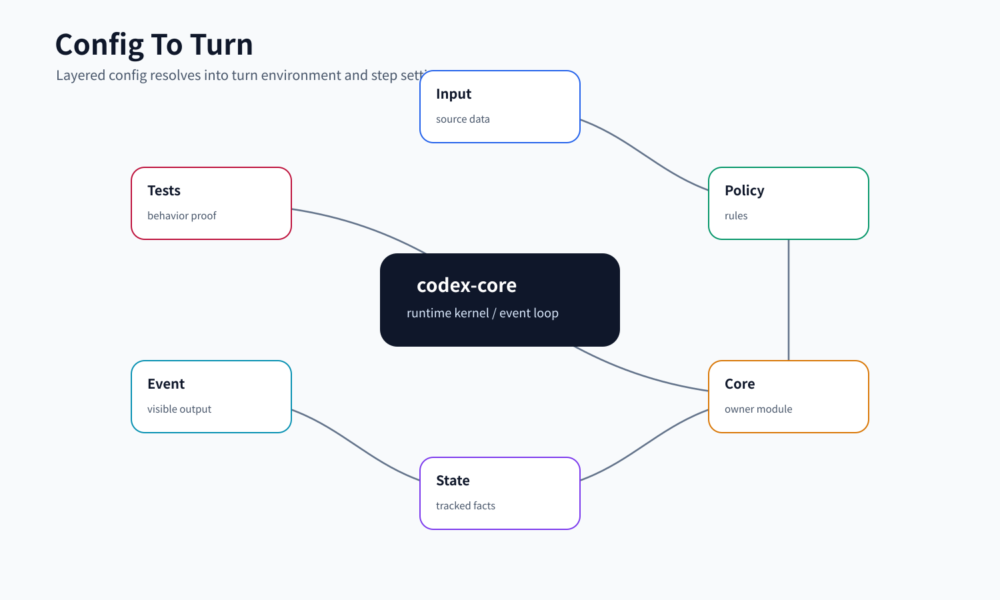
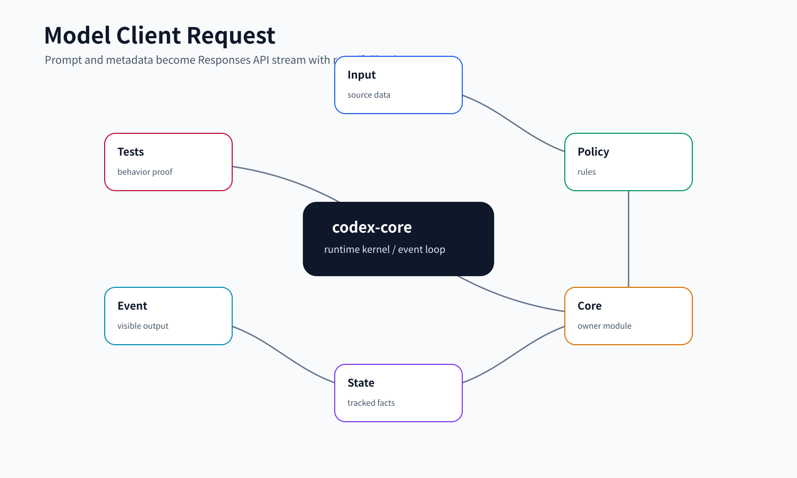

# 08. Config / Environment / Model Client

## 读完你应掌握什么

- 能解释 Codex core 为什么把配置加载、环境选择和模型请求放在同一条学习链路里。
- 能从 `config.toml`、profile、requirements 和 CLI/harness overrides 追踪到最终 `Config`。
- 能说明 `TurnEnvironment` 如何把 cwd、workspace roots、shell、permission profile 和 sandbox context 固定到一次 turn。
- 能看懂 `Prompt` 如何被转换为 Responses API 请求。
- 能说明 WebSocket、HTTP fallback、retry、metadata、auth recovery 这些机制如何影响一次模型调用。



这张开篇综合图先给出本文的主线：配置层合并成 `Config`，`Permissions` 和环境选择固定到 `TurnEnvironment`，每次模型采样再由 `StepContext` 捕获 MCP、工具和设置快照，最后由 `ModelClient` 把 `Prompt` 转成 Responses API 请求并处理传输恢复。后文的源码片段分别证明 `Permissions`、`StepContext` 和 `build_responses_request` 这三个关键落点。

## 这个模块解决什么问题

很多系统会把配置当成“启动时读几个字段”。Codex core 不是这样：配置决定了模型、工具、权限、环境、MCP、插件、上下文注入、网络代理、telemetry 和实验特性。换句话说，配置会直接改变一次 turn 的行为。

这一组模块解决四个问题：

- **配置合并**：同一个字段可能来自默认值、用户配置、项目配置、profile、managed requirements、CLI override、harness override。
- **环境冻结**：一次 turn 要在明确的 cwd、workspace roots、permission profile、shell 和 executor 上执行，不能边跑边漂移。
- **模型请求构造**：上下文、工具列表、base instructions、reasoning effort、verbosity、schema、metadata 都要进入 request。
- **传输可靠性**：Responses API 可能走 WebSocket 或 HTTP，遇到断线、401、server fallback 时要有可解释的恢复路径。

对初学者来说，可以把这条链路理解成：`Config` 是总开关，`TurnContext/StepContext` 是本轮快照，`ModelClientSession` 是本轮模型连接。

## 源码锚点

- `repo/codex/codex-rs/core/src/config/mod.rs`：`Config`、`Permissions`、`ConfigBuilder`、`ConfigOverrides`、`load_config_with_layer_stack`。
- `repo/codex/codex-rs/core/src/config/permissions.rs`：permission profile 的编译和解析。
- `repo/codex/codex-rs/core/src/config/permission_profile_selection.rs`：命名权限 profile 的选择。
- `repo/codex/codex-rs/core/src/config/requirements.rs`：managed requirements 对配置的约束。
- `repo/codex/codex-rs/core/src/environment_selection.rs`：`ThreadEnvironments`、`TurnEnvironmentSelection`、`resolve_selection_config`、环境 ready 快照。
- `repo/codex/codex-rs/core/src/session/turn_context.rs`：`TurnEnvironment`、`TurnContext`、`NewTurnContextOptions`。
- `repo/codex/codex-rs/core/src/session/step_context.rs`：`StepContext`，一次 sampling request 的不可变设置快照。
- `repo/codex/codex-rs/core/src/exec_env.rs`：`create_env`、`inject_session_env`、`inject_permission_profile_env`、`inject_apply_patch_env`。
- `repo/codex/codex-rs/core/src/client.rs`：`ModelClient`、`ModelClientSession`、`build_responses_request`、`stream_responses_api`、`stream_responses_websocket`。
- `repo/codex/codex-rs/core/src/client_common.rs`：`Prompt`、`ResponseStream`。
- `repo/codex/codex-rs/core/src/responses_metadata.rs`：`CodexResponsesMetadata`、`CodexResponsesRequestKind`、metadata validation/filtering。
- `repo/codex/codex-rs/core/src/responses_retry.rs`：`ResponsesStreamRetryState`、`handle_retryable_response_stream_error`。
- `repo/codex/codex-rs/core/src/config/config_tests.rs`、`repo/codex/codex-rs/core/src/config/config_loader_tests.rs`、`repo/codex/codex-rs/core/src/client_tests.rs`：配置合并、模型请求、metadata、fallback 和 auth recovery 测试。

## 核心代码片段

**Source:** `repo/codex/codex-rs/core/src/config/mod.rs`
**Line range:** `L305-L334`

```rust
pub struct Permissions {
    /// Approval policy for executing commands.
    pub approval_policy: Constrained<AskForApproval>,
    /// Constrained permission profile plus its selected profile identity, if
    /// the profile came from a built-in or named config profile.
    permission_profile_state: PermissionProfileState,
    /// Managed deny-read rules retained independently from user-defined denies.
    managed_deny_read_policy: Option<Arc<FileSystemSandboxPolicy>>,
    /// Thread-scoped runtime workspace roots. Symbolic `:workspace_roots`
    /// entries in the permission profile are materialized against these roots.
    workspace_roots: Vec<AbsolutePathBuf>,
    /// Effective network configuration applied to all spawned processes.
    pub network: Option<NetworkProxySpec>,
    /// Whether the model may request a login shell for shell-based tools.
    /// Default to `true`
    ///
    /// If `true`, the model may request a login shell (`login = true`), and
    /// omitting `login` defaults to using a login shell.
    /// If `false`, the model can never use a login shell: `login = true`
    /// requests are rejected, and omitting `login` defaults to a non-login
    /// shell.
    pub allow_login_shell: bool,
    /// Policy used to build process environments for shell/unified exec.
    pub shell_environment_policy: ShellEnvironmentPolicy,
    /// Effective Windows sandbox mode derived from `[windows].sandbox` or
    /// legacy feature keys.
    pub windows_sandbox_mode: Option<WindowsSandboxModeToml>,
    /// Whether the final Windows sandboxed child should run on a private desktop.
    pub windows_sandbox_private_desktop: bool,
}
```

**解释：** `Permissions` 把 approval policy、permission profile、deny-read、workspace roots、network、login shell 和 Windows sandbox 放在同一个配置对象里。后续 turn/environment/tool 都引用这个结构的解析结果，因此安全行为是配置合成后的运行时事实，而不是 handler 临时决定。

**Source:** `repo/codex/codex-rs/core/src/session/step_context.rs`
**Line range:** `L14-L34`

```rust
/// Request-scoped state that may change between model sampling requests.
pub(crate) struct StepContext {
    pub(crate) turn: Arc<TurnContext>,
    /// One immutable settings version captured before request preparation.
    pub(crate) settings: Arc<ResolvedStepSettings>,
    /// Frozen turn preferences resolved against this step's captured model.
    pub(crate) token_budget: Option<TokenBudgetConfig>,
    /// Telemetry context tagged with this sampling request's model.
    pub(crate) session_telemetry: SessionTelemetry,
    pub(crate) environments: TurnEnvironmentSnapshot,
    /// Capability roots bound to ready environments in this exact step.
    pub(crate) selected_capability_roots: Vec<ResolvedSelectedCapabilityRoot>,
    /// Executor-materialized capability files shared by MCP and skills in this exact step.
    pub(crate) executor_capability_discovery: Option<Arc<ExecutorCapabilityDiscoverySnapshot>>,
    /// The exact MCP connections, configuration, and catalog captured for this step.
    pub(crate) mcp: Arc<McpBinding>,
    /// The finalized tool plan advertised and executed for this exact sampling request.
    pub(crate) tool_router: Arc<ToolRouter>,
    /// The canonical AGENTS.md value observed with this environment snapshot.
    pub(crate) loaded_agents_md: Option<Arc<LoadedAgentsMd>>,
}
```

**解释：** `StepContext` 是单次 sampling request 的冻结快照，直接保存 settings、environment snapshot、MCP binding 和 tool router。它解释了为什么一次 turn 内多次模型调用不会因为后台环境或工具刷新而看到不一致的工具列表。

**Source:** `repo/codex/codex-rs/core/src/client.rs`
**Line range:** `L891-L939`

```rust
fn build_responses_request(
    &self,
    prompt: &Prompt,
    model_info: &ModelInfo,
    effort: Option<ReasoningEffortConfig>,
    summary: ReasoningSummaryConfig,
    service_tier: Option<String>,
    responses_metadata: &CodexResponsesMetadata,
) -> Result<ResponsesApiRequest> {
    let mut input = prompt.get_formatted_input_for_request(model_info.use_responses_lite);
    let is_openai = self.state.provider.info().is_openai();
    let (instructions, tools) = if model_info.use_responses_lite {
        // These prompt-only items are rebuilt on every request. Hash their visible payloads
        // within the thread so retries and resumed sessions preserve their identity.
        let prefix_namespace = Uuid::new_v5(
            &Uuid::NAMESPACE_OID,
            self.state.thread_id.to_string().as_bytes(),
        );
        let tools = if self.state.provider.capabilities().namespace_tools {
            create_tools_json_for_responses_lite(&prompt.tools)?
        } else {
            create_tools_json_for_responses_api(&prompt.tools)?
        };
        let mut prefix = vec![ResponseItem::AdditionalTools {
            id: Some(ResponseItemId::with_suffix(
                "at",
                Uuid::new_v5(&prefix_namespace, &serde_json::to_vec(&tools)?),
            )),
            role: "developer".to_string(),
            tools,
        }];
        if !prompt.base_instructions.text.is_empty() {
            let mut instructions = ContextualUserFragment::into(BaseInstructionsFragment(
                prompt.base_instructions.text.clone(),
            ));
            instructions.set_id(Some(ResponseItemId::with_suffix(
                "msg",
                Uuid::new_v5(&prefix_namespace, prompt.base_instructions.text.as_bytes()),
            )));
            prefix.push(instructions);
        }
        input.splice(0..0, prefix);
        (String::new(), None)
    } else {
        (
            prompt.base_instructions.text.clone(),
            Some(create_tools_raw_json_for_responses_api(&prompt.tools)?.into()),
        )
    };
```

**解释：** 模型请求构造集中在 `build_responses_request`。这段代码展示 Responses Lite 会把 tools 和 base instructions 作为 developer 前缀插入 `input`，而普通 Responses API 则走后续 `instructions/tools` 字段分支，说明模型能力、工具列表和基础指令都由同一处请求构造逻辑统一落地。

## 核心抽象

| 抽象 | 小白视角 | 关键职责 |
| --- | --- | --- |
| `ConfigBuilder` | “配置装配入口” | 接收 codex home、CLI overrides、harness overrides、strict config、cloud bundle、thread loader。 |
| `ConfigLayerStack` | “多层配置堆栈” | 保存默认、系统、用户、项目、profile、managed 等层，并给出 effective config。 |
| `ConfigOverrides` | “调用方强制覆盖” | CLI/TUI/app-server 等入口可以覆盖 model、cwd、approval、sandbox、provider、workspace roots。 |
| `Config` | “core 的最终运行配置” | 包含模型、provider、权限、MCP、features、metadata、tool registry、realtime、multi-agent 等字段。 |
| `Permissions` | “安全和 shell 环境配置的集合” | 管理 approval policy、permission profile、network proxy、shell env、Windows sandbox。 |
| `ThreadEnvironments` | “线程级环境管理器” | 管理本地/远端环境选择、连接状态、capability roots 和 shell snapshot。 |
| `TurnEnvironment` | “一次 turn 的执行环境快照” | 固定 cwd、workspace roots、permission profile、shell、executor 平台和 sandbox context。 |
| `StepContext` | “一次模型采样请求的快照” | 固定 step settings、telemetry、MCP binding、tool router 和 selected capability roots。 |
| `Prompt` | “发给模型的逻辑输入” | 包含 history input、工具 specs、base instructions、output schema 和 cyber access program。 |
| `ModelClient` | “会话级模型客户端” | 保存 provider、auth、thread id、transport fallback 和 shared websocket state。 |
| `ModelClientSession` | “turn 级模型连接” | 保存 turn-state sticky routing、WebSocket 连接、last response，用于一次 turn 内多次请求。 |
| `CodexResponsesMetadata` | “模型请求元数据快照” | 生成 `client_metadata` 和兼容 header，携带 session/thread/turn/window/tool/sandbox 信息。 |

## 主流程

开篇综合图已按 `ConfigBuilder -> Config -> TurnEnvironment -> StepContext -> Prompt -> ResponsesApiRequest` 给出本节阅读顺序。下面 1 到 7 步分别解释配置合并、环境冻结、请求构造和传输恢复；模型请求细节处另放 `Model Client 请求路径` 图。

无需代码片段重复嵌入；本节是对上方 `Permissions`、`StepContext`、`ModelClient::build_responses_request` 和下方 retry/fallback 代码证据的串联导读。

### 1. 配置层先合并，再构造 `Config`

`ConfigBuilder::build_inner` 是典型入口。它先确定 `codex_home` 和 cwd，再调用 `load_config_layers_state` 读取配置层。每一层中的相对路径已经按对应配置文件目录解析，所以合并后可以直接反序列化为 `ConfigToml`。

然后 `Config::load_config_with_layer_stack` 把 TOML、requirements 和 overrides 合成最终 `Config`。这一步会做很多“不能只靠 TOML 默认值”的工作：

- 校验 model providers 和 `responses_api_metadata`。
- 把 managed requirements 应用到配置，并记录 startup warnings。
- 解构 `ConfigRequirements` 和 `ConfigOverrides`，确保新增字段不会被遗漏。
- 合并 features，并用 requirements 限制 feature。
- 解析 Windows sandbox mode、cwd、workspace roots、permission profile。
- 根据项目 trust level 选择默认 `approval_policy`。
- 合并内置和用户自定义 model providers，确定 `model_provider_id` 和 `model_provider`。
- 生成 MCP、tool registry、multi-agent、token budget、realtime、telemetry 等最终字段。

这说明 `Config` 不是原始配置文件镜像，而是“已经过约束、补默认、归一化、可直接执行”的 runtime config。

无需代码片段重复嵌入；本节讲配置合并顺序，实体形状和权限字段证据见上方 `Permissions` 代码片段，完整装配入口见 `repo/codex/codex-rs/core/src/config/mod.rs::ConfigBuilder::build_inner` 与 `load_config_with_layer_stack`。

### 2. 权限配置进入环境快照

`Permissions` 暴露了几组关键方法：`permission_profile` 返回 canonical profile；`effective_permission_profile` 会把 `:workspace_roots` 这样的符号根物化；`file_system_sandbox_policy` 和 `network_sandbox_policy` 分别给文件系统和网络路径使用。

`environment_selection.rs` 把 thread 的默认环境和 attachment 环境合并成 `TurnEnvironmentSelection`。`resolve_selection_config` 还会记录配置归属：`Thread` 表示后续跟随 thread 设置更新，`Owner` 表示 attachment 自带配置，不应被 thread 后续改动覆盖。

最终 `TurnEnvironment` 在 `turn_context.rs` 中固定以下信息：

- `selection.environment_id` 和 `cwd`。
- `workspace_roots`。
- `permission_profile`。
- executor 报告的 `shell`、`user_home_dir`、`temporary_directories`、`executor_platform_os`。
- `shell_snapshot` 和 Windows sandbox 设置。

工具执行时不再重新猜 cwd 和权限，而是读这个 turn 环境快照。

无需代码片段重复嵌入；本节的权限实体证据在上方 `Permissions` 片段，step 冻结证据在上方 `StepContext` 片段，环境选择分支可从 `repo/codex/codex-rs/core/src/environment_selection.rs::resolve_selection_config` 继续复查。

### 3. shell 环境变量由 policy 构造

`exec_env.rs` 是配置到子进程 env 的桥。`create_env` 按 `ShellEnvironmentPolicy` 生成环境变量集合。随后执行路径会注入 core 自己的运行变量：

- `CODEX_THREAD_ID`。
- `CODEX_SESSION_ID`。
- `CODEX_VERSION`。
- `CODEX_PERMISSION_PROFILE`，仅作为信息，不是授权证明。
- `CODEX_APPLY_PATCH_PRESERVE_LINE_ENDINGS`，把 apply-patch 行尾策略传给子进程。

Unified Exec 还会加 `NO_COLOR=1`、`TERM=dumb`、`PAGER=cat`、`CODEX_CI=1` 等默认值，让命令输出更适合自动化读取。

### 4. Turn/Step 捕获模型请求视图

`TurnContext` 是一次用户 turn 的长生命周期状态，里面有 `config`、provider、session source、network、available models、dynamic tools、metadata state 等。`StepContext` 更细，它代表一次 sampling request 的不可变快照，包含 `settings`、`session_telemetry`、`environments`、`mcp` 和 `tool_router`。

为什么要有 `StepContext`？因为一次 turn 里模型可能多次采样：第一次模型要求工具，工具执行后第二次继续采样。如果中间配置、MCP、工具列表或模型设置改变，core 需要明确“本次 request 使用的是哪个冻结版本”，否则工具执行和模型看到的列表会对不上。

### 5. `Prompt` 变成 Responses API request



这张模型请求图对应 `Prompt -> ResponsesApiRequest -> ResponseStream`，读图时重点看 Responses Lite 和普通 Responses API 的差异，以及 metadata、reasoning、tool specs 如何落进请求。

`client_common.rs::Prompt` 是发给模型的逻辑输入：history `ResponseItem`、工具列表、是否允许 parallel tool calls、base instructions、output schema、cyber access program。

`ModelClient::build_responses_request` 再把 `Prompt` 和 `ModelInfo` 变成 `ResponsesApiRequest`：

- 如果启用 Responses Lite，工具列表和 base instructions 会作为 prefix `ResponseItem` 注入 input，`instructions` 字段为空。
- 如果不是 Responses Lite，base instructions 放入 `instructions`，工具 specs 进入 `tools` 字段。
- 非 OpenAI provider 会清理内部 metadata 和 encrypted function args。
- reasoning effort、reasoning summary、verbosity、output schema 会按 `ModelInfo` 能力决定是否发送。
- `parallel_tool_calls` 只有在 prompt 允许且不是 Responses Lite 时开启。
- `client_metadata` 来自 `CodexResponsesMetadata::client_metadata`。

这个函数是“配置如何影响模型请求”的最清晰锚点。

### 6. ModelClient 是会话级，ModelClientSession 是 turn 级

`ModelClient` 保存 provider、auth、thread id、originator、transport fallback、attestation provider、HTTP client factory 等会话级状态。它不直接把某次 turn 的 model、reasoning、metadata 藏在自己里面，而是要求调用 `stream` 或 `compact_conversation_history` 时显式传入。

`ModelClientSession` 是每个 turn 新建的，它可以复用 WebSocket 连接和 `previous_response_id`，并保存 `x-codex-turn-state` sticky-routing token。源码注释明确说不要跨 turn 复用它，否则会把上一个 turn 的 routing token 带到下一个 turn。

### 7. retry 和 fallback 保证请求可恢复

无需图重复嵌入；本节沿用上方 `Model Client 请求路径` 图中的 WebSocket / HTTP 分支，下面的 retry 代码片段补足恢复路径证据。

`session/turn.rs::run_sampling_request` 建立 retry loop：每次构造 `Prompt`，调用 `try_run_sampling_request`，如果错误不可重试就直接返回；可重试则交给 `handle_retryable_response_stream_error`。

`responses_retry.rs` 的策略包括：

- 特定配置下，普通 sampling 的连接失败可以无界重连，并用指数上限 delay。
- 达到 provider `stream_max_retries` 后，如果当前是 WebSocket，可以 fallback 到 HTTP。
- 重试时向前端发出 `WarningEvent`，避免用户以为卡住。
- context window exceeded 和 usage limit 这类业务错误不走普通 retry。

Source: `repo/codex/codex-rs/core/src/responses_retry.rs::handle_retryable_response_stream_error`
Line range: `repo/codex/codex-rs/core/src/responses_retry.rs:44-94`

```rust
pub(crate) async fn handle_retryable_response_stream_error(
    retry_state: &mut ResponsesStreamRetryState,
    max_retries: u64,
    err: CodexErr,
    client_session: &mut ModelClientSession,
    sess: &Session,
    turn_context: &TurnContext,
    request: ResponsesStreamRequest,
) -> Result<(), CodexErr> {
    let operation = match request {
        ResponsesStreamRequest::Sampling => RetryOperation::Sampling,
        ResponsesStreamRequest::RemoteCompactionV2 => RetryOperation::RemoteCompactionV2,
    };

    if turn_context
        .config
        .features
        .enabled(Feature::UnboundedConnectionRetries)
        && matches!(request, ResponsesStreamRequest::Sampling)
        && matches!(err.details(), CodexErrorDetails::ConnectionFailed(_))
        && !turn_context.session_source.is_internal()
        && !turn_context.provider.info().is_amazon_bedrock()
    {
        let retry_delay = retry_state.connection_retry_delay;
        // ...
        return Ok(());
    }

    if retry_state.retries >= max_retries
        && client_session.try_switch_fallback_transport(
            &turn_context.session_telemetry,
            turn_context.model_info(),
        )
    {
        // ...
        return Ok(());
    }
```

这段代码把 retry 分成两层：`UnboundedConnectionRetries` 只服务普通 sampling 的连接失败，且排除 internal session 和 Amazon Bedrock；普通 retry 用 provider 的 `max_retries` 控制，到上限后才允许 `ModelClientSession` 切到 HTTP fallback。它证明 fallback 是 turn 内传输状态，不是重新构造配置或重启 session。

## 失败模式与边界条件

无需图重复嵌入；本节是 failure matrix，配置和请求链路看开篇综合图，WebSocket/HTTP 分支看 `Model Client 请求路径` 图，retry 代码证据见上一节。
无需代码片段重复嵌入；下表每个失败项都回连到上方 `Permissions`、`StepContext`、`build_responses_request` 和 `handle_retryable_response_stream_error` 片段。

- 配置字段未知或类型不匹配：strict config 会报错，测试覆盖 unknown key、feature key 和 shell env policy 类型错误。
- overrides 冲突：`sandbox_mode`、`permission_profile`、`default_permissions` 不能互相冲突。
- legacy `profile = "..."` 已不支持：需要使用 profile v2 文件和 `--profile`。
- requirements 限制配置：如果默认或显式配置不满足 requirements，会 fallback、告警或报错。
- `approval_policy=never` 与被 requirements 禁止的 full access 组合会被拒绝，避免“降级到只读却不能审批”的死局。
- model provider 不存在：`model_provider_id` 查不到会返回 not found；旧 Ollama chat provider 有专门错误信息。
- `responses_api_metadata` 越界：最多 16 项，key 必须是短 ASCII 标识，value 最多 128 bytes，保留 key 不能被用户覆盖。
- WebSocket 不支持或已 fallback：`responses_websocket_enabled` 会关闭 WebSocket 路径，后续 turn 继续用 HTTP。
- WebSocket handshake 返回 upgrade required：直接 fallback 到 HTTP。
- auth 过期：`stream_responses_api` 和 `stream_responses_websocket` 会尝试 provider/auth manager 的 unauthorized recovery，但 bounded，不能无限刷新。
- 非 OpenAI provider：内部 metadata 和 encrypted args 会被清理，避免把 OpenAI 专有字段传给不支持的 provider。

## 图示

- [Config 到 Turn 的流转](../../image/core/config-to-turn-v1.png)：作为开篇综合图，放在“读完你应掌握什么”下方，用来建立配置、环境、step 和模型请求的全局关系。
- [Model Client 请求路径](../../image/core/model-client-request-v1.png)：放在“`Prompt` 变成 Responses API request”附近，用来解释请求构造、metadata 和传输分支。

## 复设计练习

请设计一个可以同时服务 CLI、TUI 和远端 app-server 的配置系统。你至少要说明：

1. 哪些字段属于全局默认，哪些字段必须允许 per-turn 覆盖？
2. 如何合并用户配置、项目配置、企业 requirements 和 CLI overrides？
3. 如何让一个远端 executor 的 cwd 和 workspace roots 不被本地主机路径误解？
4. 模型请求 metadata 中哪些字段应该由 core 保留，禁止上层覆盖？
5. WebSocket 和 HTTP 两种传输如何共享同一套 request 构造逻辑？

一个合理答案应该能说明 `ConfigBuilder -> Config -> TurnEnvironment -> StepContext -> Prompt -> ResponsesApiRequest -> ResponseStream`。

## 检查题

1. 为什么 `Config` 不是 `ConfigToml` 的简单复制？
2. `Permissions::effective_permission_profile` 比 `permission_profile` 多做了什么？
3. `TurnEnvironment` 为什么要保存 `config_origin`？
4. `StepContext` 为什么比 `TurnContext` 更细？
5. Responses Lite 下，tools 和 base instructions 如何进入请求？
6. 为什么 `ModelClientSession` 不能跨 turn 复用？
7. `responses_retry.rs` 中 WebSocket fallback 到 HTTP 的触发条件是什么？

### 答案要点

1. `Config` 是经过默认值、用户/项目/profile/requirements/overrides 合并、校验和归一化后的 runtime 配置；`ConfigToml` 只是原始文件结构。
2. `effective_permission_profile` 会把符号根、workspace roots、requirements 等上下文物化成执行期可用的权限画像；`permission_profile` 更接近配置选择本身。
3. `config_origin` 区分 thread-owned 和 attachment-owned 配置，防止 thread 后续设置覆盖 attachment 自带的环境约束。
4. 一个 turn 可能多次 sampling；`StepContext` 固定单次请求的 model settings、MCP binding、tool router 和 environment selection，避免请求期间工具/配置漂移。
5. Responses Lite 会把 tools 和 base instructions 作为 prefix `ResponseItem` 注入 input，而不是使用普通 Responses API 的 `instructions` 和 `tools` 字段。
6. 它保存 turn-state sticky routing、WebSocket 连接和 previous response id；跨 turn 复用会把上一轮路由和响应状态带到下一轮。
7. 当 WebSocket 路径不可用、握手要求 upgrade/fallback，或达到 provider 的 stream retry 条件后，retry 逻辑可切到 HTTP；context-window 或 usage-limit 这类业务错误不走普通 fallback。

## Follow-up Slots

- 深入 `config/schema.md`，把用户可写配置字段和 core 内部字段做一张对照表。
- 从 `config_tests.rs` 挑 10 个代表性测试，整理成“配置优先级实验”。
- 单独分析 `ModelInfo` 如何影响 reasoning、verbosity、tool mode 和 context window。
- 补充 `EnvironmentManager` 和 exec-server attachment 的远端环境专题。
