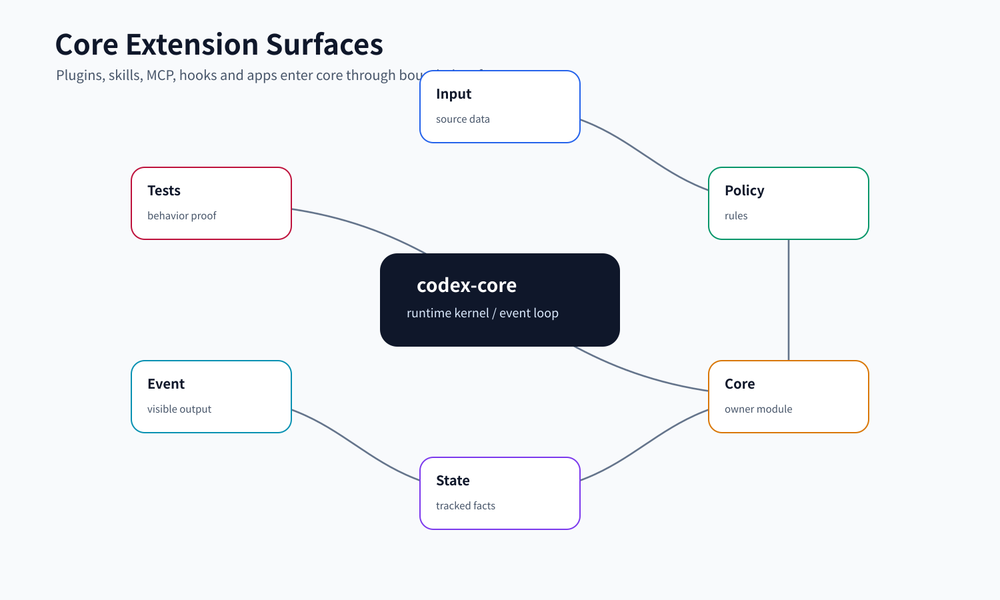
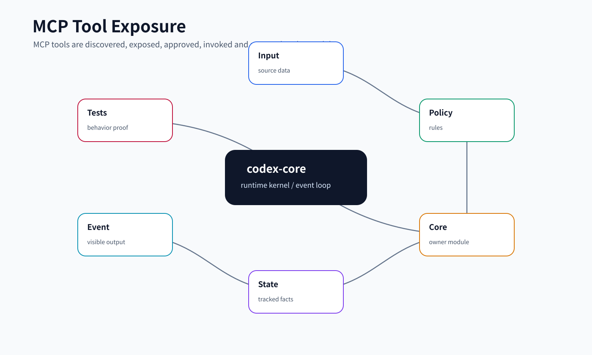

# 09. MCP / Connectors / Plugins / Skills

## 读完你应掌握什么

- 能区分 MCP server、connector、plugin、skill、extension tool 在 core 里的位置。
- 能解释外部能力如何从配置和插件贡献进入 `McpConfig`，再进入每个 step 的 `McpBinding`。
- 能说明 MCP tool 如何被过滤、注册、以 direct/deferred/hidden 三种方式暴露给模型。
- 能追踪一次 MCP tool call 的审批、调用、结果清洗、事件发送和 telemetry。
- 能设计一个插件系统，让外部能力能扩展上下文和工具，但不能绕过 core 的权限边界。



这张开篇综合图把 MCP server、Apps connector、plugin、skill、hook 和 extension tool 放回同一个 core 边界里：配置和插件先贡献能力，`Session` 在 step 级冻结 `McpBinding`，`ToolRouter` 再决定 direct/deferred/hidden 暴露，真正调用时仍经过审批、metadata、结果清洗和事件回写。后文的 `McpRuntimeProjection`、`append_mcp_tools` 和 `handle_mcp_tool_call` 片段分别对应图中的配置投影、工具曝光和调用审批三段。

## 这个模块解决什么问题

Codex core 不能把所有外部系统都写死在仓库里。它需要一种机制，让本机或宿主平台提供工具、应用、技能和上下文，同时仍然保持几个核心约束：

- 模型看到的工具列表必须是本轮确定的，不能在一次 request 中途漂移。
- 插件可以贡献 MCP server、skills、apps 或上下文提示，但不能绕过工具 registry、审批、sandbox 和 telemetry。
- app connector 往往连接私有数据，工具展示和调用都必须走 app policy、approval template 和账号状态。
- skill 是“让模型知道如何做事”的上下文，不是直接执行入口；真正执行还是靠工具、MCP 或 shell。
- hook 也可能调用 MCP 工具，但仍要通过 core 持有的 MCP runtime。

所以这组模块的核心不是“支持 MCP”四个字，而是“把外部能力收编进 core 的统一 turn 模型”。发现、展示、执行、审批、事件、上下文都必须挂到 session/step 上。

## 源码锚点

- `repo/codex/codex-rs/core/src/mcp.rs`：`McpManager`、`McpRuntimeProjection`、`runtime_config_for_step`、`runtime_config_with_context`。
- `repo/codex/codex-rs/core/src/session/mcp.rs`：`runtime_mcp_config_and_context`、`refresh_mcp_if_dirty`、`mcp_runtime_for_step`、`executor_capability_discovery_for_step`。
- `repo/codex/codex-rs/core/src/mcp_tool_exposure.rs`：`McpHandlerCache`、`append_mcp_tools`、direct/deferred/hidden 暴露策略。
- `repo/codex/codex-rs/core/src/mcp_tool_call.rs`：`handle_mcp_tool_call`、`maybe_request_mcp_tool_approval`、`handle_approved_mcp_tool_call`、MCP metadata 和结果裁剪。
- `repo/codex/codex-rs/core/src/mcp_tool_approval_templates.rs`：MCP consequential tool 的审批文案模板。
- `repo/codex/codex-rs/core/src/connectors.rs`：apps/connectors 可见性、工具推荐和 accessible connectors 缓存。
- `repo/codex/codex-rs/core/src/plugins/mod.rs`：`plugins_manager_for_config` 和 plugin manager 构造。
- `repo/codex/codex-rs/core/src/plugins/injection.rs`：`build_plugin_injections`，显式 plugin mention 如何注入上下文。
- `repo/codex/codex-rs/core/src/plugins/render.rs`：plugin 能力提示渲染和长度限制。
- `repo/codex/codex-rs/core/src/plugins/mentions.rs`：从用户输入中收集 app/plugin/tool mention。
- `repo/codex/codex-rs/core/src/skills.rs`：`skills_load_input_from_config`、显式/隐式 skill invocation telemetry。
- `repo/codex/codex-rs/core/src/context/plugin_instructions.rs`：`PluginInstructions` 作为 developer 上下文片段。
- `repo/codex/codex-rs/core/src/hook_mcp_executor.rs`：hook 调 MCP 的 core 适配器。
- `repo/codex/codex-rs/core/src/tools/handlers/extension_tools.rs`：`ExtensionToolAdapter`，把 extension executor 接入 core tool runtime。
- `repo/codex/codex-rs/core/src/mcp_tool_call_tests.rs`、`repo/codex/codex-rs/core/src/mcp_tool_exposure_test.rs`、`repo/codex/codex-rs/core/src/plugins/render_tests.rs`、`repo/codex/codex-rs/core/src/plugins/mentions_tests.rs`：扩展行为测试证据。

## 核心代码片段

**Source:** `repo/codex/codex-rs/core/src/mcp.rs`
**Line range:** `L41-L79`

```rust
/// MCP configuration and capability availability derived from the same inputs.
#[derive(Clone)]
pub(crate) struct McpRuntimeProjection {
    pub(crate) config: McpConfig,
    pub(crate) plugins_available: bool,
    pub(crate) selected_plugins: SelectedPluginSnapshot,
}

pub(crate) enum McpEnvironmentScope<'a> {
    /// Controller-level operations without an associated thread.
    HostOnly,
    /// Initial thread selections before the live environment store exists.
    Initial(&'a [TurnEnvironmentSelection]),
    /// Current attachment state for an existing thread.
    Live(&'a ThreadEnvironments),
}

pub(crate) struct McpThreadIdentity<'a> {
    pub(crate) session_source: &'a SessionSource,
    pub(crate) originator: &'a str,
    pub(crate) environments: McpEnvironmentScope<'a>,
}

#[derive(Clone)]
pub struct McpManager {
    plugins_manager: Arc<PluginsManager>,
    extensions: Arc<ExtensionRegistry<Config>>,
    codex_apps_tools_cache: ConnectorRuntimeManager<ToolInfo>,
    tool_catalog_cache: McpToolCatalogCache,
}
```

**解释：** 这组实体定义说明 MCP 不是一份静态配置：`McpRuntimeProjection` 同时携带最终 `McpConfig`、插件可用性和选中插件快照；`McpEnvironmentScope` 区分 host-only、初始 thread 环境和 live attachment 环境；`McpThreadIdentity` 则把 session source、originator 和环境范围一起传入投影过程。`McpManager` 持有 plugins、extensions、Apps 工具缓存和 tool catalog 缓存，证明外部能力的发现和曝光都收口在 core 的统一管理器里。

**Source:** `repo/codex/codex-rs/core/src/mcp_tool_exposure.rs`
**Line range:** `L90-L96`、`L121-L143`

```rust
    let exposure = if search_tool_enabled {
        ToolExposure::Deferred
    } else {
        ToolExposure::Direct
    };
    let mut registered_tools = HashSet::new();
    let mut agent_plugin_bytes = 0usize;

    // ...

        let fits_agent_budget = if agent_plugin {
            handler.model_spec_bytes().is_ok_and(|bytes| {
                if bytes > MAX_AGENT_PLUGIN_MCP_SPEC_BYTES {
                    return false;
                }
                let next = agent_plugin_bytes.saturating_add(bytes);
                if next <= MAX_AGENT_PLUGIN_MCP_TOTAL_BYTES {
                    agent_plugin_bytes = next;
                    true
                } else {
                    false
                }
            })
        } else {
            true
        };
        let tool_exposure = if fits_agent_budget {
            exposure
        } else {
            ToolExposure::Hidden
        };
        if registry.register_external_with_exposure(handler, tool_exposure) && fits_agent_budget {
            registered_tools.insert(tool_name);
        }
```

**解释：** MCP tool 曝光先过滤普通工具和 Apps 工具，再根据是否启用 search tool 选择 `Direct` 或 `Deferred`。agent plugin 还会进入后续 byte budget 判断，证明插件工具不是无条件塞进 prompt，而是通过 core registry 和曝光策略受控注册。

**Source:** `repo/codex/codex-rs/core/src/mcp_tool_call.rs`
**Line range:** `L267-L307`

```rust
    let approval_policy = if prepared_call.is_selected_plugin_server() {
        McpToolApprovalPolicy::for_selected_plugin(approval_mode)
    } else {
        McpToolApprovalPolicy::for_server(approval_mode)
    };
    if let Some(decision) = maybe_request_mcp_tool_approval(
        &sess,
        step_context,
        cancellation_token,
        &call_id,
        &invocation,
        &invocation_tool_name,
        &hook_tool_name,
        &metadata,
        prepared_call.config(),
        prepared_call.permission_profile(),
        approval_policy,
    )
    .await
    {
        let result = match decision {
            decision @ (ReviewDecision::Approved
            | ReviewDecision::ApprovedForSession
            | ReviewDecision::ApprovedMcpPolicyAmendment
            | ReviewDecision::ApprovedExecpolicyAmendment { .. }
            | ReviewDecision::NetworkPolicyAmendment { .. }) => {
                return handle_approved_mcp_tool_call(
                    &sess,
                    step_context.as_ref(),
                    &call_id,
                    originating_item_id.as_ref(),
                    invocation,
                    prepared_call,
                    metadata,
                    item_metadata,
                    McpToolApprovalApplication::Apply {
                        decision,
                        policy: approval_policy,
                    },
                )
                .await;
            }
        // ...
```

**解释：** MCP 工具调用会先根据是否来自 selected plugin 选择审批策略，再调用 `maybe_request_mcp_tool_approval`。只有 approved / approved-for-session / policy amendment / network amendment 这类通过结果才会进入 `handle_approved_mcp_tool_call`，证明外部工具仍受 core 审批生命周期控制。

## 核心抽象

| 抽象 | 小白视角 | 关键职责 |
| --- | --- | --- |
| `McpManager` | “MCP 配置总装配器” | 合并 config、插件、host extension、Apps 内置 server 和环境 authority。 |
| `McpRuntimeProjection` | “MCP 运行时配置快照” | 返回最终 `McpConfig`、插件可用性、已选插件快照。 |
| `McpBinding` | “本 step 可用 MCP 连接和工具目录” | 被 `StepContext` 捕获，保证本次 sampling request 工具视图稳定。 |
| `McpHandlerCache` | “MCP tool handler 缓存” | 根据当前 binding 生成或复用 `McpHandler`，注册进 core tool registry。 |
| `ToolExposure` | “模型如何看到工具” | direct 直接暴露，deferred 通过 tool search 暴露，hidden 不暴露。 |
| `McpToolApprovalPolicy` | “MCP 调用是否需要确认” | 区分普通 server 和 selected plugin；selected plugin 不允许持久化审批。 |
| `McpToolApprovalMetadata` | “审批展示和调用元数据” | 包含 connector、tool title、annotations、plugin id、OpenAI file 字段等。 |
| `PluginCapabilitySummary` | “插件能力摘要” | 用于渲染插件相关的技能、MCP server 和 app 提示。 |
| `PluginInstructions` | “注入模型的插件提示片段” | 作为 developer role 的上下文片段进入模型输入。 |
| `ExtensionToolAdapter` | “外部工具适配器” | 把 extension API 的 tool executor 包装成 core 可调度的 `CoreToolRuntime`。 |

## 外部能力矩阵

外部能力进入 core 时要分清“贡献配置/上下文”和“真正执行动作”两件事。`McpManager`、plugin injection、skill telemetry 和 extension tool adapter 都会影响模型看到的能力，但最终执行仍要回到 tool registry、MCP runtime 或 core tool runtime。

| 能力面 | 进入点 | 模型可见形式 | 执行边界 | 关键锚点 |
| --- | --- | --- | --- | --- |
| 用户配置 MCP server | `Config` -> `McpManager::runtime_config_for_step` | MCP tools 或 resources | `McpBinding` 捕获本 step 可用连接 | `repo/codex/codex-rs/core/src/mcp.rs`、`repo/codex/codex-rs/core/src/session/mcp.rs` |
| Host / extension MCP contribution | extension contributor -> `McpServerContributionContext` | server catalog、tools、resources | environment authority 限制可访问环境 | `repo/codex/codex-rs/core/src/mcp.rs` |
| Codex Apps connector | `connectors.rs` + Apps MCP server | apps instructions、Apps tools | app policy、account/accessibility、MCP approval | `repo/codex/codex-rs/core/src/connectors.rs`、`repo/codex/codex-rs/core/src/apps/render.rs` |
| Plugin mention | `plugins/mentions.rs` -> `plugins/injection.rs` | developer role 的 `PluginInstructions` | 只改变上下文，不直接执行 | `repo/codex/codex-rs/core/src/plugins/mentions.rs`、`repo/codex/codex-rs/core/src/plugins/injection.rs` |
| Skill invocation | `skills.rs` | skill 内容和 telemetry | skill 是指令/知识，不绕过权限 | `repo/codex/codex-rs/core/src/skills.rs` |
| MCP tool exposure | `mcp_tool_exposure.rs::append_mcp_tools` | direct、deferred、hidden tool | tool search、Apps policy、plugin byte budget | `repo/codex/codex-rs/core/src/mcp_tool_exposure.rs` |
| MCP tool call | `mcp_tool_call.rs::handle_mcp_tool_call` | tool result 或 error output | approval、metadata、result sanitize/truncate | `repo/codex/codex-rs/core/src/mcp_tool_call.rs` |
| Hook 调 MCP | `CoreHookMcpExecutor` | hook side effect，不直接进入 prompt | 使用 core 持有的 latest MCP runtime | `repo/codex/codex-rs/core/src/hook_mcp_executor.rs` |
| Extension tool | `ExtensionToolAdapter` | core tool runtime | 带 history、environment、sandbox context | `repo/codex/codex-rs/core/src/tools/handlers/extension_tools.rs` |

这张表的核心结论是：外部系统可以贡献“模型应该知道什么”和“模型可以调用什么”，但不能直接跳过 `StepContext` 的冻结视图、tool registry、approval、sandbox 和结果裁剪。

## 主流程

开篇综合图已经展示 MCP、Apps、plugins、skills、hooks 和 extension tools 如何进入 core。下面的步骤按这个入口关系展开，再在 MCP tool exposure 处放局部图说明 direct/deferred/hidden 与调用路径。

无需代码片段重复嵌入；本节是对上方 `McpRuntimeProjection`、`append_mcp_tools`、`handle_mcp_tool_call` 和下方结果清洗片段的串联导读。

### 1. 配置和插件先贡献 MCP server

`McpManager::runtime_config_for_step` 是 step 级 MCP 配置入口。它会创建 `McpServerContributionContext`，把 `Config`、thread init/store、originator、selected capability roots、executor capability discovery 都传给 extension contributor。

`runtime_config_with_context` 会按顺序处理贡献项：

- `Set`：注册或覆盖某个 MCP server。
- `HostedApps`：注册 host 提供的 Apps server。
- `SelectedPlugin`：把用户选中的插件转成 MCP server registration。
- `SelectedPluginPackage`：记录插件可用性、selected root 和 connector id。
- `Remove`：按 contributor 和 order 移除 server。

之后它把用户配置、插件贡献、Codex Apps 兼容 server 和环境 authority 合成一个 `McpConfig`。环境 authority 的作用是限制某些 server 只能访问被选择的环境，或者在 pending/failed 环境下不可用。

无需代码片段重复嵌入；本节的运行时投影实体证据见上方 `McpRuntimeProjection` / `McpEnvironmentScope` / `McpThreadIdentity` 片段，贡献项合并细节可从 `repo/codex/codex-rs/core/src/mcp.rs::runtime_config_with_context` 继续复查。

### 2. Session 负责刷新和冻结 step 视图

`Session::refresh_mcp_if_dirty` 在 auth、环境、capability roots 或配置变化时重建运行时。`Session::mcp_runtime_for_step` 会在构造 `StepContext` 时拿到满足 required servers/plugins 的 `McpBinding`。如果当前 runtime 不能满足要求，就返回空 binding，而不是把未准备好的工具暴露给模型。

这和工具路由的设计一致：模型每一次 sampling request 看到的是 `StepContext` 捕获的工具集合，而不是后台实时变化的全局工具表。

### 3. MCP tool 进入 core tool registry



这张图对应 MCP tool 从 catalog、exposure policy、registry 到 approval/call/result 的路径，帮助区分 direct、deferred、hidden 和真正执行调用。

`mcp_tool_exposure.rs::append_mcp_tools` 从 `McpBinding::tools()` 里拿 `ToolInfo`。它先过滤非 Apps 的普通 MCP tools，再根据 `apps_enabled` 和 app policy 过滤 Codex Apps tools。

曝光方式由 `search_tool_enabled` 决定：

- search tool 不可用时，MCP tools 以 `ToolExposure::Direct` 暴露。
- search tool 可用时，MCP tools 可以 `Deferred`，模型先通过 tool search 找到再调用。
- agent plugin 的 MCP specs 有单个和总量 byte budget，超出预算会 `Hidden`。

这个 budget 很重要。它防止一个插件带来大量工具 schema，把模型上下文塞满。

### 4. plugin 和 skill 注入的是上下文，不是权限捷径

`plugins/mentions.rs` 从用户输入里收集 `plugin://...`、app mention 和 `$tool` 风格 mention。`plugins/injection.rs::build_plugin_injections` 只为显式提到的插件生成上下文提示，告诉模型这些插件关联了哪些 MCP server、apps 和 skill namespace。

这些提示通过 `PluginInstructions` 以 developer 角色注入。它告诉模型“有哪些能力可以用”，但并不直接授予权限。真正调用工具时，仍要经过 tool registry、MCP prepared call、approval 和 runtime。

`skills.rs` 则记录显式或隐式 skill invocation。显式 skill 来自模型/用户选择后的注入结果；隐式 skill 可以由 shell 命令触发检测。它们都会写 telemetry 和 plugin usage，但同样不替代工具执行权限。

无需代码片段重复嵌入；本节是权限边界解释，工具曝光证据见上方 `append_mcp_tools` 片段，真正执行边界见下方 MCP tool call 与结果清洗片段。

### 5. MCP tool call 进入审批和调用生命周期

无需图重复嵌入；本节沿用上方 `MCP 工具曝光与调用` 图，图中的 approval gate 正对应上方 `handle_mcp_tool_call` 代码片段。
无需代码片段重复嵌入；审批分支的连续代码证据见上方 `handle_mcp_tool_call` 片段，下一节补结果清洗与 completed event 的落点。

模型发起 MCP tool call 后，`handle_mcp_tool_call` 先解析 JSON arguments，构造 `McpInvocation`。如果 `prepared_call` 不存在，说明工具对模型不可用，直接发 skipped/completed 事件并返回错误结果。

如果工具可用，core 会取 MCP metadata，创建 `McpToolCallItemMetadata`，发出 started 事件，并判断 approval mode：普通 server 可以允许 persistent approval，selected plugin server 只允许 session 级别，不允许持久保存。

`maybe_request_mcp_tool_approval` 的判断顺序是：严格 auto review 是否打开、MCP permission prompt 是否可自动通过、tool annotations 是否要求审批、会话/持久审批是否已记住。如果需要审批，会构造 `ApprovalAction::McpToolCall`，其中包含 server、tool、arguments、connector、账号、标题、描述、annotations、approval policy 和 reviewer。

通过后，`handle_approved_mcp_tool_call` 执行 `prepared_call.call_with_preparation`。执行前会写入 request meta，包括 call id、turn metadata、Codex Apps meta、plugin id、confirmation policies、thread id、originating item id，以及可选 sandbox state。

### 6. 结果要清洗、裁剪、发事件

MCP tool 返回后，core 会调用 `process_mcp_tool_result` 做生命周期处理，再通过 `sanitize_mcp_tool_result_for_model` 清理模型不支持的内容。事件侧还会经过 `truncate_mcp_tool_result_for_event`，避免把多 MB 的结构化 payload 写入 rollout 或 app-server event。

这条路径说明一个重要原则：外部工具结果有两个接收者，模型和 UI/历史。它们都需要信息，但都不能无限吃原始结果。

Source: `repo/codex/codex-rs/core/src/mcp_tool_call.rs::handle_approved_mcp_tool_call`
Line range: `repo/codex/codex-rs/core/src/mcp_tool_call.rs:538-590`

```rust
            process_mcp_tool_result(
                sess,
                turn_context,
                call_id,
                &mcp_tool,
                &tool_input,
                &mut result,
            )
            .await;
            let result = sanitize_mcp_tool_result_for_model(
                &turn_context.model_info().input_modalities,
                Ok(result),
            )?;
            Ok(maybe_request_codex_apps_auth_elicitation(
                sess,
                turn_context,
                prepared_call.config().approval_policy.value(),
                call_id,
                &invocation.server,
                Some(&metadata),
                result,
            )
            .await)
        }
        .await;
        record_mcp_result_span_telemetry(&Span::current(), &result);
        result
    }
    .instrument(mcp_tool_call_span(
        sess,
        turn_context,
        McpToolCallSpanFields {
            server_name: &server,
            tool_name: &tool_name,
            call_id,
            server_origin: server_origin.as_deref(),
            connector_id,
            connector_name,
        },
    ))
    .await;
    // ...
    notify_mcp_tool_call_completed(
        sess,
        turn_context,
        call_id,
        invocation,
        item_metadata,
        duration,
        truncate_mcp_tool_result_for_event(&result),
    )
    .await;
```

这段代码证明 MCP result 会先经过 tool lifecycle 处理，再清理成模型可消费格式；事件发送侧则使用 `truncate_mcp_tool_result_for_event`，说明模型输入和 UI/rollout 事件不是无界共享同一份原始 payload。

### 7. hook 也通过 core 的 MCP runtime

`hook_mcp_executor.rs::CoreHookMcpExecutor` 实现 `HookMcpExecutor`。hook 想调用 MCP 工具时，它会通过 core 持有的 `McpRuntime::latest_call_tool`，并注入 `threadId` metadata。这样 hook 不需要自己维护 MCP 连接，也不会绕过 session-scoped runtime。

### 8. extension tool 被适配成 core tool

`tools/handlers/extension_tools.rs::ExtensionToolAdapter` 把 extension API 的 `ToolExecutor` 包装成 core 的 `ToolExecutor<ToolInvocation>`。适配时会提供 conversation history、turn metadata、truncation policy、tool source 和当前可用 environments；每个 environment 都带 file system 和 sandbox context。

这使得扩展工具能像内置工具一样进入 router、hook、事件和权限上下文，而不是成为第二套工具系统。

## 失败模式与边界条件

无需图重复嵌入；本节是 failure matrix，MCP 准备、曝光、审批、调用和结果回写都可以回看开篇综合图与 `MCP 工具曝光与调用` 图。
无需代码片段重复嵌入；失败项分别回连到上方 `McpRuntimeProjection`、`append_mcp_tools`、`handle_mcp_tool_call` 和 `handle_approved_mcp_tool_call` 片段。

- MCP runtime 还没准备好或不满足 required servers/plugins：`mcp_runtime_for_step` 会返回空 binding，模型不能调用未就绪工具。
- server contribution 冲突：`McpManager` 会记录 catalog conflicts，并使用 resolved catalog 的结果。
- 环境处于 pending/failed：对应环境 authority 可能是 `Unavailable`，工具不应被当成可调用。
- Apps disabled 或 app policy disabled：Codex Apps tools 会在 exposure 或调用阶段被过滤/阻断。
- MCP tool metadata 不合法：调用会被 skipped，并把错误作为 tool result 返回给模型。
- MCP arguments 不是合法 JSON：`handle_mcp_tool_call` 直接返回 `err: ...`。
- consequential tool 需要审批：MCP approval template 会尝试生成更易读的问题和参数展示；找不到模板时仍可走通用审批。
- selected plugin approval 不持久化：`McpToolApprovalPolicy::for_selected_plugin` 把 `allow_persistent` 设为 false，避免一次临时选择污染全局配置。
- MCP result 太大：事件存储侧只保留截断预览，避免 rollout 膨胀。
- auth elicitation 被拒绝或关闭：Codex Apps 的认证引导不会自动完成，原结果返回。
- extension tool 只收到可转换为本地绝对路径的 environment；外部路径目前会被跳过，源码里也有 TODO 说明未来迁移到 `PathUri`。

## 图示

- [Core 扩展入口](../../image/core/core-extension-surfaces-v1.svg)：作为开篇综合图，放在“读完你应掌握什么”下方，用来建立外部能力进入 core 的全局模型。
- [MCP 工具曝光与调用](../../image/core/mcp-tool-exposure-v1.svg)：放在“MCP tool 进入 core tool registry”附近，用来解释 direct/deferred/hidden、approval 和 result sanitize。

## 复设计练习

请设计一个插件系统，让插件可以贡献工具、技能提示和外部账号连接，但必须满足：模型看到的工具集合在一次请求内稳定，危险工具要审批，工具结果不能无限写入历史。你至少要回答：

1. 插件声明和插件执行分别在哪一层？
2. 外部工具如何进入统一 tool registry？
3. direct、deferred、hidden 三种曝光模式如何选择？
4. 外部账号授权失败时，如何向用户请求授权而不是让模型猜？
5. 插件提示为什么只能影响模型上下文，不能自动扩大 sandbox 权限？

## 检查题

1. `McpManager::runtime_config_for_step` 比 `runtime_config` 多了哪些 step 级输入？
2. `McpRuntimeProjection` 为什么同时返回 `plugins_available` 和 `selected_plugins`？
3. `append_mcp_tools` 为什么要给 agent plugin MCP specs 设置 byte budget？
4. `maybe_request_mcp_tool_approval` 为什么要区分 selected plugin 和普通 server？
5. `build_mcp_tool_call_request_meta` 给 MCP server 传了哪些 core-owned 信息？
6. `ExtensionToolAdapter` 为什么要把 conversation history 和 environments 一起传给扩展工具？

### 答案要点

1. 它多了 step 级 context：当前 thread/store、originator、selected capability roots、executor capability discovery 和 extension contribution 状态，用来得到本次请求可用的 MCP runtime。
2. `plugins_available` 说明是否有插件能力可提示给模型，`selected_plugins` 记录本次显式选择的插件；二者分别服务上下文渲染和调用/审批边界。
3. plugin 可能贡献大量 MCP specs，byte budget 防止工具 schema 挤爆模型上下文；超预算时可转 hidden/deferred，而不是全部直塞 prompt。
4. selected plugin 是本轮显式上下文，不应把一次临时选择升级成持久审批；普通 server 可以按配置和审批缓存使用更长生命周期的授权。
5. 它会传 call id、turn metadata、Codex Apps metadata、plugin id、confirmation policy、thread id、originating item id，以及可选 sandbox state 等 core-owned 上下文。
6. extension tool 要在 core 的上下文和权限内执行；history 让工具知道对话背景，environments/sandbox context 限定它能操作哪里，避免扩展工具形成第二套未受控 runtime。

## Follow-up Slots

- 深入 `codex-mcp` crate，补一篇 MCP runtime 连接和 catalog 细节文档。
- 把 Apps connector policy 与 `mcp_tool_approval_templates.rs` 的模板匹配整理成案例表。
- 结合 `ToolRouter` 写一篇 direct/deferred/code-mode 工具曝光规则专题。
- 分析 host extension API，说明插件贡献 MCP server、tool executor 和 skill invocation callback 的完整 contract。
