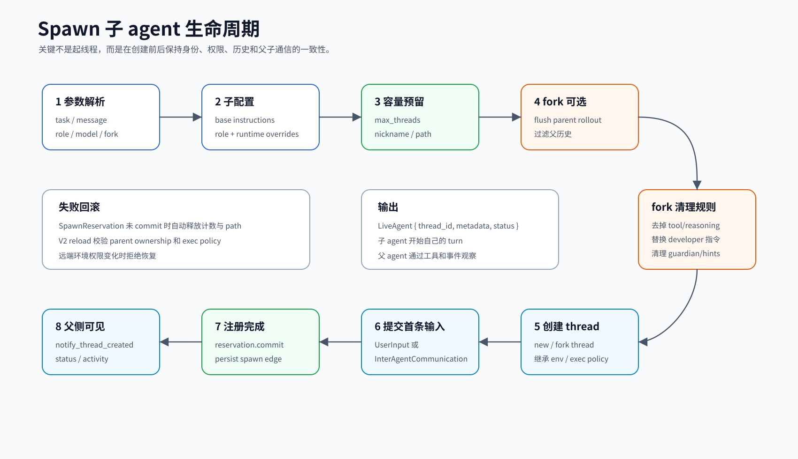

# Agents / Multi-agent / Spawn

本文讲 `codex-rs/core` 里“多 agent 协作”这条线。对小白来说，可以先把它理解成：一个主会话可以创建子会话，把一部分任务交给它；子会话不是随便起一个线程，而是带着身份、角色、权限、历史边界和回传通道被纳入同一棵 agent 树。

## 读完你应掌握什么

- 知道 `AgentControl` 为什么是多 agent 的控制面，而不是普通工具 handler。
- 能分清 `AgentRegistry`、`AgentMetadata`、`AgentPath`、`SessionSource` 的职责。
- 能解释一次 `spawn_agent` 从模型工具调用到子 agent 开始执行的生命周期。
- 知道 fork 子 agent 时为什么要过滤父线程历史、替换 developer instructions、清理 usage hint 和 guardian 上下文。
- 能说出多 agent 的主要边界：数量限制、深度限制、父子归属、环境继承、执行权限继承和持久化恢复。


这张开篇综合图先把本文的三层关系合在一起：模型只通过多 agent 工具表达意图，`AgentControl` 负责 spawn/send/wait/list/interrupt 的控制面，`AgentRegistry` 维护 root agent 树内的身份、容量和路径；fork、role、residency、rollout flush 与恢复都围绕这条控制面展开。后文的 `AgentControl`、V2 `spawn_agent` handler、`SpawnReservation` 和 fork 过滤代码片段分别证明图中的控制面、工具入口、半成功回滚和历史继承边界。

## 这个模块解决什么问题

单 agent 的 harness 只需要回答一个问题：“当前 turn 下一步做什么？”多 agent 要额外回答一组问题：

- 谁有权创建子 agent？
- 子 agent 算独立线程，还是父线程里的临时任务？
- 子 agent 继承哪些上下文，不能继承哪些上下文？
- 子 agent 运行中、完成后、被关闭后，父 agent 如何观察它？
- 恢复历史会话时，已经 spawn 出来的 agent 树如何重建？

Codex 的答案是把“协作能力”拆成三层：

- 模型可见的工具层：`spawn_agent`、message、wait、list、interrupt 等工具 handler。
- 会话树控制层：`AgentControl` 统一 spawn、send、resume、status、capacity、residency。
- 状态登记层：`AgentRegistry` 记录 agent path、thread id、nickname、role 和数量限制。

这样模型只看到工具，业务代码通过 `AgentControl` 操作线程，而 registry 保证同一 root session 内的 agent 树不会失控。

## 源码锚点

| 关注点 | 源码 |
| --- | --- |
| agent 模块出口 | `repo/codex/codex-rs/core/src/agent/mod.rs` |
| agent 注册、容量、路径和昵称 | `repo/codex/codex-rs/core/src/agent/registry.rs` |
| control plane 主结构 | `repo/codex/codex-rs/core/src/agent/control.rs` |
| spawn / fork / resume 主实现 | `repo/codex/codex-rs/core/src/agent/control/spawn.rs` |
| 执行容量限制 | `repo/codex/codex-rs/core/src/agent/control/execution.rs` |
| V2 residency | `repo/codex/codex-rs/core/src/agent/control/residency.rs` |
| 角色配置叠加 | `repo/codex/codex-rs/core/src/agent/role.rs` |
| agent 目标解析 | `repo/codex/codex-rs/core/src/agent/agent_resolver.rs` |
| agent 状态模型 | `repo/codex/codex-rs/core/src/agent/status.rs` |
| 跨 agent 通信日志 | `repo/codex/codex-rs/core/src/agent_communication.rs` |
| 子进程 spawn 工具函数 | `repo/codex/codex-rs/core/src/spawn.rs` |
| legacy 多 agent handler | `repo/codex/codex-rs/core/src/tools/handlers/multi_agents.rs` |
| V2 多 agent handler | `repo/codex/codex-rs/core/src/tools/handlers/multi_agents_v2.rs` |
| V2 spawn handler | `repo/codex/codex-rs/core/src/tools/handlers/multi_agents_v2/spawn.rs` |
| V2 message / wait / interrupt / list | `repo/codex/codex-rs/core/src/tools/handlers/multi_agents_v2/` |
| 模型上下文中的多 agent 模式提示 | `repo/codex/codex-rs/core/src/context/multi_agent_mode_instructions.rs` |
| 模型上下文中的角色提示 | `repo/codex/codex-rs/core/src/context/multi_agent_role_instructions.rs` |
| agent registry 测试 | `repo/codex/codex-rs/core/src/agent/registry_tests.rs` |
| agent control 测试 | `repo/codex/codex-rs/core/src/agent/control_tests.rs` |

## 核心代码片段

### 1. `AgentControl` 是 root agent 树共享的控制面

Source: `repo/codex/codex-rs/core/src/agent/control.rs`
Line range: 118-134

```rust
pub(crate) struct AgentControl {
    /// session_id is equal to the root thread's ID.
    session_id: SessionId,
    /// Weak handle back to the global thread registry/state.
    /// This is `Weak` to avoid reference cycles and shadow persistence of the form
    /// `ThreadManagerState -> CodexThread -> Session -> SessionServices -> ThreadManagerState`.
    manager: Weak<ThreadManagerState>,
    /// Captured at construction so delegates retain their manager's allocation policy.
    thread_id_generator: ThreadIdGenerator,
    state: Arc<AgentRegistry>,
    v2_residency: Arc<V2Residency>,
    agent_execution_limiter: Arc<AgentExecutionLimiter>,
    /// Session-scoped state shared by the root thread and every cloned sub-agent control handle.
    rollout_budget: Arc<RolloutBudget>,
    /// The user-selected root routing tier, shared by the entire agent tree.
    root_service_tier: Arc<ArcSwapOption<String>>,
}
```

解释：这段字段定义证明 `AgentControl` 不是一次工具调用里的临时对象，而是把 `ThreadManagerState`、`AgentRegistry`、V2 residency、执行限流和 rollout budget 组合在一起的控制面。`rollout_budget` 和 `root_service_tier` 的注释也明确了 root thread 与所有子 agent 共享这些状态。

### 2. V2 `spawn_agent` handler 把模型意图翻译成子线程来源和通信

Source: `repo/codex/codex-rs/core/src/tools/handlers/multi_agents_v2/spawn.rs`
Line range: 123-179

```rust
let session_source = turn.session_source.clone();
let child_depth = next_thread_spawn_depth(&session_source);
let mut config =
    build_agent_spawn_config(&session.get_base_instructions().await, turn.as_ref())?;
let is_full_history_fork = matches!(fork_mode, Some(SpawnAgentForkMode::FullHistory));
apply_requested_spawn_agent_model_overrides(
    &session,
    turn.as_ref(),
    &mut config,
    args.model.as_deref(),
    args.reasoning_effort.clone(),
)
.await?;
if !is_full_history_fork || role_name.is_some() {
    apply_spawn_agent_role(&session, &mut config, role_name).await?;
    if is_full_history_fork && config.developer_instructions.is_none() {
        config
            .developer_instructions
            .clone_from(&turn.developer_instructions);
    }
}
apply_spawn_agent_service_tier(&session, &mut config).await?;
apply_spawn_agent_runtime_overrides(&mut config, turn.as_ref())?;

// ...

let spawn_source = thread_spawn_source(
    session.thread_id,
    &turn.session_source,
    child_depth,
    persisted_role_name,
    Some(args.task_name.clone()),
)?;
let new_agent_path = spawn_source.get_agent_path().ok_or_else(|| {
    FunctionCallError::RespondToModel(
        "spawned agent is missing a canonical task name".to_string(),
    )
})?;
let author = turn
    .session_source
    .get_agent_path()
    .unwrap_or_else(AgentPath::root);
let communication = communication_from_tool_message(
    author,
    new_agent_path.clone(),
    message,
    &source,
    /*trigger_turn*/ true,
);
let context = AgentCommunicationContext::new(AgentCommunicationKind::Spawn, session.thread_id);
```

解释：handler 在这里完成四件事：计算子 agent 深度、基于父 turn 构造配置、生成 `ThreadSpawn` 来源、把工具参数里的 message 转成 `InterAgentCommunication`。这证明工具层只做意图翻译，真正创建线程的动作仍交给 `AgentControl`。

### 3. spawn 预留用 RAII 防止半成功状态泄漏



这张生命周期图在这里重点看 reserve / commit / failed rollback 三段：下面的 `SpawnReservation` 代码就是图中“失败自动释放容量和 path”的实现证据。

Source: `repo/codex/codex-rs/core/src/agent/registry.rs`
Line range: 96-115, 385-401

```rust
pub(crate) fn reserve_spawn_slot(
    self: &Arc<Self>,
    max_threads: Option<usize>,
) -> Result<SpawnReservation> {
    if let Some(max_threads) = max_threads {
        if !self.try_increment_spawned(max_threads) {
            return Err(CodexErr::new(CodexErrorDetails::AgentLimitReached {
                max_threads,
            }));
        }
    } else {
        self.total_count.fetch_add(1, Ordering::AcqRel);
    }
    Ok(SpawnReservation {
        state: Arc::clone(self),
        active: true,
        reserved_agent_nickname: None,
        reserved_agent_path: None,
    })
}

// ...

pub(crate) struct SpawnReservation {
    state: Arc<AgentRegistry>,
    active: bool,
    reserved_agent_nickname: Option<String>,
    reserved_agent_path: Option<AgentPath>,
}

pub(crate) fn commit(mut self, agent_metadata: AgentMetadata) {
    self.reserved_agent_nickname = None;
    self.reserved_agent_path = None;
    self.state.register_spawned_thread(agent_metadata);
    self.active = false;
}

impl Drop for SpawnReservation {
    fn drop(&mut self) {
        if self.active {
            if let Some(agent_path) = self.reserved_agent_path.take() {
                self.state.release_reserved_agent_path(&agent_path);
            }
            self.state.total_count.fetch_sub(1, Ordering::AcqRel);
        }
    }
}
```

解释：`reserve_spawn_slot` 先增加 root agent 树的计数并返回 `SpawnReservation`；只有 `commit` 才注册正式 agent。中途失败时 `Drop` 会释放 path 和计数，避免“spawn 失败但容量或名字被占住”的状态泄漏。

### 4. fork 只继承对子 agent 安全且有意义的历史

Source: `repo/codex/codex-rs/core/src/agent/control/spawn.rs`
Line range: 65-107

```rust
fn keep_forked_rollout_item(item: &RolloutItem, preserve_reference_context_item: bool) -> bool {
    match item {
        RolloutItem::ResponseItem(envelope) => match &envelope.item {
            ResponseItem::Message { role, phase, .. } => match role.as_str() {
                "system" | "developer" | "user" => true,
                "assistant" => *phase == Some(MessagePhase::FinalAnswer),
                _ => false,
            },
            ResponseItem::FunctionCallOutput { call_id: None, .. }
            | ResponseItem::ConfigurationUpdate { .. } => true,
            ResponseItem::AdditionalTools { .. }
            | ResponseItem::AgentMessage { .. }
            | ResponseItem::Reasoning { .. }
            | ResponseItem::LocalShellCall { .. }
            | ResponseItem::FunctionCall { .. }
            | ResponseItem::ToolSearchCall { .. }
            | ResponseItem::FunctionCallOutput {
                call_id: Some(_), ..
            }
            | ResponseItem::CustomToolCall { .. }
            | ResponseItem::CustomToolCallOutput { .. }
            | ResponseItem::ToolSearchOutput { .. }
            | ResponseItem::WebSearchCall { .. }
            | ResponseItem::ImageGenerationCall { .. }
            | ResponseItem::Compaction { .. }
            | ResponseItem::CompactionTrigger { .. }
            | ResponseItem::ContextCompaction { .. }
            | ResponseItem::Other => false,
        },
        // ...
        RolloutItem::TokenUsageRecord(_) => false,
        RolloutItem::Compacted(_) | RolloutItem::EventMsg(_) | RolloutItem::SessionMeta(_) => true,
    }
}
```

解释：fork 不复制完整父线程运行轨迹，而是过滤工具调用、reasoning、普通工具输出、realtime item 和 token usage。保留 system/developer/user/final assistant、compaction 和 session/event metadata，说明 fork 的目标是重建子 agent 可用的模型上下文，而不是复制父 agent 的全部执行权限和副作用。

## 核心抽象

### `AgentControl`

`AgentControl` 是多 agent 的控制面。它被挂在每个 `SessionServices` 中，但同一个 root session 树共享同一个内部 `AgentRegistry`。源码注释明确说明它用于 spawn 新 agent 和 inter-agent communication，并且 registry 的作用域是 root thread，而不是整个 `ThreadManager`。

关键字段可以按职责记：

- `manager: Weak<ThreadManagerState>`：回到全局线程管理器创建、查找、恢复 thread。
- `state: Arc<AgentRegistry>`：保存当前 root session 树里的 agent 身份和数量。
- `v2_residency: Arc<V2Residency>`：控制 V2 子 agent 的驻留和淘汰。
- `agent_execution_limiter: Arc<AgentExecutionLimiter>`：限制同一棵树里同时执行的 agent。
- `rollout_budget: Arc<RolloutBudget>`：共享长期运行预算。
- `root_service_tier`：让子 agent 继承 root 的路由 tier。

这说明 `AgentControl` 不是“工具函数集合”，而是一个跨线程的协调对象。

### `AgentRegistry`

`AgentRegistry` 解决三件事：

- 计数：`reserve_spawn_slot` 根据 `max_threads` 决定还能不能创建子 agent。
- 身份：`agent_tree` 和 `thread_paths` 把 `AgentPath`、`ThreadId` 和 `AgentMetadata` 互相映射。
- 命名：`reserve_agent_nickname` 从候选 nickname 中挑一个未使用的名字，耗尽后重置池并记录 metric。

`SpawnReservation` 是一个小而重要的设计：先占位，创建失败时在 `Drop` 里释放计数和 path；只有 `commit` 后才把子 agent 注册成正式成员。

### `SessionSource` / `SubAgentSource`

子 agent 不是靠“父线程变量”识别来源，而是把来源写入协议层的 `SessionSource::SubAgent(SubAgentSource::ThreadSpawn { ... })`。这里包含：

- `parent_thread_id`
- `depth`
- `agent_path`
- `agent_role`
- `agent_nickname`

这让 thread store、rollout、resume、list agents 都能从持久化数据里恢复 agent 树。

### `MultiAgentRoleInstructions` 与 `MultiAgentModeInstructions`

这两个是上下文片段，不是配置文件：

- `MultiAgentModeInstructions` 告诉模型当前是否允许 proactive delegation。
- `MultiAgentRoleInstructions` 把子 agent 的角色说明注入到 developer 上下文。

fork 父历史时，这些 hint 会被特别清理，避免子 agent 从父 agent 的“你应该如何使用子 agent”提示中得到错误身份。

### `InterAgentCommunication`

V2 多 agent 不只是把普通 user message 塞给子线程。`AgentControl::send_inter_agent_communication` 会把 `InterAgentCommunication` 和 `AgentCommunicationContext` 一起送入目标 agent，并在 `agent_communication.rs` 里记录 send / receive 观测日志。

`AgentCommunicationKind` 有 `Spawn`、`Message`、`Followup`、`Result` 四种，能区分创建任务、普通消息、后续补充和完成回传。

## 主流程

开篇综合图已经给出控制面全貌：左侧是模型工具入口，中间是 `AgentControl` / `AgentRegistry` 的容量和身份管理，右侧是父子 `CodexThread` 的创建、通信和恢复边界。

无需代码片段重复嵌入；本节是对上方 `AgentControl`、V2 `spawn_agent` handler、`SpawnReservation` 和 fork 过滤片段的串联导读。

### 1. 模型发起 `spawn_agent`

V2 的入口在 `tools/handlers/multi_agents_v2/spawn.rs`：

1. `Handler::handle` 接收 `ToolInvocation`。
2. `handle_spawn_agent` 解析参数，包括 `task_name`、`message`、`agent_type`、`fork_mode`、`model`、`reasoning_effort`。
3. 从当前 `TurnContext` 构造子 agent 的 config：基础 instruction、模型覆盖、角色配置、service tier、运行时权限覆盖。
4. 根据父 `SessionSource` 计算 `child_depth`，构造新的 `SubAgentSource::ThreadSpawn`。
5. 把工具消息转换成 `InterAgentCommunication`，并附上 `AgentCommunicationContext::new(Spawn, parent_thread_id)`。
6. 调用 `session.services.agent_control.spawn_agent_with_communication(...)`。

这里可以看到一个重要设计：工具 handler 不直接创建 session，它只负责把模型意图翻译成控制面请求。

### 2. `AgentControl` 做容量和身份登记


这张生命周期图对应下面 10 个动作：从工具参数解析、配置继承、容量预留、创建或 fork thread，到 `commit` 注册和提交初始任务；失败分支要沿着 reservation 的释放路径看。

`AgentControl::spawn_agent_internal` 是核心流程：

1. 通过 `ThreadManagerState` 计算当前 spawn 应使用的 `MultiAgentVersion`。
2. 对 `SessionSource` 做执行容量检查。
3. 根据配置得到 `agent_max_threads`，并通过 `AgentRegistry::reserve_spawn_slot` 预留名额。
4. 对 V2 resident agent，先预留 `V2ResidencySlot`，可能触发 idle 子 agent 卸载。
5. 继承父线程的 environment 和 exec policy。
6. 通过 `prepare_thread_spawn` 准备 `AgentMetadata`，包括 path、nickname、role。
7. 创建新 thread 或 fork thread。
8. `reservation.commit(agent_metadata)`，把临时预留转成正式注册。
9. 通知上层 `notify_thread_created`，并持久化 agent graph edge。
10. 把初始输入或 inter-agent communication 提交给新 thread。

如果任何步骤失败，`SpawnReservation` 的 `Drop` 会释放计数，避免“创建失败但名额被吃掉”。

### 3. 普通 spawn 与 fork spawn 的区别

普通 spawn 是新线程：

- 使用 `ThreadManagerState::spawn_new_thread_with_source`。
- 历史从空开始。
- 子 agent 的第一条输入来自用户文本或 inter-agent communication。

fork spawn 是从父线程复制一段模型上下文：

- 先调用 `parent_thread.ensure_rollout_materialized()` 和 `parent_thread.flush_rollout()`，保证父历史已经落盘。
- 通过 `load_agent_model_context` 读取父线程历史。
- 如果 `fork_mode` 是 `LastNTurns(n)`，调用 `truncate_rollout_to_last_n_fork_turns` 只保留最近 n 个 fork turn。
- 用 `keep_forked_rollout_item` 过滤不适合继承的记录：保留 system/developer/user 和 final assistant，丢弃工具调用、reasoning、token usage、realtime item 等。
- 清理父线程的 multi-agent hint、current time reminder、guardian approved action。
- 必要时把父 developer instructions 替换成子 agent developer instructions。
- 调用 `fork_thread_with_source` 创建子线程。

这就是 fork 的核心边界：它不是复制整个父线程运行时，而是构造“对子 agent 有意义且安全”的历史前缀。

### 4. 子 agent 通信和结果回传

已有子 agent 的通信由 `AgentControl::send_input` 或 `send_inter_agent_communication` 完成：

- `send_input` 会调用目标 `CodexThread::start_or_steer_turn`，如果目标已有 active turn，就进入 steer 语义。
- `send_inter_agent_communication` 在 `trigger_turn` 为真时先检查执行容量，然后提交 communication。
- `emit_sub_agent_activity` 把子 agent 活动转换成 `TurnItem::SubAgentActivity`，向父线程事件流发 `ItemStarted` / `ItemCompleted`。

旧版 V1 还有 completion watcher：子 agent 结束后自动把完成消息写回父 agent。V2 更强调显式 message / followup / result 通信和 agent graph 恢复。

### 5. 恢复和重载

无需图重复嵌入；这一节沿用主流程开头的控制面图，关注图中父子 thread 关系在进程重启或 resident agent 卸载后的重新加载边界。

`resume_agent_from_rollout` 和 `ensure_v2_agent_loaded` 解决“历史里已经有 agent 树，但当前进程没有全部加载”的问题：

- 从 thread store 读取 stored thread、model、provider、history mode、source、parent。
- 用 rollout 或 paginated model context 重建 `InitialHistory::Resumed`。
- 校验 V2 子 agent 的父子归属，防止一个父 agent 操作不属于自己的子 agent。
- 重新应用 role，但保留运行时 approval policy、cwd、permission profile。
- 从父线程继承 environment 和 exec policy；若父执行策略已经变化，拒绝恢复。
- 对被 residency 淘汰的 V2 agent，可以重新加载并恢复保存的 environment selections。

无需代码片段重复嵌入；恢复校验的实现分散在 `repo/codex/codex-rs/core/src/agent/control/residency.rs` 与 `repo/codex/codex-rs/core/src/agent/control/spawn.rs`，本节只说明读者应检查的恢复边界，上方 fork 过滤片段和 `SpawnReservation` 片段已经覆盖核心不变量。

## 失败模式与边界条件

无需图重复嵌入；下表每一项都可以回连到上方控制面图和 spawn lifecycle 图，分别对应容量/path 预留、fork 历史过滤、父子归属校验和恢复边界。
无需代码片段重复嵌入；失败项的本地证据集中在上方 `SpawnReservation`、V2 `spawn_agent` handler 和 fork history 过滤代码片段。

| 场景 | 代码如何处理 | 设计含义 |
| --- | --- | --- |
| 子 agent 数量超过限制 | `AgentRegistry::reserve_spawn_slot` 返回 `AgentLimitReached` | 限制是 root session 树级别，不是单个 handler 局部变量 |
| spawn path 重复 | `reserve_agent_path` 返回 `UnsupportedOperation` | `AgentPath` 是稳定身份，不能两个线程占同一路径 |
| spawn 中途失败 | `SpawnReservation::drop` 自动释放计数和 path | 用 RAII 兜住半成功状态 |
| 父线程历史未落盘 | fork 前显式 `ensure_rollout_materialized` + `flush_rollout` | fork 读取的是持久历史，不能依赖内存队列 |
| fork 截断到最近 N turn | `truncate_rollout_to_last_n_fork_turns` | 减少上下文，但会丢父 startup prefix，需要子线程重建 |
| 父 developer instructions 被错误继承 | `retain_forked_developer_message` 清理并替换 | 子 agent 要有自己的角色，不应继续扮演父 agent |
| V2 子 agent 不属于当前父线程 | `validate_loaded_v2_child` 拒绝 | 防止跨树控制 |
| 父执行策略改变 | `ensure_v2_agent_loaded` 拒绝恢复 | 权限边界不能在恢复时悄悄扩大 |
| remote executor 权限变化 | 对 remote environment 直接拒绝 | 远端权限不可本地重算 |
| 旧 agent 已被 residency 卸载 | 保存 evicted environments，后续 reload | 节省资源，但保留可恢复状态 |

## 图示

- [Multi-agent control plane](../../image/core/multi-agent-control-v1.png)：作为开篇综合图，放在“读完你应掌握什么”下方，用来建立工具入口、控制面、registry 和父子 thread 的整体关系。
- [Spawn agent lifecycle](../../image/core/spawn-agent-lifecycle-v1.png)：放在 RAII 代码证据和“`AgentControl` 做容量和身份登记”附近，用来对照 spawn/fork 的关键动作和失败释放路径。

## 复设计练习

假设你要为一个简化版 coding agent 增加多 agent 能力，请设计：

1. 一个 `AgentControl` 接口，至少支持 `spawn`、`send`、`wait`、`list`、`interrupt`。
2. 一个 `AgentRegistry` 数据结构，能从 `agent_path` 查 thread，也能从 thread 查 metadata。
3. 一个 fork 策略：哪些历史可以继承，哪些必须删除。
4. 一个权限策略：子 agent 可以继承父权限，但不能扩大权限。
5. 一个失败回滚策略：spawn 失败时如何释放容量和名称。

完成后对照 Codex 的设计检查：你是否把“模型工具入口”和“线程控制面”分开了？是否有持久化身份？是否能恢复 agent 树？

## 检查题

1. 为什么 `AgentControl` 要被 root session 树共享，而不是每个子 agent 自己创建一个独立 registry？
2. `SpawnReservation` 解决了什么半失败问题？
3. fork 子 agent 时为什么不能直接复制父线程完整 history？
4. `MultiAgentRoleInstructions` 和 `MultiAgentModeInstructions` 分别影响什么？
5. V2 子 agent 恢复时为什么要验证 parent ownership 和 exec policy？

参考回答要点：

1. 因为容量、身份、路径和通信关系都必须在同一棵 agent 树内一致。
2. 解决“占了名额或 path 但后续创建失败”的泄漏问题。
3. 工具调用、reasoning、父 agent usage hint、guardian 上下文等不应该成为子 agent 的有效授权或身份。
4. 前者定义子 agent 角色，后者定义当前是否主动使用多 agent。
5. 防止一个父 agent 操作别人的子 agent，也防止恢复时权限扩大或执行环境漂移。

## Follow-up Slots

- 深挖 `agent/control/residency.rs`：V2 子 agent 为什么需要驻留和淘汰机制。
- 深挖 `tools/handlers/multi_agents_v2/message_tool.rs`：普通消息、follow-up 和 result 的差异。
- 深挖 `agent/role.rs`：角色配置如何叠加到 `Config`，以及为什么不能扩大父权限。
- 深挖 `agent/control_tests.rs`：fork 后 developer instructions 替换和 history 截断的测试矩阵。
