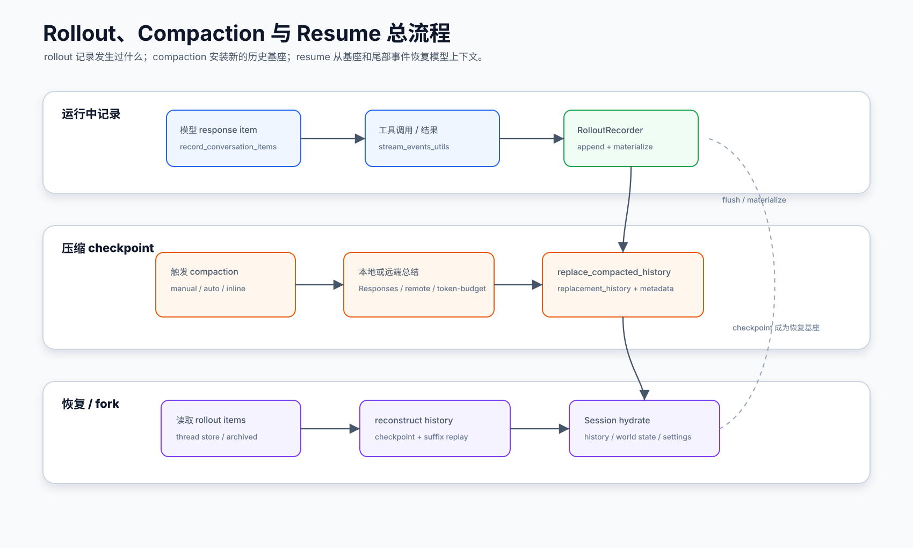
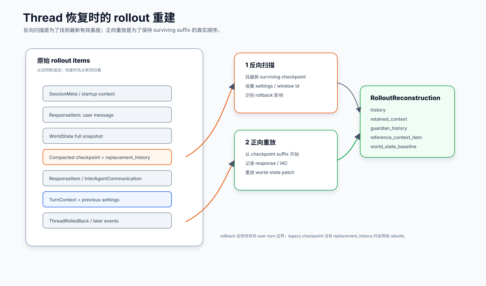

# Rollout / Compaction / Resume

本文讲 Codex core 如何让长会话“活得久”：一边把执行过程写成可回放的 rollout，一边在上下文太长时压缩历史，并在恢复或 fork 时从持久化记录重建模型上下文。对小白来说，可以把它理解成：agent 运行时有一份“工作现场录像”，compaction 是“整理后的会议纪要”，resume 是“根据录像和纪要重新布置现场”。

## 读完你应掌握什么

- 知道 rollout 是执行记录和恢复材料，不是 session 的主调度器。
- 能解释 compaction 为什么有本地、远端和 token-budget 几种路径。
- 能看懂 `CompactedItem` / `replacement_history` 为什么对恢复很关键。
- 能说明 `Session::reconstruct_history_from_rollout` 为什么要反向扫描 rollout。
- 能区分 thread store、rollout file、context reconstruction、world state baseline 的职责。



这张开篇综合图先把本文的时间线压成一个全局模型：普通 turn 持续追加 rollout，compaction 把长历史替换成 checkpoint，resume/fork 先从 checkpoint 取基座再正向重放后续事件，rollback、world state baseline 和预算提醒都挂在这条链路旁边。后文的 `CompactedHistoryMetadata`、`replace_compacted_history`、`reconstruct_history_from_rollout` 和 fork truncation 代码片段分别证明 checkpoint 结构、历史替换、恢复算法和裁剪边界。

## 这个模块解决什么问题

大模型上下文窗口有限，但 coding agent 的会话可能持续很久。Codex core 必须同时满足四个目标：

- 不中断：当前 turn 可以继续跑，不因为历史太长立刻失败。
- 可恢复：进程重启、用户 resume 或 fork 时，能找回有效历史。
- 可审计：工具调用、事件、压缩点、回滚点不能只存在内存里。
- 可控成本：长期多 agent 会话要有预算提醒和用量统计。

这就是 rollout、compaction、resume 被放在一起理解的原因。rollout 负责记录，compaction 负责替换过长历史，resume 负责从记录中恢复“模型应该看到的历史”。

## 源码锚点

| 关注点 | 源码 |
| --- | --- |
| rollout crate re-export 和配置视图 | `repo/codex/codex-rs/core/src/rollout.rs` |
| session rollout materialize / flush | `repo/codex/codex-rs/core/src/session/mod.rs` |
| thread 对外 flush 包装 | `repo/codex/codex-rs/core/src/codex_thread.rs` |
| thread manager resume / fork 前 flush | `repo/codex/codex-rs/core/src/thread_manager.rs` |
| 本地 Responses compaction | `repo/codex/codex-rs/core/src/compact.rs` |
| 远端 `/responses/compact` compaction | `repo/codex/codex-rs/core/src/compact_remote.rs` |
| remote compaction v2 | `repo/codex/codex-rs/core/src/compact_remote_v2.rs` |
| token-budget compaction | `repo/codex/codex-rs/core/src/compact_token_budget.rs` |
| rollout budget 记账与提醒 | `repo/codex/codex-rs/core/src/rollout_budget.rs` |
| rollout 按 turn 裁剪 | `repo/codex/codex-rs/core/src/thread_rollout_truncation.rs` |
| resume/fork 历史重建 | `repo/codex/codex-rs/core/src/session/rollout_reconstruction.rs` |
| compaction 测试 | `repo/codex/codex-rs/core/src/compact_tests.rs` |
| rollout 裁剪测试 | `repo/codex/codex-rs/core/src/thread_rollout_truncation_tests.rs` |
| reconstruction 测试 | `repo/codex/codex-rs/core/src/session/rollout_reconstruction_tests.rs` |

## 核心代码片段

### 1. compaction checkpoint 同时携带摘要、窗口和模型信息

Source: `repo/codex/codex-rs/core/src/compact.rs`
Line range: 84-117

```rust
/// `Session::replace_compacted_history` assigns missing item IDs before constructing the persisted
/// `CompactedItem`, ensuring the live and persisted histories remain identical.
pub(crate) struct CompactedHistoryMetadata {
    pub(crate) message: String,
    pub(crate) window_number: u64,
    pub(crate) window_ids: AutoCompactWindowIds,
    pub(crate) compaction_response_id: Option<String>,
    pub(crate) compaction_model_hash: Option<String>,
}

pub(crate) async fn build_compaction_initial_context(
    sess: &Session,
    initial_context_injection: &InitialContextInjection,
) -> (Vec<ResponseItemEnvelope>, Option<Arc<WorldState>>) {
    // Return the rendered state with its items so history and its baseline stay identical.
    match initial_context_injection {
        InitialContextInjection::BeforeLastUserMessage {
            world_state,
            step_context,
        } => {
            let items = sess
                .build_initial_context_with_world_state(
                    step_context.turn.as_ref(),
                    world_state.as_ref(),
                )
                .await;
            (
                items.into_iter().map(ResponseItemEnvelope::new).collect(),
                Some(Arc::clone(world_state)),
            )
        }
        InitialContextInjection::DoNotInject => (Vec::new(), None),
    }
}
```

解释：`CompactedHistoryMetadata` 不是只存一段 summary 文本，还记录 window id、window number、compaction response id 和模型 hash。`build_compaction_initial_context` 则说明 mid-turn compaction 需要把 initial context 与 `WorldState` baseline 一起构造成可恢复材料。

### 2. 本地 compaction 最终安装 replacement history

Source: `repo/codex/codex-rs/core/src/compact.rs`
Line range: 365-399

```rust
let user_messages = collect_annotated_user_messages(history_items, identity);

let mut new_history = build_compacted_history(Vec::new(), &user_messages, &summary_text);
if let Some(summary_item) = new_history.last_mut() {
    // This replacement history skips `record_conversation_items`; only the appended summary
    // belongs to this compaction turn.
    summary_item.set_turn_id_if_missing(&turn_context.sub_id);
}
let (window_number, window_ids) = sess.advance_auto_compact_window().await;

let (initial_context, world_state_baseline) =
    build_compaction_initial_context(sess.as_ref(), &initial_context_injection).await;
if !initial_context.is_empty() {
    new_history =
        insert_initial_context_before_last_real_user_or_summary(new_history, initial_context);
}
let reference_context_item = match initial_context_injection {
    InitialContextInjection::DoNotInject => None,
    InitialContextInjection::BeforeLastUserMessage { .. } => {
        Some(turn_context.to_turn_context_item())
    }
};
sess.replace_compacted_history(
    new_history,
    reference_context_item,
    world_state_baseline,
    CompactedHistoryMetadata {
        message: summary_text,
        window_number,
        window_ids,
        compaction_response_id: Some(compaction_response_id),
        compaction_model_hash: turn_context.model_info().comp_hash.clone(),
    },
)
.await;
```

解释：这段代码展示 compaction 的落点：收集用户消息、构造 `new_history`、推进 window、按需要插入 initial context，然后通过 `replace_compacted_history` 一次性更新 live history 与 rollout checkpoint。它支撑了“compaction 是替换历史基座，而不是追加普通摘要消息”的结论。

### 3. resume 先反向扫描找最新有效 checkpoint

Source: `repo/codex/codex-rs/core/src/session/rollout_reconstruction.rs`
Line range: 133-205

```rust
pub(super) async fn reconstruct_history_from_rollout(
    &self,
    turn_context: &TurnContext,
    rollout_items: &[RolloutItem],
) -> RolloutReconstruction {
    // Replay metadata should already match the shape of the future lazy reverse loader, even
    // while history materialization still uses an eager bridge. Scan newest-to-oldest,
    // stopping once a surviving replacement-history checkpoint and the required resume metadata
    // are both known; then replay only the buffered surviving tail forward to preserve exact
    // history semantics.
    let has_legacy_compaction_without_window_number =
        rollout_items.iter().any(|item| {
            matches!(item, RolloutItem::Compacted(compacted) if compacted.window_number.is_none())
        });

    // ...

    for (index, item) in rollout_items.iter().enumerate().rev() {
        match item {
            RolloutItem::Compacted(compacted) => {
                let active_segment =
                    active_segment.get_or_insert_with(ActiveReplaySegment::default);
                active_segment.world_state_replay.push(item);
                if active_segment.window.is_none()
                    && let Some(window_number) = compacted.window_number
                {
                    active_segment.window = Some(ReconstructedWindow {
                        number: window_number,
                        first_id: compacted.first_window_id.as_deref().and_then(parse_uuid_v7),
                        previous_id: compacted
                            .previous_window_id
                            .as_deref()
                            .and_then(parse_uuid_v7),
                        id: compacted.window_id.as_deref().and_then(parse_uuid_v7),
                    });
                }
                // Looking backward, compaction clears any older baseline unless a newer
                // `TurnContextItem` in this same segment has already re-established it.
                if matches!(
                    active_segment.reference_context_item,
                    TurnReferenceContextItem::NeverSet
                ) {
                    active_segment.reference_context_item = TurnReferenceContextItem::Cleared;
                }
                if active_segment.base_compaction.is_none()
                    && compacted.replacement_history.is_some()
                {
                    active_segment.base_compaction = Some(ReplayCheckpoint {
                        compacted,
                        suffix: &rollout_items[index + 1..],
                    });
                }
            }
            // ...
        }
    }
}
```

解释：这里直接说明 reconstruction 的核心算法：从尾部向前找最新带 `replacement_history` 的 compaction，并把它后面的 suffix 记录下来用于正向重放。`ThreadRolledBack`、window 和 reference context 都在同一轮反向扫描里处理，避免恢复出已经被压缩或回滚掉的历史。

### 4. fork 裁剪按任务边界保留最近 N 段

Source: `repo/codex/codex-rs/core/src/thread_rollout_truncation.rs`
Line range: 261-296

```rust
pub(crate) fn truncate_rollout_to_last_n_fork_turns(
    mut items: Vec<RolloutItem>,
    n_from_end: usize,
) -> Vec<RolloutItem> {
    if n_from_end == 0 {
        return Vec::new();
    }

    let fork_turn_positions = fork_turn_positions_in_rollout(&items);
    let Some(keep_idx) = fork_turn_positions
        .len()
        .checked_sub(n_from_end)
        .map(|position| fork_turn_positions[position])
        .or_else(|| fork_turn_positions.first().copied())
    else {
        return Vec::new();
    };
    items.split_off(keep_idx)
}

fn is_real_user_message_boundary(item: &ResponseItem) -> bool {
    matches!(
        event_mapping::parse_turn_item(item),
        Some(TurnItem::UserMessage(_))
    )
}

fn is_trigger_turn_boundary(item: &ResponseItem) -> bool {
    let ResponseItem::Message { role, content, .. } = item else {
        return false;
    };

    role == "assistant"
        && InterAgentCommunication::from_message_content(content)
            .is_some_and(|communication| communication.trigger_turn)
}
```

解释：fork history 的 “last N” 不是按日志条数，而是按可触发任务的 turn 边界切。真实用户消息和 `trigger_turn` 的 inter-agent communication 都是边界，这和多 agent fork 恢复语义一致。

## 核心抽象

### Rollout

`core/src/rollout.rs` 主要把 `codex-rollout` crate 的能力 re-export 给 core 使用，并让 `Config` 实现 `RolloutConfigView`。它暴露的内容包括：

- `RolloutRecorder`
- `SessionMeta`
- `ThreadItem`
- `ThreadsPage`
- `find_thread_path_by_id_str`
- `find_archived_thread_path_by_id_str`

所以 core 自己不把 rollout 存储格式都写在一个大文件里，而是把“如何找到和记录 rollout”委托给独立 crate；core 关注的是什么时候记录、什么时候 flush、如何重建。

### `RolloutItem`

`RolloutItem` 是恢复的原材料。它可以代表：

- 模型消息：`ResponseItem`
- 协作消息：`InterAgentCommunication`
- 事件：`EventMsg`
- 压缩 checkpoint：`Compacted`
- 上下文基线：`TurnContext`
- world state：`WorldState`
- token 使用记录、retained context、security risk 等辅助信息

恢复时不是把所有条目原样塞回模型，而是按语义选择：哪些成为历史，哪些只恢复 metadata，哪些用于 world state replay，哪些因为 rollback 被跳过。

### Compaction

`compact.rs` 里的 `run_compact_task` 和 `run_inline_auto_compact_task` 是本地 Responses 总结路径。关键结果是调用 `Session::replace_compacted_history`，安装一段新的 `replacement_history`，并写入 `CompactedHistoryMetadata`。

`InitialContextInjection` 控制压缩后的历史是否要重新注入初始上下文：

- `DoNotInject`：手动或 pre-turn 压缩后清掉 reference context，下个普通 turn 再重建。
- `BeforeLastUserMessage`：mid-turn 压缩需要把初始上下文插到最后一个真实用户消息之前，保持模型训练时预期的顺序。

### Remote Compaction

`compact_remote.rs` 和 `compact_remote_v2.rs` 把压缩交给远端能力。它们仍然遵循同一个 lifecycle：

- 发 `ContextCompaction` turn item started。
- 跑 pre-compact hooks。
- 发起 remote compact attempt。
- 失败时按条件 fallback 到当前模型。
- 处理 compacted history。
- 跑 post-compact hooks。
- 记录 analytics 和错误事件。

v2 额外处理 retained image budget、stream retry 和更细的 output collection。

### Token-budget Compaction

`compact_token_budget.rs` 是更直接的策略：不调用模型生成摘要，而是安装一个新的 context window。它仍然发 `ContextCompaction` lifecycle 事件，也跑 compact hooks。这样外部观察者看到的生命周期一致，只是内部策略不同。

### Rollout Reconstruction

`session/rollout_reconstruction.rs` 是 resume 的关键。`Session::reconstruct_history_from_rollout` 返回 `RolloutReconstruction`，其中包括：

- `history`：要恢复到 `ContextManager` 的模型历史。
- `retained_context`：保留下来的用户上下文和审查证据。
- `guardian_history`：guardian 审查上下文 checkpoint。
- `previous_turn_settings`：最近有效 turn 的模型设置。
- `reference_context_item`：上下文基线。
- `world_state_baseline`：world state 快照和 patch replay 后的结果。
- `window_number` / `window_id`：当前压缩窗口身份。

## 主流程

开篇综合图已经把运行时追加 rollout、compaction 生成 checkpoint、安装 replacement history、resume/fork 重建历史放在同一条时间线上。下面按这条时间线展开。

无需代码片段重复嵌入；本节是对上方 `CompactedHistoryMetadata`、本地 compaction 安装、rollout reconstruction 和 fork truncation 片段的串联导读。

### 1. 运行时持续写 rollout

一次普通 turn 中，模型输出、工具调用和事件会被记录到 session history，并异步进入 rollout。`stream_events_utils.rs` 的 `record_completed_response_item` 会先调用 `Session::record_conversation_items`，保证完成的模型输出进入历史和持久化通道。

`Session::flush_rollout` 和 `Session::ensure_rollout_materialized` 是关键落盘点。外层 `CodexThread` 提供 `ensure_rollout_materialized` / `flush_rollout` 包装；`ThreadManager` 在 fork 或需要确定历史可用时也会显式 flush。

无需代码片段重复嵌入；本节讲持久化入口，代码证据在上方 `replace_compacted_history` 和 `reconstruct_history_from_rollout` 片段中体现落盘后的消费方式，写入入口可从 `repo/codex/codex-rs/core/src/session/mod.rs::record_conversation_items` / `flush_rollout` 继续复查。

### 2. 触发 compaction

compaction 可能来自用户手动请求，也可能来自自动上下文窗口压力。不同路径最后都遵循同一套语义：

1. 发出 `TurnStarted` 或进入 inline compaction phase。
2. 发 `TurnItem::ContextCompaction` started。
3. 构造 compaction request，附带 `CompactionTurnMetadata`。
4. 得到 summary 或 compacted history。
5. 构造新的 replacement history。
6. 调用 `Session::replace_compacted_history` 更新 live history 和 rollout checkpoint。
7. 重新计算 token usage。
8. 发 `ContextCompaction` completed 和必要 warning。

本地 compaction 先把当前 prompt 送给 Responses，总结最后一个 assistant message，然后用 `build_compacted_history` 保留用户消息和摘要。远端 compaction 则把历史分组交给远端 compact endpoint，结果再走同样的 checkpoint 安装逻辑。

无需代码片段重复嵌入；上方 `CompactedHistoryMetadata` 和本地 compaction 安装片段已经展示 checkpoint 字段、window 推进、initial context 插入和 `replace_compacted_history` 的实际落点。

### 3. 恢复或 fork 时重建历史



这张重建图要从“反向扫描最新有效 checkpoint”读起，再顺着“正向重放 surviving suffix”看 `ResponseItem`、`InterAgentCommunication` 和 `WorldState` 如何回到 live context。

`Session::reconstruct_history_from_rollout` 的策略是“先反向找锚点，再正向重放尾部”：

无需代码片段：本节是对上方 `reconstruct_history_from_rollout` 代码证据的逐步讲解；源码片段已贴在“核心代码片段 / resume 先反向扫描找最新有效 checkpoint”。

1. 从最新到最旧扫描 rollout item。
2. 找到最新有效的 compaction checkpoint。如果有 `replacement_history`，它就是恢复历史的 base。
3. 同时收集最近有效的 `TurnContext`、`WorldState`、`PreviousTurnSettings` 和 window id。
4. 处理 `ThreadRolledBack`：回滚是按用户 turn 边界移除，不是简单丢弃最后 N 条日志。
5. 确定 base 后，只正向重放 checkpoint 后面的 surviving suffix。
6. 对 `ResponseItem` 和 `InterAgentCommunication` 重新写入 `ContextManager`。
7. 对 `WorldState` 先找 full snapshot，再应用 merge patch。
8. 返回 `RolloutReconstruction`，供 session resume/fork 初始化。

这个设计避免了每次恢复都从头完整构造上下文，也避免把已经被 compaction 替换的老历史重新塞回模型。

### 4. 裁剪 rollout

`thread_rollout_truncation.rs` 提供几类边界裁剪：

- `truncate_rollout_before_nth_user_message_from_start`：从开头按第 N 个用户消息之前截断。
- `truncate_rollout_after_turn_id`：保留到某个完整 turn 结束。
- `truncate_rollout_before_turn_id`：保留到某个 turn 开始之前。
- `truncate_rollout_to_last_n_fork_turns`：给 fork 子 agent 保留最后 N 个 fork turn。

这里的难点是“turn 边界”不只来自用户文本，还包括 `InterAgentCommunication` 和 legacy agent envelope；而 `ThreadRolledBack` 会改变有效历史，所以裁剪前必须按 rollback 语义修正边界列表。

### 5. 长期预算提醒

`RolloutBudget` 是 root session 树级的预算统计。它记录 weighted token usage，并按 thread / window 维度发 reminder。这样多 agent 场景下所有子 agent 共享一个预算，而每个 thread 都能在跨过阈值后看到提醒。

## 失败模式与边界条件

无需图重复嵌入；下表的失败项都可以沿用上方两张图定位：compaction 相关问题看主链路图，resume/fork/rollback/world-state patch 相关问题看 thread reconstruction 图。
无需代码片段重复嵌入；失败项分别回连到上方 compaction 安装、reconstruction 和 truncation 代码片段。

| 场景 | 代码如何处理 | 设计含义 |
| --- | --- | --- |
| compaction 前置 hook 中止 | 返回 `TurnAborted`，analytics 标记 interrupted | hook 可以阻断压缩生命周期 |
| compaction 上下文超窗 | 本地路径移除最旧 history item 重试；只剩一个 item 时失败 | 优先保留近期消息和 prompt cache |
| compaction session budget 超限 | 发送 error event 并返回错误 | 预算错误不能无限重试 |
| remote compaction 失败 | 可按 `should_retry_with_current_model` fallback | 远端能力失败时允许有限降级 |
| compaction 结果没有 replacement history | reconstruction 走 legacy rebuild，清掉 reference context | 老 rollout 兼容，但 prompt shape 会临时不理想 |
| rollback 后恢复 | reconstruction 按 user-turn segment 跳过新近回滚段 | 恢复的是有效历史，不是原始日志 |
| world-state patch 缺少 full snapshot | warn 并忽略 patch | patch 没有基线不能安全应用 |
| fork 前父历史未 flush | spawn fork 先 materialize + flush | 子 agent 不能从未落盘的内存状态 fork |
| rollout budget units 非法 | `record_usage` 返回 fatal | 避免负数或 NaN 污染预算 |

## 图示

- [Rollout compaction resume](../../image/core/rollout-compaction-resume-v1.svg)：作为开篇综合图，放在“读完你应掌握什么”下方，用来对照正常记录、压缩、checkpoint 安装和后续恢复。
- [Thread reconstruction](../../image/core/thread-reconstruction-v1.svg)：放在“恢复或 fork 时重建历史”附近，用来解释反向找锚点和正向重放尾部的顺序。

## 复设计练习

请设计一个简化版会话持久化系统，要求支持：

1. 每个 turn 的输入、模型输出、工具调用和错误事件都能追加记录。
2. 上下文过长时可以插入一个 summary checkpoint。
3. 恢复时能用 checkpoint 加后续事件重建模型历史。
4. rollback 后恢复时不能复活被撤销的用户 turn。
5. fork 子会话时可以只保留最近 N 个任务边界。

写完后检查：你的设计是否把“审计日志”和“模型历史”混为一谈？如果混了，恢复时很容易把工具调用日志、错误事件或旧权限当作模型输入。

## 检查题

1. 为什么说 rollout 不是主执行调度器？
2. `replacement_history` 在恢复时起什么作用？
3. `InitialContextInjection::BeforeLastUserMessage` 为什么不能简单 append 到最后？
4. 为什么 reconstruction 要反向扫描 rollout？
5. `ThreadRolledBack` 对 truncation 和 reconstruction 有什么影响？

参考回答要点：

1. 主调度在 session/task/turn；rollout 记录已发生的事项，供审计、恢复、fork、搜索使用。
2. 它是 compact checkpoint 的新历史基座，恢复时可以从这里开始再重放后续 surviving suffix。
3. mid-turn compaction 要保持“上下文在最后真实用户消息之前”的模型预期顺序。
4. 因为最新有效 checkpoint、settings、world state baseline 通常在尾部，先找到它们可以跳过更老历史。
5. 它会移除最新 N 个有效用户 turn，边界计算不能只看 raw rollout 的最后几条。

## Follow-up Slots

- 深挖 `compact_remote_v2_images.rs`：远端压缩如何保留图片预算。
- 深挖 `session/mod.rs` 的 `replace_compacted_history`：live history、rollout checkpoint 和 token usage 如何同步。
- 深挖 `codex-rollout` crate：rollout 文件格式、索引和 thread list 查询。
- 深挖 `rollout_budget.rs`：多 agent 长会话预算如何跨线程共享。
