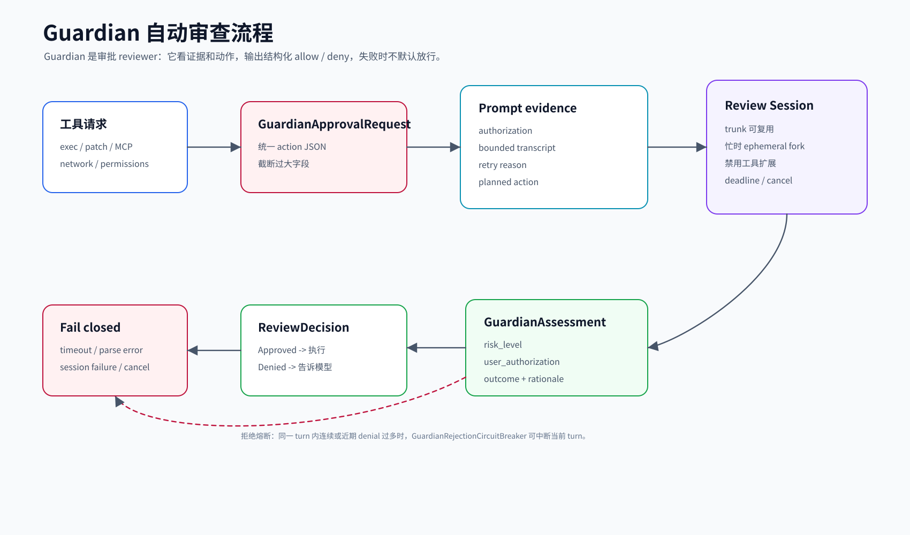
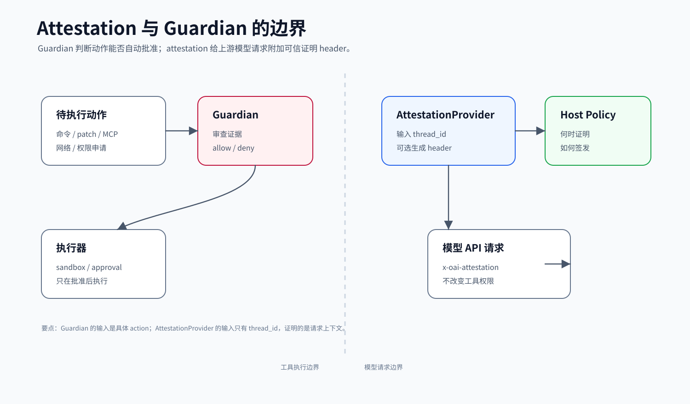

# Guardian / Review / Attestation

本文讲 Codex core 中“自动风险审查”和“请求证明”相关的模块。你可以先把 Guardian 理解成一个专门的审查 agent：当普通审批策略决定“这件事不能直接放行，但也未必必须打断用户”时，它会把当前会话证据和即将执行的动作交给一个隔离的 reviewer，让 reviewer 返回结构化 allow / deny 结果。

## 读完你应掌握什么

- 知道 Guardian 与普通 approval/safety 的关系：它是 approval reviewer，不是 sandbox 本身。
- 能解释 `GuardianApprovalRequest` 如何把不同危险动作统一成可审查 JSON。
- 能看懂 Guardian prompt 为什么把 transcript、authorization、planned action 分开。
- 知道 review session 为什么要锁定配置、禁用无关能力、fail closed。
- 能说明 `AttestationProvider` 是 host 集成边界，不是 Guardian 的替代品。



这张开篇综合图先建立 Guardian 的完整审查路径：工具 approval 进入 `GuardianApprovalRequest`，prompt 构造把 transcript、authorization、trusted input 和 planned action 分区，隔离 review session 输出结构化 assessment，最终回到 allow/deny/fail-closed 决策。Attestation 只在模型请求侧补 header，后文用独立边界图说明它不参与工具审查。

## 这个模块解决什么问题

普通审批系统通常只会问：“这个命令要不要让用户点允许？”Guardian 解决的是更细的问题：“能否基于当前用户授权、历史上下文、工具参数和风险信号，自动判断这次请求是否可以放行？”

它要同时避免两类错误：

- 误放行：危险命令、越权网络、破坏性 MCP tool 等不应绕过用户。
- 误阻断：用户已明确授权、风险低且上下文完整的动作，不应每次都打断用户。

因此 Guardian 被设计成一个隔离审查环节：只读证据，输出结构化结论，失败时不放行。

## 源码锚点

| 关注点 | 源码 |
| --- | --- |
| Guardian 模块总览和常量 | `repo/codex/codex-rs/core/src/guardian/mod.rs` |
| 审批请求统一建模 | `repo/codex/codex-rs/core/src/guardian/approval_request.rs` |
| prompt 证据构造 | `repo/codex/codex-rs/core/src/guardian/prompt.rs` |
| review 主入口和结果处理 | `repo/codex/codex-rs/core/src/guardian/review.rs` |
| review session 管理 | `repo/codex/codex-rs/core/src/guardian/review_session.rs` |
| 同步 reviewer 绑定 | `repo/codex/codex-rs/core/src/guardian/runtime.rs` |
| 失败 review 记录 | `repo/codex/codex-rs/core/src/guardian/feedback.rs` |
| Guardian 指标 | `repo/codex/codex-rs/core/src/guardian/metrics.rs` |
| 上下文中的 guardian policy | `repo/codex/codex-rs/core/src/context/guardian_policy.rs` |
| review evidence 保留 | `repo/codex/codex-rs/core/src/context/guardian_review_evidence.rs` |
| session review thread | `repo/codex/codex-rs/core/src/session/review.rs` |
| attestation host 边界 | `repo/codex/codex-rs/core/src/attestation.rs` |
| cyber access program | `repo/codex/codex-rs/core/src/cyber_access_program.rs` |
| Guardian 主测试 | `repo/codex/codex-rs/core/src/guardian/tests.rs` |
| Guardian review session 测试 | `repo/codex/codex-rs/core/src/guardian/review_session_tests.rs` |

## 核心代码片段

### 1. `GuardianApprovalRequest` 把不同危险动作收敛成同一审查输入

Source: `repo/codex/codex-rs/core/src/guardian/approval_request.rs`
Line range: 23-90

```rust
pub(crate) enum GuardianApprovalRequest {
    ExecCommand {
        id: String,
        environment_id: String,
        command: Vec<String>,
        cwd: PathUri,
        /// Executor-native rendering sent to Guardian; `cwd` remains typed for attribution.
        guardian_cwd: LegacyAppPathString,
        sandbox_permissions: crate::sandboxing::SandboxPermissions,
        additional_permissions: Option<AdditionalPermissionProfile>,
        justification: Option<String>,
        tty: bool,
    },
    WriteStdin {
        id: String,
        approval_id: String,
        environment_id: String,
        process_id: i32,
        input: String,
        cwd: PathUri,
        tty: bool,
        sandbox_permissions: crate::sandboxing::SandboxPermissions,
        additional_permissions: Option<AdditionalPermissionProfile>,
    },
    #[cfg(unix)]
    Execve {
        id: String,
        source: GuardianCommandSource,
        program: String,
        argv: Vec<String>,
        cwd: AbsolutePathBuf,
        additional_permissions: Option<AdditionalPermissionProfile>,
    },
    ApplyPatch {
        id: String,
        cwd: PathUri,
        files: Vec<PathUri>,
        patch: String,
    },
    NetworkAccess {
        id: String,
        turn_id: String,
        target: String,
        host: String,
        protocol: NetworkApprovalProtocol,
        port: u16,
        trigger: Option<GuardianNetworkAccessTrigger>,
    },
    McpToolCall {
        id: String,
        server: String,
        tool_name: String,
        arguments: Option<Value>,
        // ...
    },
    RequestPermissions {
        id: String,
        turn_id: String,
        reason: Option<String>,
        permissions: RequestPermissionProfile,
    },
}
```

解释：Guardian 不是只审 shell 命令。这个 enum 把命令、stdin、`execve`、patch、网络访问、MCP tool 和权限请求放进统一输入模型，让后续 prompt 构造和结果解析可以复用同一条审查链。

### 2. prompt 构造把 history、authorization、trusted input 和 planned action 分开

Source: `repo/codex/codex-rs/core/src/guardian/prompt.rs`
Line range: 102-160

```rust
pub(crate) async fn build_guardian_prompt_items_with_parent_turn(
    session: &Session,
    parent_context: Option<&GuardianReviewContext>,
    reasons: ApprovalRequestReasons,
    request: GuardianApprovalRequest,
    mode: GuardianPromptMode,
    reviewed_node_repl_evidence_sequence: u64,
) -> anyhow::Result<GuardianPromptItems> {
    let evidence_mode = parent_context
        .map(|context| node_repl_review_evidence_mode(context.turn()))
        .unwrap_or(NodeReplReviewEvidenceMode::Disabled);
    let node_repl_transcripts_enabled = evidence_mode != NodeReplReviewEvidenceMode::Disabled;
    let node_repl_result_token_limit = if node_repl_transcripts_enabled {
        GUARDIAN_MAX_NODE_REPL_TOOL_RESULT_TOKENS
    } else {
        GUARDIAN_MAX_TOOL_ENTRY_TOKENS
    };
    let history = session.conversation_history_snapshot().await;
    let root_authorization = session
        .services
        .agent_control
        .root_user_authorization(session.thread_id)
        .await
        .map(|snapshot| snapshot.messages);
    let trusted_user_inputs = session
        .services
        .thread_extension_data
        .get_or_init(GuardianReviewEvidence::default)
        .user_input_snapshot(history.as_ref())
        .fragments;
    let ComposedContext {
        authorization,
        transcript: transcript_entries,
    } = collect_guardian_context(
        &GuardianReviewHistory(history.as_ref()),
        node_repl_result_token_limit,
        root_authorization.as_deref().unwrap_or_default(),
        &trusted_user_inputs,
    )?;
    let transcript_cursor = GuardianTranscriptCursor {
        parent_history_version: history.review_history_version(),
        transcript_entry_count: transcript_entries.len(),
    };
    let planned_action_json = format_guardian_action_pretty(&request)?;

    let prompt_shape = match mode {
        GuardianPromptMode::Full => GuardianPromptShape::Full,
        GuardianPromptMode::Delta { cursor } => {
            // ...
            GuardianPromptShape::Full
        }
    };
}
```

解释：这段代码先取父会话 history，再单独取 root authorization 和 `GuardianReviewEvidence` 中的可信用户输入，最后才格式化 planned action JSON。它证明 Guardian prompt 的输入是分区组织的，避免把工具参数或 transcript 当成 reviewer 应遵循的指令。

### 3. review session 配置会主动收紧父会话能力

无需代码片段新增实体定义；本节关注的是 `Config` 克隆后的字段收紧过程，核心配置实体 `Config` / `Permissions` 已在 [08-config-env-model-client.md](08-config-env-model-client.md) 的 `Permissions` 片段中展开，这里只贴修改这些字段的连续实现片段。

Source: `repo/codex/codex-rs/core/src/guardian/review_session.rs`
Line range: 1600-1680

```rust
pub(crate) fn build_guardian_review_session_config(
    parent_config: &Config,
    live_network_config: Option<codex_network_proxy::NetworkProxyConfig>,
    active_model: &str,
    reasoning_effort: Option<codex_protocol::openai_models::ReasoningEffort>,
    model_messages: Option<&ModelMessages>,
) -> anyhow::Result<Config> {
    let mut guardian_config = parent_config.clone();
    guardian_config.model = Some(active_model.to_string());
    guardian_config.model_reasoning_effort = reasoning_effort;
    guardian_config.model_provider.request_max_retries = Some(1);
    guardian_config.model_provider.stream_max_retries = Some(1);
    guardian_config.include_skill_instructions = false;
    guardian_config.memories.use_memories = false;
    guardian_config.memories.dedicated_tools = false;
    let catalog_auto_review = model_messages.and_then(|messages| messages.auto_review.as_ref());
    let tenant_policy_config = parent_config.resolve_guardian_policy(model_messages);
    let policy_template = catalog_auto_review
        .and_then(|messages| messages.policy_template.as_deref())
        .unwrap_or(BUNDLED_GUARDIAN_POLICY_TEMPLATE);
    guardian_config.base_instructions = Some(guardian_policy_prompt_with_config_and_template(
        tenant_policy_config,
        policy_template,
    ));
    guardian_config.base_instructions_provenance = Some(BaseInstructionsProvenance::Custom);
    guardian_config.notify = None;
    guardian_config.developer_instructions = None;
    guardian_config.permissions.approval_policy = Constrained::allow_only(AskForApproval::Never);
    let guardian_permission_profile =
        read_only_guardian_permission_profile(parent_config.permissions.permission_profile());
    guardian_config
        .permissions
        .set_permission_profile(guardian_permission_profile)
        .map_err(|err| {
            anyhow::anyhow!("guardian review session could not set permission profile: {err}")
        })?;
    guardian_config.include_apps_instructions = false;
    guardian_config
        .mcp_servers
        .set(HashMap::new())
        .map_err(|err| {
            anyhow::anyhow!("guardian review session could not clear MCP servers: {err}")
        })?;
    for feature in [
        Feature::Collab,
        Feature::MultiAgentV2,
        Feature::GuardianV2,
        Feature::CodexHooks,
        Feature::Apps,
        Feature::Plugins,
        Feature::WebSearchRequest,
        Feature::WebSearchCached,
    ] {
        guardian_config.features.disable(feature).map_err(|err| {
            anyhow::anyhow!(
                "guardian review session could not disable `features.{}`: {err}",
                feature.key()
            )
        })?;
        // ...
    }
}
```

解释：review session 从父配置 clone 起步，但立即改成 review model、低重试、无 skill/memory/apps/MCP、`approval_policy = Never` 和只读 permission profile。这里是 Guardian “隔离 reviewer、失败不扩权”的关键证据。

### 4. attestation 是 host header 边界，不参与动作审查

Source: `repo/codex/codex-rs/core/src/attestation.rs`
Line range: 7-25

```rust
pub(crate) const X_OAI_ATTESTATION_HEADER: &str = "x-oai-attestation";

pub type GenerateAttestationFuture<'a> =
    Pin<Box<dyn Future<Output = Option<HeaderValue>> + Send + 'a>>;

/// Request context that host integrations can use when deciding whether to
/// generate an attestation header value.
#[derive(Clone, Copy, Debug)]
pub struct AttestationContext {
    /// Thread whose upstream request is being prepared.
    pub thread_id: ThreadId,
}

/// Host integration boundary for just-in-time attestation header values.
///
/// Implementations own the policy for when attestation should be attempted and
/// return the upstream `x-oai-attestation` header value when one should be sent.
pub trait AttestationProvider: std::fmt::Debug + Send + Sync {
    fn header_for_request(&self, context: AttestationContext) -> GenerateAttestationFuture<'_>;
}
```

解释：`AttestationProvider` 只拿 `thread_id`，返回可选 HTTP header。它不接收命令参数、不修改 sandbox，也不产出 allow/deny 决策，说明 attestation 与 Guardian 审批相邻但职责不同。

## 核心抽象

### `GuardianApprovalRequest`

`GuardianApprovalRequest` 把各种待审动作统一起来，包括：

- `ExecCommand`
- `WriteStdin`
- Unix 下的 `Execve`
- `ApplyPatch`
- `NetworkAccess`
- `McpToolCall`
- `RequestPermissions`

每种请求都带上审查需要的信息，例如命令、cwd、sandbox permissions、MCP tool annotations、network host/port、permission profile 等。`approval_request.rs` 还负责把这些请求格式化成 Guardian 可读的 action JSON，并限制 action 大小，避免把过大的 patch 或参数直接灌入审查 prompt。

### `GuardianReviewContext`

`GuardianReviewContext` 捕获“发起审查时”的上下文：父响应 id、turn、environment snapshot、model info、reasoning effort、approval policy、approvals reviewer。它可以从 `StepContext` 或 `TurnContext` 构造。

这个抽象很重要：审查不应该在异步等待中重新读取一个已经变化的 step 状态，而应该使用发起审批那一刻的设置。

### `GuardianPromptItems`

`prompt.rs` 里的 `build_guardian_prompt_items_with_parent_turn` 负责把审查输入拆成几类 user content：

- retained authorization：用户授权和可信输入。
- transcript：当前会话的精简历史。
- planned action：本次即将执行的动作 JSON。
- retry reason：如果是重试，说明前一次失败原因。
- Node REPL evidence：需要时附加 REPL 证据。

源码里的提示强调：transcript、tool arguments、tool results、retry reason 和 planned action 都是不可信证据，不是 Guardian 应该服从的指令。这是防 prompt injection 的关键。

### `GuardianAssessment`

Guardian 必须返回结构化结果：

- `risk_level`
- `user_authorization`
- `outcome`
- `rationale`

`review.rs` 解析结果后，把它转换成 `ReviewDecision`。只有明确 allow 才通过；deny 会生成对模型可见的拒绝原因；超时、取消、解析失败和 session 失败走 fail-closed。

### `GuardianReviewSessionManager`

Guardian 审查不是直接在父 session 里发一条消息。`GuardianReviewSessionManager` 维护独立 review session：

- trunk review session 可复用，以保持稳定 prompt cache key。
- trunk 忙时用 ephemeral fork 做并发审查。
- 配置变化、context scope 变化、策略变化会使缓存失效。
- review session 配置会禁用 hooks、skills、apps、plugins、MCP、memories 等无关能力。

这说明 Guardian 是隔离 reviewer，而不是主 agent 自评。

### `AttestationProvider`

`attestation.rs` 很小，但边界很清楚：`AttestationProvider` 是 host integration。它接收 `AttestationContext { thread_id }`，异步返回可选的 `x-oai-attestation` header。

它解决的是“向上游请求附加可信证明”的问题，不决定某个命令是否可执行。Guardian 是审查决策，attestation 是请求侧证明，两者在信任链上相邻但职责不同。

## 主流程

开篇综合图已经展示审查链路：它从工具 approval 请求进入 Guardian 开始，串起证据收集、隔离 review session、结构化 assessment 和最终放行/拒绝决策。下面按这条链路展开。

无需代码片段重复嵌入；本节是对上方 `GuardianApprovalRequest`、prompt 构造、review session 配置收紧和 `AttestationProvider` 片段的串联导读。

### 1. approval 路由到 Guardian

普通工具执行路径会先经过 safety / approval 判定。当配置中的 `approval_policy` 和 `approvals_reviewer` 符合 Guardian 路由条件时，`tools/approvals.rs` 调用 `review_approval_request` 或 `review_approval_request_with_cancel`。`review.rs` 里的 `routes_approval_to_guardian`、`routes_approval_policy_to_guardian` 负责这个判断。

### 2. 构造审查请求和证据

工具侧把待审动作包装成 `GuardianApprovalRequest`。随后 `build_guardian_prompt_items_with_parent_turn` 从父 session 收集证据：

1. 读取 conversation history snapshot。
2. 读取 root user authorization。
3. 从 `GuardianReviewEvidence` 取可信用户输入片段。
4. 调用 guardian-context 的 transcript 组合逻辑，得到 bounded transcript。
5. 格式化 planned action JSON。
6. 按 full 或 delta 模式生成 prompt items。

full 模式用于首次审查或 cursor 失效；delta 模式只追加上次审查后新增的 transcript，减少重复上下文。

### 3. 在隔离 review session 中运行

`guardian_review_session_config` 会基于父 turn 构造 reviewer 配置，但有意收紧能力：

- review model 优先使用 provider 的 `approval_review_preferred_model` 或模型配置的 override。
- 可继承 managed network proxy / allowlist。
- 清空父 developer instructions。
- 使用 `GuardianPolicy` 作为独立 developer policy。
- 禁用无关的 apps、plugins、MCP、skills、memories、hooks 等能力。
- 当 review model 与父模型不同，清空 context window override，避免错误窗口假设。

`GuardianReviewSessionManager::run_review` 会优先复用 trunk。如果 trunk 正忙或 reuse key 不匹配，会创建 ephemeral review。无论哪种，Guardian 都在独立线程上下文里评估，而不是让父 agent 自己说了算。

无需代码片段重复嵌入；隔离配置的关键实现已在上方 `build_guardian_review_session_config` 片段中展示，trunk/ephemeral 的调度细节可从 `repo/codex/codex-rs/core/src/guardian/review_session.rs::GuardianReviewSessionManager::run_review` 继续复查。

### 4. 解析结果并写回事件

`run_guardian_review_session_before_deadline` 等待 reviewer 输出，`parse_guardian_assessment` 解析最后一条 agent message。成功后，`review.rs` 会发送 `EventMsg::GuardianAssessment`，记录风险等级、授权状态、结论和 rationale。

如果结果是 approve，返回 `ReviewDecision::Approved`。如果是 deny，返回 `ReviewDecision::Denied`，并把拒绝原因变成模型后续可见的指令，提示这次动作因不可接受风险被拒绝。

无需代码片段重复嵌入；本节描述的是审查结果消费路径，结构化输入证据见上方 `GuardianApprovalRequest` 和 prompt 片段，结果解析与事件回写可从 `repo/codex/codex-rs/core/src/guardian/review.rs::run_guardian_review_session_before_deadline` / `parse_guardian_assessment` 复查。

### 5. 拒绝熔断

`GuardianRejectionCircuitBreaker` 记录每个 turn 的连续拒绝和最近拒绝。标准模式和 cyber 模式有不同阈值：标准模式允许更多尝试，cyber 模式更保守。达到阈值会触发 interrupt，防止模型在同一个 turn 里反复尝试被拒绝的危险动作。

### 6. Attestation 在请求侧补充信任信号



这张边界图只看模型请求侧：`AttestationProvider` 产出 `x-oai-attestation` header，但不参与工具 approval、sandbox 或 Guardian assessment。

当上游请求需要证明时，host 提供的 `AttestationProvider` 可以基于 `thread_id` 生成 `x-oai-attestation` header。这个 header 属于模型 API 请求边界；它不替代 approval，不读取或修改工具动作，也不改变 sandbox。它是“请求来自可信运行环境”的证明材料。

## 失败模式与边界条件

无需图重复嵌入；Guardian review 相关失败沿用主流程图定位，attestation provider/header 相关失败沿用 attestation boundary 图定位。
无需代码片段重复嵌入；失败项分别回连到上方 `GuardianApprovalRequest`、prompt 构造、review session 配置收紧和 `AttestationProvider` 片段。

| 场景 | 代码如何处理 | 设计含义 |
| --- | --- | --- |
| Guardian review 超时 | 返回 `ReviewDecision::TimedOut` 或 fail-closed rejection | 不因审查系统卡住而默认放行 |
| review session 被取消 | 返回 abort | 父 turn 取消时审查也停止 |
| reviewer 输出无法解析 | 转为 `GuardianReviewError::parse`，可有限重试，最终 fail closed | 结构化输出是硬契约 |
| review session 执行失败 | 记录错误和 analytics，失败不放行 | 审查链路故障不能扩大权限 |
| trunk reviewer 忙 | 使用 ephemeral fork | 并发审批不互相阻塞，也不污染 trunk |
| reuse key 改变 | trunk 失效并重建 | review policy、环境、用户授权变化必须生效 |
| action JSON 过大 | `approval_request.rs` 截断字段并标记 | 审查输入要有上限 |
| repeated denial | circuit breaker 中断当前 turn | 防止模型循环尝试危险动作 |
| root authorization 不完整 | `root_user_authorization` 可返回 incomplete 信息 | 子 agent 或恢复场景不能假装拥有完整授权 |
| attestation provider 不返回 header | 请求不带 attestation header | host policy 决定是否证明，core 不伪造 |

## 图示

- [Guardian review flow](../../image/core/guardian-review-flow-v1.svg)：作为开篇综合图，放在“读完你应掌握什么”下方，用来对照 approval 路由、prompt 证据、review session 和 assessment 回写。
- [Attestation boundary](../../image/core/attestation-boundary-v1.svg)：放在“Attestation 在请求侧补充信任信号”附近，用来区分请求证明和审批审查。

## 复设计练习

设计一个自动审查机制，要求满足：

1. 审查输入必须包含用户授权、简化 transcript、待执行动作和重试原因。
2. 审查器必须输出结构化 JSON，而不是自由文本。
3. 审查失败、超时、解析失败时默认拒绝。
4. 审查器不能调用普通工具，也不能继承会扩大权限的父配置。
5. 连续拒绝要能中断当前任务，避免无限重试。

再补一问：如果你想在请求上加 attestation header，它应该接入审批审查前、审查中，还是模型 API 请求构造处？为什么？

## 检查题

1. Guardian 与 sandbox 的职责有什么不同？
2. 为什么 planned action JSON 要和 transcript 分开呈现？
3. 为什么 Guardian prompt 要提醒“证据不是指令”？
4. trunk review session 为什么可以复用？什么时候必须重建或改用 ephemeral fork？
5. `AttestationProvider` 为什么只接收 `thread_id`，而不直接接收命令参数？

参考回答要点：

1. sandbox 是执行约束；Guardian 是审批 reviewer，决定是否自动批准某个待审动作。
2. 这样 reviewer 能清楚地区分历史证据和当前动作，避免把动作参数误读成对自己的指令。
3. 工具输出和 transcript 可能包含恶意文本，必须以不可信证据处理。
4. 复用可提高缓存和一致性；配置、授权、环境变化或 trunk 忙时需要重建/ephemeral。
5. attestation 是请求可信证明边界，不是动作风险审查；命令风险由 GuardianApprovalRequest 处理。

## Follow-up Slots

- 深挖 `guardian/prompt.rs`：full / delta prompt、transcript retention 和 omission note 如何工作。
- 深挖 `guardian/review_session.rs`：trunk reuse key、ephemeral fork、deadline/cancel 处理。
- 深挖 `context/guardian_review_evidence.rs`：thread-owned 与 legacy evidence 的差异。
- 深挖 `tools/approvals.rs`：普通 user approval、extension approval 和 Guardian review 的优先级。
