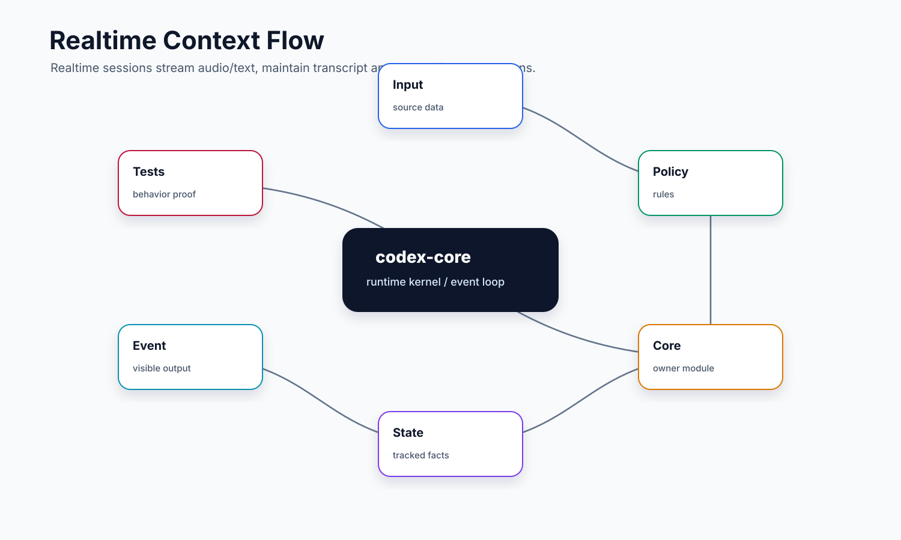
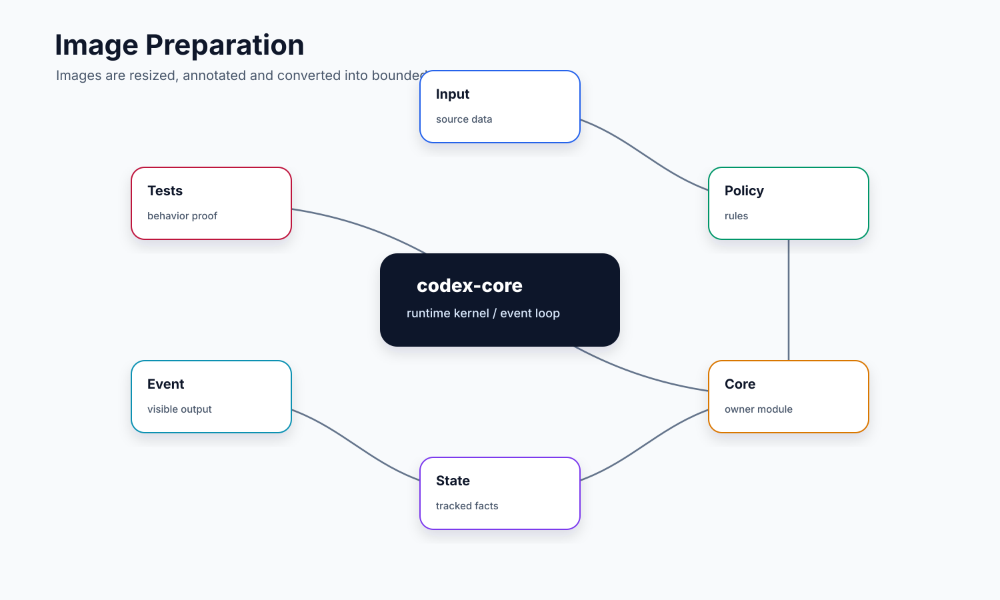

# Realtime / Apps / Images

本文讲 Codex core 中三类“非普通文本 turn”的输入：实时对话、应用上下文和图片。它们看起来分散，但共同目标一样：把语音、实时 transcript、app connector 提示和图片内容转成模型能安全消费的上下文，同时控制大小、格式和生命周期。

## 读完你应掌握什么

- 知道 realtime conversation 和普通 request/response turn 的差异。
- 能解释 realtime startup context 从哪里来，为什么它明确标注“可能不完整或过时”。
- 能看懂 realtime 输入、输出、handoff、transcript history 的关系。
- 知道 apps instruction 何时注入，以及为什么 app 等价于 apps MCP server 的一组工具。
- 能说明图片在发送给模型前如何被处理、替换、降级和记录 metadata。



这张开篇综合图把三类非普通文本输入放回同一条治理路径：realtime 先启动长连接并构造 bounded startup context，输入和 server events 通过通道流转，handoff 可以进入普通 agent turn，transcript 被 reducer 写成 durable history；Apps 通过 MCP 工具边界暴露，图片则在模型请求前完成 data URL 校验、resize metadata 和失败占位。后文的 startup context、conversation start、history reducer、apps instructions 和 image preparation 片段分别证明这些边界。

## 这个模块解决什么问题

普通 coding agent 的输入是用户文本，输出是模型消息和工具调用。Realtime / Apps / Images 扩展了这个假设：

- Realtime：用户可能通过语音或低延迟文本持续输入，不是一条 prompt 对一个 response。
- Apps：外部 app connector 会给模型额外的调用方式，但不能绕过 MCP/tool 权限边界。
- Images：模型可以看图，但图片体积、细节级别、远程 URL、失败占位都必须处理。

所以这些模块不是“UI 附件”，而是把多模态和应用上下文纳入 core 主循环前的输入治理层。

## 源码锚点

| 关注点 | 源码 |
| --- | --- |
| realtime startup context | `repo/codex/codex-rs/core/src/realtime_context.rs` |
| realtime conversation 管理 | `repo/codex/codex-rs/core/src/realtime_conversation.rs` |
| realtime durable history reducer | `repo/codex/codex-rs/core/src/realtime_history.rs` |
| realtime backend prompt | `repo/codex/codex-rs/core/src/realtime_prompt.rs` |
| apps 模块 | `repo/codex/codex-rs/core/src/apps/` |
| apps instruction 渲染 | `repo/codex/codex-rs/core/src/apps/render.rs` |
| context 中的 apps instruction | `repo/codex/codex-rs/core/src/context/apps_instructions.rs` |
| 图片预处理主逻辑 | `repo/codex/codex-rs/core/src/image_preparation.rs` |
| original image detail 边界 | `repo/codex/codex-rs/core/src/original_image_detail.rs` |
| realtime conversation 测试 | `repo/codex/codex-rs/core/src/realtime_conversation_tests.rs` |
| 图片预处理测试 | `repo/codex/codex-rs/core/src/image_preparation_tests.rs` |

## 核心代码片段

### 1. realtime startup context 是有预算的现场摘要

Source: `repo/codex/codex-rs/core/src/realtime_context.rs`
Line range: 59-116

```rust
pub(crate) async fn build_realtime_startup_context(
    sess: &Session,
    budget_tokens: usize,
) -> Option<String> {
    let config = sess.get_config().await;
    let cwd = config.cwd.clone();
    let current_thread_section = {
        let history = sess.clone_history().await;
        build_current_thread_section(history.raw_items())
    };
    let recent_threads = load_recent_threads(sess).await;
    let recent_work_section = build_recent_work_section(&cwd, &recent_threads).await;
    let workspace_section = build_workspace_section_with_user_root(&cwd, home_dir()).await;

    if current_thread_section.is_none()
        && recent_work_section.is_none()
        && workspace_section.is_none()
    {
        debug!("realtime startup context unavailable; skipping injection");
        return None;
    }

    let mut parts = vec![STARTUP_CONTEXT_HEADER.to_string()];

    // ...

    if let Some(section) = format_section(
        "Notes",
        Some("Built at realtime startup from the current thread history, local thread metadata, and a bounded local workspace scan. This excludes repo memory instructions, AGENTS files, project-doc prompt blends, and memory summaries.".to_string()),
        NOTES_SECTION_TOKEN_BUDGET,
    ) {
        parts.push(section);
    }

    let context = format_startup_context_blob(&parts.join("\n\n"));
```

解释：startup context 来自当前 thread history、recent work 和 workspace scan，并在 Notes 中明确排除 repo memory、AGENTS、project-doc prompt blends 和 memory summaries。`budget_tokens` 与各 section budget 说明 realtime 启动上下文是受限提示，不是完整上下文系统。

### 2. realtime conversation 启动会替换旧连接并创建独立输入输出通道

Source: `repo/codex/codex-rs/core/src/realtime_conversation.rs`
Line range: 532-604

```rust
async fn start(
    &self,
    start: RealtimeStart,
    mode_instructions: RealtimeModeInstructions,
) -> CodexResult<RealtimeStartOutput> {
    let previous_state = {
        let mut guard = self.state.lock().await;
        guard.take()
    };
    if let Some(state) = previous_state {
        stop_conversation_state(state, RealtimeFanoutTaskStop::Await).await;
    }

    let output = self.start_inner(start).await?;
    *self.mode_instructions.lock().await = Some(mode_instructions);
    Ok(output)
}

async fn start_inner(&self, start: RealtimeStart) -> CodexResult<RealtimeStartOutput> {
    let RealtimeStart {
        api_provider,
        realtime_sideband_base_url,
        extra_headers,
        client_managed_handoffs,
        flush_transcript_tail_on_session_end,
        codex_responses_as_items,
        codex_response_item_prefix,
        codex_response_handoff_mode,
        codex_response_handoff_channel_prefixes,
        realtime_call_api_provider,
        session_config,
        model_client,
        sdp,
        existing_call_id,
    } = start;
    let event_parser = session_config.event_parser;
    let session_kind = match event_parser {
        RealtimeEventParser::V1 | RealtimeEventParser::FramelessBidi => RealtimeSessionKind::V1,
        RealtimeEventParser::RealtimeV2 => RealtimeSessionKind::V2,
    };

    let (audio_tx, audio_rx) =
        async_channel::bounded::<RealtimeAudioFrame>(AUDIO_IN_QUEUE_CAPACITY);
    let (text_tx, text_rx) =
        async_channel::bounded::<ConversationTextParams>(TEXT_IN_QUEUE_CAPACITY);
    let (handoff_output_tx, handoff_output_rx) =
        async_channel::bounded::<RealtimeOutbound>(HANDOFF_OUT_QUEUE_CAPACITY);
    let (events_tx, events_rx) =
        async_channel::bounded::<RealtimeEvent>(OUTPUT_EVENTS_QUEUE_CAPACITY);
    let (transcript_tail_tx, transcript_tail_rx) = async_channel::bounded::<String>(1);

    let realtime_active = Arc::new(AtomicBool::new(true));
    let stop_token = CancellationToken::new();
    let handoff = RealtimeHandoffState {
        // ...
    };
    let input_channels = RealtimeInputChannels {
        text_rx,
        handoff_output_rx,
        audio_rx,
    };
```

解释：`start` 会先停止旧 realtime state，再启动新连接，避免同一 manager 挂多个活跃会话。`start_inner` 创建音频、文本、handoff output、server event 和 transcript tail 通道，说明 realtime 是长期事件循环，而不是普通的一次 request/response。

### 3. transcript reducer 把 realtime 事件归约成可持久化历史

Source: `repo/codex/codex-rs/core/src/realtime_history.rs`
Line range: 94-176

```rust
pub(crate) struct RealtimeHistoryState {
    active_session_id: Option<String>,
    active_segments: ActiveTranscriptSegments,
    streaming_agent_message: Option<StreamingAgentMessage>,
    active_turn_id: Option<String>,
    realtime_session_by_bem_turn: HashMap<String, String>,
    promoted_bem_presentation_keys: HashSet<String>,
    pending_handoffs: VecDeque<String>,
    failed: bool,
}

impl RealtimeHistoryState {
    fn should_seal_user_input(&self, input: &[UserInput]) -> bool {
        self.active_session_id.is_some()
            && [&self.active_segments.user, &self.active_segments.assistant]
                .into_iter()
                .flatten()
                .any(|segment| !segment.text.is_empty())
            && !matches!(input, [UserInput::Text { text, .. }] if {
                let text = text.trim();
                text.starts_with("<realtime_delegation>")
                    && text.ends_with("</realtime_delegation>")
            })
    }

    fn seal_user_input(&mut self, input: &[UserInput]) -> Vec<RealtimeItem> {
        if !self.should_seal_user_input(input) {
            return Vec::new();
        }
        let mut items = Vec::new();
        self.seal_segments(&mut items, Continuation::Continue);
        items
    }

    pub(crate) fn should_observe(&self, event: &EventMsg) -> bool {
        matches!(
            event,
            EventMsg::RealtimeConversationStarted(_)
                | EventMsg::TurnStarted(_)
                | EventMsg::TurnComplete(_)
                | EventMsg::TurnAborted(_)
        ) || (self.active_session_id.is_some()
            && matches!(
                event,
                EventMsg::RealtimeConversationRealtime(_)
                    | EventMsg::RealtimeConversationClosed(_)
                    | EventMsg::TurnStarted(_)
                    | EventMsg::ItemStarted(_)
                    | EventMsg::ItemCompleted(_)
                    | EventMsg::AgentMessageContentDelta(_)
            ))
            // ...
    }
}
```

解释：`RealtimeHistoryState` 保存 active session、active transcript segment、handoff 队列和 BEM turn 映射。`should_observe` 明确哪些 core event 会进入 reducer，`seal_user_input` 则说明普通 user input 前会先封存已有语音 transcript，保证 durable history 的顺序稳定。

### 4. apps instruction 只在存在可用 app 时注入，并声明 MCP 边界

Source: `repo/codex/codex-rs/core/src/context/apps_instructions.rs`
Line range: 8-33

```rust
#[derive(Debug, Clone, PartialEq)]
pub(crate) struct AppsInstructions;

impl ContextualUserFragment for AppsInstructions {
    fn content_kind(&self) -> ContentItemKind {
        ContentItemKind("apps.instructions".to_string())
    }

    fn role(&self) -> &'static str {
        "developer"
    }

    fn markers(&self) -> (&'static str, &'static str) {
        Self::type_markers()
    }

    fn type_markers() -> (&'static str, &'static str) {
        (APPS_INSTRUCTIONS_OPEN_TAG, APPS_INSTRUCTIONS_CLOSE_TAG)
    }

    fn body(&self) -> String {
        format!(
            "\n## Apps (Connectors)\nApps (Connectors) can be explicitly triggered in user messages in the format `[$app-name](app://{{connector_id}})`. Apps can also be implicitly triggered as long as the context suggests usage of available apps.\nAn app is equivalent to a set of MCP tools within the `{CODEX_APPS_MCP_SERVER_NAME}` MCP.\nAn installed app's MCP tools are either provided to you already, or can be lazy-loaded through the `tool_search` tool. If `tool_search` is available, the apps that are searchable by `tools_search` will be listed by it.\nDo not additionally call list_mcp_resources or list_mcp_resource_templates for apps.\n"
        )
    }
}
```

解释：apps instruction 作为 developer-role contextual fragment 注入，并把 app 明确解释成 `{CODEX_APPS_MCP_SERVER_NAME}` MCP 内的一组工具。这证明 apps 是提示层和工具发现层，不是绕开 tool runtime 的执行后门。

### 5. 图片预处理会拒绝远程 URL、低 detail，并记录 resize metadata

无需代码片段新增实体定义；本节证明的是 `prepare_image` 的处理分支，metadata 的字段在下面 `ImagePreparationMetadata` 构造处以内联结构展示，足以说明记录哪些尺寸和来源信息。

Source: `repo/codex/codex-rs/core/src/image_preparation.rs`
Line range: 267-321

```rust
fn prepare_image(
    image_url: &mut String,
    detail: &mut Option<ImageDetail>,
    origin: ImageOrigin<'_>,
    metadata: &mut Vec<ImagePreparationMetadata>,
    mode: ImagePreparationMode,
) -> Result<Option<PreparedImageResize>, ImagePreparationError> {
    if is_remote_image_url(image_url) {
        return Err(ImagePreparationError::RemoteUrlUnsupported);
    }
    if !is_data_url(image_url) {
        return Ok(None);
    }

    let (effective_detail, image_mode) = match mode {
        ImagePreparationMode::UnifiedBudget => (
            ImageDetailSetting::Original,
            PromptImageMode::ORIGINAL_DETAIL,
        ),
        ImagePreparationMode::DetailBased => match detail {
            None | Some(ImageDetail::Auto | ImageDetail::High) => {
                (ImageDetailSetting::High, PromptImageMode::HIGH_DETAIL)
            }
            Some(ImageDetail::Original) => (
                ImageDetailSetting::Original,
                PromptImageMode::ORIGINAL_DETAIL,
            ),
            Some(ImageDetail::Low) => return Err(ImagePreparationError::UnsupportedLowDetail),
        },
    };
    let image = load_data_url_for_prompt(image_url, image_mode)?;
    metadata.push(ImagePreparationMetadata {
        message_role: origin.message_role.map(str::to_string),
        item_id: origin.item_id.map(str::to_string),
        effective_detail,
        source_width: image.source_width,
        source_height: image.source_height,
        prepared_width: image.width,
        prepared_height: image.height,
    });
    let resize = ((image.source_width, image.source_height) != (image.width, image.height))
        .then_some(PreparedImageResize {
            source_width: image.source_width,
            source_height: image.source_height,
            prepared_width: image.width,
            prepared_height: image.height,
        });
    *image_url = image.into_data_url();
    if mode == ImagePreparationMode::UnifiedBudget {
        // Preserve accurate context-window accounting while older transports still require an
        // image detail field. Responses Lite removes this compatibility hint before sending.
        *detail = Some(ImageDetail::Original);
    }
    Ok(resize)
}
```

解释：`prepare_image` 只处理 data URL，远程 URL 和 `ImageDetail::Low` 直接变成错误，再由上层替换成占位文本。成功路径会记录原始和处理后的尺寸，并在统一预算模式下把 detail 设为 `Original`，支撑请求前图片治理和上下文窗口计数。

## 核心抽象

### `RealtimeConversationManager`

`RealtimeConversationManager` 管一个活跃 realtime session。它内部保存：

- `ConversationState`：当前 realtime 连接、输入通道、handoff 状态、stop token。
- `RealtimeModeInstructions`：启动和结束实时模式时给模型的提示。
- `audio_tx` / `text_tx` / `handoff_output_tx`：用户音频、用户文本、后台 agent 输出的三类输入通道。
- `events_rx`：realtime server event 输出给 core 的通道。

普通 turn 是“模型采样 -> 工具 -> follow-up”的离散循环；realtime 是“连接存在期间持续收发事件”的流式循环。

### Realtime startup context

`build_realtime_startup_context` 在 realtime 启动时构造背景上下文。它最多包含：

- Current Thread：当前线程最近用户/助手消息。
- Recent Work：thread store 里最近工作，按 cwd/git root 分组。
- Machine / Workspace Map：当前工作区的轻量目录图。
- Notes：说明这些上下文来自本地扫描和 thread metadata，不包含 repo memory instructions、AGENTS 文件等。

这段上下文有明确 token budget，例如 current thread、recent work、workspace map 各自都有预算。它不是完整记忆系统，只是 realtime 启动时帮助语音模型快速进入现场。

### `RealtimeHistoryState`

无需图重复嵌入；这个状态归约要对照主流程里的 realtime context flow 图，重点看 server events、handoff 和 durable history 之间的边界。无需代码片段重复嵌入；本节的状态字段和 observe 边界已由上方 `RealtimeHistoryState` 片段展示。

`realtime_history.rs` 负责把 realtime event 归约成可持久化的 voice history。它跟踪：

- active realtime session id
- 正在流式增长的 user / assistant transcript segment
- 当前 turn id
- BEM turn 到 realtime session 的映射
- pending handoffs
- 是否失败

它的 `observe` 方法接收 `EventMsg`，输出 `RealtimeEventEffects`，决定哪些 transcript item 应该在事件前或事件后落入 durable history。

### Apps instructions

`apps/render.rs` 的 `render_apps_section` 很直接：只要存在 accessible 且 enabled 的 app connector，就渲染 `AppsInstructions`。`context/apps_instructions.rs` 告诉模型：

- app 可以通过 `[$app-name](app://{connector_id})` 被显式触发。
- app 也可基于上下文被隐式触发。
- app 等价于 `{CODEX_APPS_MCP_SERVER_NAME}` MCP server 中的一组工具。
- 不要为 apps 额外调用 `list_mcp_resources` 或 `list_mcp_resource_templates`。

也就是说，apps 是 connector 到 MCP tool 的提示层，不是绕过 tool runtime 的捷径。

### Image preparation

`image_preparation.rs` 在模型请求前遍历 `ResponseItem`，处理 `Message`、`FunctionCallOutput` 和 `CustomToolCallOutput` 中的图片。核心函数是 `prepare_response_items`。

它支持两种模式：

- `DetailBased`：根据 `ImageDetail::Auto/High/Original/Low` 决定处理方式。`Low` 当前不支持。
- `UnifiedBudget`：统一按 original detail 处理，并把 detail 设置成 `Original`，保持旧 transport 的上下文窗口计数准确。

处理失败时，不是把坏图片原样发给模型，而是替换成文本占位，例如远程 URL 不支持、低 detail 不支持、图片过大或处理失败。无需代码片段新增实体定义；本节依赖的是上方 `prepare_image` 片段中的 `ImagePreparationMetadata` 字段和 `ImageDetail` 分支。

## 主流程

开篇综合图已经把 start、startup context、输入通道、server event fanout、handoff 到普通 agent、transcript 持久化串成一条读图路径。下面按这条路径展开。

无需代码片段：主流程是对上方五段 evidence 的串联导读，关键实体和分支已分别由 startup context、conversation start、history reducer、apps instruction 和 image preparation 片段证明。

### 1. 启动 realtime conversation

入口是 `handle_start`：

1. 调用 `prepare_realtime_start` 读取 provider、auth、config、transport 和 version。
2. 根据 WebSocket、WebRTC、ExistingCall 选择连接方式。
3. 调用 `build_realtime_session_config` 生成 `RealtimeSessionConfig`。
4. 可选构造 startup context，并与 backend prompt 合并。
5. 校验 voice、output modality、initial items 数量和 token budget。
6. 调用 `RealtimeConversationManager::start`。
7. 发送 `RealtimeConversationStarted` 事件。
8. 注册 fanout task，把 realtime server events 转成 core events。

如果准备或启动失败，`handle_start` 不让异常逃出到调用方，而是向事件流发送 `RealtimeEvent::Error`。

### 2. realtime 输入进入连接

实时连接启动后，外部输入通过不同 handler 进入 `RealtimeConversationManager`：

- `handle_audio` -> `audio_in` -> `audio_tx`
- `handle_text` -> `text_in` -> `text_tx`
- `handle_speech` -> `append_speech`
- `handle_close` -> `end_realtime_conversation`

`run_realtime_input_task` 用 `tokio::select!` 同时等待服务端事件、文本输入、音频帧和后台 agent 输出。它像一个专门服务 realtime 连接的小事件循环。

### 3. realtime handoff 到普通 agent

当 realtime backend 需要 Codex 主 agent 处理任务时，会产生 handoff。`realtime_delegation_from_handoff` 会把 transcript 包成 `RealtimeDelegation`，作为普通 agent 能理解的输入。后台 agent 的输出再通过 `handoff_out` 回到 realtime 连接，可以是 handoff update、append、completed 或 conversation item。

这就是 realtime 和普通 turn 的桥：实时侧负责低延迟对话，普通 turn 负责工具型、长思考的 coding agent 工作。

### 4. transcript 进入 durable history

`RealtimeHistoryState::observe` 观察核心事件，维护 transcript segment：

- `InputTranscriptDelta` / `OutputTranscriptDelta` 累加文本。
- `InputTranscriptDone` / `OutputTranscriptDone` 封存 segment。
- `TurnStarted` 关联 BEM turn 和 realtime session。
- `ItemStarted` / `ItemCompleted` 可触发 user input seal。
- conversation close 或 error 会结束 session item。

这样语音对话不会只是临时流，而能以标准 `RealtimeItem` 形态进入 rollout/history。

### 5. app connector 注入上下文

apps 不直接启动一个独立执行循环。它们通过 connector 状态决定是否渲染 `AppsInstructions`，让模型知道可用 app 和触发方式。真正调用仍然走 MCP tool runtime，保留工具注册、路由、审批和结果回传边界。

### 6. 图片准备后进入模型请求



这张图片处理图要从 `prepare_response_items` 读起，重点看 data URL 校验、detail 分支、resize metadata、notice 注入和失败占位文本这几条分支。

`prepare_response_items` 会对待发送的 response items 做就地改写：

1. 遍历每个 `ResponseItem`。
2. 找到用户消息或工具输出中的 `InputImage`。
3. 拒绝远程 URL，只处理 data URL。
4. 根据模式选择 high/original detail。
5. 调用 `load_data_url_for_prompt` 做尺寸和格式处理。
6. 记录 `ImagePreparationMetadata`，包括角色、item id、detail、原始尺寸和准备后尺寸。
7. 如发生 resize 且开启 notice，在原 item 后插入 `ImageResizeNotice` 上下文片段。
8. 失败时把图片替换成文本占位，避免坏图片进入模型请求。

## 失败模式与边界条件

无需图重复嵌入；realtime 连接、输入和 handoff 失败沿用 realtime context flow 图，图片 URL/detail/resize 失败沿用 image preparation 图。
无需代码片段：失败项分别回连到上方 `build_realtime_startup_context`、`RealtimeConversationManager::start`、`RealtimeHistoryState` 和 `prepare_image` 片段。

| 场景 | 代码如何处理 | 设计含义 |
| --- | --- | --- |
| realtime auth 缺失 | `realtime_api_key` 返回 invalid request | realtime 当前需要 API key 或可用 bearer token |
| ExistingCall 带 session 配置 | `prepare_realtime_start` 拒绝 | 已有通话不能重新配置 prompt/model/voice/initial items |
| WebRTC 使用 realtime v2 | `validate_avas_webrtc_start` 拒绝 | AVAS WebRTC 只支持 v1/v3 |
| realtime start/end instructions 超预算 | `build_realtime_session_config` 拒绝 | 模式提示也要受 token budget 约束 |
| initial realtime items 版本不对 | 非 v3 拒绝 | 初始 item 是特定协议能力 |
| audio queue 满 | warn 并丢弃该帧 | 实时音频宁可丢帧，也不能阻塞整个系统 |
| 连接已经结束还写入输入 | 返回 `conversation is not running` | 输入通道以 active state 为边界 |
| realtime transport loss | 报 error event，必要时 flush transcript tail | 断线要显式进入事件流 |
| 没有 accessible enabled app | 不渲染 apps section | 避免给模型展示不可用能力 |
| remote image URL | 替换成不支持远程 URL 的文本占位 | 模型请求只接受受控图片输入 |
| `ImageDetail::Low` | 替换成低 detail 不支持的文本占位 | 避免发出模型不支持的 detail |
| 图片过大或处理失败 | 替换为对应 placeholder | 请求失败前在 core 内降级为可解释文本 |

## 图示

- [Realtime context flow](../../image/core/realtime-context-flow-v1.svg)：作为开篇综合图，放在“读完你应掌握什么”下方，用来对照 realtime start、输入通道、server events、handoff 和 durable history。
- [Image preparation](../../image/core/image-preparation-v1.svg)：放在“图片准备后进入模型请求”附近，用来解释图片校验、改写、metadata 和失败降级。

## 复设计练习

设计一个多模态 agent 输入系统，要求：

1. 普通文本 turn 和 realtime conversation 可以共存。
2. realtime 启动时能注入最近工作上下文，但必须有 token 上限。
3. 图片输入只允许 data URL，处理失败必须产生可解释占位。
4. app connector 只能贡献工具提示，真正执行仍走 tool runtime。
5. 语音 transcript 要能在会话关闭后进入持久历史。

完成后检查：你的 realtime 连接是否有关闭、断线、队列满、重复启动的处理？你的图片处理是否会把不支持的图片直接发给模型？

## 检查题

1. Realtime conversation 与普通 turn 的最大结构差异是什么？
2. `build_realtime_startup_context` 为什么不读取 AGENTS 和 memory summaries？
3. Apps instruction 为什么说 app 等价于 apps MCP server 的工具集合？
4. 图片预处理为什么要拒绝 remote URL？
5. `ImageResizeNotice` 为什么只在部分场景插入？

参考回答要点：

1. Realtime 是长连接事件循环，普通 turn 是一次模型采样和工具 follow-up 的离散循环。
2. 它只是 realtime 启动背景，不是完整上下文构造路径；避免重复和无界注入。
3. 因为 app connector 的执行面仍是 MCP/tool runtime，提示只是告诉模型如何触发。
4. 远程 URL 不受 core 控制，无法保证可取、大小、格式和安全边界。
5. 只有用户消息或工具输出图片发生 resize 且开启 notice 时才需要告诉模型尺寸变化。

## Follow-up Slots

- 深挖 `realtime_conversation.rs` 的 `handle_realtime_server_event`：不同 Realtime protocol event 如何映射。
- 深挖 `realtime_history.rs` 的 presentation 子模块：BEM item 如何呈现。
- 深挖 `image_preparation_tests.rs`：各种图片 detail、resize 和 placeholder 的测试证据。
- 深挖 apps 与 MCP：从 `connectors.rs` 到 `{CODEX_APPS_MCP_SERVER_NAME}` 工具曝光路径。
