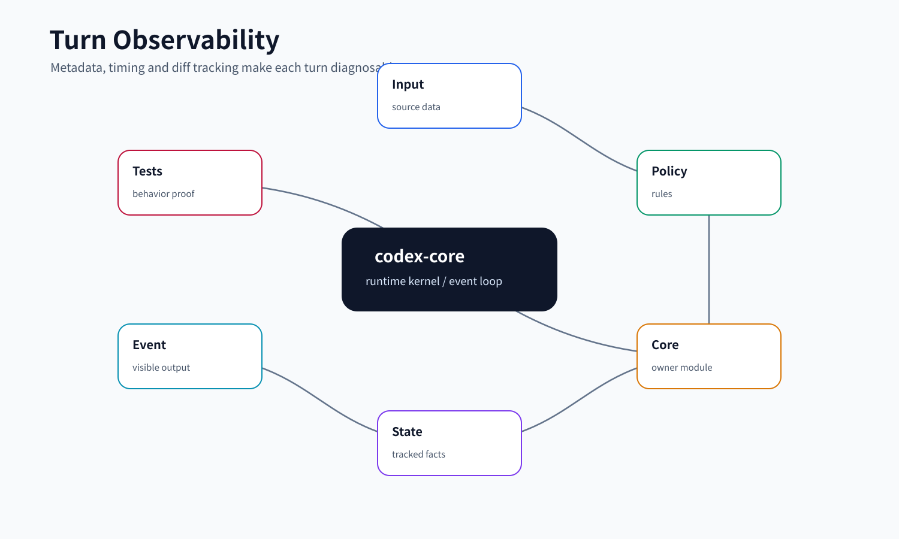
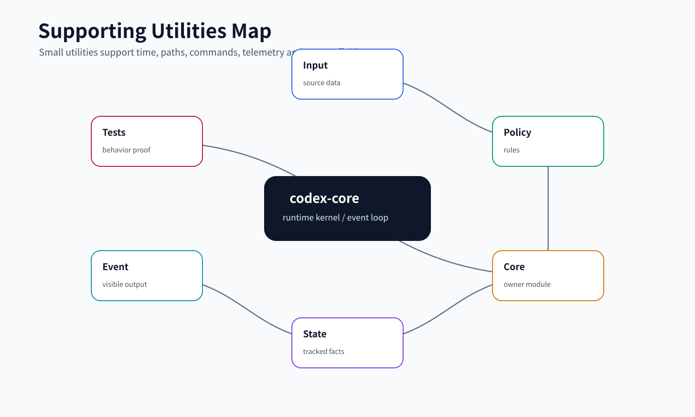

# Observability / Metadata / Utilities

本文讲 core 里那些不直接“做任务”，但让任务可诊断、可追踪、可复现的模块。小白容易把它们看成杂项工具；更准确的理解是：它们把一次 turn 的身份、时间、工具、diff、外部上下文、命令规范化和系统时间抽成稳定支撑层。

## 读完你应掌握什么

- 知道 `TurnMetadataState` 如何给 Responses API、MCP 和 analytics 提供同一套 turn 身份。
- 能解释 `TurnTimingState` 记录 TTFT、TTFM 和 phase profile 的方式。
- 能说明 `TurnDiffTracker` 为什么不重新读文件，而是从 apply_patch delta 维护本轮净 diff。
- 知道 `stream_events_utils` 如何把模型 stream item 变成 turn item、持久化和工具执行。
- 能理解命令 canonicalization、current time provider、memory usage metric 这些 utility 为什么属于 core 支撑能力。



这张开篇综合图把本文的支撑链路放在一次 turn 里看：`TurnMetadataState` 生成模型/MCP/analytics 共用的身份标签，`TurnTimingState` 记录用户感知延迟和 profile phase，`stream_events_utils` 把模型 stream item 变成事件、history 和工具执行，`TurnDiffTracker` 用 apply_patch delta 维护本轮净 diff。后文的 metadata、timing 和 diff tracker 片段分别证明这些观测对象的字段形状和失效边界。

## 这个模块解决什么问题

一个 agent harness 如果只能“执行”，但不能回答下面这些问题，就很难调试和运营：

- 这次模型请求属于哪个 session、thread、turn、agent？
- 它使用了什么模型、reasoning effort、sandbox、workspace、tool namespace？
- 第一个 token 和第一条可见消息分别用了多久？
- 本轮 patch 到底净改了哪些文件？
- 模型输出里哪些隐藏 markup 应该去掉？
- 命令审批缓存为什么认为两条 shell 命令等价？
- 当前时间来自系统还是 host 外部 provider？

这些模块共同组成 core 的 observability 和 utility 层：不抢主流程，但给主流程提供可解释性和稳定边界。

## 源码锚点

| 关注点 | 源码 |
| --- | --- |
| Responses metadata schema | `repo/codex/codex-rs/core/src/responses_metadata.rs` |
| turn metadata 状态和 git enrichment | `repo/codex/codex-rs/core/src/turn_metadata.rs` |
| turn timing 和 profile | `repo/codex/codex-rs/core/src/turn_timing.rs` |
| 本轮 diff 追踪 | `repo/codex/codex-rs/core/src/turn_diff_tracker.rs` |
| memory usage metric | `repo/codex/codex-rs/core/src/memory_usage.rs` |
| current time provider | `repo/codex/codex-rs/core/src/current_time.rs` |
| 命令规范化 | `repo/codex/codex-rs/core/src/command_canonicalization.rs` |
| stream event 处理工具 | `repo/codex/codex-rs/core/src/stream_events_utils.rs` |
| 通用 utils | `repo/codex/codex-rs/core/src/utils/` |
| diff tracker 测试 | `repo/codex/codex-rs/core/src/turn_diff_tracker_tests.rs` |
| command canonicalization 测试 | `repo/codex/codex-rs/core/src/command_canonicalization_tests.rs` |
| turn timing 测试 | `repo/codex/codex-rs/core/src/turn_timing_tests.rs` |
| turn metadata 测试 | `repo/codex/codex-rs/core/src/turn_metadata_tests.rs` |

## 核心代码片段

### 1. `CodexResponsesMetadata` 是模型请求侧的审计实体

无需图重复嵌入；这段实体定义要和主流程中的 `Turn observability` 图一起看，图给出 metadata 从 turn start 到模型请求和日志侧的流向，代码给出字段形状。

Source: `repo/codex/codex-rs/core/src/responses_metadata.rs::CodexResponsesMetadata`
Line range: `repo/codex/codex-rs/core/src/responses_metadata.rs:220-252`

```rust
pub struct CodexResponsesMetadata {
    /// Guardian parent reference; projected only onto a Guardian request.
    pub(crate) parent_response_id: Option<String>,
    pub(crate) installation_id: String,
    pub(crate) session_id: String,
    pub(crate) thread_id: String,
    pub(crate) agent_name: Option<String>,
    pub(crate) turn_id: Option<String>,
    pub(crate) routing_hint: Option<HeaderValue>,
    pub(crate) window_id: String,
    pub(crate) window_number: Option<u64>,
    pub(crate) context_window_id: Option<Uuid>,
    pub(crate) request_kind: Option<CodexResponsesRequestKind>,
    pub(crate) forked_from_thread_id: Option<ThreadId>,
    pub(crate) forked_from_ordinal_exclusive: Option<u64>,
    pub(crate) parent_thread_id: Option<ThreadId>,
    pub(crate) parent_turn_id: Option<String>,
    pub(crate) root_turn_id: Option<String>,
    pub(crate) subagent_header: Option<String>,
    pub(crate) subagent_kind: Option<String>,
    pub(crate) thread_source: Option<ThreadSource>,
    pub(crate) turn_trigger: Option<String>,
    pub(crate) sandbox: Option<String>,
    pub(crate) sandbox_mode: Option<String>,
    pub(crate) auto_review_enabled: Option<bool>,
    pub(crate) node_repl_auto_review_required: Option<bool>,
    pub(crate) node_repl_disabled: Option<bool>,
    pub(crate) workspaces: BTreeMap<String, TurnMetadataWorkspace>,
    pub(crate) tool_namespaces_info: Option<TurnToolNamespacesInfo>,
    pub(crate) turn_started_at_unix_ms: Option<i64>,
    pub(crate) history_ingest_requested: Option<bool>,
    pub(crate) extra: BTreeMap<String, String>,
}
```

这段实体定义展示了“一次模型请求的身份”到底由哪些字段组成：session/thread/turn/window 是定位维度，parent/root/subagent/thread source 是 lineage 维度，sandbox/auto review/node repl 是安全维度，workspace/tool namespace/extra 是运行上下文维度。后续 analytics、MCP metadata 和后端日志都依赖这个统一数据形状。

### 2. `TurnTimingState` 把用户感知时间和 profile phase 分开

无需图重复嵌入；这段 timing 结构同样对应主流程中的 `Turn observability` 图，读图时重点看 TTFT/TTFM 与 profile phase 是两条并行观测线。

Source: `repo/codex/codex-rs/core/src/turn_timing.rs::TurnTimingState`
Line range: `repo/codex/codex-rs/core/src/turn_timing.rs:43-87`

```rust
#[derive(Debug, Default)]
pub(crate) struct TurnTimingState {
    state: Mutex<TurnTimingStateInner>,
    profile: StdMutex<TurnProfileState>,
}

#[derive(Debug, Default)]
struct TurnTimingStateInner {
    started_at: Option<Instant>,
    started_at_unix_secs: Option<i64>,
    item_started_at_ms: HashMap<String, i64>,
    first_token_at: Option<Instant>,
    first_message_at: Option<Instant>,
}

#[derive(Debug, Default)]
struct TurnProfileState {
    started_at: Option<Instant>,
    last_transition_at: Option<Instant>,
    active_phase: Option<TurnProfilePhase>,
    seen_sampling: bool,
    before_first_sampling: Duration,
    sampling: Duration,
    compaction: Duration,
    between_sampling_overhead: Duration,
    tool_blocking: Duration,
    pending_idle_after_sampling: Duration,
    sampling_request_count: u32,
    sampling_retry_count: u32,
    completed_profile: Option<TurnProfile>,
}

#[derive(Clone, Copy, Debug, PartialEq, Eq)]
enum TurnProfilePhase {
    Sampling,
    Compaction,
    ToolBlocking,
}

#[must_use]
pub(crate) struct TurnProfileTimingGuard {
    timing: Arc<TurnTimingState>,
    phase: TurnProfilePhase,
    active: bool,
}
```

这段代码说明 timing 不是一个简单耗时数字。`TurnTimingStateInner` 保存 TTFT/TTFM 所需的用户感知时间点，`TurnProfileState` 保存 sampling、compaction、tool blocking 等 profile phase，`TurnProfileTimingGuard` 用 RAII 方式减少 phase 开始后忘记结束的风险。

### 3. `TurnDiffTracker` 用 baseline/current/origin 维护本轮净 diff

Source: `repo/codex/codex-rs/core/src/turn_diff_tracker.rs::TurnDiffTracker`
Line range: `repo/codex/codex-rs/core/src/turn_diff_tracker.rs:49-106`

```rust
pub struct TurnDiffTracker {
    valid: bool,
    display_roots_by_environment: HashMap<String, PathUri>,
    baseline_by_path: HashMap<TrackedPath, TrackedContent>,
    current_by_path: HashMap<TrackedPath, TrackedContent>,
    origin_by_current_path: HashMap<TrackedPath, TrackedPath>,
    next_revision: u64,
    rendered_diffs: HashMap<DiffCacheKey, Option<String>>,
    unified_diff: Option<String>,
    #[cfg(test)]
    rendered_diff_count: std::cell::Cell<usize>,
}

impl Default for TurnDiffTracker {
    fn default() -> Self {
        Self {
            valid: true,
            display_roots_by_environment: HashMap::new(),
            baseline_by_path: HashMap::new(),
            current_by_path: HashMap::new(),
            origin_by_current_path: HashMap::new(),
            next_revision: 0,
            rendered_diffs: HashMap::new(),
            unified_diff: None,
            #[cfg(test)]
            rendered_diff_count: std::cell::Cell::new(0),
        }
    }
}

impl TurnDiffTracker {
    pub fn track_delta(&mut self, environment_id: &str, delta: &AppliedPatchDelta) {
        if !self.valid {
            return;
        }

        if !delta.is_exact() {
            self.invalidate();
            return;
        }

        for change in delta.changes() {
            self.apply_change(environment_id, change);
        }
        self.refresh_unified_diff();
    }
}
```

这段结构和方法一起证明 diff tracker 的不变量：只要 delta 是 exact，就用 baseline/current/origin 逐步维护本轮净修改；一旦 delta 不精确，直接 `invalidate`，避免向用户展示伪 diff。

## 核心抽象

### `CodexResponsesMetadata`

`responses_metadata.rs` 定义发往模型侧的 metadata 结构。它覆盖：

- 安装、session、thread、turn、window id
- request kind，例如 regular、compaction、memory
- subagent header / kind / parent turn / root turn
- workspace git metadata
- sandbox、auto review、Node REPL 等安全相关状态
- tool namespace 和 function 信息
- 额外 metadata 的过滤和大小限制

它是“模型请求侧的审计标签”，让后端、日志和分析系统能知道这次请求来自哪里、处于什么模式。

### `TurnMetadataState`

无需图重复嵌入；这一抽象已经由主流程中的 `Turn observability` 图覆盖，读图时关注 turn metadata 如何在模型请求、MCP metadata 和 analytics 之间被投影。
无需代码片段重复嵌入；本节说明的是 metadata 状态容器的使用面，具体请求侧实体字段已在上方 `CodexResponsesMetadata` 片段展示。

`TurnMetadataState` 是一个 turn 生命周期内可增量填充的 metadata 状态机。它一开始由 session/thread/turn/config 初始化，后续可以补充：

- `parent_turn_id`
- `root_turn_id`
- `initiating_agent_path`
- `turn_trigger`
- client metadata
- configured responses metadata
- tool namespace 信息
- turn started timestamp
- git workspace enrichment
- 用户是否在 turn 中被请求输入

它既能生成 Responses metadata，也能生成 MCP 请求 metadata。MCP metadata 会移除 harness-owned tool inventory 和部分内部 agent 字段，避免把不该给外部 MCP 的信息带出去。

### `TurnTimingState`

无需图重复嵌入；这一抽象已经由主流程中的 `Turn observability` 图覆盖，读图时关注用户感知时间和 profile phase 的分离。
无需代码片段重复嵌入；本节依赖上方 `TurnTimingState` / `TurnProfileState` / `TurnProfileTimingGuard` 片段作为实体和状态证据。

`TurnTimingState` 记录两类时间：

- 用户可感知时间：turn started、item started、completed、TTFT、TTFM。
- profile phase：sampling、compaction、tool blocking、between-sampling overhead、retry count。

`begin_sampling`、`begin_compaction`、`begin_tool_blocking` 返回 `TurnProfileTimingGuard`，guard drop 时自动结束 phase。这和 `SpawnReservation` 类似，都是用 RAII 降低漏记状态的风险。

### `TurnDiffTracker`

`TurnDiffTracker` 维护本轮 apply_patch 的净 diff。它不是在 turn 结束时重新读 workspace，而是消费 `AppliedPatchDelta`：

- `baseline_by_path` 保存第一次看见某路径时的旧内容。
- `current_by_path` 保存当前内容。
- `origin_by_current_path` 追踪 rename。
- `rendered_diffs` 用 revision 做缓存。
- `unified_diff` 保存聚合后的 Git diff 文本。

如果 delta 不是 exact，tracker 会 `invalidate`，因为它无法安全声明本轮净 diff。

### `stream_events_utils`

无需代码片段：本节是对 stream item 落地点的职责说明，关键执行顺序可从 `repo/codex/codex-rs/core/src/stream_events_utils.rs::handle_output_item_done` 和 `record_completed_response_item` 继续复查；本文避免再复制一段长分支，防止分散 metadata/timing/diff 三条主证据。

`stream_events_utils.rs` 位于模型流和 session/event/history 之间。它做几件事：

- `handle_output_item_done` 判断模型输出是不是工具调用。
- 如果是工具调用，立即记录 response item，并排队工具执行 future。
- 如果不是工具调用，转换成 `TurnItem`，跑 turn item contributors，发 started/completed 事件。
- `finalize_turn_item` 清理隐藏 citations 和 plan markup。
- `record_completed_response_item` 把完成项写入 history，并处理 memory citation 和外部上下文污染标记。

所以它不是简单 parser，而是“模型 stream item 落地”的关键 glue layer。

### 支撑 utility

几个小模块各自守住一个窄边界：

- `command_canonicalization.rs`：把 `/bin/bash -lc`、`bash -lc`、PowerShell wrapper 等命令规范化，用于审批缓存匹配。
- `current_time.rs`：定义 `TimeProvider`，可用系统时间，也可由 host 提供外部时间源。
- `memory_usage.rs`：从 `exec_command` 参数里提取 shell script，识别 memory 相关读取并打 usage metric。
- `utils/json.rs`：JSON byte counting 等通用能力。
- `utils/path_utils.rs`：re-export `codex_utils_path`，让 core 内统一使用路径工具。

## 主流程

开篇综合图已经展示观测链路：它从 turn start 的 metadata/timing 初始化开始，串到模型 stream item 落地、TTFT/TTFM、diff tracker 和 analytics 输出。下面按这条链路展开。
无需代码片段：本节是对上方 metadata、timing 和 diff tracker 三段代码证据的串联导读，stream item 的长分支以源码锚点补充而不在此重复展开。

### 1. turn 开始时建立 metadata 和 timing

新 turn 创建时，core 会初始化 `TurnMetadataState` 和 `TurnTimingState`：

1. `TurnMetadataState::new` 写入 session id、thread id、turn id、cwd、permission profile、sandbox tags、agent name、subagent header 等。
2. `TurnTimingState::mark_turn_started` 记录 monotonic start 和 unix timestamp。
3. `TurnMetadataState::spawn_git_enrichment_task` 异步读取 git root、remote URL、HEAD commit、dirty 状态。
4. 模型请求前，`to_responses_metadata` 生成 `CodexResponsesMetadata`。

metadata 可以晚到：git enrichment 是后台任务；memory request 最多等一小段时间。这让主 turn 不因为慢 git 查询被长期阻塞。

### 2. 模型 stream item 被处理和持久化

无需代码片段新增实体定义；本节关注 stream item 的落地顺序，具体状态实体由上方 metadata/timing/diff tracker 片段覆盖，事件转换实现可从 `stream_events_utils.rs` 源码锚点复查。

模型流输出每完成一个 item，`handle_output_item_done` 会判断：

- 工具调用：通过 `ToolRouter::build_tool_call` 识别，记录到 history，然后创建工具执行 future，后续需要 follow-up。
- 普通消息 / reasoning / web search：转成 `TurnItem`，发事件，写 history。
- 可反馈给模型的工具错误：写入 function call output，触发 follow-up。
- fatal 错误：直接返回 `CodexErr::Fatal`。

这里有一个重要顺序：完成的 response item 会尽早记录，所以即使 turn 后面取消，history 和 rollout 也能保留已经发生的事实。

### 3. timing 记录用户感知延迟

无需代码片段新增实体定义；本节解释的是上方 `TurnTimingState` / `TurnProfileState` 片段已经展示过的字段如何在主流程中被使用。

`record_turn_ttft_metric` 观察 response event，第一次满足条件时记录 time to first token。`record_turn_ttfm_metric` 在第一个 agent message turn item 出现时记录 time to first message。profile guard 则把整个 turn 分成 sampling、compaction、tool blocking 等阶段，最终 `complete_profile_and_duration_ms` 返回总耗时和 profile。

### 4. diff tracker 记录本轮净修改

无需代码片段新增实体定义；本节解释的是上方 `TurnDiffTracker` 片段已经展示过的 baseline/current/origin 字段如何被 `track_delta` 更新。

当 apply_patch 成功并给出 exact delta，`TurnDiffTracker::track_delta` 会：

1. 对 add/delete/update/rename 更新 baseline 和 current。
2. 根据 environment display root 生成稳定显示路径。
3. 用 Git blob SHA-1 格式生成 `index old..new`。
4. 用 `similar` 生成 unified diff，且有 100ms timeout。
5. 聚合所有路径的 diff。

这让 UI 或上层逻辑能问“本轮做了什么改动”，而不需要重新扫描整个工作区。

### 5. supporting utilities 服务安全和可复现



这张支撑工具图要按“主流程外围能力”来看：命令规范化、时间源、memory usage、JSON/path utils 都不接管 turn，只给安全、审计和可复现性提供稳定输入。
无需代码片段：这些 utility 是主证据之外的窄边界补充，读者需要深挖时再按源码锚点进入 `command_canonicalization.rs`、`current_time.rs`、`memory_usage.rs` 和 `utils/`。

命令审批缓存需要稳定 key，所以 `canonicalize_command_for_approval` 会把简单 `shell -lc` 命令还原成 plain command；复杂脚本保留 script text，并加上 `__codex_shell_script__` 或 `__codex_powershell_script__` 前缀。

current time 通过 `TimeProvider` 抽象，避免核心代码到处直接调用系统时间；当配置要求 external clock 但 host 没提供时，会返回明确错误。

memory usage metric 不解析所有工具，只在默认 namespace 的 `exec_command` 里解析 `cmd`，识别 memory usage kinds 并打点。这个边界很窄，避免 metric 逻辑污染工具 runtime。

## 失败模式与边界条件

无需图重复嵌入；metadata/timing/stream/diff 失败沿用 turn observability 图，command/time/memory/path 相关失败沿用 supporting utils map 图。
无需代码片段：本节失败项分别回连到上方 `CodexResponsesMetadata`、`TurnTimingState`、`TurnDiffTracker` 片段和源码锚点表中的 utility 文件。

| 场景 | 代码如何处理 | 设计含义 |
| --- | --- | --- |
| git enrichment 慢 | memory metadata 最多等待 `MEMORY_GIT_METADATA_TIMEOUT`；普通 turn 后台完成 | metadata 不能无限阻塞主请求 |
| enrichment 任务不再需要 | `cancel_git_enrichment_task` abort 并标记 complete | 避免悬挂后台任务 |
| MCP metadata 外发 | 移除 agent name、parent/root turn、tool inventory 等内部字段 | 外部 MCP 不该拿到全部内部状态 |
| turn item contributor 失败 | warn 后继续 | 扩展贡献失败不能破坏主 turn |
| 模型输出含隐藏 citation/plan markup | `finalize_turn_item` 清理可见文本并提取 memory citation | UI 可见内容和内部标记分离 |
| response item 可能含外部上下文 | 按配置 mark memory mode polluted | 防止外部上下文污染 memory 生成 |
| apply_patch delta 非 exact | `TurnDiffTracker::invalidate` | 无法精确追踪就不输出伪 diff |
| diff 生成耗时异常 | `similar` 配置 100ms timeout | diff 不能拖慢工具完成 |
| wrapper shell 路径不同 | canonicalize 成等价命令 | 审批缓存更稳定 |
| external time provider 缺失 | 返回明确错误 | host 集成缺失不能静默退回 |

## 图示

- [Turn observability](../../image/core/turn-observability-v1.png)：作为开篇综合图，放在“读完你应掌握什么”下方，用来对照 turn metadata、timing、stream 处理、diff 和 analytics。
- [Supporting utils map](../../image/core/supporting-utils-map-v1.png)：放在“supporting utilities 服务安全和可复现”附近，用来说明外围 utility 如何服务主链路。

## 复设计练习

设计一套 agent runtime 观测字段，要求能回答：

1. 本次请求属于哪个 session、thread、turn、agent？
2. 它使用了什么模型、provider、reasoning effort、sandbox、workspace？
3. 第一个 token、第一条消息、工具阻塞和 compaction 分别耗时多久？
4. 本轮净 diff 是什么？无法精确追踪时如何表示？
5. 哪些工具输出可能引入外部上下文，是否要影响 memory 生成？

再检查你的设计：metadata 是否能同时服务模型请求、MCP 请求和 analytics？如果三套系统各自拼字段，后续很容易出现同一 turn 三种身份的混乱。

## 检查题

1. `TurnMetadataState` 和 `CodexResponsesMetadata` 的关系是什么？
2. TTFT 和 TTFM 分别衡量什么？
3. `TurnDiffTracker` 为什么在 delta 非 exact 时要失效？
4. `stream_events_utils` 为什么要在工具执行前记录工具调用 item？
5. 命令 canonicalization 为什么不能把所有 shell script 都拆成 token？

参考回答要点：

1. `TurnMetadataState` 是可变状态容器，`CodexResponsesMetadata` 是发请求时序列化出去的 metadata 结构。
2. TTFT 是首 token 延迟；TTFM 是第一条可见 agent message 延迟。
3. 因为不精确 delta 无法保证 baseline/current 正确，继续输出 diff 会误导用户。
4. 这样即使后续工具取消或失败，history/rollout 仍保留模型曾经请求过该工具的事实。
5. 复杂脚本可能包含控制流、重定向、变量和 quoting；强行拆 token 会改变语义，审批缓存会变得危险。

## Follow-up Slots

- 深挖 `responses_metadata.rs`：metadata 字段、大小限制和 header serialization。
- 深挖 `turn_metadata_tests.rs`：subagent、guardian、MCP metadata 的测试用例。
- 深挖 `turn_timing_tests.rs`：phase profile 如何处理重试和嵌套状态。
- 深挖 `stream_events_utils_tests.rs`：隐藏 markup、memory citation 和 mailbox delivery 的边界。
