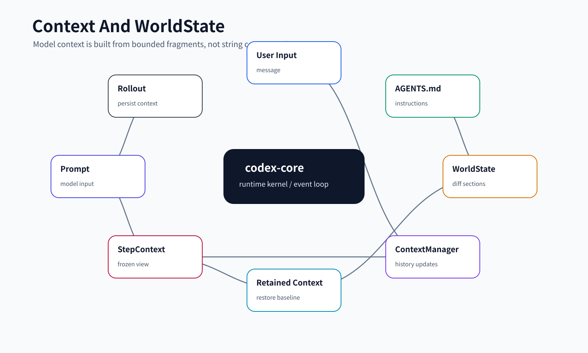
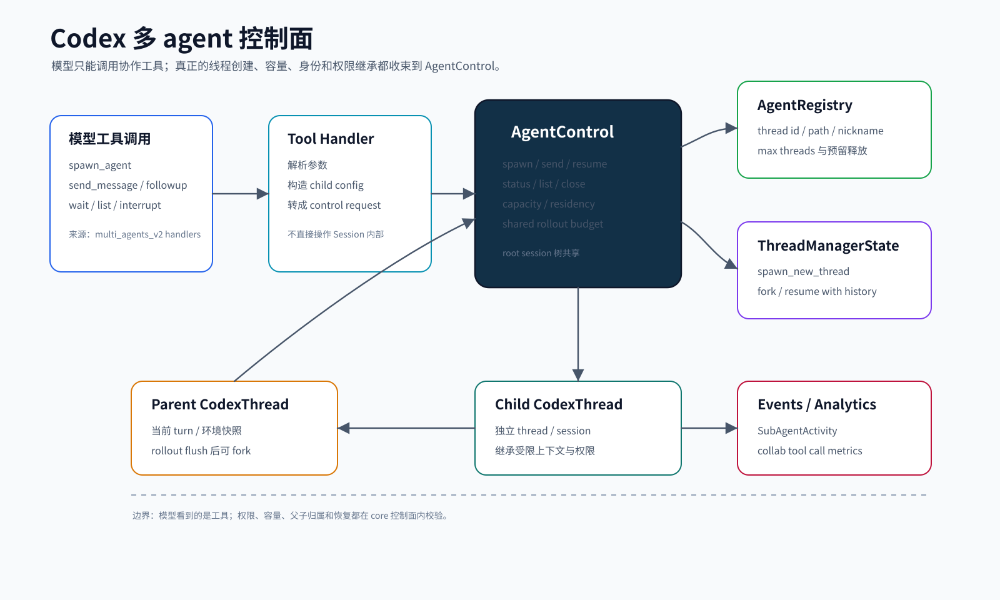
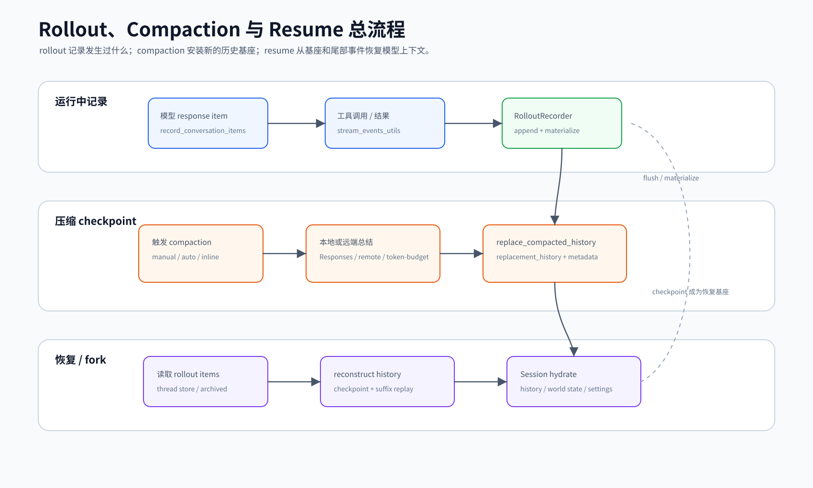

# 15. Core 核心代码证据导读

本文把 `codex-rs/core` 最关键的运行机制压缩成少量代码片段。它不是逐行源码讲解，而是帮助读者在不打开源码文件的前提下，看清 Codex harness 的主干形状：入口如何进入、turn 如何启动、模型请求如何采样、工具如何注册与执行、安全如何介入、多 agent 如何防半成功、rollout 如何恢复。

## 读完你应掌握什么

- 能用代码片段解释 `ThreadManager -> CodexThread -> Session -> Turn -> ToolRuntime -> Event` 的主路径。
- 能说明 `TurnInputMode` / `TurnInputSubmission` 为什么是输入协议边界。
- 能看懂 `run_sampling_request` 如何把 prompt、model stream、tool runtime 和 retry 串起来。
- 能解释 tool registry、approval/sandbox、WorldState、multi-agent、rollout reconstruction 的关键不变量。
- 能判断一篇 core 文档是否只是“贴文件链接”，还是已经提供了足够的代码证据。


这张开篇综合图把本文的证据路径压成一条主干：外部通过 `CodexThread` 提交输入，`TurnInputMode` 决定 start/steer/reject，`run_sampling_request` 绑定 `StepContext`、prompt 和工具 runtime，工具调用进入 router/orchestrator，结果再写入 history、rollout、compaction 与恢复链路。后文 8 组代码证据沿这条主干展开，并在 WorldState、tool runtime、multi-agent 和 rollout 处就近复用对应专题图。

## 这个模块解决什么问题

前面的专题文档按职责拆解 core，但如果只列源码路径，小白仍要跳进源码才能理解真实实现。本文补上“关键代码片段 + 机制解读”：每段代码都只摘最能说明机制的 10 到 40 行，并解释它证明了什么边界、连接了哪个上下游步骤、对应哪篇专题。代码块是当前源码快照的证据；凡省略非关键行，都用 `// ...` 明示，避免把非连续片段误读成完整可编译单元。

## 源码锚点

- `repo/codex/codex-rs/core/src/lib.rs`：core 对外 API 和内部模块边界。
- `repo/codex/codex-rs/core/src/codex_thread.rs`：外部 thread 句柄和 `submit` 入口。
- `repo/codex/codex-rs/protocol/src/turn_input.rs`：turn 输入路由协议。
- `repo/codex/codex-rs/core/src/session/turn.rs`：模型采样和工具 follow-up 主循环。
- `repo/codex/codex-rs/core/src/context/world_state/mod.rs`：WorldState section 合约。
- `repo/codex/codex-rs/core/src/tools/spec_plan.rs`：本次 step 的工具注册和曝光。
- `repo/codex/codex-rs/core/src/tools/orchestrator.rs`：审批、sandbox、网络审批和 retry 外壳。
- `repo/codex/codex-rs/core/src/agent/registry.rs`：multi-agent 身份、容量和半成功回收。
- `repo/codex/codex-rs/core/src/session/rollout_reconstruction.rs`：resume/fork 历史重建。

## 片段使用规则

本文所有 Rust 代码片段都来自当前本地源码快照 `repo/codex/`。片段优先保持连续摘录；如果为了篇幅省略非关键行，会在代码块内用 `// ...` 标明省略点。阅读时不要把片段当成完整函数实现，而要把它当成“能证明一个边界或不变量的最小证据”。

## 核心抽象

| 抽象 | 代码证据 | 说明 |
| --- | --- | --- |
| `CodexThread` | `codex_thread.rs` | 外部调用 core 的稳定句柄，暴露提交输入和读取事件，隐藏 `Session` 内部状态。 |
| `TurnInputMode` / `TurnInputSubmission` | `protocol/src/turn_input.rs` | 输入不是直接运行，而是先经过 start/steer/reject 协议。 |
| `run_sampling_request` | `session/turn.rs` | 一次模型请求的 retry、prompt 构造、tool runtime 绑定和错误分类入口。 |
| `WorldStateSection` | `context/world_state/mod.rs` | 模型可见状态的最小合约：稳定 ID、snapshot、diff、retained/legacy 匹配。 |
| `ToolRouter` / `ToolRegistry` | `tools/spec_plan.rs` | 本次 step 可见工具集合由 feature、model、MCP、extension、environment 共同决定。 |
| `ToolOrchestrator` | `tools/orchestrator.rs` | approval、sandbox、network approval 和 retry 的统一外壳。 |
| `SpawnReservation` | `agent/registry.rs` | 子 agent 创建先占位，失败自动释放，避免容量和 path 泄漏。 |
| `RolloutReconstruction` | `session/rollout_reconstruction.rs` | resume/fork 从 rollout 反向找 checkpoint，再正向重放 surviving suffix。 |

## 代码证据矩阵

| 读者必须掌握的不变量 | 代码片段 | 对应专题 | 对应图示 |
| --- | --- | --- | --- |
| 上层只能通过 thread 句柄提交 `Op`，不能绕过 session 内部队列 | `CodexThread::submit` | [01-thread-lifecycle.md](01-thread-lifecycle.md) | `thread-lifecycle-v1.png` |
| 输入接受只是 start/steer/reject 的调度结果，不等于模型完成 | `TurnInputMode` / `TurnInputSubmission` | [02-session-turn-loop.md](02-session-turn-loop.md) | `session-turn-loop-v1.png` |
| 每次采样都绑定 step 级工具、权限、环境和 diff 视图 | `run_sampling_request` | [02-session-turn-loop.md](02-session-turn-loop.md) | `session-turn-loop-v1.png` |
| 模型可见状态必须可 snapshot、diff、retained/legacy 匹配 | `WorldStateSection` | [03-context-world-state.md](03-context-world-state.md) | `context-world-state-v1.png` |
| 工具不是全局常量，而是每个 step 现场装配出来的 router | `build_tool_router` | [04-tool-runtime.md](04-tool-runtime.md) | `tool-runtime-v1.png` |
| 审批、sandbox 和网络策略必须在工具外壳统一判定 | `ToolOrchestrator::run` | [06-safety-sandbox-approval.md](06-safety-sandbox-approval.md) | `safety-approval-decision-v1.png` |
| 子 agent 创建必须先 reserve，失败自动释放，成功才 commit | `reserve_spawn_slot` / `SpawnReservation` | [10-agents-and-spawn.md](10-agents-and-spawn.md) | `multi-agent-control-v1.png` |
| 恢复历史要反向找有效 checkpoint，再正向重放 surviving suffix | `reconstruct_history_from_rollout` | [11-rollout-compaction-resume.md](11-rollout-compaction-resume.md) | `rollout-compaction-resume-v1.png` |

## 主流程

无需图重复嵌入；开篇综合图已经把 thread submit、turn input 路由、sampling、tool follow-up、history/rollout 连接成一条主干。下面的 8 个代码证据点就是沿这条主干向内展开。
无需代码片段：本节是 evidence guide 的阅读路径说明，真正的 typed code block 从下一节开始按主干顺序逐段给出。

1. 上层只拿到 `CodexThread`，通过 `submit` 投递 `Op`，通过事件流观察结果。
2. `Op::TurnInput` 进入 `TurnInputMode` 判定，决定启动新 turn、steer 当前 turn，还是拒绝。
3. turn 内每次 sampling 都构造新的 `StepContext`，冻结工具、MCP、环境和模型设置。
4. `build_tool_router` 在 step 级别组装工具；模型只看到这次 request 被允许看到的工具。
5. 模型输出 tool call 后，handler 解析参数，`ToolOrchestrator` 统一处理 approval、sandbox 和 retry。
6. 工具结果进入下一次模型输入；事件和 response item 进入 history/rollout。
7. 长会话通过 compaction 生成 checkpoint；resume/fork 时从 rollout 重建有效历史。
8. multi-agent 创建时先 reserve，再创建/注册/提交输入；失败时 reservation 自动释放。

## 核心代码片段

### Code Evidence: 外部只通过 `CodexThread` 操作会话

Source: `repo/codex/codex-rs/core/src/codex_thread.rs::CodexThread`
Line range: `repo/codex/codex-rs/core/src/codex_thread.rs:177-222`

```rust
pub struct CodexThread {
    pub(crate) session: Arc<Session>,
    pub(crate) io: SessionIo,
    pub(crate) session_source: SessionSource,
    session_configured: SessionConfiguredEvent,
    rollout_path: Option<PathBuf>,
    out_of_band_elicitations: Mutex<OutOfBandElicitations>,
    _diagnostics_guard: GaugeGuard,
}

// ...

impl CodexThread {
    pub(crate) fn new(
        session: Arc<Session>,
        io: SessionIo,
        session_configured: SessionConfiguredEvent,
        rollout_path: Option<PathBuf>,
        session_source: SessionSource,
    ) -> Self {
        Self {
            session,
            io,
            session_source,
            session_configured,
            rollout_path,
            out_of_band_elicitations: Mutex::new(OutOfBandElicitations::default()),
            _diagnostics_guard: LIVE_THREADS.track(),
        }
    }

    pub async fn submit(&self, op: Op) -> CodexResult<String> {
        self.io.submit(op).await
    }
}
```

这段代码说明 core 的对外使用者不直接操作 `Session`。`CodexThread` 持有内部 `Session`，但只给上层一个 `submit(Op)` 入口和事件读取出口。它保护的边界是：UI、CLI、app-server 不能自行绕过 session 的队列、turn、tool runtime 和 rollout 规则。

### Code Evidence: turn 输入只有三种路由结果

Source: `repo/codex/codex-rs/protocol/src/turn_input.rs::TurnInputMode`
Line range: `repo/codex/codex-rs/protocol/src/turn_input.rs:128-190`

```rust
/// How Core should route submitted turn input.
#[derive(Clone, Debug, Eq, PartialEq)]
pub enum TurnInputMode {
    /// Start a regular turn when idle, otherwise steer the active regular turn.
    StartOrSteer,
    /// Start only when the thread is idle.
    StartIfIdle,
    /// Steer only if this exact turn is active.
    Steer { expected_turn_id: String },
}

// ...

/// What Core did with input submitted through `start_or_steer_turn`.
///
/// Started and Steered only mean Core accepted the input for turn processing. They
/// do not wait for user-prompt hooks, updating the in-memory model context,
/// rollout persistence, or sampling.
#[derive(Clone, Debug, Eq, PartialEq)]
pub enum TurnInputSubmission {
    /// Core started a turn. Persistent thread settings and start options were applied.
    Started { turn_id: String },
    /// Core steered an active turn. Persistent thread settings were applied for
    /// subsequent turns. No new turn was created, so lineage metadata was not
    /// recorded. If the request included `final_output_json_schema`, the active
    /// turn already used the same schema.
    Steered { turn_id: String },
    /// Core rejected the input without applying settings or start options.
    NotSubmitted { reason: NotSubmittedReason },
}
```

这段代码是 session 输入协议的最小状态机。它告诉读者：输入被 core 接收，不代表模型已经回答；`Started` / `Steered` / `NotSubmitted` 只是入口层的调度结果。理解这一点后，才能解释为什么同一用户输入可能启动新 turn，也可能只追加到已有 turn。

### Code Evidence: sampling 前绑定 tool runtime 和 prompt

Source: `repo/codex/codex-rs/core/src/session/turn.rs::run_sampling_request`
Line range: `repo/codex/codex-rs/core/src/session/turn.rs:1415-1460`

```rust
async fn run_sampling_request(
    sess: Arc<Session>,
    step_context: Arc<StepContext>,
    turn_store: Arc<codex_extension_api::ExtensionData>,
    turn_diff_tracker: SharedTurnDiffTracker,
    client_session: &mut ModelClientSession,
    responses_metadata: &CodexResponsesMetadata,
    input: Vec<ResponseItem>,
    cancellation_token: CancellationToken,
) -> CodexResult<(SamplingRequestResult, Vec<ResponseItem>)> {
    let turn_context = Arc::clone(&step_context.turn);
    let base_instructions = sess.get_prompt_base_instructions().await;

    let tool_runtime = ToolCallRuntime::new(
        Arc::clone(&sess),
        Arc::clone(&step_context),
        Arc::clone(&turn_diff_tracker),
    );
    let _code_mode_worker = sess.services.code_mode_service.start_turn_worker(
        &sess,
        Arc::clone(&step_context),
        Arc::clone(&turn_diff_tracker),
    );
    let max_retries = turn_context.provider.info().stream_max_retries();
    let mut retry_state = ResponsesStreamRetryState::default();
    let mut initial_input = Some(input);
    let mut original_input = None;
    let mut executed_tool_calls_by_output = HashMap::new();
    // ...
}
```

```rust
    loop {
        // A retry must not attribute the next tool call to the previous response.
        turn_context
            .extension_data
            .remove::<codex_api::ResponseId>();
        let prompt_input = if let Some(input) = initial_input.take() {
            input
        } else {
            sess.clone_history()
                .await
                .for_prompt(&step_context.settings.model_info.input_modalities)
        };
        // ...
        let prompt = build_prompt(
            prompt_input,
            step_context.as_ref(),
            base_instructions.clone(),
        );
        // ...
    }
}
```

这段代码说明一次 sampling 不只是“请求模型”。它先把 `Session`、`StepContext` 和 `TurnDiffTracker` 绑定成 `ToolCallRuntime`，再在 retry loop 中构造 prompt。后续模型返回 tool call 时，工具执行能拿到同一份 step 级工具/权限/环境视图，也能把 patch delta 写回本轮 diff tracker。

### Code Evidence: WorldState section 是可持久化、可 diff 的状态合约



这张图要从 section snapshot 读起：`WorldStateSection` 负责把模型可见状态变成可持久化、可 diff、可 retained/legacy 匹配的上下文片段，下面的 trait 定义就是这个合约的源码形状。

Source: `repo/codex/codex-rs/core/src/context/world_state/mod.rs::WorldStateSection`
Line range: `repo/codex/codex-rs/core/src/context/world_state/mod.rs:228-264`

```rust
pub(crate) trait WorldStateSection: Send + Sync + 'static {
    const ID: &'static str;
    type Snapshot: DeserializeOwned + Serialize;

    fn snapshot(&self) -> Self::Snapshot;

    fn should_persist(&self) -> bool {
        true
    }

    fn matches_legacy_fragment(_role: &str, _text: &str) -> bool {
        false
    }

    /// Recognizes legacy fragments whose identity depends on this section's current value.
    fn matches_current_legacy_fragment(&self, role: &str, text: &str) -> bool {
        Self::matches_legacy_fragment(role, text)
    }

    fn has_retained_fragment_matcher() -> bool {
        false
    }

    /// Recognizes this section's rendered fragment in retained model history.
    fn matches_retained_fragment(_role: &str, _text: &str) -> bool {
        false
    }

    fn render_diff(
        &self,
        previous: PreviousSectionState<'_, Self::Snapshot>,
    ) -> Option<Box<dyn ContextualUserFragment>>;
}
```

这段代码说明 world state 不是一段文本模板，而是一组有稳定 `ID`、可序列化 snapshot、可按 previous state 渲染 diff 的 section。它保护的边界是：模型看到的环境、权限、插件、工具、multi-agent 状态可以被去重、恢复和审计。

### Code Evidence: 每个 step 的工具集合由 router 现场装配


这张工具运行图对应主流程第 3-5 步：先在 step 上冻结模型、环境和 MCP 视图，再由 router 暴露本次可见工具，最后才进入统一执行外壳。

Source: `repo/codex/codex-rs/core/src/tools/spec_plan.rs::build_tool_router`
Line range: `repo/codex/codex-rs/core/src/tools/spec_plan.rs:125-166`

```rust
pub(crate) fn build_tool_router(
    session: &Session,
    turn_context: &TurnContext,
    model_info: &ModelInfo,
    // ...
    environments: &TurnEnvironmentSnapshot,
    mcp: &Arc<codex_mcp::McpBinding>,
    apps_enabled: bool,
    // ...
) -> CodexResult<ToolRouter> {
    let default_agent_type_description =
        crate::agent::role::spawn_tool_spec::build(&std::collections::BTreeMap::new());
    let wait_for_environment_tool_config = session
        .services
        .thread_extension_data
        .get::<crate::WaitForEnvironmentToolConfig>();
    let context = CoreToolPlanContext {
        turn_context,
        model_info,
        environments,
        mcp,
        // ...
        wait_for_environment_tool_config: wait_for_environment_tool_config.as_ref(),
        default_agent_type_description: &default_agent_type_description,
        wait_agent_timeouts: wait_agent_timeout_options(turn_context),
    };
    let mut registry = ToolRegistry::default();
    add_core_tool_sources(&context, &mut registry);

    let hosted_specs = if crate::guardian::is_basic_session_source(&turn_context.session_source) {
        Vec::new()
    } else {
        let registered_mcp_tools = session.services.mcp_handler_cache.append_mcp_tools(
            mcp,
            &turn_context.config,
            apps_enabled,
            &mcp.config().mcp_server_catalog,
            search_tool_enabled(turn_context, model_info),
            &mut registry,
        );
```

这段代码说明工具不是全局常量。每次 step 都按 model、environment、MCP binding、apps、extension 和 guardian session source 重新装配工具路由。文档里说“工具列表被冻结”，必须靠这段代码理解：冻结点是 `StepContext` 的工具 router，而不是进程启动时的全局配置。

### Code Evidence: approval 和 sandbox 是所有工具共享的外壳

Source: `repo/codex/codex-rs/core/src/tools/orchestrator.rs::ToolOrchestrator::run`
Line range: `repo/codex/codex-rs/core/src/tools/orchestrator.rs:121-176`

```rust
pub async fn run<Rq, Out, T>(
    &mut self,
    tool: &mut T,
    req: &Rq,
    tool_ctx: &ToolCtx,
) -> Result<OrchestratorRunResult<Out>, ToolError>
where
    T: ToolRuntime<Rq, Out>,
{
    let turn_ctx = tool_ctx.step_context.turn.as_ref();
    let approval_policy = tool_ctx.step_context.settings.approval_policy();
    // ...
    let environment = tool.turn_environment(req);
    let sandbox_config = environment.config();
    let owner_network_policy = sandbox_config.network_policy.is_some();
    if owner_network_policy
        && tool
            .sandbox_permissions(req)
            .requires_escalated_permissions()
    {
        return Err(ToolError::Rejected(
            "attachment-owned network policy cannot be bypassed by sandbox escalation"
                .to_string(),
        ));
    }
    let executor_managed_process_sandbox = tool.uses_executor_managed_process_sandbox(req);
    let permission_profile = environment.permission_profile();
    let permissions = if executor_managed_process_sandbox {
        // Executor-native roots remain symbolic until the executor applies its own sandbox.
        permission_profile.clone()
    } else {
        environment.permission_profile_with_workspace_roots()
    };
    let file_system_sandbox_policy = permissions.file_system_sandbox_policy();
    let requirement = tool.exec_approval_requirement(req).unwrap_or_else(|| {
        default_exec_approval_requirement(approval_policy, &file_system_sandbox_policy)
    });
```

这段代码为篇幅省略了 telemetry 和 strict auto-review 细节，但保留了连续安全判定主干。它说明安全边界不是 `exec_command` 独有，也不是 handler 自己随便判断。所有实现 `ToolRuntime` 的工具进入统一 orchestrator 后，才进行 approval policy、owner network policy、sandbox permissions 和默认审批要求的组合判断。

### Code Evidence: 子 agent 创建先占位，失败自动释放



这张控制面图要重点看 `AgentControl` 与 `AgentRegistry` 的交界：模型只能表达 `spawn_agent` 意图，容量、path、metadata 和父子 thread 关系都由控制面提交或回滚。

Source: `repo/codex/codex-rs/core/src/agent/registry.rs::reserve_spawn_slot`
Line range: `repo/codex/codex-rs/core/src/agent/registry.rs:96-118`, `repo/codex/codex-rs/core/src/agent/registry.rs:356-403`

```rust
pub(crate) fn reserve_spawn_slot(
    self: &Arc<Self>,
    max_threads: Option<usize>,
) -> Result<SpawnReservation> {
    if let Some(max_threads) = max_threads {
        if !self.try_increment_spawned(max_threads) {
            return Err(CodexErr::new(CodexErrorDetails::AgentLimitReached {
                max_threads,
            }));
        }
    } else {
        self.total_count.fetch_add(1, Ordering::AcqRel);
    }
    Ok(SpawnReservation {
        state: Arc::clone(self),
        active: true,
        reserved_agent_nickname: None,
        reserved_agent_path: None,
    })
}
```

```rust
impl SpawnReservation {
    pub(crate) fn commit(mut self, agent_metadata: AgentMetadata) {
        self.reserved_agent_nickname = None;
        self.reserved_agent_path = None;
        self.state.register_spawned_thread(agent_metadata);
        self.active = false;
    }
}

impl Drop for SpawnReservation {
    fn drop(&mut self) {
        if self.active {
            if let Some(agent_path) = self.reserved_agent_path.take() {
                self.state.release_reserved_agent_path(&agent_path);
            }
            self.state.total_count.fetch_sub(1, Ordering::AcqRel);
        }
    }
}
```

这两段代码是 multi-agent 半失败保护的核心。spawn 不是先创建完整 thread 再登记，而是先 reserve 容量和 path；成功时 `commit` 注册完整 metadata 并关闭 reservation，失败或提前返回时 `Drop` 释放 path 和计数。昵称是例外：`reserve_agent_nickname` 会把失败过的昵称留在 used pool，直到昵称池重置，避免同一轮失败重试反复暴露同名 agent。

### Code Evidence: resume/fork 先反向找 checkpoint，再正向重放



这张 rollout 图要从 checkpoint 安装读到 resume/fork：下面的代码片段证明恢复不是全量重放日志，而是反向找有效锚点后正向重放 surviving suffix。

Source: `repo/codex/codex-rs/core/src/session/rollout_reconstruction.rs::reconstruct_history_from_rollout`
Line range: `repo/codex/codex-rs/core/src/session/rollout_reconstruction.rs:133-172`, `repo/codex/codex-rs/core/src/session/rollout_reconstruction.rs:436-460`

```rust
pub(super) async fn reconstruct_history_from_rollout(
    &self,
    turn_context: &TurnContext,
    rollout_items: &[RolloutItem],
) -> RolloutReconstruction {
    // Replay metadata should already match the shape of the future lazy reverse loader, even
    // while history materialization still uses an eager bridge. Scan newest-to-oldest,
    // stopping once a surviving replacement-history checkpoint and the required resume metadata
    // are both known; then replay only the buffered surviving tail forward to preserve exact
    // history semantics.
    let has_legacy_compaction_without_window_number =
        rollout_items.iter().any(|item| {
            matches!(item, RolloutItem::Compacted(compacted) if compacted.window_number.is_none())
        });
    let initial_window = if has_legacy_compaction_without_window_number {
        None
    } else {
        rollout_items.iter().find_map(|item| match item {
            RolloutItem::SessionMeta(session_meta) => session_meta
                .meta
                .context_window
                .as_ref()
                .and_then(reconstructed_window_from_session_context_window),
            _ => None,
        })
    };
    let mut base_compaction = None;
    let mut previous_turn_settings = None;
    let mut reference_context_item = TurnReferenceContextItem::NeverSet;
    let mut world_state_replay = Vec::new();
    let mut window = None;
    // ...
```

```rust
// Segments and their contents were collected newest-first; replay the surviving records
// chronologically so compaction resets and merge patches have their original meaning.
world_state_replay.reverse();
let mut world_state_baseline: Option<WorldStateSnapshot> = None;
for item in world_state_replay {
    match item {
        RolloutItem::Compacted(_) => world_state_baseline = None,
        RolloutItem::WorldState(world_state) if world_state.full => {
            world_state_baseline = Some(WorldStateSnapshot::from(&world_state.state));
        }
        RolloutItem::WorldState(world_state) => {
            let Some(baseline) = world_state_baseline.as_mut() else {
                tracing::warn!("ignored world-state patch without a full snapshot");
                continue;
            };
            baseline.apply_merge_patch(&world_state.state);
        }
        // ...
    }
}
```

这两段代码说明 rollout 不是“把日志全塞回模型”。恢复时先从尾部找最新有效 checkpoint、turn settings、reference context 和 world state baseline，再把收集到的 surviving records 反转为时间顺序重放。这样 compact、rollback、fork 都能保持历史语义，而不是简单按文件顺序拼接。

## 测试证据

| 行为规则 | Source anchor | Test anchor | 读者结论 |
| --- | --- | --- | --- |
| thread 外层只暴露稳定句柄和提交入口 | `repo/codex/codex-rs/core/src/codex_thread.rs::CodexThread` | `repo/codex/codex-rs/core/src/thread_manager_tests.rs` | thread 生命周期由 manager/session 维护，上层不应绕过 `CodexThread` 直接改内部状态。 |
| turn 输入先被归类为 start/steer/reject | `repo/codex/codex-rs/protocol/src/turn_input.rs::TurnInputMode` | `repo/codex/codex-rs/core/src/session/turn_input_tests.rs` | 接收输入只代表排队或转向成功，不代表 turn 已完成。 |
| sampling 与工具执行共享同一个 step 视图 | `repo/codex/codex-rs/core/src/session/turn.rs::run_sampling_request` | `repo/codex/codex-rs/core/src/session/turn_tests.rs` | prompt、tool runtime、retry 和 diff tracking 必须按 step 一起理解。 |
| world state section 通过稳定 ID 和 snapshot/diff 恢复 | `repo/codex/codex-rs/core/src/context/world_state/mod.rs::WorldStateSection` | `repo/codex/codex-rs/core/src/context/world_state/world_state_tests.rs` | 上下文片段不是普通文本，必须能参与持久化、diff 和 retained/legacy 匹配。 |
| step 级 router 决定模型可见工具 | `repo/codex/codex-rs/core/src/tools/spec_plan.rs::build_tool_router` | `repo/codex/codex-rs/core/src/tools/router_tests.rs` | 工具曝光由当前 model、environment、MCP、extension 和 session source 共同决定。 |
| approval/sandbox 由 orchestrator 统一包裹工具执行 | `repo/codex/codex-rs/core/src/tools/orchestrator.rs::ToolOrchestrator::run` | `repo/codex/codex-rs/core/src/tools/sandboxing_tests.rs` | 权限判定不能散落在 handler 内，否则不同工具会出现不一致安全语义。 |
| spawn reservation 处理半成功清理 | `repo/codex/codex-rs/core/src/agent/registry.rs::SpawnReservation` | `repo/codex/codex-rs/core/src/agent/registry_tests.rs` | 子 agent 创建失败必须释放容量和 path，成功后才注册完整 metadata。 |
| rollout reconstruction 用 checkpoint 和 surviving suffix 恢复 | `repo/codex/codex-rs/core/src/session/rollout_reconstruction.rs::reconstruct_history_from_rollout` | `repo/codex/codex-rs/core/src/session/rollout_reconstruction_tests.rs` | resume/fork 不能盲目重放全量日志，必须尊重 compact、rollback 和 world-state patch。 |

## 失败模式与边界条件

无需图重复嵌入；这一节是 evidence guide 的维护约束，阅读时回连上方各证据段落旁的 session turn loop、tool runtime、WorldState、multi-agent 和 rollout 图即可。
无需代码片段：本节归纳的是上方八组 evidence 的维护风险，不引入新的 runtime 分支；每条失败项都能回连到相邻代码证据段落。

- 代码片段过长会退化成源码搬运；每段应只保留能解释机制的最小上下文。
- 只摘代码不解释，会让读者继续依赖源码背景；每段后必须解释边界、不变量和上下游。
- 只挑 happy path 会误导学习者；安全、恢复、权限、取消、半失败必须有代表性片段。
- 片段和源码快照会漂移；更新 `repo/codex/` 后要复核本文所有 snippet。
- 图示和代码片段要相互印证；图展示路径，代码证明关键分支。

## 图示

- [Session turn loop](../../image/core/session-turn-loop-v1.png)：作为开篇综合图，放在“读完你应掌握什么”下方，用来对照 evidence guide 的 8 步主干。
- [Context 与 WorldState](../../image/core/context-world-state-v1.png)：放在 `WorldStateSection` 证据段落附近，用来解释 snapshot/diff/retained history 合约。
- [Tool runtime](../../image/core/tool-runtime-v1.png)：放在 `build_tool_router` 证据段落附近，用来解释 step 级工具曝光和执行边界。
- [Multi-agent control plane](../../image/core/multi-agent-control-v1.png)：放在 spawn reservation 证据段落附近，用来解释控制面如何提交或回滚子 agent。
- [Rollout compaction resume](../../image/core/rollout-compaction-resume-v1.png)：放在 rollout reconstruction 证据段落附近，用来解释 checkpoint 与 surviving suffix 的恢复路径。

## 复设计练习

请基于本文代码片段设计一个最小 agent harness：

1. 对外只暴露 thread 句柄和事件流。
2. 输入先经过 start/steer/reject 协议。
3. 每次模型请求冻结工具和环境视图。
4. 工具执行统一经过 approval/sandbox 外壳。
5. 长会话能通过 checkpoint 和 suffix replay 恢复。
6. 子 agent 创建要能处理半成功回收。

完成后检查你的设计：哪些类型是 public API？哪些状态必须持久化？哪些错误必须对模型可见？哪些权限只能由外壳统一处理？

## 检查题

1. 为什么 `CodexThread` 不直接暴露 `Session`？
2. `TurnInputSubmission::Started` 为什么不等于模型已经完成回答？
3. 为什么 `StepContext` 是工具列表冻结的关键位置？
4. `WorldStateSection::ID` 为什么必须稳定？
5. `ToolOrchestrator` 统一处理 approval/sandbox 解决了什么风险？
6. `SpawnReservation` 为什么比“创建完再计数”更安全？
7. rollout reconstruction 为什么不能简单从头按顺序重放全部日志？

### 答案要点

1. `CodexThread` 是上层稳定句柄，隐藏 session 队列、turn 状态、工具 runtime 和 rollout 等内部细节，避免 UI/CLI/app-server 依赖不稳定实现。
2. `Started` 只说明输入已被 core 接收并创建 turn；hooks、模型上下文更新、rollout 持久化、sampling 和工具执行都还没完成。
3. 一个 turn 可能多次 sampling；`StepContext` 捕获本次请求的 tool router、MCP binding、environment 和 settings，防止请求期间工具视图漂移。
4. `ID` 会进入 rollout 的 world-state snapshot，用于后续 diff、retained 匹配和恢复；不稳定会导致恢复时无法判断哪段状态被替换。
5. 它防止每个 handler 各自实现权限逻辑，保证审批、sandbox、network approval 和 retry 规则在 shell、patch、MCP、extension tool 间一致。
6. 先 reserve 可以在后续创建 thread、fork history、提交初始输入失败时自动释放容量和 path，避免半成功状态泄漏。
7. compact checkpoint、rollback 和 world-state patch 会改变有效历史；恢复必须找到最新有效基线，只重放 surviving suffix，避免复活已压缩或已回滚内容。

## Follow-up Slots

- 源码快照更新后，逐段复核本文行号和片段是否仍与 `repo/codex/` 对齐。
- 维护 protocol/event 证据覆盖面，必要时追加 `EventMsg` 主要事件族的短片段。
- 安全链路若出现新的审批或 sandbox 类型，再补充能串起 `ExecPolicyManager`、`ToolOrchestrator`、`ApprovalAction` 和 `SandboxAttempt` 的证据图或局部代码片段。
