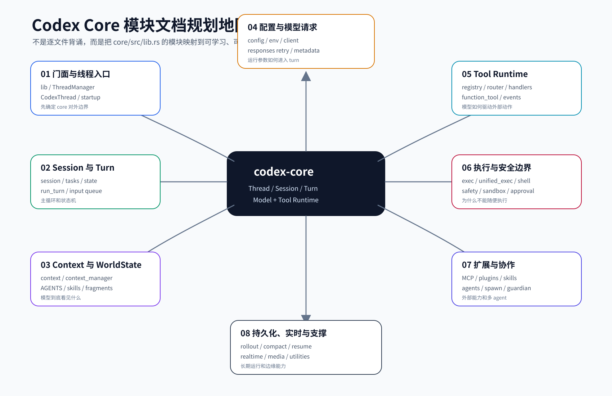

# Codex Core 层文档索引

本文面向第一次系统阅读 `codex-rs/core` 的读者。目标不是把每个源码文件逐行复述，而是把 core 层拆成一组可以逐篇学习的专题文档。每篇专题最终都要让读者达到两个标准：

- 能看懂当前实现：知道入口、核心抽象、状态流转、失败处理和测试证据。
- 能复设计相似逻辑：如果自己设计一个 agent harness，能说明为什么需要这些模块、边界如何切、接口如何定义。

本文基于源码快照 `repo/codex/`，版本见 [../source-snapshot.md](../source-snapshot.md)。



## 1. 总体拆解原则

`codex-rs/core/src` 的文件数量很多，不能按“一个文件一篇”机械展开。更适合小白的方式是按职责聚类：

1. 先读主生命周期：`ThreadManager -> CodexThread -> Session -> SessionTask -> run_turn`。
2. 再读模型上下文：输入、世界状态、上下文片段、压缩。
3. 再读工具链路：工具定义、路由、执行、结果回传。
4. 再读安全边界：审批、sandbox、exec policy、patch safety。
5. 再读外部能力：MCP、plugins、skills、connectors、agents。
6. 最后读支撑能力：配置、rollout、实时、observability、utility。

当前 `docs/core/00-core-map.md` 到 `docs/core/15-core-code-evidence.md` 已形成第一版完整文档集。后续加固以 `$source-study-docs` 的 harness-level 口径为准：读者应能从文档复盘代表性运行链路、关键状态、错误路径、跨模块契约和测试证据，而不是只知道源码在哪里。

## 2. 文档质量门

| 层级 | 含义 | 当前要求 |
| --- | --- | --- |
| `Skeleton` | 文件、章节、图片存在 | `scripts/check_core_docs.py` 必须通过 |
| `Guided reading` | 有源码锚点、主流程、核心抽象和失败模式 | 每篇专题都要能指导读者继续深读源码 |
| `Harness-level` | 不看代码也能先复盘机制 | 关键专题补端到端 trace、核心代码片段、决策/状态矩阵、错误路径、跨模块契约、测试证据和参考答案 |

本目录当前已经达到 `Guided reading`，并已用 15 号代码证据导读、重点 trace、矩阵和检查题答案向 `Harness-level` 推进。后续新增或修改专题时，必须优先回答：

1. 输入从哪里进入，输出从哪里离开。
2. 哪些对象持有状态，状态何时创建、更新、清理或持久化。
3. happy path 如何串起来，关键分支如何选择。
4. 失败、取消、重试、权限、恢复如何表达给模型、用户和持久化层。
5. 哪些源码符号、核心代码片段和测试证明这些规则。

## 3. 推荐阅读顺序

| 顺序 | 专题 | 文档 | 为什么先后这样排 |
| --- | --- | --- | --- |
| 1 | Core 总览与模块地图 | [00-core-map.md](00-core-map.md) | 先知道 core 层有哪些职责，不直接陷入大文件 |
| 2 | ThreadManager 与 CodexThread | [01-thread-lifecycle.md](01-thread-lifecycle.md) | 建立 thread/session/turn 的外层对象模型 |
| 3 | Session / Turn / Task 主循环 | [02-session-turn-loop.md](02-session-turn-loop.md) | 把一次用户请求跑通，是理解 harness 的主干 |
| 4 | Context 与 WorldState | [03-context-world-state.md](03-context-world-state.md) | 理解模型看到什么，为什么上下文不能无限增长 |
| 5 | Tools 与 Tool Runtime | [04-tool-runtime.md](04-tool-runtime.md) | 理解模型如何驱动外部动作 |
| 6 | Exec / Shell / UnifiedExec | [05-exec-shell.md](05-exec-shell.md) | 把命令执行作为最重要工具链路单独拆开 |
| 7 | Safety / Sandbox / Approval | [06-safety-sandbox-approval.md](06-safety-sandbox-approval.md) | 解释为什么 agent 不能随便执行所有动作 |
| 8 | ApplyPatch | [07-apply-patch.md](07-apply-patch.md) | patch 是独立安全路径，不能混在普通 shell 里 |
| 9 | Config / Environment / Model Client | [08-config-env-model-client.md](08-config-env-model-client.md) | 理解运行参数、模型请求和环境选择 |
| 10 | MCP / Connectors / Plugins / Skills | [09-extensions-inside-core.md](09-extensions-inside-core.md) | 理解外部能力如何进入 core |
| 11 | Agents / Multi-agent / Spawn | [10-agents-and-spawn.md](10-agents-and-spawn.md) | 理解 sub-agent、协作和 agent registry |
| 12 | Rollout / Compaction / Resume | [11-rollout-compaction-resume.md](11-rollout-compaction-resume.md) | 理解长期会话如何保存、压缩和恢复 |
| 13 | Guardian / Review / Attestation | [12-guardian-review-attestation.md](12-guardian-review-attestation.md) | 理解风险审查和授权周边机制 |
| 14 | Realtime / Apps / Images | [13-realtime-apps-images.md](13-realtime-apps-images.md) | 理解非文本、多模态和应用上下文 |
| 15 | Observability / Metadata / Utilities | [14-observability-utilities.md](14-observability-utilities.md) | 最后补齐指标、时间、差异追踪和辅助工具 |
| 16 | Core 核心代码证据导读 | [15-core-code-evidence.md](15-core-code-evidence.md) | 用短代码片段串联入口、turn、工具、安全、multi-agent 和恢复机制 |

## 4. 专题索引

### 00. Core 总览与模块地图

**文档：** `docs/core/00-core-map.md`

**学习目标：** 让读者知道 `codex-core` 为什么是 runtime kernel，以及它和 CLI/TUI/app-server/protocol/rollout 等 crate 的边界。

**源码锚点：**

- `repo/codex/codex-rs/core/src/lib.rs`
- `repo/codex/codex-rs/core/Cargo.toml`
- `repo/codex/codex-rs/Cargo.toml`

**讲解重点：**

- `lib.rs` 中 `mod` 与 `pub use` 的差异：哪些是内部实现，哪些成为外部 API。
- core 依赖 `codex-protocol`、`codex-tools`、`codex-sandboxing`、`codex-rollout` 等 crate 的原因。
- 为什么 core 是中枢，但不应该无限膨胀。

**图示清单：**

- `image/core/codex-core-module-map-v1.png`
- `image/core/core-crate-boundary-v1.png`

**复设计练习：** 如果你要设计一个本地 coding agent core crate，你会暴露哪些 public API？哪些模块必须保持 private？

**完成标准：** 能从 `lib.rs` 讲清 core 的公共出口、内部模块和外部依赖。

### 01. ThreadManager 与 CodexThread

**文档：** `docs/core/01-thread-lifecycle.md`

**学习目标：** 理解一个用户会话如何被创建、恢复、分叉、提交输入和读取事件。

**源码锚点：**

- `repo/codex/codex-rs/core/src/thread_manager.rs`
- `repo/codex/codex-rs/core/src/codex_thread.rs`
- `repo/codex/codex-rs/core/src/thread_manager_tests.rs`
- `repo/codex/codex-rs/core/src/codex_thread.rs`

**讲解重点：**

- `ThreadManager` 负责全局线程生命周期和资源创建。
- `CodexThread` 是外部调用 core 的会话对象，承载 input/event 边界。
- 新建、恢复、fork 的差异。
- thread store、rollout、session 初始化如何串起来。

**图示清单：**

- `image/core/thread-lifecycle-v1.png`

**复设计练习：** 设计一个 `ThreadManager` API，让上层可以 start/resume/fork/thread input，同时不暴露 session 内部细节。

**完成标准：** 能解释为什么外部使用 `CodexThread` 而不是直接操作 `Session`。

### 02. Session / Turn / Task 主循环

**文档：** `docs/core/02-session-turn-loop.md`

**学习目标：** 掌握 Codex harness 的主干：一次用户输入如何进入 task，如何驱动 turn，如何在模型输出和工具执行之间循环。

**源码锚点：**

- `repo/codex/codex-rs/core/src/session/session.rs`
- `repo/codex/codex-rs/core/src/session/turn.rs`
- `repo/codex/codex-rs/core/src/session/turn_input.rs`
- `repo/codex/codex-rs/core/src/tasks/mod.rs`
- `repo/codex/codex-rs/core/src/tasks/regular.rs`
- `repo/codex/codex-rs/core/src/tasks/compact.rs`
- `repo/codex/codex-rs/core/src/tasks/review.rs`
- `repo/codex/codex-rs/core/src/session/turn_tests.rs`
- `repo/codex/codex-rs/core/src/tasks/mod_tests.rs`

**讲解重点：**

- `SessionTask` 抽象解决“不同任务类型都要被 session 调度”的问题。
- regular / compact / review / user_shell task 的职责差异。
- turn input 如何进入 session，turn 什么时候开始和结束。
- 模型响应、工具调用、事件发送之间的主循环。

**图示清单：**

- `image/core/session-turn-loop-v1.png`
- `image/core/task-types-v1.png`

**复设计练习：** 设计一个最小 agent loop：输入队列、模型调用、工具调用、事件输出、终止条件分别是什么？

**完成标准：** 能不看源码画出 `SessionTask -> run_turn -> tool call -> model follow-up` 的主路径。

### 03. Context / ContextManager / WorldState

**文档：** `docs/core/03-context-world-state.md`

**学习目标：** 理解模型上下文从哪里来、如何被增量维护、哪些内容会被注入模型。

**源码锚点：**

- `repo/codex/codex-rs/core/src/context/`
- `repo/codex/codex-rs/core/src/context/world_state/`
- `repo/codex/codex-rs/core/src/context_manager/`
- `repo/codex/codex-rs/core/src/session/step_context.rs`
- `repo/codex/codex-rs/core/src/session/retained_context.rs`
- `repo/codex/codex-rs/context-fragments/src/fragment.rs`
- `repo/codex/codex-rs/core/src/context/contextual_user_message_tests.rs`

**讲解重点：**

- `ContextualUserFragment` 代表可注入模型上下文的结构化片段。
- world state 负责把环境、权限、插件、工具等当前状态渲染进上下文。
- context manager 处理历史、normalize、updates，避免无界增长和 cache miss。
- 为什么上下文不是简单字符串拼接。

**图示清单：**

- `image/core/context-world-state-v1.png`
- `image/core/context-fragment-lifecycle-v1.png`

**复设计练习：** 设计一个上下文注入系统，要求每个片段有大小上限、来源清晰、可增量更新。

**完成标准：** 能说明一个环境信息或插件信息如何从状态变成模型可见内容。

### 04. Tools 与 Tool Runtime

**文档：** `docs/core/04-tool-runtime.md`

**学习目标：** 理解工具如何声明、注册、路由、执行，并把结果回传给模型。

**源码锚点：**

- `repo/codex/codex-rs/core/src/tools/mod.rs`
- `repo/codex/codex-rs/core/src/tools/registry.rs`
- `repo/codex/codex-rs/core/src/tools/router.rs`
- `repo/codex/codex-rs/core/src/tools/orchestrator.rs`
- `repo/codex/codex-rs/core/src/tools/lifecycle.rs`
- `repo/codex/codex-rs/core/src/tools/events.rs`
- `repo/codex/codex-rs/core/src/tools/handlers/`
- `repo/codex/codex-rs/core/src/tools/router_tests.rs`
- `repo/codex/codex-rs/core/src/tools/registry_tests.rs`

**讲解重点：**

- 工具定义和工具执行器是两件事。
- registry/router/orchestrator 分别负责什么。
- handler 如何把不同工具统一到一个执行协议。
- tool event 如何进入 session 和模型后续输入。

**图示清单：**

- `image/core/tool-runtime-v1.png`
- `image/core/tool-router-handler-v1.png`

**复设计练习：** 设计一个工具系统，要求支持内置工具、动态工具、MCP 工具和权限审批。

**完成标准：** 能解释一个工具调用从模型响应到 handler 执行再到结果回传的路径。

### 05. Exec / Shell / UnifiedExec

**文档：** `docs/core/05-exec-shell.md`

**学习目标：** 理解 shell 命令执行为什么复杂：PTY、异步进程、stdin、输出截断、sandbox 和升级权限都会影响执行模型。

**源码锚点：**

- `repo/codex/codex-rs/core/src/exec.rs`
- `repo/codex/codex-rs/core/src/shell.rs`
- `repo/codex/codex-rs/core/src/shell_snapshot.rs`
- `repo/codex/codex-rs/core/src/unified_exec/`
- `repo/codex/codex-rs/core/src/tools/handlers/unified_exec.rs`
- `repo/codex/codex-rs/core/src/tools/handlers/unified_exec/exec_command.rs`
- `repo/codex/codex-rs/core/src/user_shell_command.rs`
- `repo/codex/codex-rs/core/src/unified_exec/process_manager_tests.rs`

**讲解重点：**

- 普通命令和 PTY 命令的差异。
- long-running process 如何被管理和轮询。
- stdout/stderr 如何被截断、缓存、返回。
- 用户后续 stdin 如何接入已有进程。
- sandbox denial 和 escalation 何时触发。

**图示清单：**

- `image/core/unified-exec-lifecycle-v1.png`
- `image/core/exec-output-buffer-v1.png`

**复设计练习：** 设计一个命令执行器，支持超时、流式输出、stdin、进程复用和安全策略。

**完成标准：** 能解释为什么 `exec_command` 不是简单调用 `std::process::Command`。

### 06. Safety / Sandbox / Approval

**文档：** `docs/core/06-safety-sandbox-approval.md`

**学习目标：** 理解 Codex 如何在“能帮用户做事”和“不能越权”之间建立执行边界。

**源码锚点：**

- `repo/codex/codex-rs/core/src/safety.rs`
- `repo/codex/codex-rs/core/src/exec_policy.rs`
- `repo/codex/codex-rs/core/src/network_policy_decision.rs`
- `repo/codex/codex-rs/core/src/sandbox_tags.rs`
- `repo/codex/codex-rs/core/src/windows_sandbox.rs`
- `repo/codex/codex-rs/core/src/windows_sandbox_read_grants.rs`
- `repo/codex/codex-rs/core/src/tools/approvals.rs`
- `repo/codex/codex-rs/core/src/tools/network_approval.rs`
- `repo/codex/codex-rs/core/src/safety_tests.rs`
- `repo/codex/codex-rs/core/src/exec_policy_tests.rs`

**讲解重点：**

- sandbox policy、approval policy、exec policy 的职责差异。
- 文件系统、网络、平台 sandbox 如何组合。
- 为什么某些请求需要用户确认或 reviewer 审批。
- 被拒绝、失败、重试的上下文如何呈现给模型。

**图示清单：**

- `image/core/safety-approval-decision-v1.png`
- `image/core/sandbox-policy-boundary-v1.png`

**复设计练习：** 设计一个命令审批系统，要求支持默认策略、用户临时授权和命令前缀白名单。

**完成标准：** 能给出“某条命令为什么可执行/需审批/被拒绝”的判定链。

### 07. ApplyPatch

**文档：** `docs/core/07-apply-patch.md`

**学习目标：** 单独理解 patch 执行路径，因为它与普通 shell 命令不同，有独立 parser、文件更新和 safety 路由。

**源码锚点：**

- `repo/codex/codex-rs/core/src/apply_patch.rs`
- `repo/codex/codex-rs/core/src/tools/handlers/apply_patch.rs`
- `repo/codex/codex-rs/core/src/tools/runtimes/apply_patch.rs`
- `repo/codex/codex-rs/apply-patch/src/parser.rs`
- `repo/codex/codex-rs/apply-patch/src/file_update.rs`
- `repo/codex/codex-rs/apply-patch/src/lib.rs`
- `repo/codex/codex-rs/core/src/apply_patch_tests.rs`
- `repo/codex/codex-rs/apply-patch/src/file_update_tests.rs`

**讲解重点：**

- patch grammar 如何被解析。
- add/update/delete/rename 类操作如何映射到文件系统。
- patch safety 如何结合 sandbox policy。
- 为什么失败时不能简单重试或回滚。

**图示清单：**

- `image/core/apply-patch-flow-v1.png`
- `image/core/patch-safety-route-v1.png`

**复设计练习：** 设计一个安全 patch 系统，要求可解析、可定位、可拒绝危险路径、可报告失败原因。

**完成标准：** 能清楚说明 `apply_patch` 从输入文本到文件变更的每一步。

### 08. Config / Environment / Model Client

**文档：** `docs/core/08-config-env-model-client.md`

**学习目标：** 理解配置加载、环境选择、模型 provider 和 request metadata 如何影响一次 turn。

**源码锚点：**

- `repo/codex/codex-rs/core/src/config/`
- `repo/codex/codex-rs/core/src/environment_selection.rs`
- `repo/codex/codex-rs/core/src/exec_env.rs`
- `repo/codex/codex-rs/core/src/client.rs`
- `repo/codex/codex-rs/core/src/client_common.rs`
- `repo/codex/codex-rs/core/src/responses_metadata.rs`
- `repo/codex/codex-rs/core/src/responses_retry.rs`
- `repo/codex/codex-rs/core/src/config/config_tests.rs`
- `repo/codex/codex-rs/core/src/client_tests.rs`

**讲解重点：**

- config loader 如何合并默认配置、用户配置、profile 和 CLI override。
- environment 如何影响 cwd、sandbox、网络、工具可用性。
- model client 如何构造 request、处理 retry 和 metadata。
- 为什么配置是 harness 行为的重要输入，而不是外围细节。

**图示清单：**

- `image/core/config-to-turn-v1.png`
- `image/core/model-client-request-v1.png`

**复设计练习：** 设计一个配置系统，使同一套 core 可以被 CLI、TUI 和 app-server 复用。

**完成标准：** 能解释一个 CLI 参数如何最终影响模型请求或工具执行策略。

### 09. MCP / Connectors / Plugins / Skills

**文档：** `docs/core/09-extensions-inside-core.md`

**学习目标：** 理解 core 内部如何管理外部工具和上下文扩展能力。

**源码锚点：**

- `repo/codex/codex-rs/core/src/mcp.rs`
- `repo/codex/codex-rs/core/src/mcp_tool_call.rs`
- `repo/codex/codex-rs/core/src/mcp_tool_exposure.rs`
- `repo/codex/codex-rs/core/src/mcp_tool_approval_templates.rs`
- `repo/codex/codex-rs/core/src/connectors.rs`
- `repo/codex/codex-rs/core/src/plugins/`
- `repo/codex/codex-rs/core/src/skills.rs`
- `repo/codex/codex-rs/core/src/hook_mcp_executor.rs`
- `repo/codex/codex-rs/core/src/mcp_tool_call_tests.rs`

**讲解重点：**

- MCP server、connector、plugin、skill 的边界。
- 工具曝光和工具调用如何进入 core。
- plugin/skill 如何影响上下文和工具列表。
- MCP 工具为什么需要单独的 approval 展示模板。

**图示清单：**

- `image/core/core-extension-surfaces-v1.png`
- `image/core/mcp-tool-exposure-v1.png`

**复设计练习：** 设计一个插件系统，让外部能力既能注入提示，也能贡献工具，但不能绕过权限边界。

**完成标准：** 能说清一个 skill/plugin/MCP tool 从发现到模型可见的路径。

### 10. Agents / Multi-agent / Spawn

**文档：** `docs/core/10-agents-and-spawn.md`

**学习目标：** 理解 Codex 如何表达 agent 角色、注册 agent、spawn 子任务，以及如何进行 agent 间通信。

**源码锚点：**

- `repo/codex/codex-rs/core/src/agent/`
- `repo/codex/codex-rs/core/src/agent_communication.rs`
- `repo/codex/codex-rs/core/src/spawn.rs`
- `repo/codex/codex-rs/core/src/tools/handlers/multi_agents.rs`
- `repo/codex/codex-rs/core/src/tools/handlers/multi_agents_v2.rs`
- `repo/codex/codex-rs/core/src/context/multi_agent_mode_instructions.rs`
- `repo/codex/codex-rs/core/src/context/multi_agent_role_instructions.rs`
- `repo/codex/codex-rs/core/src/agent/registry_tests.rs`
- `repo/codex/codex-rs/core/src/agent/control_tests.rs`

**讲解重点：**

- agent role、registry、resolver 各自解决什么问题。
- spawn 的输入、权限、上下文继承和输出回传。
- multi-agent 工具和 session/thread 的关系。
- agent 间通信如何避免混乱。

**图示清单：**

- `image/core/multi-agent-control-v1.png`
- `image/core/spawn-agent-lifecycle-v1.png`

**复设计练习：** 设计一个多 agent 执行框架，说明主 agent、子 agent、消息、状态和权限如何隔离。

**完成标准：** 能解释子 agent 从创建到返回结果的生命周期。

### 11. Rollout / Compaction / Resume

**文档：** `docs/core/11-rollout-compaction-resume.md`

**学习目标：** 理解长期会话如何记录、压缩、截断和恢复。

**源码锚点：**

- `repo/codex/codex-rs/core/src/rollout.rs`
- `repo/codex/codex-rs/core/src/rollout_budget.rs`
- `repo/codex/codex-rs/core/src/thread_rollout_truncation.rs`
- `repo/codex/codex-rs/core/src/compact.rs`
- `repo/codex/codex-rs/core/src/compact_remote.rs`
- `repo/codex/codex-rs/core/src/compact_remote_v2.rs`
- `repo/codex/codex-rs/core/src/compact_token_budget.rs`
- `repo/codex/codex-rs/core/src/session/rollout_reconstruction.rs`
- `repo/codex/codex-rs/core/src/compact_tests.rs`
- `repo/codex/codex-rs/core/src/thread_rollout_truncation_tests.rs`

**讲解重点：**

- rollout 是执行记录和恢复材料，不是主执行调度器。
- compaction 为什么需要 token budget 和历史重建。
- resume/fork 如何依赖持久化数据。
- 截断 rollout 的安全边界。

**图示清单：**

- `image/core/rollout-compaction-resume-v1.png`
- `image/core/thread-reconstruction-v1.png`

**复设计练习：** 设计一个会话持久化系统，要求支持恢复、裁剪历史、生成摘要和保留审计线索。

**完成标准：** 能分清 thread store、rollout file、context reconstruction 和 compaction 的职责。

### 12. Guardian / Review / Attestation

**文档：** `docs/core/12-guardian-review-attestation.md`

**学习目标：** 理解风险审查、guardian、attestation 如何参与安全和可信执行。

**源码锚点：**

- `repo/codex/codex-rs/core/src/guardian/`
- `repo/codex/codex-rs/core/src/attestation.rs`
- `repo/codex/codex-rs/core/src/cyber_access_program.rs`
- `repo/codex/codex-rs/core/src/context/guardian_policy.rs`
- `repo/codex/codex-rs/core/src/context/guardian_review_evidence.rs`
- `repo/codex/codex-rs/core/src/session/review.rs`
- `repo/codex/codex-rs/core/src/guardian/tests.rs`
- `repo/codex/codex-rs/core/src/guardian/review_session_tests.rs`

**讲解重点：**

- guardian 和 approval/safety 的关系。
- review session 如何组织证据。
- attestation 解决什么信任问题。
- 哪些风险信号会进入模型上下文。

**图示清单：**

- `image/core/guardian-review-flow-v1.png`
- `image/core/attestation-boundary-v1.png`

**复设计练习：** 设计一个自动审查机制，让 agent 行为在执行前后都有可解释证据。

**完成标准：** 能说明 guardian 的输入、输出、触发点和失败回退方式。

### 13. Realtime / Apps / Images

**文档：** `docs/core/13-realtime-apps-images.md`

**学习目标：** 理解 core 中和实时、多模态、应用上下文相关的能力如何接入主循环。

**源码锚点：**

- `repo/codex/codex-rs/core/src/realtime_context.rs`
- `repo/codex/codex-rs/core/src/realtime_conversation.rs`
- `repo/codex/codex-rs/core/src/realtime_history.rs`
- `repo/codex/codex-rs/core/src/realtime_prompt.rs`
- `repo/codex/codex-rs/core/src/apps/`
- `repo/codex/codex-rs/core/src/image_preparation.rs`
- `repo/codex/codex-rs/core/src/original_image_detail.rs`
- `repo/codex/codex-rs/core/src/realtime_conversation_tests.rs`
- `repo/codex/codex-rs/core/src/image_preparation_tests.rs`

**讲解重点：**

- realtime conversation 和普通 turn 的差异。
- apps context 如何进入模型上下文。
- 图片预处理、resize notice、original image detail 的边界。
- 多模态输入如何保持上下文可控。

**图示清单：**

- `image/core/realtime-context-flow-v1.png`
- `image/core/image-preparation-v1.png`

**复设计练习：** 设计一个多模态 agent 输入系统，要求支持图片、实时上下文和普通文本共存。

**完成标准：** 能解释图片或实时输入如何进入模型上下文，并说明大小/质量控制点。

### 14. Observability / Metadata / Utilities

**文档：** `docs/core/14-observability-utilities.md`

**学习目标：** 理解 core 中支撑诊断、指标、时间、diff、命令规范化和通用工具的模块。

**源码锚点：**

- `repo/codex/codex-rs/core/src/responses_metadata.rs`
- `repo/codex/codex-rs/core/src/turn_metadata.rs`
- `repo/codex/codex-rs/core/src/turn_timing.rs`
- `repo/codex/codex-rs/core/src/turn_diff_tracker.rs`
- `repo/codex/codex-rs/core/src/memory_usage.rs`
- `repo/codex/codex-rs/core/src/current_time.rs`
- `repo/codex/codex-rs/core/src/command_canonicalization.rs`
- `repo/codex/codex-rs/core/src/stream_events_utils.rs`
- `repo/codex/codex-rs/core/src/utils/`
- `repo/codex/codex-rs/core/src/turn_diff_tracker_tests.rs`
- `repo/codex/codex-rs/core/src/command_canonicalization_tests.rs`

**讲解重点：**

- metadata 和 timing 如何帮助理解一次 turn。
- diff tracker 如何服务“本轮改了什么”。
- command canonicalization 为什么影响安全和可复现。
- utility 模块如何避免污染主流程。

**图示清单：**

- `image/core/turn-observability-v1.png`
- `image/core/supporting-utils-map-v1.png`

**复设计练习：** 设计一套 agent runtime 观测字段，要求能回答一次 turn 的耗时、模型、工具、diff 和错误来源。

**完成标准：** 能说明这些支撑模块如何帮助调试，而不是把它们误认为主业务流程。

### 15. Core 核心代码证据导读

**文档：** `docs/core/15-core-code-evidence.md`

**学习目标：** 让读者通过少量关键代码片段理解 core harness 的真实实现形状，而不是只依赖文件链接。

**源码锚点：**

- `repo/codex/codex-rs/core/src/codex_thread.rs`
- `repo/codex/codex-rs/protocol/src/turn_input.rs`
- `repo/codex/codex-rs/core/src/session/turn.rs`
- `repo/codex/codex-rs/core/src/context/world_state/mod.rs`
- `repo/codex/codex-rs/core/src/tools/spec_plan.rs`
- `repo/codex/codex-rs/core/src/tools/orchestrator.rs`
- `repo/codex/codex-rs/core/src/agent/registry.rs`
- `repo/codex/codex-rs/core/src/session/rollout_reconstruction.rs`

**讲解重点：**

- 关键代码片段如何证明 thread、turn、step、tool、sandbox、agent、rollout 的边界。
- 每段代码如何连接到既有专题文档和 PNG 图示（SVG 源文件保留）。
- 为什么只贴文件路径不足以支撑不看代码的理解目标。

**图示清单：**

- `image/core/session-turn-loop-v1.png`
- `image/core/tool-runtime-v1.png`
- `image/core/context-world-state-v1.png`
- `image/core/multi-agent-control-v1.png`
- `image/core/rollout-compaction-resume-v1.png`

**复设计练习：** 基于本文代码片段设计一个最小 agent harness，说明 public API、输入路由、step 级工具冻结、统一 approval/sandbox、持久化恢复和 multi-agent 半失败回收。

**完成标准：** 能仅凭代码片段和解释说清 core harness 的关键不变量，并知道每个不变量在哪个专题继续深读。

## 5. Harness-Level 维护模板

每篇 core 专题文档都按以下骨架维护：

```text
# <专题名>

<一段说明本文范围和读者要建立的心智模型>

## 读完你应掌握什么

开篇综合图路径：`../../image/core/<topic-synthesis>.png`

开篇综合图：用 1 段文字说明它覆盖的系统位置、核心实体/状态、主路径、关键分支和源码锚点。

## 这个模块解决什么问题

## 源码锚点

## 核心抽象

## 主流程

## 失败模式与边界条件

## 图示

## 复设计练习

## 检查题

## Follow-up Slots
```

其中“复设计练习”和“检查题”是必须项。只看懂代码不够，目标是能复述设计约束并自己设计一个简化版本。
`## 图示` 是维护索引或资产说明，不是正文理解路径；需要读者理解主流程、状态、边界或失败分支的图片必须放在对应章节附近。

对主链路、高分支或高风险专题，还要补充以下 harness-level 信息：

| 信息单元 | 适用场景 | 完成标准 |
| --- | --- | --- |
| 开篇综合图 | 每篇 substantive 专题 | 在前两个 H2 内放一张本地 PNG，压缩说明系统位置、核心实体/状态、主路径和关键分支；纯索引或短报告必须写明不适用原因 |
| 端到端 trace | session、tool、config、extension、resume 等运行链路 | 能从输入一路复盘到事件、状态、持久化或后续模型输入 |
| 直观流程图 | 每篇专题的主流程、状态变化或跨模块链路 | 本地 PNG 出现在 `## 主流程`、状态、失败或关键链路说明附近，并配一句读图说明；文末 `## 图示` 只作为索引 |
| 决策/状态矩阵 | 审批、安全、上下文、工具曝光、恢复、multi-agent | 列出条件、分支、执行者、输出和失败语义 |
| 跨模块契约 | 任何跨 crate、跨目录、跨线程或跨进程调用 | 写清上游输入、下游保证、不变量和破坏性变更风险 |
| 测试证据 | 安全、恢复、权限、持久化、协议兼容等结论 | 绑定到测试文件或标注 `source-only` / `test-gap` |
| 核心代码证据 | thread、turn、sampling、world state、tool router、orchestrator、multi-agent、rollout 等关键边界 | 每篇专题至少提供 3 段 10 到 40 行短片段、源码锚点、行号和解释；其中至少 1 段展示核心实体/状态/协议/配置结构定义；章节若只做串联导读，应明确写出证据已在邻近片段覆盖；[15-core-code-evidence.md](15-core-code-evidence.md) 作为串联导读而非替代各篇证据 |
| 参考答案 | 检查题和复设计练习 | 读者可以自测，不需要翻源码确认基础答案 |

## 6. 覆盖关系回查

以下 `core/src/lib.rs` 中的主要模块已纳入文档集：

- 主生命周期：`thread_manager`、`codex_thread`、`session`、`tasks`、`event_mapping`、`codex_delegate`。
- 上下文：`context`、`context_manager`、`realtime_context`、`session_prefix`、`prompt_debug`。
- 工具：`tools`、`function_tool`、`unified_exec`、`exec`、`shell`、`user_shell_command`。
- 安全：`safety`、`exec_policy`、`sandboxing`、`sandbox_tags`、`network_policy_decision`、`windows_sandbox`、`windows_sandbox_read_grants`。
- patch：`apply_patch` 和 `codex-apply-patch` crate。
- 配置和环境：`config`、`environment_selection`、`exec_env`、`client`、`client_common`、`responses_metadata`、`responses_retry`。
- 外部能力：`mcp`、`mcp_tool_call`、`mcp_tool_exposure`、`mcp_tool_approval_templates`、`mcp_openai_file`、`mcp_skill_dependencies`、`connectors`、`plugins`、`skills`、`hook_runtime`、`hook_mcp_executor`。
- 多 agent：`agent`、`agent_communication`、`spawn`。
- 持久化和压缩：`rollout`、`rollout_budget`、`thread_rollout_truncation`、`compact`、`compact_remote*`、`compact_token_budget`、`state_db_bridge`。
- 风险审查：`guardian`、`attestation`、`cyber_access_program`。
- 实时和多模态：`realtime_conversation`、`realtime_history`、`realtime_prompt`、`apps`、`image_preparation`、`original_image_detail`。
- 支撑工具：`turn_metadata`、`turn_timing`、`turn_diff_tracker`、`memory_usage`、`current_time`、`command_canonicalization`、`stream_events_utils`、`installation_id`、`utils`、`web_search`、`otel_init`、`test_support`。

### 逐模块覆盖矩阵

| `core/src/lib.rs` 模块 | 文档 |
| --- | --- |
| `agent` | `docs/core/10-agents-and-spawn.md` |
| `agent_communication` | `docs/core/10-agents-and-spawn.md` |
| `agents_md` | `docs/core/03-context-world-state.md` |
| `agents_md_manager` | `docs/core/03-context-world-state.md` |
| `apply_patch` | `docs/core/07-apply-patch.md` |
| `apps` | `docs/core/13-realtime-apps-images.md` |
| `attestation` | `docs/core/12-guardian-review-attestation.md` |
| `client` | `docs/core/08-config-env-model-client.md` |
| `client_common` | `docs/core/08-config-env-model-client.md` |
| `codex_delegate` | `docs/core/10-agents-and-spawn.md` |
| `codex_thread` | `docs/core/01-thread-lifecycle.md` |
| `command_canonicalization` | `docs/core/14-observability-utilities.md` |
| `compact` | `docs/core/11-rollout-compaction-resume.md` |
| `compact_model_fallback` | `docs/core/11-rollout-compaction-resume.md` |
| `compact_remote` | `docs/core/11-rollout-compaction-resume.md` |
| `compact_remote_history` | `docs/core/11-rollout-compaction-resume.md` |
| `compact_remote_v2` | `docs/core/11-rollout-compaction-resume.md` |
| `compact_token_budget` | `docs/core/11-rollout-compaction-resume.md` |
| `config` | `docs/core/08-config-env-model-client.md` |
| `connectors` | `docs/core/09-extensions-inside-core.md` |
| `context` | `docs/core/03-context-world-state.md` |
| `context_manager` | `docs/core/03-context-world-state.md` |
| `current_time` | `docs/core/14-observability-utilities.md` |
| `cyber_access_program` | `docs/core/12-guardian-review-attestation.md` |
| `elicitation` | `docs/core/02-session-turn-loop.md` |
| `environment_selection` | `docs/core/08-config-env-model-client.md` |
| `event_mapping` | `docs/core/02-session-turn-loop.md` |
| `exec` | `docs/core/05-exec-shell.md` |
| `exec_env` | `docs/core/08-config-env-model-client.md` |
| `exec_policy` | `docs/core/06-safety-sandbox-approval.md` |
| `function_tool` | `docs/core/04-tool-runtime.md` |
| `guardian` | `docs/core/12-guardian-review-attestation.md` |
| `hook_mcp_executor` | `docs/core/09-extensions-inside-core.md` |
| `hook_runtime` | `docs/core/09-extensions-inside-core.md` |
| `image_preparation` | `docs/core/13-realtime-apps-images.md` |
| `installation_id` | `docs/core/14-observability-utilities.md` |
| `mcp` | `docs/core/09-extensions-inside-core.md` |
| `mcp_openai_file` | `docs/core/09-extensions-inside-core.md` |
| `mcp_skill_dependencies` | `docs/core/09-extensions-inside-core.md` |
| `mcp_tool_approval_templates` | `docs/core/09-extensions-inside-core.md` |
| `mcp_tool_call` | `docs/core/09-extensions-inside-core.md` |
| `mcp_tool_exposure` | `docs/core/09-extensions-inside-core.md` |
| `memory_usage` | `docs/core/14-observability-utilities.md` |
| `mention_syntax` | `docs/core/09-extensions-inside-core.md` |
| `network_policy_decision` | `docs/core/06-safety-sandbox-approval.md` |
| `original_image_detail` | `docs/core/13-realtime-apps-images.md` |
| `otel_init` | `docs/core/14-observability-utilities.md` |
| `plugins` | `docs/core/09-extensions-inside-core.md` |
| `prompt_debug` | `docs/core/03-context-world-state.md` |
| `realtime_context` | `docs/core/13-realtime-apps-images.md` |
| `realtime_conversation` | `docs/core/13-realtime-apps-images.md` |
| `realtime_history` | `docs/core/13-realtime-apps-images.md` |
| `realtime_prompt` | `docs/core/13-realtime-apps-images.md` |
| `responses_metadata` | `docs/core/08-config-env-model-client.md` |
| `responses_retry` | `docs/core/08-config-env-model-client.md` |
| `rollout` | `docs/core/11-rollout-compaction-resume.md` |
| `rollout_budget` | `docs/core/11-rollout-compaction-resume.md` |
| `safety` | `docs/core/06-safety-sandbox-approval.md` |
| `sandbox_tags` | `docs/core/06-safety-sandbox-approval.md` |
| `sandboxing` | `docs/core/06-safety-sandbox-approval.md` |
| `session` | `docs/core/02-session-turn-loop.md` |
| `session_prefix` | `docs/core/03-context-world-state.md` |
| `session_rollout_init_error` | `docs/core/11-rollout-compaction-resume.md` |
| `session_startup_prewarm` | `docs/core/02-session-turn-loop.md` |
| `shell` | `docs/core/05-exec-shell.md` |
| `shell_snapshot` | `docs/core/05-exec-shell.md` |
| `skills` | `docs/core/09-extensions-inside-core.md` |
| `spawn` | `docs/core/10-agents-and-spawn.md` |
| `state` | `docs/core/02-session-turn-loop.md` |
| `state_db_bridge` | `docs/core/11-rollout-compaction-resume.md` |
| `stream_events_utils` | `docs/core/08-config-env-model-client.md` |
| `tasks` | `docs/core/02-session-turn-loop.md` |
| `test_support` | `docs/core/14-observability-utilities.md` |
| `thread_manager` | `docs/core/01-thread-lifecycle.md` |
| `thread_rollout_truncation` | `docs/core/11-rollout-compaction-resume.md` |
| `tools` | `docs/core/04-tool-runtime.md` |
| `turn_diff_tracker` | `docs/core/14-observability-utilities.md` |
| `turn_metadata` | `docs/core/14-observability-utilities.md` |
| `turn_timing` | `docs/core/14-observability-utilities.md` |
| `unified_exec` | `docs/core/05-exec-shell.md` |
| `user_shell_command` | `docs/core/05-exec-shell.md` |
| `util` | `docs/core/14-observability-utilities.md` |
| `utils` | `docs/core/14-observability-utilities.md` |
| `web_search` | `docs/core/14-observability-utilities.md` |
| `windows_sandbox` | `docs/core/06-safety-sandbox-approval.md` |
| `windows_sandbox_read_grants` | `docs/core/06-safety-sandbox-approval.md` |

## 7. 当前维护路线

当前文档集按 harness-level 学习口径维护：每篇专题都有源码锚点、局部代码证据、就近 PNG 图示（SVG 源文件保留）、失败边界和检查题答案。后续维护重点不是“补齐文件”，而是跟随 `repo/codex/` 快照变化保持证据新鲜：

1. 源码快照更新后，先复核 `docs/source-snapshot.md`，再检查 00-15 中所有 `Source:` / `Line range:` 是否仍命中当前代码。
2. 如果 core 新增协议、事件、tool runtime、approval、sandbox、multi-agent 或 compaction 分支，优先在对应专题就近补短代码片段；[15-core-code-evidence.md](15-core-code-evidence.md) 只同步补充跨专题主干证据。
3. 图示维护以“开篇综合图 + 细节处局部图”为准；现有 `image/core/` PNG 先复用，SVG 源文件保留，只有新分支无法由现有图解释时才新增图片。
4. 高风险链路继续用矩阵固化：配置优先级、工具曝光、审批/sandbox、rollout 恢复、多 agent 半成功回滚、图片降级等表格要跟源码行为一起更新。
5. 每轮改动后复跑 `python3 scripts/check_core_docs.py`、`python3 /data00/home/jiangxukun/.trae/skills/source-study-docs/scripts/check_source_study_docs.py --docs-dir docs/core --source-root repo/codex --image-root image/core --complete` 和 `openspec validate harden-codex-core-docs --strict`；机械通过后仍需人工从开篇到检查题做一次阅读复核。
