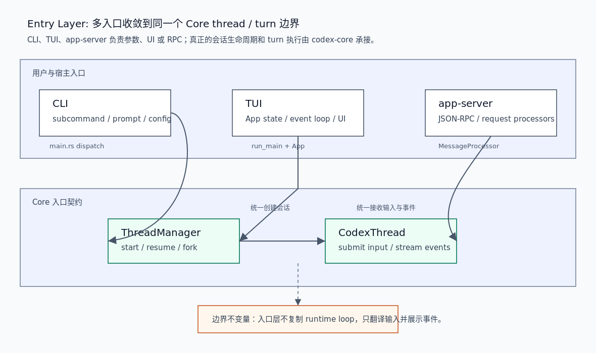

# 00. Entry 层总览

Entry 层负责把用户动作、终端交互、非交互命令和 app-server JSON-RPC 请求翻译成 Codex Core 能理解的 thread / turn 操作。它不是 runtime loop 的拥有者，也不应该复制工具执行、安全审批、上下文压缩或 rollout 恢复逻辑。

## 读完你应掌握什么



开篇全局图：这张图把 Entry 层压缩成三类入口：`cli` 解析命令和模式，`tui` 承载交互状态和事件展示，`app-server` 承接远程或富客户端 JSON-RPC。三条路径最终都要回到 `ThreadManager` / `CodexThread` 边界。对应源码锚点是 `repo/codex/codex-rs/cli/src/main.rs`、`repo/codex/codex-rs/tui/src/app.rs`、`repo/codex/codex-rs/app-server/src/message_processor.rs` 和 `repo/codex/codex-rs/app-server/src/request_processors/turn_processor.rs`。

- 能区分 CLI、TUI、app-server 的职责。
- 能解释为什么入口层只是翻译与展示，不拥有 Core runtime loop。
- 能从 `ClientRequest::ThreadStart` / `TurnStart` 追到 request processor，再追到 `CodexThread`。
- 能判断新增入口功能应该落在 Entry 层、Core 层还是 Support 层。

## 这个模块解决什么问题

Codex harness 有多个用户入口：直接运行 `codex`，运行 `codex exec`，进入 TUI，或由 app-server 客户端发起 `thread/start`、`turn/start` 等 JSON-RPC 请求。入口层解决的问题是把这些差异很大的输入收敛成一致的 Core 操作。

如果入口层直接实现对话状态机，就会和 Core 的 `Session` / `Turn` / `ToolRuntime` 分叉。正确边界是：入口层负责解析、校验、展示、连接远程端点和构造请求；Core 负责线程生命周期、turn 执行、模型调用、工具执行、安全和持久化。

## 源码锚点

- `repo/codex/codex-rs/cli/src/main.rs`：`MultitoolCli`、`Subcommand`、`cli_main`、`run_interactive_tui`。
- `repo/codex/codex-rs/tui/src/app.rs`：`App` 结构体和 TUI app state。
- `repo/codex/codex-rs/app-server/src/message_processor.rs`：`MessageProcessor` 和 `ClientRequest` 分发。
- `repo/codex/codex-rs/app-server/src/request_processors/thread_processor.rs`：thread start / resume / fork 处理。
- `repo/codex/codex-rs/app-server/src/request_processors/turn_processor.rs`：`turn/start` 到 `CodexThread::start_or_steer_turn` 的桥接。
- `repo/codex/codex-rs/app-server-protocol/src/protocol/v2/thread.rs`：`ThreadStartParams` / `ThreadStartResponse` 协议形状。
- `repo/codex/codex-rs/protocol/src/protocol.rs`：core SQ/EQ 里的 `Submission`、`Op`、`EventMsg` 等基础协议。

## 核心抽象

| 抽象 | 所属入口 | 职责 | 不该做什么 |
| --- | --- | --- | --- |
| `MultitoolCli` / `Subcommand` | CLI | 把 `codex`、`codex exec`、`review`、`mcp`、`plugin`、`app-server` 等命令拆到不同 runner | 不保存 turn 状态 |
| `TuiCli` / `run_interactive_tui` | CLI -> TUI | 检查终端、远程端点和启动 TUI | 不直接执行模型 loop |
| `App` | TUI | 持有 UI 状态、事件通道、线程列表、active thread 和 app-server 请求状态 | 不把 Core 内部 `Session` 暴露给 UI |
| `MessageProcessor` | app-server | 反序列化 JSON-RPC，并按 `ClientRequest` 分发到 processor | 不自己处理所有业务分支 |
| `ThreadRequestProcessor` | app-server | start/resume/fork/list/read 等线程级请求 | 不处理每个 turn 的输入细节 |
| `TurnRequestProcessor` | app-server | 校验 `turn/start`，构造 `TurnInputRequest`，提交给 `CodexThread` | 不绕过 `CodexThread` 直接改 session |

无需额外实体图：开篇 PNG 已经展示这些入口和 Core 边界的关系；本节表格只是给图中的节点补充职责和非职责。

## 核心代码片段

### 1. CLI 顶层分发决定进入交互还是非交互路径

Source: `repo/codex/codex-rs/cli/src/main.rs::cli_main`
Line range: `repo/codex/codex-rs/cli/src/main.rs:1118-1241`

```rust
fn main() -> anyhow::Result<()> {
    codex_build_info::initialize!();
    let remote_control_disabled = codex_app_server::take_remote_control_disabled_env();
    arg0_dispatch_or_else(move |arg0_paths: Arg0DispatchPaths| async move {
        cli_main(arg0_paths, remote_control_disabled).await?;
        Ok(())
    })
}

async fn cli_main(
    arg0_paths: Arg0DispatchPaths,
    remote_control_disabled: bool,
) -> anyhow::Result<()> {
    let MultitoolCli {
        config_overrides: mut root_config_overrides,
        feature_toggles,
        remote,
        mut interactive,
        subcommand,
    } = MultitoolCli::parse();
    reject_unsupported_worktree_for_subcommand(interactive.shared.worktree, &subcommand)?;
    // Fold --enable/--disable into config overrides so they flow to all subcommands.
    let toggle_overrides = feature_toggles.to_overrides()?;
    root_config_overrides.raw_overrides.extend(toggle_overrides);
    let agents_options = match &subcommand {
        Some(Subcommand::Agents(options)) => Some(options),
        _ => None,
    };
    // ...
    match subcommand {
        None | Some(Subcommand::Agents(_)) => {
            prepend_config_flags(
                &mut interactive.config_overrides,
                root_config_overrides.clone(),
            );
            // ...
            let exit_info = run_interactive_tui(
                interactive,
                root_remote.clone(),
                root_remote_auth_token_env.clone(),
                arg0_paths.clone(),
            )
            .await?;
            handle_app_exit(exit_info)?;
        }
        Some(Subcommand::Exec(mut exec_cli)) => {
            reject_remote_mode_for_subcommand(
                root_remote.as_deref(),
                root_remote_auth_token_env.as_deref(),
                "exec",
            )?;
            exec_cli
                .shared
                .inherit_exec_root_options(&interactive.shared);
            exec_cli.strict_config |= root_strict_config;
            prepend_config_flags(
                &mut exec_cli.config_overrides,
                root_config_overrides.clone(),
            );
            codex_exec::run_main(exec_cli, arg0_paths.clone()).await?;
        }
```

这段说明 `codex` 入口先做命令解析、feature/config 合并和模式选择。交互路径进入 `run_interactive_tui`，非交互路径进入 `codex_exec::run_main`；两者都是 Entry 层选择，不是 Core runtime loop 本身。

### 2. TUI `App` 持有 UI 和线程事件状态

无需图：本节只证明 `App` 结构体的状态拥有关系，开篇综合图已经覆盖 TUI 到 Core 的层级位置；额外结构图不会比字段片段更清楚。

Source: `repo/codex/codex-rs/tui/src/app.rs::App`
Line range: `repo/codex/codex-rs/tui/src/app.rs:542-650`

```rust
pub(crate) struct App {
    feature_write_lock: Arc<tokio::sync::Mutex<()>>,
    model_catalog: Arc<ModelCatalog>,
    pub(crate) session_telemetry: SessionTelemetry,
    pub(crate) app_event_tx: AppEventSender,
    pub(crate) chat_widget: ChatWidget,
    workspace_command_runner: Option<WorkspaceCommandRunner>,
    /// Legacy bootstrap and server-setting inputs; local preferences live in `local_settings`.
    pub(crate) config: Config,
    pub(crate) local_settings: crate::local_settings::LocalSettings,
    launch_cwd: PathBuf,
    /// Resume anchor selected by `/cd`; ordinary resumes retain the immutable launch cwd.
    runtime_working_directory_override: Option<PathBuf>,
    pub(crate) state_db: Option<StateDbHandle>,
    cli_kv_overrides: Vec<(String, TomlValue)>,
    harness_overrides: ConfigOverrides,
    loader_overrides: LoaderOverrides,
    cloud_config_bundle: CloudConfigBundleLoader,
    runtime_approval_policy_override: Option<RuntimeApprovalPolicyOverride>,
    runtime_permission_profile_override: Option<RuntimePermissionProfileOverride>,

    pub(crate) file_search: FileSearchManager,

    pub(crate) transcript_cells: Vec<Arc<dyn HistoryCell>>,
    last_rendered_history_tail: Option<history_ui::RenderedHistoryTail>,
    last_thread_usage_status_cell: Option<history_ui::ThreadUsageStatusHistory>,
    pub(crate) pending_thread_usage_history_refresh: bool,

    // Pager overlay state (Transcript or Static like Diff)
    pub(crate) overlay: Option<Overlay>,
    pub(crate) deferred_history_lines: Vec<crate::terminal_hyperlinks::HyperlinkLine>,
    has_emitted_history_lines: bool,
    transcript_reflow: TranscriptReflowState,
    initial_history_replay_buffer: Option<InitialHistoryReplayBuffer>,
    pub(crate) scrollback_has_older_history: bool,
    // ...
    thread_event_channels: HashMap<ThreadId, ThreadEventChannel>,
    temporary_structured_requests: HashMap<ThreadId, mpsc::UnboundedSender<ServerNotification>>,
    /// Track title generation across thread switches and deduplicate automatic requests.
    pending_thread_titles: HashSet<(ThreadId, ThreadTitleDestination)>,
    thread_event_listener_tasks: HashMap<ThreadId, JoinHandle<()>>,
    agent_navigation: AgentNavigationState,
    agents_overview: agents_overview::AgentsOverviewState,
    side_threads: HashMap<ThreadId, SideThreadState>,
    abandoned_side_threads: HashSet<ThreadId>,
    active_thread_id: Option<ThreadId>,
    active_thread_rx: Option<mpsc::Receiver<ThreadBufferedEvent>>,
    primary_thread_id: Option<ThreadId>,
}
```

这段实体定义证明 TUI 是入口层的状态协调器：它持有 transcript、overlay、keymap、thread event channel、side thread 和 pending requests。它的状态面向 UI 与线程事件路由，而不是直接持有 Core `Session` 的内部执行状态。

### 3. app-server 把 JSON-RPC thread 请求交给 processor

Source: `repo/codex/codex-rs/app-server/src/message_processor.rs::process_client_request`
Line range: `repo/codex/codex-rs/app-server/src/message_processor.rs:1135-1179`

```rust
ClientRequest::ThreadStart { params, .. } => {
    self.thread_processor
        .thread_start(
            request_id.clone(),
            params,
            app_server_client_name.clone(),
            client_version.clone(),
            client_mcp_extensions.clone(),
            request_context,
        )
        .await
}
ClientRequest::ThreadUnsubscribe { params, .. } => {
    let thread_id = params.thread_id.clone();
    let response = self
        .thread_processor
        .thread_unsubscribe(&request_id, params)
        .await?;
    if let Ok(thread_id) = ThreadId::from_string(&thread_id) {
        session.mcp_event_streams.stop_thread(thread_id).await;
    }
    Ok(response)
}
ClientRequest::ThreadResume { params, .. } => {
    self.thread_processor
        .thread_resume(
            request_id.clone(),
            params,
            app_server_client_name.clone(),
            client_version.clone(),
            client_mcp_extensions.clone(),
        )
        .await
}
ClientRequest::ThreadFork { params, .. } => {
    self.thread_processor
        .thread_fork(
            request_id.clone(),
            params,
            app_server_client_name.clone(),
            client_version.clone(),
            client_mcp_extensions.clone(),
        )
        .await
}
```

这段显示 app-server 入口把不同 JSON-RPC request 映射到专门 processor；`MessageProcessor` 是调度器，不把 thread 生命周期逻辑内联到一个巨大函数里。

### 4. `turn/start` 最终提交到 `CodexThread`

Source: `repo/codex/codex-rs/app-server/src/request_processors/turn_processor.rs::turn_start`
Line range: `repo/codex/codex-rs/app-server/src/request_processors/turn_processor.rs:517-698`

```rust
pub(crate) async fn turn_start(
    &self,
    request_id: String,
    params: TurnStartParams,
    app_server_client_name: Option<String>,
    app_server_client_version: Option<String>,
) -> Result<TurnStartResponse, JSONRPCErrorError> {
    let (thread_id, thread) =
        self.load_thread(&params.thread_id)
            .await
            .inspect_err(|error| {
                self.track_error_response(&request_id, error, /*error_type*/ None);
            })?;
    self.ensure_direct_input_allowed(&request_id, thread.as_ref())
        .await?;
    if let Some(tool_output) = &params.tool_output {
        if !params.input.is_empty() {
            return Err(invalid_request(
                "`toolOutput` cannot be combined with nonempty `input`",
            ));
        }
        if tool_output.name.is_empty() {
            return Err(invalid_request("`toolOutput.name` must not be empty"));
        }
    }
    // ...
    let submission = thread
        .start_or_steer_turn(
            TurnInputRequest::new(input)
                .with_thread_settings(thread_settings)
                .on_start(TurnStartOptions {
                    turn_trigger: params.turn_trigger,
                    final_output_json_schema: params.output_schema,
                    service_tier: params.service_tier_for_turn,
                    cyber_access_program: params.cyber_access_program.map(Into::into),
                    ..Default::default()
                })
                .with_additional_context(additional_context)
                .with_responses_metadata(params.responsesapi_client_metadata)
                .with_trace(self.request_trace_context(&request_id).await),
        )
        .await
        .map_err(|err| {
            let error = internal_error(format!("failed to submit turn input: {err}"));
            self.track_error_response(&request_id, &error, /*error_type*/ None);
            error
        })?;
    let (turn_id, started) = match submission {
        TurnInputSubmission::Started { turn_id } => (turn_id, true),
        TurnInputSubmission::Steered { turn_id } => (turn_id, false),
        TurnInputSubmission::NotSubmitted { reason } => {
            let error = internal_error(format!("failed to submit turn input: {reason:?}"));
            self.track_error_response(&request_id, &error, /*error_type*/ None);
            return Err(error);
        }
    };
    // ...
    Ok(TurnStartResponse { turn })
}
```

这段证明入口层最终还是交给 `CodexThread::start_or_steer_turn`。app-server 可以校验输入大小、工具输出互斥、环境覆盖和 thread settings，但不会绕过 Core 的 submit / event 模型。

## 主流程


无需另加第二张流程图；本节也无需代码片段，因为入口层主流程的关键代码证据已经在上方 `cli_main`、`App`、`MessageProcessor` 和 `turn_start` 片段中覆盖。开篇图已经表达 Entry 层主流程，本节将图里的箭头展开成可复盘步骤。

1. 用户从 `codex` CLI、TUI 或远程 app-server 客户端进入。
2. CLI 路径先由 `MultitoolCli` 和 `Subcommand` 决定是交互 TUI、非交互 exec/review、插件/MCP 管理还是 app-server 子命令。
3. TUI 路径启动 `codex_tui::run_main`，由 `App` 持有 UI 状态、thread event channel、active thread、side thread 和 pending app-server request。
4. app-server 路径先把 JSON-RPC request 反序列化为 `ClientRequest`，再由 `MessageProcessor` 分发给 thread、turn、plugin、MCP、filesystem 等 processor。
5. thread-level request 进入 `ThreadRequestProcessor`；turn-level request 进入 `TurnRequestProcessor`。
6. `turn/start` 经过输入校验、环境和权限 settings override 后，构造 `TurnInputRequest` 并调用 `CodexThread::start_or_steer_turn`。
7. 后续模型调用、工具执行、事件和 rollout 由 Core 与 Support 层继续处理，Entry 层只负责展示、转发、恢复 UI 状态或处理 RPC 响应。

## 失败模式与边界条件


这张图也标出了 Entry 层的主要失败边界：只要某个入口绕过 `ThreadManager` / `CodexThread`，就会绕开 Core 的统一状态、权限和持久化。

| 风险 | 入口表现 | 代码锚点 | 结果 |
| --- | --- | --- | --- |
| 命令模式误路由 | `codex agents` 与 prompt、remote/local 配置冲突 | `repo/codex/codex-rs/cli/src/main.rs::cli_main` | CLI 在入口层直接拒绝，而不是让 Core 承担非法组合 |
| TUI 无终端能力 | `TERM=dumb` 且 stdin/stderr 不是 TTY | `repo/codex/codex-rs/cli/src/main.rs::run_interactive_tui` | 入口层返回 fatal，不启动交互 UI |
| JSON-RPC 字段过期 | request 使用被移除的 `permissionProfile` | `repo/codex/codex-rs/app-server/src/message_processor.rs::reject_removed_permission_profile` | app-server 返回 invalid params，避免旧协议污染 Core |
| `turn/start` 输入非法 | `toolOutput` 与普通 input 同时存在 | `repo/codex/codex-rs/app-server/src/request_processors/turn_processor.rs::turn_start` | 入口 processor 拒绝请求，避免构造不一致的 `TurnInput` |
| 入口复制 Core loop | UI 或 RPC 直接改 session 状态 | 设计边界：`CodexThread::start_or_steer_turn` | 会破坏统一 event、approval、rollout 与 resume 语义 |

无需代码片段：本节的关键 guard 已在上方 `cli_main` 和 `turn_start` 片段中覆盖。

## 图示

本篇使用 `../../image/architecture/harness-entry-layer-v1.png` 作为开篇综合图和主流程图。图片已放在开篇和主流程附近；本节只作为资产说明，不作为主要阅读路径。

## 复设计练习

如果要为另一个 coding agent 设计 Entry 层，请写出以下边界：

1. CLI 如何决定进入交互、非交互、服务端或管理命令？
2. UI 状态对象应该持有哪些信息，哪些必须留给 Core？
3. JSON-RPC / HTTP 请求如何被拆分到 processor？
4. 哪些错误应该在入口层拒绝，哪些应该交给 Core 返回？
5. 入口层如何把请求和 trace id 传给 Core，又不直接操纵 Core 内部状态？

一个合理设计应该能画出 `CLI/TUI/RPC -> request processor -> ThreadManager/CodexThread -> event response` 的路径，并明确入口层不拥有模型调用和工具执行循环。

## 检查题

1. 为什么 `codex` 默认无 subcommand 时进入 TUI，而 `codex exec` 进入非交互 runner？
2. `App` 为什么持有 `thread_event_channels`、`active_thread_id` 和 `side_threads`，但不直接持有 `Session`？
3. `MessageProcessor` 为什么要把 `ThreadStart`、`ThreadResume`、`TurnStart` 分发给不同 processor？
4. `turn/start` 在提交给 `CodexThread` 前做了哪些入口层校验？
5. 新增一个富客户端功能时，如何判断它应写在 app-server request processor 还是 Core？

### 答案要点

1. CLI 是模式分发层；无 subcommand 是交互体验，`exec`/`review` 是非交互执行路径，两者需要不同 runner 和不同输入输出语义。
2. TUI 管的是展示、事件接收、用户交互和 thread 切换；`Session` 的 turn loop、工具执行和上下文属于 Core，暴露给 UI 会让入口层耦合内部实现。
3. thread request 和 turn request 的状态边界不同：thread start/resume/fork 处理生命周期，turn start 处理用户输入和 settings override；拆 processor 可避免一个入口函数拥有所有语义。
4. 它检查 thread 是否可接受输入、`toolOutput` 与普通 input 是否互斥、工具输出名字是否为空、输入大小、cwd/environments/settings override，并附加 trace 和 metadata。
5. 如果功能只影响协议、请求校验、UI 状态或展示，放在 Entry；如果影响 turn 执行、工具、安全、上下文或持久化语义，应进入 Core 或 Support 并通过入口层调用。

## Follow-up Slots

- 已落地：`docs/entry/01-cli-tui-app-server-flow.md` 专门讲 CLI dispatch、TUI `AppServerSession`、app-server `thread/start` / `turn/start` 到 Core 的入口链路。
- 对照 app-server-protocol 的 TypeScript export，补一篇客户端兼容性说明。
