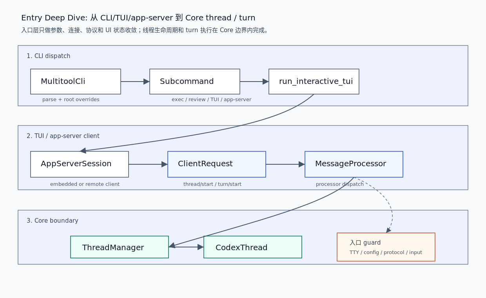

# 01. CLI / TUI / app-server 入口链路

本文补足 Entry 层不应只停在 map 的部分：一次请求如何从 `codex` 命令、TUI 或 app-server RPC 进入，并被翻译为 `ThreadManager` / `CodexThread` 上的线程和 turn 操作。读完后，你应该能解释入口层哪些事情可以自己做，哪些事情必须交给 Core。

## 读完你应掌握什么



开篇全局图：从上往下读。第一层是 CLI dispatch：`MultitoolCli` 解析根参数和 `Subcommand`，决定进入 TUI、`exec`、`review` 或 app-server 管理路径。第二层是 TUI/app-server client：TUI 通过 `AppServerSession` 和 `ClientRequest` 管理 embedded/remote thread。第三层是 Core boundary：`MessageProcessor` 和 request processors 做入口校验后，调用 `ThreadManager` / `CodexThread`。对应源码锚点是 `repo/codex/codex-rs/cli/src/main.rs`、`repo/codex/codex-rs/tui/src/app_server_session.rs`、`repo/codex/codex-rs/app-server/src/message_processor.rs`、`repo/codex/codex-rs/app-server/src/request_processors/thread_processor.rs` 和 `repo/codex/codex-rs/app-server/src/request_processors/turn_processor.rs`。

- 能复盘 `codex` CLI 如何决定进入交互或非交互路径。
- 能解释 TUI 为什么通过 `AppServerSession` 管理 thread，而不是直接持有 Core `Session`。
- 能说明 `thread/start` 和 `turn/start` 在 app-server 入口层分别做哪些校验与转换。
- 能判断入口层错误应该在哪一层返回。

## 这个模块解决什么问题

Entry 层面对的是不同用户形态：终端命令、交互 TUI、远程 app-server 客户端、后台 daemon。它们的输入方式不同，但都需要收敛为同一个 Core 协议，否则 CLI、TUI、app-server 会各自复制一套 thread/turn 状态机。

因此 Entry 层的核心职责是：

1. 解析和合并用户输入、配置覆盖、feature toggles。
2. 选择运行模式：交互 TUI、非交互 exec/review、app-server 或管理命令。
3. 在 host 边界做协议级校验：旧字段、非法组合、输入大小、权限覆盖、cwd/environments。
4. 把有效请求转交给 `ThreadManager` / `CodexThread`。
5. 接收 Core 事件并投影到 TUI 或 app-server response/notification。

## 源码锚点

- `repo/codex/codex-rs/cli/src/main.rs::MultitoolCli`：顶层命令参数和 subcommand。
- `repo/codex/codex-rs/cli/src/main.rs::cli_main`：根 dispatch、TUI/exec/review/app-server 分支。
- `repo/codex/codex-rs/cli/src/main.rs::run_interactive_tui`：终端能力、remote endpoint 和 TUI 启动。
- `repo/codex/codex-rs/tui/src/app_server_session.rs::AppServerSession`：TUI 到 app-server client 的线程会话状态。
- `repo/codex/codex-rs/tui/src/app_server_session.rs::ThreadParamsMode`：embedded / remote thread 参数来源差异。
- `repo/codex/codex-rs/app-server/src/lib.rs::OutboundControlEvent`：app-server processor loop 和 outbound loop 的协调事件。
- `repo/codex/codex-rs/app-server/src/message_processor.rs::process_client_request`：`ClientRequest` 分发。
- `repo/codex/codex-rs/app-server/src/request_processors/thread_processor.rs::thread_start_inner`：`thread/start` 参数校验和后台启动任务。
- `repo/codex/codex-rs/app-server/src/request_processors/turn_processor.rs::turn_start`：`turn/start` 输入校验并调用 `CodexThread::start_or_steer_turn`。

## 核心抽象

| 抽象 | 所在源码 | 入口职责 | 下游边界 |
| --- | --- | --- | --- |
| `MultitoolCli` | `cli/src/main.rs` | 根 CLI 参数和 subcommand 聚合 | 分支到 TUI、exec、review、app-server |
| `run_interactive_tui` | `cli/src/main.rs` | TTY 检查、remote endpoint、TUI 启动 | `codex_tui::run_main` |
| `AppServerSession` | `tui/src/app_server_session.rs` | TUI 的 app-server client facade 和 thread 状态 | `ClientRequest` |
| `MessageProcessor` | `app-server/src/message_processor.rs` | JSON-RPC 反序列化和 request dispatch | request processors |
| `ThreadRequestProcessor` | `app-server/src/request_processors/thread_processor.rs` | start/resume/fork/read/list lifecycle | `ThreadManager` |
| `TurnRequestProcessor` | `app-server/src/request_processors/turn_processor.rs` | turn input/settings/environment 校验 | `CodexThread` |

无需额外图：开篇图已经展示这些抽象的层级与调用关系，表格用于补充每个抽象的职责。

## 核心代码片段

### 1. CLI 根命令把不同入口分流

无需图：本节证明的是 CLI dispatch 分支，开篇图已经展示 dispatch 位置。

Source: `repo/codex/codex-rs/cli/src/main.rs::cli_main`
Line range: `repo/codex/codex-rs/cli/src/main.rs:1118-1241`

```rust
fn main() -> anyhow::Result<()> {
    codex_build_info::initialize!();
    let remote_control_disabled = codex_app_server::take_remote_control_disabled_env();
    arg0_dispatch_or_else(move |arg0_paths: Arg0DispatchPaths| async move {
        cli_main(arg0_paths, remote_control_disabled).await?;
        Ok(())
    })
}

async fn cli_main(
    arg0_paths: Arg0DispatchPaths,
    remote_control_disabled: bool,
) -> anyhow::Result<()> {
    let MultitoolCli {
        config_overrides: mut root_config_overrides,
        feature_toggles,
        remote,
        mut interactive,
        subcommand,
    } = MultitoolCli::parse();
    reject_unsupported_worktree_for_subcommand(interactive.shared.worktree, &subcommand)?;
    let toggle_overrides = feature_toggles.to_overrides()?;
    root_config_overrides.raw_overrides.extend(toggle_overrides);
    // ...
    match subcommand {
        None | Some(Subcommand::Agents(_)) => {
            prepend_config_flags(
                &mut interactive.config_overrides,
                root_config_overrides.clone(),
            );
            let exit_info = run_interactive_tui(
                interactive,
                root_remote.clone(),
                root_remote_auth_token_env.clone(),
                arg0_paths.clone(),
            )
            .await?;
            handle_app_exit(exit_info)?;
        }
        Some(Subcommand::Exec(mut exec_cli)) => {
            reject_remote_mode_for_subcommand(
                root_remote.as_deref(),
                root_remote_auth_token_env.as_deref(),
                "exec",
            )?;
            exec_cli
                .shared
                .inherit_exec_root_options(&interactive.shared);
            codex_exec::run_main(exec_cli, arg0_paths.clone()).await?;
        }
```

这段证明 CLI 入口并不执行 agent loop。它解析根参数、合并 feature/config override，并选择不同 runner。默认交互走 `run_interactive_tui`，非交互走 `codex_exec::run_main`。

### 2. TUI 通过 `AppServerSession` 抽象 embedded / remote thread

无需图：本节证明的是 TUI 持有的 app-server client state，字段片段比额外结构图更直接。

Source: `repo/codex/codex-rs/tui/src/app_server_session.rs::AppServerSession`
Line range: `repo/codex/codex-rs/tui/src/app_server_session.rs:307-349`

```rust
pub(crate) struct AppServerSession {
    client: AppServerClient,
    next_request_id: i64,
    history_pagination: HashMap<ThreadId, history::ThreadHistoryPagination>,
    task_tool_threads: HashSet<ThreadId>,
    task_tool_capabilities_dir: Option<AbsolutePathBuf>,
    task_search_generation: Arc<AtomicU64>,
    remote_cwd_override: Option<PathBuf>,
    thread_params_mode: ThreadParamsMode,
    history_support: ThreadHistorySupport,
    thread_settings_update_supported: bool,
    default_model: Option<String>,
    available_models: Vec<ModelPreset>,
    managed_new_thread_defaults: Option<NewThreadModelDefaults>,
    external_agent_config_import_completion_pending: AtomicBool,
    dynamic_tool_mcp: Option<Arc<DynamicToolMcpServer>>,
}

#[derive(Clone, Copy, Debug, PartialEq, Eq)]
pub(crate) enum ThreadParamsMode {
    Embedded,
    Remote,
}

impl ThreadParamsMode {
    fn model_provider_from_config(self, config: &Config) -> Option<String> {
        match self {
            Self::Embedded => Some(config.model_provider_id.clone()),
            Self::Remote => None,
        }
    }
}
```

这段说明 TUI 把 thread 管理委托给 app-server client facade。`ThreadParamsMode` 是关键边界：embedded 模式可以从本地 config 传 model provider，remote 模式则让远端 app-server 恢复自己的线程设置。

### 3. app-server 把 transport 与 processor/outbound loop 解耦

无需图：开篇图已经展示 app-server 位于 TUI/client 与 Core 之间；这里用代码说明它内部不是单线程直写连接。

Source: `repo/codex/codex-rs/app-server/src/lib.rs::OutboundControlEvent`
Line range: `repo/codex/codex-rs/app-server/src/lib.rs:163-186`

```rust
/// Control-plane messages from the processor/transport side to the outbound router task.
///
/// `run_main_with_transport_options` uses two loops/tasks:
/// - processor loop: handles incoming JSON-RPC and request dispatch
/// - outbound loop: performs potentially slow writes to per-connection writers
///
/// `OutboundControlEvent` keeps those loops coordinated without sharing mutable
/// connection state directly. In particular, the outbound loop needs to know
/// when a connection opens/closes so it can route messages correctly.
enum OutboundControlEvent {
    /// Register a new writer for an opened connection.
    Opened {
        connection_id: ConnectionId,
        writer: mpsc::Sender<QueuedOutgoingMessage>,
        disconnect_sender: Option<CancellationToken>,
        initialized: Arc<AtomicBool>,
        experimental_api_enabled: Arc<AtomicBool>,
        opted_out_notification_methods: Arc<RwLock<HashSet<String>>>,
    },
    /// Remove state for a closed/disconnected connection.
    Closed { connection_id: ConnectionId },
    /// Disconnect all connection-oriented clients during graceful restart.
    DisconnectAll,
}
```

这段说明 app-server 是控制面入口：它把 incoming processor loop 和 outbound writer loop 拆开，保证慢连接写入不阻塞请求分发，也避免共享可变连接状态。

### 4. `thread/start` 在 app-server 层做 host-side 校验后启动 Core thread

无需图：这段代码直接对应开篇图中 `MessageProcessor -> ThreadRequestProcessor -> ThreadManager` 的下半段。

Source: `repo/codex/codex-rs/app-server/src/request_processors/thread_processor.rs::thread_start_inner`
Line range: `repo/codex/codex-rs/app-server/src/request_processors/thread_processor.rs:1130-1258`

```rust
let ThreadStartParams {
    model,
    model_provider,
    allow_provider_model_fallback,
    service_tier,
    cwd,
    runtime_workspace_roots,
    approval_policy,
    approvals_reviewer,
    sandbox,
    permissions,
    config,
    service_name,
    base_instructions,
    developer_instructions,
    dynamic_tools,
    selected_capability_roots,
    // ...
    environments,
} = params;
if matches!(
    history_mode,
    Some(codex_app_server_protocol::ThreadHistoryMode::Paginated)
) && !self.thread_store.supports_paginated_history_lists()
{
    return Err(invalid_request(
        "paginated threads require thread/turns/list and thread/items/list support",
    ));
}
if sandbox.is_some() && permissions.is_some() {
    return Err(invalid_request(
        "`permissions` cannot be combined with `sandbox`",
    ));
}
// ...
let thread_start_task = async move {
    if let Err(error) = Self::thread_start_task(
        listener_task_context,
        thread_store,
        config_manager,
        request_id,
        app_server_client_name,
        app_server_client_version,
        client_mcp_extensions,
        config,
        typesafe_overrides,
        dynamic_tools,
        selected_capability_roots.unwrap_or_default(),
        history_mode.map(Into::into),
        session_start_source,
        thread_source.map(Into::into),
        project_id,
        environments,
        service_name,
        allow_provider_model_fallback,
        experimental_raw_events,
        request_trace,
        initial_config_warnings,
    )
    .await
    {
        outgoing.send_error(error_request_id, error).await;
    }
};
self.background_tasks
    .spawn(thread_start_task.instrument(request_context.span()));
```

这段说明 app-server 在 `thread/start` 阶段先处理 host-side 语义：paginated history 能力、`sandbox` / `permissions` 互斥、project id、workspace roots、environment selections、dynamic tools、capability roots。真正创建 thread 的长任务被放入 background task，避免 RPC handler 阻塞连接。

### 5. `turn/start` 将用户输入提交给 `CodexThread`

无需图：这段是 Entry 层到 Core turn 边界的最终转交点。

Source: `repo/codex/codex-rs/app-server/src/request_processors/turn_processor.rs::turn_start`
Line range: `repo/codex/codex-rs/app-server/src/request_processors/turn_processor.rs:517-698`

```rust
let (thread_id, thread) =
    self.load_thread(&params.thread_id)
        .await
        .inspect_err(|error| {
            self.track_error_response(&request_id, error, /*error_type*/ None);
        })?;
self.ensure_direct_input_allowed(&request_id, thread.as_ref())
    .await?;
if let Some(tool_output) = &params.tool_output {
    if !params.input.is_empty() {
        return Err(invalid_request(
            "`toolOutput` cannot be combined with nonempty `input`",
        ));
    }
    if tool_output.name.is_empty() {
        return Err(invalid_request("`toolOutput.name` must not be empty"));
    }
}
// ...
let submission = thread
    .start_or_steer_turn(
        TurnInputRequest::new(input)
            .with_thread_settings(thread_settings)
            .on_start(TurnStartOptions {
                turn_trigger: params.turn_trigger,
                final_output_json_schema: params.output_schema,
                service_tier: params.service_tier_for_turn,
                cyber_access_program: params.cyber_access_program.map(Into::into),
                ..Default::default()
            })
            .with_additional_context(additional_context)
            .with_responses_metadata(params.responsesapi_client_metadata)
            .with_trace(self.request_trace_context(&request_id).await),
    )
    .await
    .map_err(|err| {
        let error = internal_error(format!("failed to submit turn input: {err}"));
        self.track_error_response(&request_id, &error, /*error_type*/ None);
        error
    })?;
```

这段证明 `turn/start` 入口层只负责校验和构造 `TurnInputRequest`，最终仍调用 `CodexThread::start_or_steer_turn`。模型采样、工具执行和事件输出不会在 app-server processor 里展开。

## 主流程


无需代码片段：本节复盘的每个关键边界已经在上方 `cli_main`、`AppServerSession`、`OutboundControlEvent`、`thread_start_inner` 和 `turn_start` 片段中覆盖。

1. 用户运行 `codex`。`MultitoolCli::parse` 读取根参数、feature toggles、remote options、interactive TUI 参数和 subcommand。
2. `cli_main` 将根配置覆盖传播到具体 runner。无 subcommand 进入 TUI；`exec` / `review` 进入非交互 runner；app-server、plugin、MCP 等进入各自管理命令。
3. TUI 启动后不直接持有 Core `Session`，而是通过 `AppServerSession` 管理 embedded/remote app-server client、thread params、history pagination 和动态工具状态。
4. app-server transport 将 JSON-RPC request 交给 `MessageProcessor`。写回连接的慢路径由 outbound loop 处理。
5. `thread/start` 进入 `ThreadRequestProcessor`，先校验 host-side 配置和持久化能力，再启动后台任务创建 Core thread。
6. `turn/start` 进入 `TurnRequestProcessor`，先校验 direct input、tool output、输入大小、cwd/environment/settings override，再调用 `CodexThread::start_or_steer_turn`。
7. Core 后续发出的事件由 app-server/TUI 投影回用户，入口层不复制 turn loop。

## 失败模式与边界条件

无需图：本节使用 failure matrix 表达“失败点 -> 捕获位置 -> 可见结果 -> 恢复语义”，比新增一张重复流程图更清楚；开篇链路图已覆盖这些失败点所在的层级位置。

| 失败点 | 捕获位置 | 用户/客户端可见结果 | 恢复语义 |
| --- | --- | --- | --- |
| `TERM=dumb` 且没有 TTY | `cli/src/main.rs::run_interactive_tui` | 返回 fatal app exit | 用户换终端或改用非交互命令 |
| remote 与本地 override 冲突 | `cli/src/main.rs::cli_main` | CLI 直接 bail | 调整 remote/local 参数，不进入 Core |
| `permissionProfile` 旧字段 | `app-server/src/message_processor.rs::reject_removed_permission_profile` | JSON-RPC invalid params | 客户端改用 `permissions` |
| `sandbox` 和 `permissions` 同时传入 | `thread_processor.rs::thread_start_inner` | JSON-RPC invalid request | 客户端选择一种权限表达 |
| `toolOutput` 和普通 input 同时存在 | `turn_processor.rs::turn_start` | JSON-RPC invalid request | 客户端拆成合法 turn input |
| direct input 被线程状态禁止 | `turn_processor.rs::ensure_direct_input_allowed` | request error | 等待当前状态可接受输入或走 steer/recover 路径 |

无需代码片段：表中 guard 分布在上方代码证据和 `00-entry-map.md` 已列源码锚点中，本节只做 failure matrix。

## 行为证据矩阵

| Behavior rule | Source anchor | Test anchor | Reader conclusion |
| --- | --- | --- | --- |
| CLI 入口先分发模式，再进入 TUI 或非交互 runner | `repo/codex/codex-rs/cli/src/main.rs::cli_main` | `source-only` | Entry 层负责模式选择，不拥有 Core turn loop。 |
| TUI 用 `AppServerSession` 屏蔽 embedded / remote 差异 | `repo/codex/codex-rs/tui/src/app_server_session.rs::AppServerSession` | `repo/codex/codex-rs/tui/src/app_server_session/thread_list_tests.rs` | UI 面向 app-server client facade，而不是直接操作 Core `Session`。 |
| app-server 将 processor loop 与 outbound loop 解耦 | `repo/codex/codex-rs/app-server/src/lib.rs::OutboundControlEvent` | `repo/codex/codex-rs/app-server/src/transport_tests.rs` | 慢连接写回不会直接阻塞 JSON-RPC request dispatch。 |
| `thread/start` 在入口层拒绝非法权限组合 | `repo/codex/codex-rs/app-server/src/request_processors/thread_processor.rs::thread_start_inner` | `repo/codex/codex-rs/app-server/src/request_processors/thread_processor_tests.rs` | `sandbox` / `permissions` 等入口配置错误在进入 Core 前被拒绝。 |
| `turn/start` 最终通过 `CodexThread::start_or_steer_turn` 提交 | `repo/codex/codex-rs/app-server/src/request_processors/turn_processor.rs::turn_start` | `source-only` | app-server processor 只做校验和请求转换，不复制模型采样循环。 |

## 图示

本篇的关键图示是 `../../image/architecture/entry-cli-tui-app-server-flow-v1.png`，已在开篇和主流程附近引用。它补充 `00-entry-map.md` 的总览图，把 CLI/TUI/app-server 到 Core 的实际调用链展开。

## 复设计练习

设计一个新的 rich client 入口，要求同时支持本地 embedded server 和远程 server。请回答：

1. 哪些参数应该在 CLI/client 层解析？
2. 哪些 settings 应该随 `thread/start` 固化，哪些应随 `turn/start` 覆盖？
3. 如何避免客户端直接依赖 Core `Session` 内部字段？
4. 当远端 server 不支持 paginated history 或新权限字段时，兼容策略是什么？
5. 哪些错误应在入口层直接返回，哪些应交给 Core 事件流表达？

## 检查题

1. 为什么 `AppServerSession` 要区分 `ThreadParamsMode::Embedded` 和 `Remote`？
2. `thread/start` 为什么要先校验 paginated history 支持？
3. `turn/start` 为什么允许 tool output，但不允许和普通 input 混用？
4. app-server 为什么拆 processor loop 和 outbound loop？
5. 入口层为什么不能直接调用 `Session::run_turn`？

### 答案要点

1. embedded server 可以安全使用当前本地 config 的 model provider；remote server 应恢复远端保存的线程设置，避免本地配置覆盖远程线程。
2. paginated history 是持久化能力约束；如果 store 不支持 list turns/items，启动 paginated thread 会导致后续读取和恢复不完整。
3. tool output 是对已有 tool call 的响应，普通 input 是用户新输入；混用会让 turn input 语义不清，可能把工具结果当用户消息处理。
4. request dispatch 和连接写回有不同耗时和失败模式；拆开后慢连接不会阻塞 processor，也避免共享可变连接状态。
5. `Session::run_turn` 属于 Core 内部执行主轴；入口层绕过 `CodexThread` 会破坏统一 submit/event/trace/rollout/approval 语义。

## Follow-up Slots

- 深挖 `codex exec` 的 headless runner 与 TUI/app-server 的区别。
- 深挖 app-server protocol export 与 TypeScript schema 兼容性。
- 补一篇 remote-control daemon 的连接、auth token 和 graceful restart 路径。
