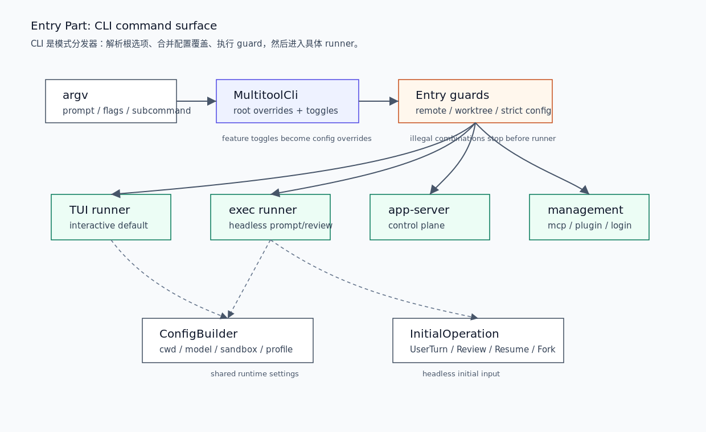

# 02. CLI Command Surface

本文拆开 Entry 层的第一部分：`codex` 命令行入口如何解析根参数、分发 subcommand、应用 guard，并把交互与非交互路径送到不同 runner。它只讲 CLI command surface，不展开 Core 的 `Session` / `run_turn`。

## 读完你应掌握什么



开篇全局图：从左到右、从上到下读。`argv` 先进入 `MultitoolCli`，根级 feature/config override 被合并，然后 `Subcommand` 和 guard 决定进入 TUI、`exec`、app-server 或管理命令。对应源码锚点是 `repo/codex/codex-rs/cli/src/main.rs::Subcommand`、`cli_main`、`reject_remote_mode_for_subcommand`、`reject_unsupported_worktree_for_subcommand` 和 `repo/codex/codex-rs/exec/src/lib.rs::run_main`。

- 能说清 `codex` 根命令和 subcommand 的关系。
- 能解释哪些 guard 在进入 runner 之前就会拒绝。
- 能区分交互 TUI 与非交互 `exec` 的入口责任。
- 能说明 `exec` 如何构造 `InitialOperation`，但不展开 Core turn loop。

## 这个模块解决什么问题

CLI 是 Codex 最外层入口。它需要把用户输入、根参数、subcommand 参数、feature toggles、config overrides 和运行环境转换成一个具体 runner。没有这层，TUI、exec、review、plugin/MCP 管理命令会混在一起，错误也会更晚才被发现。

CLI command surface 的边界是：

1. 解析命令形状。
2. 合并根级和 subcommand 级配置。
3. 拒绝不支持的组合。
4. 选择 runner。
5. 对非交互 runner 构造初始输入。

## 源码锚点

- `repo/codex/codex-rs/cli/src/main.rs::Subcommand`：所有 CLI 子命令的枚举。
- `repo/codex/codex-rs/cli/src/main.rs::cli_main`：顶层分发函数。
- `repo/codex/codex-rs/cli/src/main.rs::prepend_config_flags`：根级配置覆盖如何进入 subcommand。
- `repo/codex/codex-rs/cli/src/main.rs::reject_remote_mode_for_subcommand`：远程模式 guard。
- `repo/codex/codex-rs/cli/src/main.rs::reject_unsupported_worktree_for_subcommand`：worktree guard。
- `repo/codex/codex-rs/exec/src/lib.rs::run_main`：非交互 runner 的配置入口。
- `repo/codex/codex-rs/exec/src/lib.rs::run_exec_session`：headless 初始操作构造。

## 核心抽象

| 抽象 | 职责 | 设计边界 |
| --- | --- | --- |
| `MultitoolCli` | 根级 CLI shape，包含 config override、feature toggle、remote、interactive、subcommand | 解析输入，不执行业务 |
| `Subcommand` | 将 `exec`、`review`、`mcp`、`plugin`、`app-server`、`resume` 等模式列为互斥分支 | 只做模式选择 |
| `prepend_config_flags` | 把根级 `-c` 覆盖放到 subcommand 覆盖之前 | 保持 subcommand 后置参数优先 |
| `reject_remote_mode_for_subcommand` | 防止 remote 参数进入不支持的 subcommand | 在 runner 前失败 |
| `reject_unsupported_worktree_for_subcommand` | 防止 `--worktree` 与不支持的命令组合 | 避免创建错误运行态 |
| `run_exec_session` | 将非交互参数变成 `InitialOperation` | 不拥有模型执行循环 |

无需额外图：开篇 PNG 已经展示 CLI 决策树，表格补充每个抽象的边界。

## 核心代码片段

### 1. `Subcommand` 定义 CLI 的命令面

无需图：本节证明命令面枚举，开篇图已经展示 subcommand 分流位置。

Source: `repo/codex/codex-rs/cli/src/main.rs::Subcommand`
Line range: `repo/codex/codex-rs/cli/src/main.rs:146-230`

```rust
#[derive(Debug, clap::Subcommand)]
enum Subcommand {
    /// Browse all agent sessions on the shared local app-server daemon.
    Agents(AgentsCommand),

    /// Run Codex non-interactively.
    #[clap(visible_alias = "e")]
    Exec(ExecCli),

    /// Run a code review non-interactively.
    Review(ReviewCommand),

    /// Manage login.
    Login(LoginCommand),

    /// Manage external MCP servers for Codex.
    Mcp(McpCli),

    /// Manage Codex plugins.
    Plugin(PluginCli),

    /// [experimental] Run the app server or related tooling.
    AppServer(AppServerCommand),

    /// [experimental] Manage the app-server daemon with remote control enabled.
    RemoteControl(RemoteControlCommand),

    /// Resume a previous interactive session (picker by default; use --last to continue the most recent).
    Resume(ResumeCommand),

    /// Fork a previous interactive session (picker by default; use --last to fork the most recent).
    Fork(ForkCommand),
}
```

这段说明 CLI 的入口面是显式枚举，不是运行时猜测。每个 subcommand 都能有独立 runner、独立 guard 和独立配置继承策略。

### 2. `cli_main` 汇总根选项并选择 runner

无需图：本节证明 dispatch 主路径，开篇图已经展示 `MultitoolCli -> guards -> runner`。

Source: `repo/codex/codex-rs/cli/src/main.rs::cli_main`
Line range: `repo/codex/codex-rs/cli/src/main.rs:1127-1241`

```rust
async fn cli_main(
    arg0_paths: Arg0DispatchPaths,
    remote_control_disabled: bool,
) -> anyhow::Result<()> {
    let MultitoolCli {
        config_overrides: mut root_config_overrides,
        feature_toggles,
        remote,
        mut interactive,
        subcommand,
    } = MultitoolCli::parse();
    reject_unsupported_worktree_for_subcommand(interactive.shared.worktree, &subcommand)?;
    // Fold --enable/--disable into config overrides so they flow to all subcommands.
    let toggle_overrides = feature_toggles.to_overrides()?;
    root_config_overrides.raw_overrides.extend(toggle_overrides);
    // ...
    match subcommand {
        None | Some(Subcommand::Agents(_)) => {
            prepend_config_flags(
                &mut interactive.config_overrides,
                root_config_overrides.clone(),
            );
            let exit_info = run_interactive_tui(
                interactive,
                root_remote.clone(),
                root_remote_auth_token_env.clone(),
                arg0_paths.clone(),
            )
            .await?;
            handle_app_exit(exit_info)?;
        }
        Some(Subcommand::Exec(mut exec_cli)) => {
            reject_remote_mode_for_subcommand(
                root_remote.as_deref(),
                root_remote_auth_token_env.as_deref(),
                "exec",
            )?;
            exec_cli
                .shared
                .inherit_exec_root_options(&interactive.shared);
            exec_cli.strict_config |= root_strict_config;
            prepend_config_flags(
                &mut exec_cli.config_overrides,
                root_config_overrides.clone(),
            );
            codex_exec::run_main(exec_cli, arg0_paths.clone()).await?;
        }
    }
}
```

这段显示 root feature toggles 会被折叠进 config overrides，交互路径进入 TUI，`exec` 路径继承 shared 选项后进入 `codex_exec::run_main`。

### 3. CLI guard 在 runner 前拒绝不支持组合

无需图：本节证明 guard 逻辑，开篇图已展示 guard 位于 runner 前。

Source: `repo/codex/codex-rs/cli/src/main.rs::reject_remote_mode_for_subcommand`
Line range: `repo/codex/codex-rs/cli/src/main.rs:2450-2509`

```rust
fn reject_remote_mode_for_subcommand(
    remote: Option<&str>,
    remote_auth_token_env: Option<&str>,
    subcommand: &str,
) -> anyhow::Result<()> {
    if let Some(remote) = remote {
        anyhow::bail!(
            "`--remote {remote}` is only supported for interactive TUI commands, not `codex {subcommand}`"
        );
    }
    if remote_auth_token_env.is_some() {
        anyhow::bail!(
            "`--remote-auth-token-env` is only supported for interactive TUI commands, not `codex {subcommand}`"
        );
    }
    Ok(())
}

fn reject_unsupported_worktree_for_subcommand(
    root_worktree: bool,
    subcommand: &Option<Subcommand>,
) -> anyhow::Result<()> {
    let subcommand_worktree = match subcommand {
        Some(Subcommand::Exec(command)) => command.shared.worktree,
        Some(Subcommand::Resume(command)) => command.config_overrides.0.shared.worktree,
        Some(Subcommand::Fork(command)) => command.config_overrides.0.shared.worktree,
        // ...
        _ => false,
    };
    // ...
    match subcommand {
        None => Ok(()),
        Some(Subcommand::Fork(command)) if command.session_id.is_some() && !command.last => Ok(()),
        Some(Subcommand::Exec(command)) => match &command.command {
            None | Some(ExecCommand::Fork(_)) => Ok(()),
            Some(ExecCommand::Resume(_)) => anyhow::bail!(
                "`--worktree` cannot resume an existing session; use `codex exec fork --worktree`"
            ),
            Some(ExecCommand::Review(_)) => {
                anyhow::bail!("`--worktree` is not supported for code review")
            }
        },
        _ => anyhow::bail!(
            "`--worktree` supports new interactive sessions, `codex fork`, `codex exec`, and `codex exec fork`"
        ),
    }
}
```

这段说明不支持的 remote/worktree 组合在 CLI 层直接失败，不会把非法运行状态传入 TUI 或 Core。

### 4. `exec` runner 构造 headless 初始操作

无需图：本节证明非交互入口只构造初始操作和事件处理器，不展开 Core loop。

Source: `repo/codex/codex-rs/exec/src/lib.rs::run_exec_session`
Line range: `repo/codex/codex-rs/exec/src/lib.rs:819-923`

```rust
async fn run_exec_session(args: ExecRunArgs) -> anyhow::Result<()> {
    let ExecRunArgs {
        in_process_start_args,
        state_db,
        command,
        config,
        resume_approvals_reviewer_override,
        dangerously_bypass_approvals_and_sandbox,
        exec_span,
        images,
        json_mode,
        last_message_file,
        model_provider,
        managed_worktree,
        oss,
        output_schema_path,
        prompt,
        skip_git_repo_check,
        stderr_with_ansi,
        thread_source,
    } = args;

    let mut event_processor: Box<dyn EventProcessor> = match json_mode {
        true => Box::new(EventProcessorWithJsonOutput::new(last_message_file.clone())),
        _ => Box::new(EventProcessorWithHumanOutput::create_with_ansi(
            stderr_with_ansi,
            &config,
            last_message_file.clone(),
        )),
    };
    // ...
    let (initial_operation, prompt_summary) = match (command.as_ref(), prompt, images) {
        (Some(ExecCommand::Review(review_cli)), _, _) => {
            let review_request = build_review_request(review_cli)?;
            let summary = codex_core::review_prompts::user_facing_hint(&review_request.target);
            (InitialOperation::Review { review_request }, summary)
        }
        (Some(ExecCommand::Resume(args)), root_prompt, imgs) => {
            let prompt_arg = args.prompt.clone().or_else(|| {
                if args.last { args.session_id.clone() } else { None }
            }).or(root_prompt);
            let prompt_text = resolve_prompt(prompt_arg);
            let mut items: Vec<UserInput> = imgs
                .into_iter()
                .chain(args.images.iter().cloned())
                .map(|path| UserInput::LocalImage { path, detail: None })
                .collect();
            items.push(UserInput::Text {
                text: prompt_text.clone(),
                text_elements: Vec::new(),
            });
            let output_schema = load_output_schema(output_schema_path.clone());
            (InitialOperation::UserTurn { items, output_schema }, prompt_text)
        }
    };
}
```

这段说明 `codex exec` 入口需要选择输出 processor、处理 JSON/human output、处理 review/resume/fork/prompt/images，并构造 `InitialOperation` 交给后续执行路径。

## 主流程


无需代码片段：主流程关键分支已由 `Subcommand`、`cli_main`、guard 和 `run_exec_session` 片段覆盖。

1. 用户输入进入 `MultitoolCli::parse`。
2. feature toggles 被转换成 config overrides。
3. 根级选项和 subcommand 选项合并，subcommand 后置配置保留更高优先级。
4. guard 拒绝 remote/worktree/strict-config 的非法组合。
5. 无 subcommand 或 `agents` 进入交互 TUI；`exec` / `review` 进入非交互 runner；`mcp`、`plugin`、`login`、`doctor` 等进入管理命令。
6. `exec` runner 将 prompt/images/review/resume/fork 转成 `InitialOperation`。

## 失败模式与边界条件

无需图：本节用 failure matrix 表达 CLI guard 和 runner 选择失败，开篇决策树已覆盖层级位置。

| 失败点 | 捕获位置 | 用户可见结果 | 恢复语义 |
| --- | --- | --- | --- |
| `--remote` 用在非交互 subcommand | `reject_remote_mode_for_subcommand` | CLI bail | 改用交互 TUI 或移除 remote 参数 |
| `--worktree` 与 resume/review 不兼容 | `reject_unsupported_worktree_for_subcommand` | CLI bail | 改用支持的 `fork` / `exec fork` 组合 |
| config override 解析失败 | `run_exec_session` / config parse | stderr 错误并退出 | 修 `-c key=value` |
| `TERM=dumb` 无 TTY | `run_interactive_tui` | fatal app exit | 换终端或改用 headless `exec` |
| OSS provider 不可用 | `run_exec_session` | `OSS setup failed` | 修 provider 配置 |

无需代码片段：表中 guard 已在上方代码证据覆盖。

## 行为证据矩阵

| Behavior rule | Source anchor | Test anchor | Reader conclusion |
| --- | --- | --- | --- |
| CLI command surface 是显式 subcommand 枚举 | `repo/codex/codex-rs/cli/src/main.rs::Subcommand` | `repo/codex/codex-rs/cli/src/exec_server_args_tests.rs` | 新命令必须进入命令面枚举和对应 runner。 |
| 根级 feature toggles 会折叠进 config overrides | `repo/codex/codex-rs/cli/src/main.rs::cli_main` | `source-only` | feature/config override 在进入 runner 前已经统一。 |
| remote 参数只支持交互 TUI 命令 | `repo/codex/codex-rs/cli/src/main.rs::reject_remote_mode_for_subcommand` | `source-only` | 非交互 runner 不继承 remote app-server endpoint。 |
| worktree 只支持有限命令组合 | `repo/codex/codex-rs/cli/src/main.rs::reject_unsupported_worktree_for_subcommand` | `repo/codex/codex-rs/cli/src/snapshots/codex__tests__unsupported_worktree_commands.snap` | CLI 在创建运行态前阻止不安全组合。 |
| `exec` 将 prompt/review/resume/fork 变成初始操作 | `repo/codex/codex-rs/exec/src/lib.rs::run_exec_session` | `source-only` | headless mode 的入口责任是构造操作和选择输出 processor。 |

## 图示

本篇关键图示是 `../../image/architecture/entry-cli-command-surface-v1.png`，已在开篇和主流程附近引用。

## 复设计练习

设计一个 CLI command surface，要求支持交互、headless、review、plugin 管理和远程连接。请回答：

1. 根级 flags 与 subcommand flags 如何合并？
2. 哪些参数组合必须在 runner 前拒绝？
3. 非交互 runner 如何选择 JSON 输出或人类可读输出？
4. review/resume/fork 如何变成统一 initial operation？
5. 哪些错误必须在 CLI 层直接退出？

## 检查题

1. `Subcommand` 为什么是 CLI command surface 的第一张地图？
2. `prepend_config_flags` 为什么把根级 override 前置？
3. 为什么 remote 只支持交互 TUI 命令？
4. `--worktree` 为什么不能配 `codex exec resume`？
5. `exec` runner 为什么要先选择 `EventProcessor`？

### 答案要点

1. 因为它列出了 CLI 可进入的所有互斥模式，是后续 runner 分发的边界。
2. 前置后 subcommand 自己的覆盖可以保留更高优先级，符合命令行局部参数覆盖全局参数的直觉。
3. remote endpoint 对应交互 TUI 的 app-server 会话，headless runner 没有同样的远程控制语义。
4. resume 是恢复既有 session，worktree 创建适用于新 session 或 fork；二者组合会让运行目录语义冲突。
5. JSON/human output 决定后续事件如何被消费和展示，必须在启动 headless session 前确定。

## Follow-up Slots

- 单独分析 `codex exec fork --worktree` 的目录创建和权限继承。
- 对比 `codex review` 与 `codex exec review` 的参数复用方式。
- 补充 `doctor` 命令如何做本机环境诊断。
