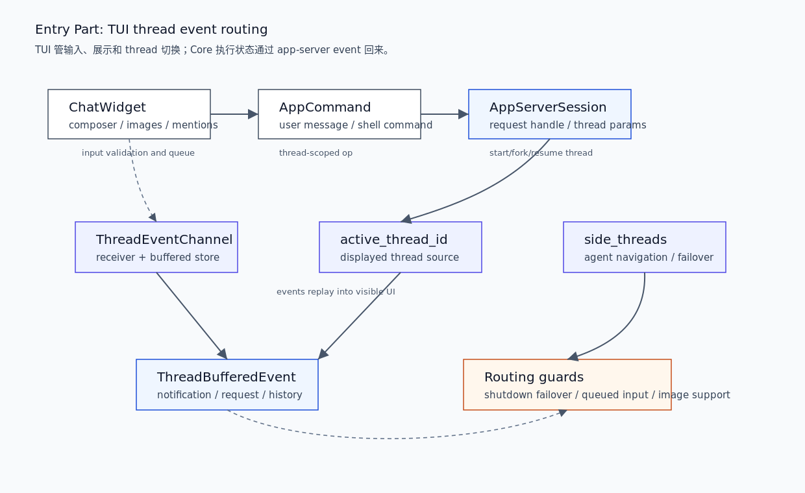

# 03. TUI Thread Event Routing

本文拆开 Entry 层的第二部分：TUI 如何把用户输入变成 thread-scoped operation，如何通过 `AppServerSession` 启动或恢复线程，如何缓冲 thread events，以及 active/side thread 切换如何避免 UI 状态和 Core 状态混淆。

## 读完你应掌握什么



开篇全局图：从上往下读。`ChatWidget` 把输入框里的文本、图片、skill/plugin/app mention 转成 `UserInput` 或 `AppCommand`；`AppServerSession` 负责向 app-server 发 thread 请求；`ThreadEventChannel`、`active_thread_id` 和 `side_threads` 决定事件如何回到当前可见 UI。源码锚点是 `repo/codex/codex-rs/tui/src/chatwidget/input_submission.rs`、`repo/codex/codex-rs/tui/src/app_server_session.rs`、`repo/codex/codex-rs/tui/src/app/thread_routing.rs` 和 `repo/codex/codex-rs/tui/src/app_event.rs`。

- 能解释 TUI 为什么不直接持有 Core `Session`。
- 能复盘用户输入如何变成 `UserInput`、`UserInput::Skill`、`UserInput::Mention` 或 shell command。
- 能说明 `AppServerSession` 如何启动 thread 并处理 history fallback。
- 能区分 active thread、primary thread、side thread 和 buffered event。

## 这个模块解决什么问题

TUI 的工作不是运行模型，而是管理可见交互状态。用户在输入框里输入文本、图片、`$skill`、plugin/app mention 或 `!cmd`，这些都必须转换成 app-server/Core 能理解的结构化输入。与此同时，多个 thread 可能并存：主 thread、side thread、sub-agent thread、已关闭 thread、等待 replay 的 thread。TUI 必须让用户看到正确的 thread，同时不丢失后台事件。

## 源码锚点

- `repo/codex/codex-rs/tui/src/app.rs::App`：TUI 顶层状态，持有 thread event channels、active thread、side threads、pending requests。
- `repo/codex/codex-rs/tui/src/app_event.rs::AppEvent`：TUI 内部事件类型。
- `repo/codex/codex-rs/tui/src/app_server_session.rs::AppServerSession`：TUI 到 app-server 的 client facade。
- `repo/codex/codex-rs/tui/src/app_server_session.rs::start_thread_with_session_start_source`：thread 启动请求。
- `repo/codex/codex-rs/tui/src/app_server_session.rs::start_thread_with_request_handle`：外部 request handle 启动 thread。
- `repo/codex/codex-rs/tui/src/chatwidget/input_submission.rs::submit_user_message_with_history_and_shell_escape_policy`：输入提交与 mention 转换。
- `repo/codex/codex-rs/tui/src/app/thread_routing.rs::handle_active_thread_event`：active thread 事件处理和 failover。

## 核心抽象

| 抽象 | 职责 | UI 边界 |
| --- | --- | --- |
| `ChatWidget` | 输入框、历史展示、图片/mention 收集、shell escape | 不运行 Core turn |
| `AppCommand` | TUI 内部要提交的 thread-scoped operation | 不等于 protocol `Op`，需要通过 app-server 转换 |
| `AppServerSession` | app-server client facade，处理 embedded/remote 和 thread params | 不保存 Core `Session` |
| `ThreadEventChannel` | 每个 thread 的 buffered event channel | 让非 active thread 事件不丢失 |
| `active_thread_id` | 当前可见 thread 的 source of truth | UI 跟随用户正在看的 thread |
| `side_threads` | side/sub-agent thread 状态 | 支持切换、关闭和 failover |

无需额外图：开篇 PNG 已经表达 UI 输入、app-server 请求和 thread event routing 的关系。

## 核心代码片段

### 1. `App` 持有 thread routing 状态

无需图：本节证明 TUI 状态拥有关系，开篇图已覆盖这些字段的流向。

Source: `repo/codex/codex-rs/tui/src/app.rs::App`
Line range: `repo/codex/codex-rs/tui/src/app.rs:542-637`

```rust
pub(crate) struct App {
    feature_write_lock: Arc<tokio::sync::Mutex<()>>,
    model_catalog: Arc<ModelCatalog>,
    pub(crate) session_telemetry: SessionTelemetry,
    pub(crate) app_event_tx: AppEventSender,
    pub(crate) chat_widget: ChatWidget,
    workspace_command_runner: Option<WorkspaceCommandRunner>,
    pub(crate) config: Config,
    pub(crate) local_settings: crate::local_settings::LocalSettings,
    launch_cwd: PathBuf,
    runtime_working_directory_override: Option<PathBuf>,
    pub(crate) state_db: Option<StateDbHandle>,
    // ...
thread_event_channels: HashMap<ThreadId, ThreadEventChannel>,
temporary_structured_requests: HashMap<ThreadId, mpsc::UnboundedSender<ServerNotification>>,
/// Track title generation across thread switches and deduplicate automatic requests.
pending_thread_titles: HashSet<(ThreadId, ThreadTitleDestination)>,
thread_event_listener_tasks: HashMap<ThreadId, JoinHandle<()>>,
agent_navigation: AgentNavigationState,
agents_overview: agents_overview::AgentsOverviewState,
side_threads: HashMap<ThreadId, SideThreadState>,
abandoned_side_threads: HashSet<ThreadId>,
active_thread_id: Option<ThreadId>,
active_thread_rx: Option<mpsc::Receiver<ThreadBufferedEvent>>,
primary_thread_id: Option<ThreadId>,
last_subagent_backfill_attempt: Option<ThreadId>,
primary_session_configured: Option<ThreadSessionState>,
pending_primary_events: VecDeque<ThreadBufferedEvent>,
pending_app_server_requests: PendingAppServerRequests,
dynamic_tool_status_updates:
    tokio::sync::broadcast::Sender<codex_app_server_protocol::ThreadStatusChangedNotification>,
dynamic_tool_tasks: HashMap<codex_app_server_protocol::RequestId, (String, JoinHandle<()>)>,
}
```

这段说明 TUI 的状态核心是 thread event routing：它知道哪些 thread 存在、哪个 thread 正在显示、哪些事件待回放、哪些 app-server request 还没完成。

### 2. `AppServerSession` 启动 thread 并处理 history fallback

无需图：本节证明 TUI 通过 app-server client 启动 thread，而不是直接构造 Core session。

Source: `repo/codex/codex-rs/tui/src/app_server_session.rs::start_thread_with_session_start_source`
Line range: `repo/codex/codex-rs/tui/src/app_server_session.rs:780-830`

```rust
pub(crate) async fn start_thread(&mut self, config: &Config) -> Result<AppServerStartedThread> {
    self.start_thread_with_session_start_source(
        &LocalSettings::from(config),
        config,
        /*session_start_source*/ None,
        /*remote_cwd_override*/ None,
    )
    .await
}

pub(crate) async fn start_thread_with_session_start_source(
    &mut self,
    local_settings: &LocalSettings,
    config: &Config,
    session_start_source: Option<ThreadStartSource>,
    remote_cwd_override: Option<&std::path::Path>,
) -> Result<AppServerStartedThread> {
    let request_id = self.next_request_id();
    let session_config = self.session_config_with_effective_service_tier(config);
    let mut params = thread_start_params_from_config(
        &session_config,
        self.thread_params_mode(),
        remote_cwd_override.or(self.remote_cwd_override.as_deref()),
        session_start_source,
    );
    if self.history_support == ThreadHistorySupport::LegacyOnly {
        params.history_mode = None;
    }
    self.thread_tool_transport().configure(&mut params);
    let request_handle = self.request_handle();
    let (response, history_support, task_tools_available) =
        request_thread_start_with_history_fallback(&request_handle, request_id, params)
            .await
            .map_err(|err| {
                bootstrap_request_error("thread/start failed during TUI bootstrap", err)
            })?;
```

这段说明 TUI thread start 会构造 `ThreadStartParams`、根据 server 能力处理 history fallback、配置 thread tool transport，再通过 app-server request handle 请求启动。

### 3. ChatWidget 输入提交流程

无需图：本节证明输入转换逻辑，开篇图已展示 ChatWidget 到 AppCommand 的位置。无需代码结构定义片段：本节关注提交流程，TUI 状态实体已经由上一节 `App` 结构片段覆盖。

Source: `repo/codex/codex-rs/tui/src/chatwidget/input_submission.rs::submit_user_message_with_history_and_shell_escape_policy`
Line range: `repo/codex/codex-rs/tui/src/chatwidget/input_submission.rs:110-190`

```rust
pub(super) fn submit_user_message_with_history_and_shell_escape_policy(
    &mut self,
    user_message: UserMessage,
    history_record: UserMessageHistoryRecord,
    shell_escape_policy: ShellEscapePolicy,
) -> (bool, Option<AppCommand>) {
    if self.has_misalignment_policy_violation() {
        return (false, None);
    }
    if self.input_queue.rate_limit_recovery_pending {
        self.input_queue
            .queued_user_messages
            .push_back(QueuedUserMessage::from(user_message));
        self.input_queue
            .queued_user_message_history_records
            .push_back(history_record);
        self.refresh_pending_input_preview();
        return (true, None);
    }
    if !self.is_session_configured() {
        tracing::warn!("cannot submit user message before session is configured; queueing");
        self.input_queue
            .queued_user_messages
            .push_front(QueuedUserMessage::from(user_message));
        self.input_queue
            .queued_user_message_history_records
            .push_front(history_record);
        self.refresh_pending_input_preview();
        return (true, None);
    }
    if user_message.text.is_empty()
        && user_message.local_images.is_empty()
        && user_message.remote_image_urls.is_empty()
    {
        return (false, None);
    }
    // Special-case: "!cmd" executes a local shell command instead of sending to the model.
    if shell_escape_policy == ShellEscapePolicy::Allow
        && let Some(stripped) = text.strip_prefix('!')
    {
        let app_command = match self.submit_shell_command_with_history(stripped, &text) {
            QueueDrain::Continue => None,
            QueueDrain::Stop => Some(AppCommand::run_user_shell_command(
                stripped.trim().to_string(),
            )),
        };
        return (app_command.is_some(), app_command);
    }
```

这段说明 TUI 会在提交前处理 rate-limit recovery、session configured、空输入、图片支持和 shell escape。这些是 UI/entry 层语义，不是 Core turn loop。

### 4. ChatWidget 将 skill/plugin mention 转成 `UserInput`

无需图：本节证明 mention 转换路径，开篇图已表达输入进入结构化 command 的方向。

Source: `repo/codex/codex-rs/tui/src/chatwidget/input_submission.rs::submit_user_message_with_history_and_shell_escape_policy`
Line range: `repo/codex/codex-rs/tui/src/chatwidget/input_submission.rs:214-281`

```rust
let mentions = collect_tool_mentions(&text, &HashMap::new());
let bound_names: HashSet<String> = mention_bindings
    .iter()
    .map(|binding| binding.mention.clone())
    .collect();
let mut skill_names_lower: HashSet<String> = HashSet::new();
let mut selected_skill_paths: HashSet<AbsolutePathBuf> = HashSet::new();
let mut selected_plugin_ids: HashSet<String> = HashSet::new();

if let Some(skills) = self.bottom_pane.skills() {
    skill_names_lower = skills
        .iter()
        .map(|skill| skill.name.to_ascii_lowercase())
        .collect();

    for binding in &mention_bindings {
        let path = binding
            .path
            .strip_prefix("skill://")
            .unwrap_or(binding.path.as_str());
        let path = Path::new(path);
        if let Some(skill) = skills.iter().find(|skill| skill.path.as_path() == path)
            && selected_skill_paths.insert(skill.path.clone())
        {
            items.push(UserInput::Skill {
                name: skill.name.clone(),
                path: skill.path.to_path_buf(),
            });
        }
    }

    let skill_mentions = find_skill_mentions_with_tool_mentions(&mentions, skills);
    for skill in skill_mentions {
        if bound_names.contains(skill.name.as_str())
            || !selected_skill_paths.insert(skill.path.clone())
        {
            continue;
        }
        items.push(UserInput::Skill {
            name: skill.name.clone(),
            path: skill.path.to_path_buf(),
        });
    }
}
```

这段说明 TUI 会把 UI mention binding 和 `$skill` 文本 mention 转成结构化 `UserInput::Skill`。这让 Core 和 skill selection 可以基于路径和名称处理，而不是重新解析 UI 状态。

### 5. Active thread event 处理保护 shutdown / failover 语义

无需图：本节证明 active thread event routing 的关键分支，开篇图已展示 active/side thread 关系。

Source: `repo/codex/codex-rs/tui/src/app/thread_routing.rs::handle_active_thread_event`
Line range: `repo/codex/codex-rs/tui/src/app/thread_routing.rs:1815-1895`

```rust
pub(super) async fn handle_active_thread_event(
    &mut self,
    tui: &mut tui::Tui,
    app_server: &mut AppServerSession,
    event: ThreadBufferedEvent,
) -> Result<()> {
    // Capture this before any potential thread switch: we only want to clear
    // the exit marker when the currently active thread acknowledges shutdown.
    let pending_shutdown_exit_completed = matches!(
        &event,
        ThreadBufferedEvent::Notification(notification)
            if matches!(notification.as_ref(), ServerNotification::ThreadClosed(_))
    ) && self.pending_shutdown_exit_thread_id
        == self.active_thread_id;

    // Processing order matters:
    //
    // 1. handle unexpected non-primary shutdown failover first;
    // 2. clear pending exit marker for matching shutdown;
    // 3. forward the event through normal handling.
    if let ThreadBufferedEvent::Notification(notification) = &event
        && let Some((closed_thread_id, primary_thread_id)) =
            self.active_non_primary_shutdown_target(notification.as_ref())
    {
        self.mark_agent_picker_thread_closed(closed_thread_id);
        if self.side_threads.contains_key(&closed_thread_id) {
            self.discard_closed_side_thread(closed_thread_id).await;
            self.select_agent_thread(tui, app_server, primary_thread_id)
                .await?;
        } else {
            self.select_agent_thread_and_discard_side(tui, app_server, primary_thread_id)
                .await?;
        }
        return Ok(());
    }

    if pending_shutdown_exit_completed {
        self.pending_shutdown_exit_thread_id = None;
    }
    self.handle_thread_event_now_recovering_file_changes(event)
        .await;
}
```

这段说明 active thread event 不是简单转发：TUI 要先处理非主 thread 意外关闭的 failover，再清理用户请求退出的 marker，最后才进入普通事件处理。

## 主流程


无需代码片段：主流程关键状态和分支已经在上方 `App`、`AppServerSession`、`ChatWidget` 和 `handle_active_thread_event` 片段中覆盖。

1. 用户在 `ChatWidget` 输入文本、图片、mention 或 `!cmd`。
2. `ChatWidget` 检查 misalignment、rate-limit recovery、session configured、图片支持和空输入。
3. 文本、图片、skill mention、plugin mention 被转换为结构化 `UserInput` 或 `AppCommand`。
4. TUI 通过 `AppServerSession` 发送 thread/turn 请求，embedded 和 remote 模式共享 facade。
5. app-server 返回的 notification/request/history response 被放入对应 `ThreadEventChannel`。
6. 当前可见 thread 的 receiver 存在 `active_thread_rx`；非当前 thread 事件留在 channel store 或 side thread 状态。
7. `handle_active_thread_event` 处理 active thread 事件，必要时在 side thread 关闭后切回 primary thread。

## 失败模式与边界条件

无需图：本节用 failure matrix 表达 UI 状态和 thread routing 风险，开篇图已覆盖这些风险所在层级。

| 失败点 | 捕获位置 | 用户可见结果 | 恢复语义 |
| --- | --- | --- | --- |
| misalignment policy violation | `ChatWidget::submit_user_message_with_history_and_shell_escape_policy` | 输入不提交 | 用户处理提示后重试 |
| rate-limit recovery pending | `ChatWidget` input queue | 消息进入 pending preview | 恢复后自动 drain |
| session 尚未 configured | `ChatWidget` input queue | 消息排到队首 | session configured 后继续 |
| 当前模型不支持图片 | `restore_blocked_image_submission` | 输入恢复到 composer | 用户换模型或移除图片 |
| side thread 意外关闭 | `handle_active_thread_event` | UI 切回 main thread 或显示错误 | 丢弃已关闭 side thread |

无需代码片段：表中 guard 已在上方代码证据覆盖。

## 行为证据矩阵

| Behavior rule | Source anchor | Test anchor | Reader conclusion |
| --- | --- | --- | --- |
| TUI 顶层状态拥有 thread event channels 和 active/side thread 指针 | `repo/codex/codex-rs/tui/src/app.rs::App` | `repo/codex/codex-rs/tui/src/app/agents_overview_tests.rs` | TUI 负责事件路由和显示状态，不持有 Core `Session`。 |
| TUI 通过 app-server client 启动 thread | `repo/codex/codex-rs/tui/src/app_server_session.rs::start_thread_with_session_start_source` | `repo/codex/codex-rs/tui/src/app_server_session/thread_list_tests.rs` | thread lifecycle 请求统一经 app-server facade。 |
| 未 configured 或 rate-limit 恢复时用户输入会排队 | `repo/codex/codex-rs/tui/src/chatwidget/input_submission.rs::submit_user_message_with_history_and_shell_escape_policy` | `source-only` | TUI 保护输入不丢，但不提前提交给 Core。 |
| Skill mention 被转为结构化 `UserInput::Skill` | `repo/codex/codex-rs/tui/src/chatwidget/input_submission.rs::submit_user_message_with_history_and_shell_escape_policy` | `repo/codex/codex-rs/tui/src/app/connector_mentions_tests.rs` | UI mention binding 会变成可审计的结构化输入。 |
| side thread shutdown 触发 failover | `repo/codex/codex-rs/tui/src/app/thread_routing.rs::handle_active_thread_event` | `repo/codex/codex-rs/tui/src/snapshots/codex_tui__multi_agents__tests__collab_resume_interrupted.snap` | TUI 在 agent/side thread 关闭后维护可见 thread 一致性。 |

## 图示

本篇关键图示是 `../../image/architecture/entry-tui-thread-event-routing-v1.png`，已在开篇和主流程附近引用。

## 复设计练习

设计一个 TUI thread event router，要求支持主 thread、side thread、后台 agent thread 和输入队列：

1. 哪个状态表示当前屏幕正在显示的 thread？
2. 非 active thread 的 notification 应该存在哪里？
3. 用户输入何时应该直接提交，何时应该排队？
4. side thread 意外关闭时如何避免用户停在失效视图？
5. 图片、skill、plugin mention 应该在哪一层转成结构化输入？

## 检查题

1. `App` 为什么同时有 `active_thread_id` 和 `active_thread_rx`？
2. `ThreadParamsMode::Remote` 为什么不直接使用本地 model provider？
3. `ChatWidget` 为什么在 session 未 configured 时排队输入？
4. `!cmd` 为什么在 TUI 层被特殊处理？
5. side thread 关闭后为什么要优先 failover 再普通处理事件？

### 答案要点

1. `active_thread_id` 是当前显示 thread 的身份，`active_thread_rx` 是该 thread 的事件 receiver；切换 thread 时二者要一起维护。
2. remote server 应恢复远端保存的线程设置，本地 model provider 可能不适用于远端环境。
3. 未 configured 时 Core/app-server 还不能安全接受 turn input，排队能保留用户输入并在会话就绪后继续。
4. `!cmd` 是本地 shell escape，语义不同于发给模型的用户消息，因此在 ChatWidget 提交阶段转成 `AppCommand`。
5. 非主 thread 意外关闭会影响当前可见 UI，必须先切回主 thread 或清理 side thread，再处理普通 notification。

## Follow-up Slots

- 深挖 TUI history replay 和 paginated history UI。
- 深挖 agents overview 的 thread list refresh、switch 和 rename。
- 深挖 pending interactive request 与 bottom pane 交互。
