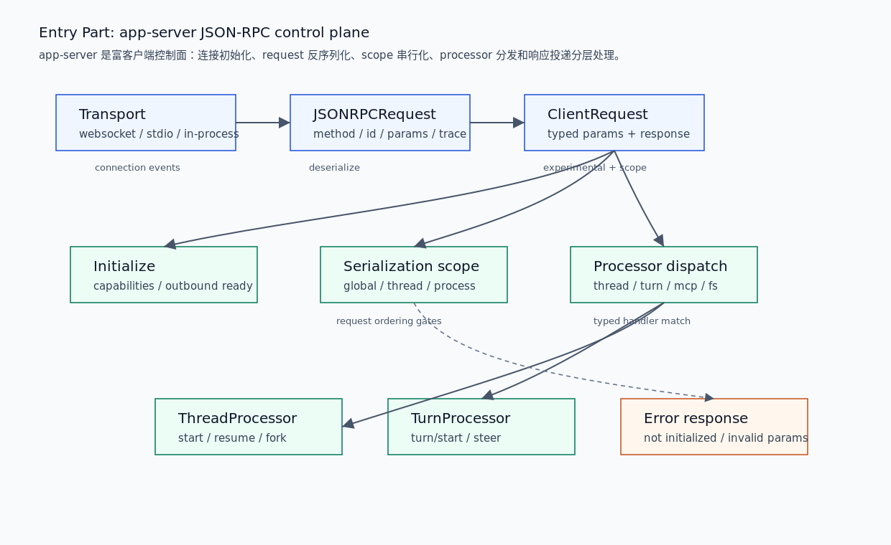

# 04. App-Server JSON-RPC Control Plane

本文拆开 Entry 层的第三部分：app-server 如何作为富客户端控制面接收 JSON-RPC request，完成 initialize gate、experimental gate、serialization scope、processor dispatch，并把 `thread/start` / `turn/start` 桥接到 Core。

## 读完你应掌握什么



开篇全局图：从上往下读。transport 接收 JSON-RPC，协议宏生成 typed `ClientRequest`，`MessageProcessor` 先处理 initialize，再按 serialization scope 排队或并发执行，最后分发到 thread/turn/MCP/fs 等 processor。对应源码锚点是 `repo/codex/codex-rs/app-server-protocol/src/protocol/common.rs`、`repo/codex/codex-rs/app-server/src/message_processor.rs`、`repo/codex/codex-rs/app-server/src/request_processors/thread_processor.rs` 和 `repo/codex/codex-rs/app-server/src/request_processors/turn_processor.rs`。

- 能解释 JSON-RPC wire request 如何变成 typed `ClientRequest`。
- 能说明 initialize 为什么是特殊请求，未 initialized 时其他 request 会被拒绝。
- 能区分 serialization scope 与 processor dispatch。
- 能复盘 `thread/start` 和 `turn/start` 到 Core 的边界。

## 这个模块解决什么问题

app-server 是 TUI、远程客户端和富客户端共同使用的控制面。它不只是 CLI wrapper，也不是 Core runtime 本身。它的任务是在连接、协议和请求处理之间建立稳定边界：先将 JSON-RPC 反序列化为 typed request，再用 connection state 做 initialize / experimental gate，随后按 serialization scope 控制并发，最后分发给具体 processor。

## 源码锚点

- `repo/codex/codex-rs/app-server-protocol/src/protocol/common.rs::client_request_definitions`：`ClientRequest` typed enum 生成宏。
- `repo/codex/codex-rs/app-server-protocol/src/protocol/v2/thread.rs::ThreadStartParams`：线程启动 wire payload。
- `repo/codex/codex-rs/app-server-protocol/src/protocol/v2/turn.rs::TurnStartParams`：turn 启动 wire payload。
- `repo/codex/codex-rs/app-server/src/message_processor.rs::process_client_request`：typed request 外层处理。
- `repo/codex/codex-rs/app-server/src/message_processor.rs::handle_client_request`：initialize gate。
- `repo/codex/codex-rs/app-server/src/message_processor.rs::dispatch_initialized_client_request`：initialized / experimental gate 和 serialization scope。
- `repo/codex/codex-rs/app-server/src/message_processor.rs::handle_initialized_client_request`：request variant 到 processor 的分发。
- `repo/codex/codex-rs/app-server/src/request_processors/thread_processor.rs::thread_start_inner`：`thread/start` 桥接。
- `repo/codex/codex-rs/app-server/src/request_processors/turn_processor.rs::turn_start`：`turn/start` 桥接。

## 核心抽象

| 抽象 | 职责 | 边界 |
| --- | --- | --- |
| `JSONRPCRequest` | wire 层 method/id/params/trace | 外部客户端到 app-server |
| `ClientRequest` | typed request enum，关联 params 和 response type | app-server-protocol 到 app-server |
| `ConnectionSessionState` | initialized 状态、experimental flag、client metadata、MCP extensions | connection-scoped gate |
| `RequestSerializationQueues` | 按 global/thread/process/fs 等 scope 控制并发 | request ordering |
| `MessageProcessor` | request context、initialize gate、dispatch | 控制面中枢 |
| `ThreadRequestProcessor` | thread lifecycle RPC | 到 `ThreadManager` |
| `TurnRequestProcessor` | turn input/settings RPC | 到 `CodexThread` |

无需额外图：开篇 PNG 已经表达 wire、gate、scope、processor 的层级和流向。

## 核心代码片段

### 1. 协议宏生成 typed `ClientRequest`

无需图：本节证明 JSON-RPC 到 typed request 的协议形状，开篇图已展示转换位置。

Source: `repo/codex/codex-rs/app-server-protocol/src/protocol/common.rs::client_request_definitions`
Line range: `repo/codex/codex-rs/app-server-protocol/src/protocol/common.rs:208-285`

```rust
/// Generates an `enum ClientRequest` where each variant is a request that the
/// client can send to the server. Each variant has associated `params` and
/// `response` types. Also generates a `export_client_responses()` function to
/// export all response types to TypeScript.
macro_rules! client_request_definitions {
    (
        $(
            $(#[experimental($reason:expr)])?
            $(#[doc = $variant_doc:literal])*
            $variant:ident => $wire:literal {
                params: $(#[$params_meta:meta])* $params:ty,
                $(inspect_params: $inspect_params:tt,)?
                serialization: $serialization:ident $( ( $($serialization_args:tt)* ) )?,
                $(manual_payload_conversion: $manual_payload_conversion:ident,)?
                response: $response:ty,
            }
        ),* $(,)?
    ) => {
        /// Request from the client to the server.
        #[derive(Serialize, Deserialize, Debug, Clone, PartialEq, JsonSchema, TS)]
        #[serde(tag = "method", rename_all = "camelCase")]
        pub enum ClientRequest {
            $(
                #[serde(rename = $wire)]
                #[ts(rename = $wire)]
                $variant {
                    #[serde(rename = "id")]
                    request_id: RequestId,
                    $(#[$params_meta])*
                    params: $params,
                },
            )*
        }
```

这段说明 app-server protocol 用宏把 wire method、params、serialization scope 和 response type 绑定在一起，并导出 TypeScript schema，避免客户端和服务端手写两套不一致协议。

### 2. `ThreadStartParams` 是 thread lifecycle 的 wire payload

无需图：本节证明 `thread/start` 的字段边界，开篇图已展示它进入 ThreadProcessor。

Source: `repo/codex/codex-rs/app-server-protocol/src/protocol/v2/thread.rs::ThreadStartParams`
Line range: `repo/codex/codex-rs/app-server-protocol/src/protocol/v2/thread.rs:62-159`

```rust
#[derive(
    Serialize, Deserialize, Debug, Clone, PartialEq, Default, JsonSchema, TS, ExperimentalApi,
)]
#[serde(rename_all = "camelCase")]
#[ts(export_to = "v2/")]
pub struct ThreadStartParams {
    #[ts(optional = nullable)]
    pub model: Option<String>,
    #[ts(optional = nullable)]
    pub model_provider: Option<String>,
    #[experimental("thread/start.allowProviderModelFallback")]
    #[serde(default, skip_serializing_if = "std::ops::Not::not")]
    pub allow_provider_model_fallback: bool,
    #[ts(optional = nullable)]
    pub cwd: Option<String>,
    /// Replace the thread's runtime workspace roots. Paths must be absolute.
    #[experimental("thread/start.runtimeWorkspaceRoots")]
    #[ts(optional = nullable)]
    pub runtime_workspace_roots: Option<Vec<AbsolutePathBuf>>,
    #[experimental(nested)]
    #[ts(optional = nullable)]
    pub approval_policy: Option<AskForApproval>,
    #[ts(optional = nullable)]
    pub sandbox: Option<SandboxMode>,
    /// Named profile id for this thread. Cannot be combined with `sandbox`.
    #[experimental("thread/start.permissions")]
    #[ts(optional = nullable)]
    pub permissions: Option<String>,
    #[ts(optional = nullable)]
    pub base_instructions: Option<String>,
    #[ts(optional = nullable)]
    pub developer_instructions: Option<String>,
    #[ts(optional = nullable)]
    pub ephemeral: Option<bool>,
    /// Persisted thread history contract to use for this new thread.
    #[experimental("thread/start.historyMode")]
    #[ts(optional = nullable)]
    pub history_mode: Option<ThreadHistoryMode>,
    #[experimental("thread/start.dynamicTools")]
    #[serde(
        default,
        deserialize_with = "codex_protocol::dynamic_tools::deserialize_dynamic_tool_specs"
    )]
    #[ts(optional = nullable)]
    pub dynamic_tools: Option<Vec<DynamicToolSpec>>,
}
```

这段说明 `thread/start` 不只是“新建会话”。它携带模型、cwd、workspace roots、approval、sandbox/permissions、instructions、history mode、dynamic tools 等 thread-scoped 配置。

### 3. initialize gate 必须先完成

无需图：本节证明连接初始化门禁，开篇图已展示 initialize 位于 request dispatch 前。

Source: `repo/codex/codex-rs/app-server/src/message_processor.rs::handle_client_request`
Line range: `repo/codex/codex-rs/app-server/src/message_processor.rs:850-891`

```rust
async fn handle_client_request(
    self: &Arc<Self>,
    connection_request_id: ConnectionRequestId,
    codex_request: ClientRequest,
    session: Arc<ConnectionSessionState>,
    outbound_initialized: Option<&AtomicBool>,
    request_context: RequestContext,
) -> Result<(), JSONRPCErrorError> {
    let connection_id = connection_request_id.connection_id;
    if let ClientRequest::Initialize { request_id, params } = codex_request {
        let connection_initialized = self
            .initialize_processor
            .initialize(
                connection_id,
                request_id,
                params,
                &session,
                outbound_initialized,
            )
            .await?;
        if connection_initialized {
            self.thread_processor
                .connection_initialized(
                    connection_id,
                    ConnectionCapabilities {
                        request_attestation: session.request_attestation(),
                    },
                )
                .await;
        }
        return Ok(());
    }

    self.dispatch_initialized_client_request(
        connection_request_id,
        codex_request,
        session,
        request_context,
    )
    .await
}
```

这段说明 `Initialize` 是特殊请求。连接必须先初始化，成功后 thread processor 才记录 connection capabilities，其他请求才会进入 initialized dispatch。

### 4. initialized request 会经过 experimental gate 和 serialization scope

无需图：本节证明 app-server 的 request ordering gate，开篇图已展示 serialization scope。

Source: `repo/codex/codex-rs/app-server/src/message_processor.rs::dispatch_initialized_client_request`
Line range: `repo/codex/codex-rs/app-server/src/message_processor.rs:893-960`

```rust
async fn dispatch_initialized_client_request(
    self: &Arc<Self>,
    connection_request_id: ConnectionRequestId,
    codex_request: ClientRequest,
    session: Arc<ConnectionSessionState>,
    request_context: RequestContext,
) -> Result<(), JSONRPCErrorError> {
    if !session.initialized() {
        return Err(invalid_request("Not initialized"));
    }

    if let Some(reason) = codex_request.experimental_reason()
        && !session.experimental_api_enabled()
    {
        return Err(invalid_request(experimental_required_message(reason)));
    }
    // ...
    let serialization_scope = codex_request.serialization_scope();
    let request = QueuedInitializedRequest::new(
        rpc_gate,
        async move {
            let processor_for_request = Arc::clone(&processor);
            let result = processor_for_request
                .handle_initialized_client_request(
                    connection_request_id,
                    codex_request,
                    request_context,
                    session,
                    event_stream_ready,
                )
                .await;
            if let Err(error) = result {
                processor.outgoing.send_error(error_request_id, error).await;
            }
        }
        .instrument(span),
    );

    if let Some(scope) = serialization_scope {
        let (key, access) = RequestSerializationQueueKey::from_scope(connection_id, scope);
        self.request_serialization_queues
            .enqueue(key, access, request)
            .await;
    } else {
        tokio::spawn(async move {
            request.run().await;
        });
    }
    Ok(())
}
```

这段说明 initialized request 会先过 connection initialized 和 experimental API gate，再按 serialization scope 决定排队或并发执行。

### 5. request variant 分发到 thread/turn processor

无需图：本节证明控制面最终按 request variant 分发，开篇图已展示 processor dispatch。

Source: `repo/codex/codex-rs/app-server/src/message_processor.rs::handle_initialized_client_request`
Line range: `repo/codex/codex-rs/app-server/src/message_processor.rs:1135-1179,1468-1477`

```rust
ClientRequest::ThreadStart { params, .. } => {
    self.thread_processor
        .thread_start(
            request_id.clone(),
            params,
            app_server_client_name.clone(),
            client_version.clone(),
            client_mcp_extensions.clone(),
            request_context,
        )
        .await
}
ClientRequest::ThreadResume { params, .. } => {
    self.thread_processor
        .thread_resume(
            request_id.clone(),
            params,
            app_server_client_name.clone(),
            client_version.clone(),
            client_mcp_extensions.clone(),
        )
        .await
}
ClientRequest::ThreadFork { params, .. } => {
    self.thread_processor
        .thread_fork(
            request_id.clone(),
            params,
            app_server_client_name.clone(),
            client_version.clone(),
            client_mcp_extensions.clone(),
        )
        .await
}
// ...
ClientRequest::TurnStart { params, .. } => {
    self.turn_processor
        .turn_start(
            request_id.clone(),
            params,
            app_server_client_name.clone(),
            client_version.clone(),
        )
        .await
}
```

这段说明 app-server 控制面最终按 request variant 转发到具体 processor。thread lifecycle 和 turn input 是两个不同 processor，避免把生命周期和输入语义混成一个大分支。

## 主流程


无需代码片段：主流程关键边界已在上方 typed protocol、initialize gate、serialization scope 和 processor dispatch 片段中覆盖。

1. transport 接收 websocket、stdio 或 in-process client 的 JSON-RPC message。
2. protocol 层将 method/id/params/trace 转成 typed `ClientRequest`。
3. `MessageProcessor` 为 request 建立 `ConnectionRequestId` 和 tracing context。
4. `Initialize` 请求先被单独处理；未 initialized 的其他 request 直接 invalid request。
5. initialized request 先经过 experimental API gate。
6. 有 serialization scope 的 request 进入 `RequestSerializationQueues`，没有 scope 的 request 直接 `tokio::spawn`。
7. typed variant 被分发到 `ThreadRequestProcessor`、`TurnRequestProcessor`、`McpRequestProcessor`、`FsRequestProcessor` 等。
8. thread/turn processor 再桥接到 `ThreadManager` 或 `CodexThread`。

## 失败模式与边界条件

无需图：本节用 failure matrix 表达控制面失败位置，开篇图已覆盖 gate 和 processor 层级。

| 失败点 | 捕获位置 | 客户端可见结果 | 恢复语义 |
| --- | --- | --- | --- |
| request 使用过期字段 | `reject_obsolete_request_fields` | invalid params | 客户端改用新字段 |
| 非 initialize request 在连接未初始化时到达 | `dispatch_initialized_client_request` | `Not initialized` | 先发送 initialize |
| experimental request 未开启 experimental API | `experimental_reason` gate | invalid request | initialize 时声明 capability 或避免使用实验 API |
| scoped request 需要串行 | `RequestSerializationQueues` | 排队执行 | 等同 scope 的前序 request 完成 |
| `ThreadStart` 参数非法 | `ThreadRequestProcessor` | JSON-RPC error | 修 thread-scoped 参数 |
| `TurnStart` 输入非法 | `TurnRequestProcessor` | JSON-RPC error | 修 turn input 或 tool output |

无需代码片段：表中 gate 已在上方代码证据覆盖。

## 行为证据矩阵

| Behavior rule | Source anchor | Test anchor | Reader conclusion |
| --- | --- | --- | --- |
| app-server-protocol 生成 typed request 和 response contract | `repo/codex/codex-rs/app-server-protocol/src/protocol/common.rs::client_request_definitions` | `repo/codex/codex-rs/app-server-protocol/src/protocol/v2/tests.rs` | JSON-RPC method、params、response 和 serialization scope 是同一份协议定义。 |
| `Initialize` 先于其他 initialized request | `repo/codex/codex-rs/app-server/src/message_processor.rs::handle_client_request` | `repo/codex/codex-rs/app-server/src/main_tests.rs` | app-server 用 connection state 做初始化门禁。 |
| experimental request 需要 connection capability | `repo/codex/codex-rs/app-server/src/message_processor.rs::dispatch_initialized_client_request` | `source-only` | 客户端不能在未声明实验能力时调用实验 API。 |
| serialization scope 决定 request 排队或并发 | `repo/codex/codex-rs/app-server/src/message_processor.rs::dispatch_initialized_client_request` | `repo/codex/codex-rs/app-server/src/request_processors/thread_processor_tests.rs` | 控制面能保护 thread/global/process 等共享资源顺序。 |
| thread 和 turn request 分发到不同 processor | `repo/codex/codex-rs/app-server/src/message_processor.rs::handle_initialized_client_request` | `source-only` | thread lifecycle 与 turn input 语义分离。 |

## 图示

本篇关键图示是 `../../image/architecture/entry-app-server-json-rpc-control-plane-v1.png`，已在开篇和主流程附近引用。

## 复设计练习

设计一个 app-server JSON-RPC 控制面，要求支持 websocket 和 in-process client：

1. 如何把 wire request 转成 typed request？
2. initialize gate 保存哪些 connection-scoped state？
3. 哪些 request 需要 serialization scope？
4. thread lifecycle 和 turn input 为什么要拆 processor？
5. 错误是同步 response 返回，还是异步 notification 返回？

## 检查题

1. `ClientRequest` 宏为什么同时声明 params、serialization 和 response？
2. `Initialize` 为什么不能走普通 initialized dispatch？
3. experimental API gate 保护的是什么？
4. serialization scope 解决什么并发问题？
5. `ThreadStart` 和 `TurnStart` 为什么分属不同 processor？

### 答案要点

1. 这样 Rust 服务端、JSON schema 和 TypeScript 客户端能共享同一协议源，减少 schema drift。
2. initialize 负责建立 connection state 和 capabilities，普通 request 依赖这些状态。
3. 它防止客户端调用尚未协商的实验 API，避免旧客户端误用新语义。
4. 它按 global/thread/process/fs 等 scope 排队，避免同一资源上的 request 乱序执行。
5. thread start/resume/fork 是生命周期操作，turn start/steer/interrupt 是输入和运行中控制操作，错误处理和状态依赖不同。

## Follow-up Slots

- 深挖 app-server TypeScript schema export 和 fixture 测试。
- 深挖 websocket connection handling 与 remote auth。
- 深挖 request processors 的模块边界和共享错误类型。
