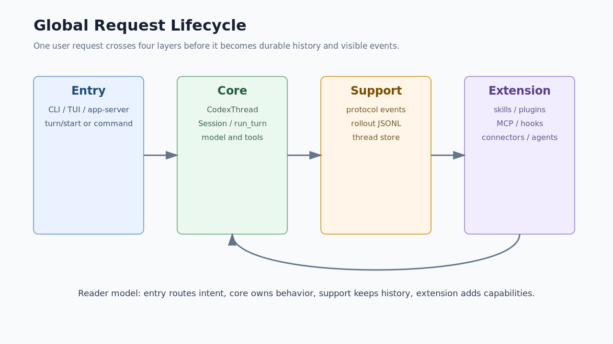

# 01. 全局心智模型

## 读完你应掌握什么

你应该能用一条主线解释 Codex harness：Entry 把用户意图转成协议操作，Core 负责 thread/session/turn 和模型工具循环，Support 保存协议、历史和恢复材料，Extension 把 skills、plugins、MCP、hooks、connectors 接入 Core。



这张图从左到右读：CLI/TUI/app-server 不直接拥有运行逻辑，它们把请求交给 Core；Core 的输出通过 protocol event 回到客户端，并通过 rollout/thread-store 变成可恢复状态；Extension 不是旁路脚本，而是被 Core 的上下文、工具和 hook 边界吸收。

## 这个模块解决什么问题

全局模型解决的是“先知道系统在哪里切边界”。如果没有这一步，初学者会把 TUI、tool handler、rollout、MCP、memory 混成一团，误以为 Codex 是一个大循环文件。实际上源码把稳定边界放在协议、thread、turn、工具、安全和持久化类型上。

## 源码锚点

- `repo/codex/codex-rs/Cargo.toml`：workspace crate 列表，说明 Entry/Core/Support/Extension 不是文档虚构分层。
- `repo/codex/codex-rs/core/src/codex_thread.rs::CodexThread`：Core 对外的 thread 操作面。
- `repo/codex/codex-rs/protocol/src/protocol.rs::Op`：入口提交给 Core 的操作协议。
- `repo/codex/codex-rs/protocol/src/protocol.rs::EventMsg`：Core 输出给 UI/app-server 的事件协议。
- `repo/codex/codex-rs/history/src/lib.rs::RolloutItem`：长期会话的持久化记录形态。

## 核心抽象

全局层最重要的抽象不是某个函数，而是四组边界：

| 抽象 | 谁拥有 | 读者要抓住的点 |
| --- | --- | --- |
| Entry surface | `cli`、`tui`、`app-server` | 负责收集输入、配置和 UI 状态，不拥有 turn 主循环 |
| Thread API | `codex-core` | 外部通过 `CodexThread` 进入 Core |
| Protocol | `codex-protocol` | `Op` 和 `EventMsg` 是跨层稳定边界 |
| Durable state | `history` / `rollout` / `thread-store` | 恢复、压缩、回放不依赖 UI 内存 |
| Extension surface | `skills` / `plugin` / `codex-mcp` / `hooks` | 外部能力必须经过声明、暴露、执行和事件回传 |

## 核心代码片段

### Code Evidence: Thread 是 Core 的对外操作面

图示说明：本代码片段由开篇图承接，局部代码证据不需要单独配图；无需图。

Source: `repo/codex/codex-rs/core/src/codex_thread.rs::CodexThread`
Line range: `repo/codex/codex-rs/core/src/codex_thread.rs:177-224`

```rust
pub struct CodexThread {
    pub(crate) session: Arc<Session>,
    pub(crate) io: SessionIo,
    pub(crate) session_source: SessionSource,
    session_configured: SessionConfiguredEvent,
    rollout_path: Option<PathBuf>,
    out_of_band_elicitations: Mutex<OutOfBandElicitations>,
    _diagnostics_guard: GaugeGuard,
}

/// Conduit for the bidirectional stream of messages that compose a thread
/// (formerly called a conversation) in Codex.
impl CodexThread {
    pub async fn submit(&self, op: Op) -> CodexResult<String> {
        self.io.submit(op).await
    }
}
```

这段代码说明 Entry 不直接操作 `Session` 内部状态，而是通过 `CodexThread::submit` 提交 `Op`。`rollout_path` 和 `session_source` 也说明 thread 同时绑定来源和持久化位置。

### Code Evidence: Op 是入口到 Core 的动作协议

图示说明：本代码片段由开篇图承接，局部代码证据不需要单独配图；无需图。

Source: `repo/codex/codex-rs/protocol/src/protocol.rs::Op`
Line range: `repo/codex/codex-rs/protocol/src/protocol.rs:592-624`

```rust
pub enum Op {
    /// Abort current task without terminating background terminal processes.
    /// This server sends [`EventMsg::TurnAborted`] in response.
    Interrupt,

    /// Terminate all running background terminal processes for this thread.
    CleanBackgroundTerminals,

    /// Start a realtime conversation stream.
    RealtimeConversationStart(ConversationStartParams),

    /// Submit turn input using the requested routing behavior.
    TurnInput {
        request: Box<TurnInputRequest>,
        mode: TurnInputMode,
        reply: oneshot::Sender<CodexResult<TurnInputSubmission>>,
    },
}
```

这段代码展示了协议的粒度：用户输入、实时会话、打断、后台终端清理都被建模成 `Op`。读者要注意 `TurnInput` 不只是文本，它还携带路由模式和 reply channel。

### Code Evidence: EventMsg 是 Core 到客户端的结果协议

图示说明：本代码片段由开篇图承接，局部代码证据不需要单独配图；无需图。

Source: `repo/codex/codex-rs/protocol/src/protocol.rs::EventMsg`
Line range: `repo/codex/codex-rs/protocol/src/protocol.rs:1338-1415`

```rust
pub struct Event {
    /// Submission `id` that this event is correlated with.
    pub id: String,
    /// Payload
    pub msg: EventMsg,
}

/// Response event from the agent
#[derive(Debug, Clone, Deserialize, Serialize, Display, JsonSchema, TS)]
#[serde(tag = "type", rename_all = "snake_case")]
pub enum EventMsg {
    /// Error while executing a submission
    Error(ErrorEvent),
    Warning(WarningEvent),
    ContextCompacted(ContextCompactedEvent),
    ThreadRolledBack(ThreadRolledBackEvent),
    #[serde(rename = "task_started", alias = "turn_started")]
    TurnStarted(TurnStartedEvent),
    #[serde(rename = "task_complete", alias = "turn_complete")]
    TurnComplete(TurnCompleteEvent),
}
```

这段代码说明 UI 看到的是事件，而不是直接读取 Core 内部对象。`Event.id` 负责把事件和 submission 对齐，`EventMsg` 的 tagged enum 是跨层 wire shape。

## 主流程

图示证据：本节复用开篇的全局生命周期图，避免重复插入同一张图；无需图。代码证据：本节逐步串联上方 `CodexThread`、`Op`、`EventMsg` 代码片段；无需代码片段重复粘贴。

1. 用户从 CLI、TUI 或 app-server 发起请求。
2. Entry 层把输入转换成 `Op`，通常是 `Op::TurnInput`。
3. `CodexThread` 把 `Op` 写入 Core 的输入队列。
4. `Session` 创建或推进 turn，并捕获 step context。
5. Core 构造模型请求，模型可能返回文本、工具调用、状态更新或错误。
6. 工具调用进入 tool router / orchestrator，真实副作用由安全策略约束。
7. Core 把过程事件转换为 `EventMsg` 给客户端，同时把可恢复记录写入 rollout。
8. 之后 resume/fork/compact 可以基于 Support 层记录重建上下文。

## 失败模式与边界条件

图示证据：开篇图已经标出四层边界，下面表格把失败归属到这些边界；无需图。代码证据：本节引用上方 `Op` / `EventMsg` / `RolloutItem` 证据解释失败出口；无需代码片段重复粘贴。

| 失败或边界 | 归属层 | 结果 |
| --- | --- | --- |
| Entry 参数无效 | Entry | 不进入 Core turn，入口侧返回错误 |
| `Op` 被拒绝或无法提交 | Core thread API | `CodexThread::submit` 返回 `CodexResult` 错误 |
| turn 执行失败 | Core | 通过 `EventMsg::Error` 或 turn lifecycle 事件暴露 |
| 工具安全拒绝 | Core tools / safety | 工具结果或事件回到模型和客户端，不应产生真实副作用 |
| rollout 缺失或损坏 | Support | resume 能力受损，必须回到持久化解析和重建逻辑定位 |
| 扩展加载失败 | Extension / Core integration | 能力不进入模型可见工具或上下文，通常有 startup/failure event |

## 行为证据矩阵

| Behavior rule | Source anchor | Test anchor | Reader conclusion |
| --- | --- | --- | --- |
| Entry 通过 `CodexThread` 进入 Core，而不是直接改 `Session` | `repo/codex/codex-rs/core/src/codex_thread.rs::CodexThread` | `repo/codex/codex-rs/core/src/thread_manager_tests.rs` | Core 对外边界是 thread API |
| `Op` 定义了 Core 可接收的操作集合 | `repo/codex/codex-rs/protocol/src/protocol.rs::Op` | source-only | 协议是跨入口收敛点 |
| `EventMsg` 定义了客户端可观察的输出集合 | `repo/codex/codex-rs/protocol/src/protocol.rs::EventMsg` | source-only | UI 不应依赖 Core 内部实现 |
| rollout 记录是恢复的事实来源之一 | `repo/codex/codex-rs/history/src/lib.rs::RolloutItem` | `repo/codex/codex-rs/core/src/session/rollout_reconstruction_tests.rs` | 长期会话能力来自 Support 层 |

## 图示

- `../../image/expert-learning/global-request-lifecycle-v1.png`

## 复设计练习

设计一个最小 agent harness，只保留 CLI 入口、一个 thread、一个 turn、一个 shell 工具和一个 JSONL 历史文件。要求说明：入口提交什么协议对象，Core 对外暴露什么 API，工具执行失败如何返回，历史文件记录哪些事件。

## 检查题

1. 为什么不能把 CLI/TUI 直接视为 Codex 的核心运行时？
2. `Op` 和 `EventMsg` 分别保护了什么边界？
3. rollout 为什么属于 Support 层，而不是 UI 层？

### 答案要点

1. CLI/TUI 是入口和展示面，主循环、工具、安全、上下文由 Core 和 Support 负责。
2. `Op` 是入口到 Core 的输入协议，`EventMsg` 是 Core 到客户端的输出协议。
3. rollout 支撑 resume、compact、fork 和 memory，不依赖某个 UI 进程的内存。

## Follow-up Slots

- 可以继续拆 `app-server-protocol` 的 v2 wire shape。
- 可以补一篇 workspace crate 依赖图，把 `Cargo.toml` 成员映射到四层模型。
