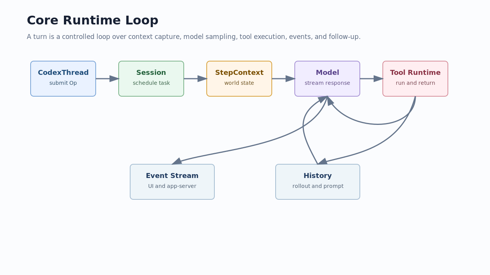

# 02. Core Runtime Loop

## 读完你应掌握什么

你应该能复盘一次 turn：`CodexThread` 接收 `Op::TurnInput`，`Session` 捕获 step context，`run_turn` 记录输入和 world state，`run_sampling_request` 构造模型请求，模型输出如果包含工具调用就进入 tool runtime，最后事件和历史共同决定是否继续 follow-up 或完成 turn。



图中上半部分是执行链，下半部分是输出和持久化链。读者要注意：模型请求不是直接用用户文本构造，而是使用 `StepContext`、history、world state、tools 和 config 共同构造。

## 这个模块解决什么问题

Core runtime loop 解决“如何把一个自然语言请求变成可控的多步执行”。它必须同时处理模型 streaming、工具调用、用户插队、上下文压缩、取消、错误和事件输出。这个 loop 是理解 Codex harness 的主干。

## 源码锚点

- `repo/codex/codex-rs/protocol/src/turn_input.rs::TurnInputRequest`
- `repo/codex/codex-rs/protocol/src/turn_input.rs::TurnInputMode`
- `repo/codex/codex-rs/core/src/session/turn.rs::run_turn`
- `repo/codex/codex-rs/core/src/session/turn.rs::run_sampling_request`
- `repo/codex/codex-rs/core/src/tools/spec_plan.rs::build_tool_router`

## 核心抽象

| 抽象 | 责任 | 专家判断点 |
| --- | --- | --- |
| `TurnInputRequest` | 把输入、thread settings、start options、additional context、trace 绑在一起 | 输入不是纯文本 |
| `TurnInputMode` | 决定 start、steer 或 idle-only 行为 | 并发输入是否创建新 turn 由这里约束 |
| `TurnContext` / `StepContext` | 固化本 turn 和本 step 的模型可见状态 | 工具集合、配置、world state 都挂在这里 |
| `run_turn` | turn 级 orchestration | 负责 pre-compact、hooks、context capture、sampling loop |
| `run_sampling_request` | 单次模型 sampling 和工具跟进 | 负责 prompt、tool runtime、stream retry 和 follow-up |

## 核心代码片段

### Code Evidence: TurnInputRequest 承载输入和上下文

图示说明：本代码片段由开篇图承接，局部代码证据不需要单独配图；无需图。

Source: `repo/codex/codex-rs/protocol/src/turn_input.rs::TurnInputRequest`
Line range: `repo/codex/codex-rs/protocol/src/turn_input.rs:32-64`

```rust
pub enum TurnInput {
    UserInput {
        content: Vec<UserInput>,
        client_id: Option<String>,
    },
    ResponseItem(ResponseItem),
    InterAgentCommunication(InterAgentCommunication),
}

pub struct TurnInputRequest {
    pub input: TurnInput,
    pub thread_settings: ThreadSettingsOverrides,
    pub start: TurnStartOptions,
    pub additional_context: BTreeMap<String, AdditionalContextEntry>,
    pub responsesapi_client_metadata: Option<HashMap<String, String>>,
    pub trace: Option<W3cTraceContext>,
}
```

这段代码说明 turn 输入携带的不只是用户消息，还包括 thread settings、start options、额外上下文和 trace。调试 turn 行为时要检查整包 request，而不是只看文本。

### Code Evidence: TurnInputMode 决定输入路由

图示说明：本代码片段由开篇图承接，局部代码证据不需要单独配图；无需图。

Source: `repo/codex/codex-rs/protocol/src/turn_input.rs::TurnInputMode`
Line range: `repo/codex/codex-rs/protocol/src/turn_input.rs:133-194`

```rust
pub enum TurnInputMode {
    /// Start a regular turn when idle, otherwise steer the active regular turn.
    StartOrSteer,
    /// Start only when the thread is idle.
    StartIfIdle,
    /// Steer only if this exact turn is active.
    Steer { expected_turn_id: String },
}

pub enum TurnInputSubmission {
    Started { turn_id: String },
    Steered { turn_id: String },
    NotSubmitted { reason: NotSubmittedReason },
}
```

这段代码是并发语义的核心：同一段输入可能启动新 turn，也可能 steer 当前 turn，或者被拒绝。专家读源码时要从这里追 `NotSubmittedReason`，不要先猜 UI 行为。

### Code Evidence: run_turn 捕获 step context

图示说明：本代码片段由开篇图承接，局部代码证据不需要单独配图；无需图。

Source: `repo/codex/codex-rs/core/src/session/turn.rs::run_turn`
Line range: `repo/codex/codex-rs/core/src/session/turn.rs:162-250`

```rust
pub(crate) async fn run_turn(
    sess: Arc<Session>,
    turn_context: Arc<TurnContext>,
    input: Vec<TurnInput>,
    mcp_startup_requirements: &mut McpStartupRequirements,
    prewarmed_client_session: Option<ModelClientSession>,
    cancellation_token: CancellationToken,
) -> CodexResult<Option<String>> {
    drain_async_hook_results(&sess, &turn_context, /*before_user_prompt*/ true).await;
    let mut client_session =
        prewarmed_client_session.unwrap_or_else(|| sess.services.model_client.new_session());
    if let Err(err) = run_pre_sampling_compact(
        &sess,
        &turn_context,
        &mut client_session,
        &cancellation_token,
    )
    .await
    {
        if matches!(err.details(), CodexErrorDetails::TurnAborted) {
            run_hooks_and_record_inputs(&sess, &turn_context, &input, PersistContext::Standard)
                .await;
            return Err(err);
        }
    }
    let first_step_context = match sess
        .capture_step_context_with_required_mcp_servers(
            Arc::clone(&turn_context),
            &cancellation_token,
            required_servers,
            required_plugins,
        )
        .await
    {
        Ok(step_context) => step_context,
        Err(err) => return Err(err),
    };
}
```

这段节选证明 `run_turn` 在 sampling 前会先处理 hook、pre-sampling compact 和 step context 捕获。`StepContext` 是模型请求的事实快照。

### Code Evidence: run_sampling_request 绑定工具 runtime 和 prompt

图示说明：本代码片段由开篇图承接，局部代码证据不需要单独配图；无需图。

Source: `repo/codex/codex-rs/core/src/session/turn.rs::run_sampling_request`
Line range: `repo/codex/codex-rs/core/src/session/turn.rs:1415-1465`

```rust
async fn run_sampling_request(
    sess: Arc<Session>,
    step_context: Arc<StepContext>,
    turn_store: Arc<codex_extension_api::ExtensionData>,
    turn_diff_tracker: SharedTurnDiffTracker,
    client_session: &mut ModelClientSession,
    responses_metadata: &CodexResponsesMetadata,
    input: Vec<ResponseItem>,
    cancellation_token: CancellationToken,
) -> CodexResult<(SamplingRequestResult, Vec<ResponseItem>)> {
    let turn_context = Arc::clone(&step_context.turn);
    let base_instructions = sess.get_prompt_base_instructions().await;

    let tool_runtime = ToolCallRuntime::new(
        Arc::clone(&sess),
        Arc::clone(&step_context),
        Arc::clone(&turn_diff_tracker),
    );
    let max_retries = turn_context.provider.info().stream_max_retries();
    let mut retry_state = ResponsesStreamRetryState::default();
    let mut initial_input = Some(input);
}
```

这段代码说明模型 sampling 和工具 runtime 是同一个 step 里的协作关系。工具不是模型之后的外置脚本，而是 sampling loop 的一部分。

## 主流程

图示证据：本节复用开篇的 Core runtime loop 图，下面步骤按图中箭头展开；无需图。代码证据：本节串联上方 `TurnInputRequest`、`TurnInputMode`、`run_turn`、`run_sampling_request` 片段；无需代码片段重复粘贴。

1. `CodexThread::submit` 接收 `Op::TurnInput`。
2. `TurnInputMode` 判断是启动新 turn、steer 当前 turn，还是拒绝提交。
3. `run_turn` 运行 pre-sampling compact 和输入 hook。
4. `Session` 捕获 `StepContext`，记录 world state 和 context updates。
5. `run_sampling_request` 读取 prompt base instructions、history 和 tool runtime。
6. 模型输出文本则发送 message/delta 事件；输出工具调用则交给 tool runtime。
7. 工具结果写回 history，模型根据 `needs_follow_up` 决定是否继续。
8. token limit、pending input、错误或取消会改变 loop 的退出方式。

## 失败模式与边界条件

图示证据：开篇图已把 retry、tool follow-up、event/history 回流放在同一张图里；无需图。代码证据：失败分支可回到 `run_turn` 和 `run_sampling_request` 片段定位；无需代码片段重复粘贴。

| 条件 | 处理位置 | 结果 |
| --- | --- | --- |
| pre-sampling compact 被取消 | `run_turn` | 记录输入后返回 `TurnAborted` |
| MCP required server 无法满足 | `run_turn` | 输入记录后返回错误 |
| stream 错误可重试 | `run_sampling_request` | 根据 provider retry policy 重建请求 |
| model 需要工具 follow-up | `run_sampling_request` / caller loop | 工具结果作为后续模型输入 |
| 有 pending input | `run_turn` | 当前 turn 继续处理或接受 mailbox delivery |

## 行为证据矩阵

| Behavior rule | Source anchor | Test anchor | Reader conclusion |
| --- | --- | --- | --- |
| turn 输入包含 settings、context 和 trace | `repo/codex/codex-rs/protocol/src/turn_input.rs::TurnInputRequest` | `repo/codex/codex-rs/core/src/session/turn_input_tests.rs` | 调试输入时看完整 request |
| 输入路由有 start/idle/steer 三类语义 | `repo/codex/codex-rs/protocol/src/turn_input.rs::TurnInputMode` | `repo/codex/codex-rs/core/src/session/turn_input_tests.rs` | 并发输入不是简单 append |
| turn 在 sampling 前捕获 step context | `repo/codex/codex-rs/core/src/session/turn.rs::run_turn` | `repo/codex/codex-rs/core/src/session/turn_tests.rs` | 模型看到的是快照 |
| sampling loop 创建 tool runtime | `repo/codex/codex-rs/core/src/session/turn.rs::run_sampling_request` | source-only | 工具执行属于 turn loop |

## 图示

- `../../image/expert-learning/core-runtime-loop-v1.png`

## 复设计练习

设计一个最小 `run_turn`：输入队列、上下文快照、模型请求、工具调用、工具结果回填、终止条件分别用什么对象表示？要求说明哪些状态可以跨 retry 复用，哪些必须每次重新捕获。

## 检查题

1. 为什么 `TurnInputRequest` 不能简化为 `String`？
2. `StartOrSteer` 和 `StartIfIdle` 的设计差异解决什么问题？
3. 为什么工具 runtime 在 `run_sampling_request` 内创建，而不是入口层创建？

### 答案要点

1. 因为 turn 输入还需要携带 settings、start options、additional context 和 trace。
2. `StartOrSteer` 允许活跃 turn 被追加引导，`StartIfIdle` 防止在繁忙时误创建或干扰 turn。
3. 工具集合依赖当前 `StepContext`、model、config、MCP 和扩展状态，入口层没有这些完整信息。

## Follow-up Slots

- 可以继续拆 `try_run_sampling_request` 中 streaming event 的具体消费逻辑。
- 可以补一篇 token limit 和 auto compact 的专题。
