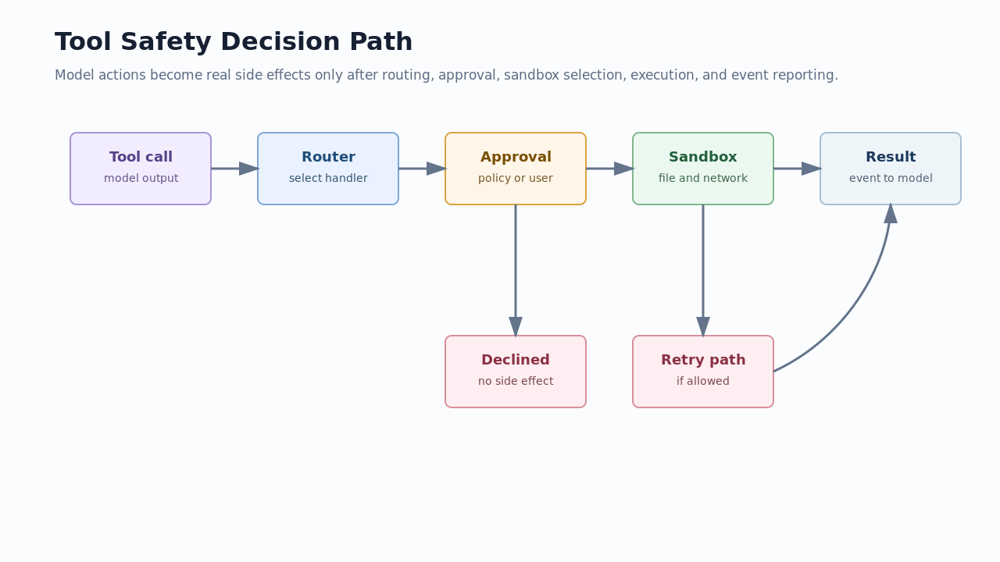

# 03. Tools, Safety, And Patch

## 读完你应掌握什么

你应该能解释模型输出的一个工具调用如何变成真实动作：先由 tool router 找到模型可见工具和 runtime handler，再由 orchestrator 统一处理 approval、sandbox、network、执行和 retry，最后通过 exec/patch/MCP 等事件回到模型、UI 和 rollout。



这张图强调一个事实：工具执行不是“模型说了就运行”。Codex 在 handler 前后都设有边界，尤其是 `exec_command` 和 `apply_patch` 这种会产生本地副作用的路径。

## 这个模块解决什么问题

工具系统解决的是“如何让模型安全地调用外部能力”。它要同时支持内置工具、shell、patch、MCP、动态工具、插件工具，还要处理 sandbox、approval、network policy、拒绝和失败回传。专家读这部分时，重点不是记住每个工具名，而是理解工具的生命周期和安全判定点。

## 源码锚点

- `repo/codex/codex-rs/core/src/tools/router.rs::ToolRouter`
- `repo/codex/codex-rs/core/src/tools/spec_plan.rs::build_tool_router`
- `repo/codex/codex-rs/core/src/tools/orchestrator.rs::ToolOrchestrator::run`
- `repo/codex/codex-rs/protocol/src/protocol.rs::AskForApproval`
- `repo/codex/codex-rs/protocol/src/protocol.rs::SandboxPolicy`
- `repo/codex/codex-rs/protocol/src/protocol.rs::ExecCommandEndEvent`
- `repo/codex/codex-rs/protocol/src/protocol.rs::PatchApplyEndEvent`

## 核心抽象

| 抽象 | 责任 | 专家判断点 |
| --- | --- | --- |
| `ToolRouter` | 保存 registry、model-visible specs、tool mode | 模型看见的工具不等于所有已注册工具 |
| `build_tool_router` | 按 turn context、MCP、apps、extensions 现场装配工具 | 工具集合是 per-step 结果 |
| `ToolOrchestrator` | 统一 approval、sandbox、执行、retry | 安全策略集中在工具外壳 |
| `AskForApproval` | 决定是否请求用户授权 | `Never`、`OnRequest`、`Granular` 行为不同 |
| `SandboxPolicy` | 决定文件系统和网络边界 | `WorkspaceWrite` 和 `DangerFullAccess` 是不同风险级别 |
| patch events | 把补丁解析和应用结果结构化回传 | patch 不只是 shell 文本 |

## 核心代码片段

### Code Evidence: ToolRouter 保存模型可见工具和 runtime registry

图示说明：本代码片段由开篇图承接，局部代码证据不需要单独配图；无需图。

Source: `repo/codex/codex-rs/core/src/tools/router.rs::ToolRouter`
Line range: `repo/codex/codex-rs/core/src/tools/router.rs:74-142`

```rust
pub struct ToolRouter {
    registry: ToolRegistry,
    model_visible_specs: Arc<[ToolSpec]>,
    tool_mode: ToolMode,
    code_mode_tool_names: BTreeMap<String, ToolName>,
    tool_namespaces_info: Option<TurnToolNamespacesInfo>,
    can_manage_children: bool,
}

impl ToolRouter {
    pub(crate) fn from_parts(
        registry: ToolRegistry,
        model_visible_specs: Vec<ToolSpec>,
        tool_mode: ToolMode,
        code_mode_tool_names: BTreeMap<String, ToolName>,
        tool_namespaces_info: Option<TurnToolNamespacesInfo>,
        child_management_tools: &[ToolName],
    ) -> Self {
        let mut router = Self {
            registry,
            model_visible_specs: model_visible_specs.into(),
            tool_mode,
            code_mode_tool_names,
            tool_namespaces_info,
            can_manage_children: false,
        };
        router.can_manage_children = !child_management_tools.is_empty()
            && child_management_tools
                .iter()
                .all(|name| router.exposes_tool(name));
        router
    }
}
```

这段代码说明 router 同时持有 runtime registry 和模型可见 spec。专家判断工具问题时要区分“handler 存在”和“模型本轮可见”。

### Code Evidence: 每个 step 现场构造 tool router

图示说明：本代码片段由开篇图承接，局部代码证据不需要单独配图；无需图。

Source: `repo/codex/codex-rs/core/src/tools/spec_plan.rs::build_tool_router`
Line range: `repo/codex/codex-rs/core/src/tools/spec_plan.rs:125-178`

```rust
pub(crate) fn build_tool_router(
    session: &Session,
    turn_context: &TurnContext,
    model_info: &ModelInfo,
    model_messages: Option<&ModelMessages>,
    environments: &TurnEnvironmentSnapshot,
    mcp: &Arc<codex_mcp::McpBinding>,
    apps_enabled: bool,
    step_store: &ExtensionData,
    tool_suggest_candidates: Option<&crate::tools::router::ToolSuggestCandidates>,
) -> CodexResult<ToolRouter> {
    let context = CoreToolPlanContext {
        turn_context,
        model_info,
        model_messages,
        environments,
        mcp,
        tool_suggest_candidates,
        wait_for_environment_tool_config: wait_for_environment_tool_config.as_ref(),
        default_agent_type_description: &default_agent_type_description,
        wait_agent_timeouts: wait_agent_timeout_options(turn_context),
    };
    let mut registry = ToolRegistry::default();
    add_core_tool_sources(&context, &mut registry);
    let registered_mcp_tools = session.services.mcp_handler_cache.append_mcp_tools(
        mcp,
        &turn_context.config,
        apps_enabled,
        &mcp.config().mcp_server_catalog,
        search_tool_enabled(turn_context, model_info),
        &mut registry,
    );
}
```

这段代码证明工具集合依赖 `TurnContext`、model、environment、MCP、apps 和 extension data。工具暴露是动态规划结果，不是静态全局列表。

### Code Evidence: ToolOrchestrator 统一 approval 和 sandbox

图示说明：本代码片段由开篇图承接，局部代码证据不需要单独配图；无需图。

Source: `repo/codex/codex-rs/core/src/tools/orchestrator.rs::ToolOrchestrator::run`
Line range: `repo/codex/codex-rs/core/src/tools/orchestrator.rs:121-176`

```rust
pub async fn run<Rq, Out, T>(
    &mut self,
    tool: &mut T,
    req: &Rq,
    tool_ctx: &ToolCtx,
) -> Result<OrchestratorRunResult<Out>, ToolError>
where
    T: ToolRuntime<Rq, Out>,
{
    let turn_ctx = tool_ctx.step_context.turn.as_ref();
    let approval_policy = tool_ctx.step_context.settings.approval_policy();
    let strict_auto_review = tool_ctx
        .session
        .active_turn_context_and_strict_auto_review()
        .await
        .is_some_and(|(_, _, strict_auto_review)| strict_auto_review);
    // 1) Approval
    let mut already_approved = false;

    let environment = tool.turn_environment(req);
    let sandbox_manager = SandboxManager::new();
    let sandbox_config = environment.config();
    let owner_network_policy = sandbox_config.network_policy.is_some();
    if owner_network_policy
        && tool
            .sandbox_permissions(req)
            .requires_escalated_permissions()
    {
        return Err(ToolError::Rejected(
            "attachment-owned network policy cannot be bypassed by sandbox escalation"
                .to_string(),
        ));
    }
    let file_system_sandbox_policy = permissions.file_system_sandbox_policy();
    let requirement = tool.exec_approval_requirement(req).unwrap_or_else(|| {
        default_exec_approval_requirement(approval_policy, &file_system_sandbox_policy)
    });
}
```

这段代码展示了安全外壳的顺序：先取 approval policy，再取 environment/sandbox config，再计算 approval requirement。副作用工具都要经过这个共享外壳。

### Code Evidence: approval 和 sandbox 是协议配置

图示说明：本代码片段由开篇图承接，局部代码证据不需要单独配图；无需图。

Source: `repo/codex/codex-rs/protocol/src/protocol.rs::AskForApproval`
Line range: `repo/codex/codex-rs/protocol/src/protocol.rs:984-1118`

```rust
pub enum AskForApproval {
    #[serde(rename = "untrusted")]
    UnlessTrusted,
    #[serde(alias = "on-failure")]
    #[default]
    OnRequest,
    Granular(GranularApprovalConfig),
    Never,
}

pub enum SandboxPolicy {
    #[serde(rename = "danger-full-access")]
    DangerFullAccess,
    #[serde(rename = "read-only")]
    ReadOnly { network_access: bool },
    #[serde(rename = "external-sandbox")]
    ExternalSandbox { network_access: NetworkAccess },
    #[serde(rename = "workspace-write")]
    WorkspaceWrite {
        writable_roots: Vec<AbsolutePathBuf>,
        network_access: bool,
        exclude_tmpdir_env_var: bool,
        exclude_slash_tmp: bool,
    },
}
```

这段代码说明 approval 和 sandbox 是协议级配置，不是 handler 的自由发挥。要评估一次命令能不能跑，必须同时看 approval policy 和 sandbox policy。

## 主流程

图示证据：本节复用开篇的工具安全决策图，下面步骤按 router、approval、sandbox、result 展开；无需图。代码证据：本节串联上方 `ToolRouter`、`build_tool_router`、`ToolOrchestrator::run`、policy 片段；无需代码片段重复粘贴。

1. 模型输出 tool call。
2. Core 用当前 step 的 `ToolRouter` 找到 handler。
3. `ToolOrchestrator::run` 根据 approval policy、sandbox policy、network policy 计算执行要求。
4. 如果需要 approval，生成请求；用户拒绝或 policy 禁止时直接返回 rejected/declined。
5. 如果允许执行，选择 sandbox 或 unsandboxed attempt。
6. handler 运行工具并产生结构化事件，例如 `ExecCommandBeginEvent` / `ExecCommandEndEvent` 或 `PatchApplyBeginEvent` / `PatchApplyEndEvent`。
7. 工具输出被记录回模型上下文，必要时触发 follow-up sampling。

## 失败模式与边界条件

图示证据：开篇图已经标出 declined 和 retry path；无需图。代码证据：本节的失败判断回到 `ToolOrchestrator::run` 和 `AskForApproval` / `SandboxPolicy` 片段；无需代码片段重复粘贴。

| 条件 | 行为 | 专家判断点 |
| --- | --- | --- |
| `AskForApproval::Never` | 不向用户请求授权，失败回传模型 | 不要误以为会自动弹审批 |
| `Granular` 某类关闭 | 该类审批自动拒绝 | 需要看具体字段，如 `sandbox_approval`、`mcp_elicitations` |
| owner network policy 存在但工具要求 escalation | `ToolError::Rejected` | attachment-owned policy 不能被绕过 |
| sandbox 执行失败 | 可能按 policy retry 或直接失败 | retry 不等于无条件提权 |
| patch 解析失败 | `PatchApplyEndEvent.success=false` 或 failed status | patch 路径不是普通 shell |

## 行为证据矩阵

| Behavior rule | Source anchor | Test anchor | Reader conclusion |
| --- | --- | --- | --- |
| 模型可见工具由 router 保存 | `repo/codex/codex-rs/core/src/tools/router.rs::ToolRouter` | `repo/codex/codex-rs/core/src/tools/router_tests.rs` | handler 存在不代表模型可见 |
| 工具集合按 step 动态构造 | `repo/codex/codex-rs/core/src/tools/spec_plan.rs::build_tool_router` | `repo/codex/codex-rs/core/src/tools/registry_tests.rs` | 工具暴露取决于当前上下文 |
| approval 和 sandbox 由 orchestrator 统一处理 | `repo/codex/codex-rs/core/src/tools/orchestrator.rs::ToolOrchestrator::run` | `repo/codex/codex-rs/core/src/tools/sandboxing_tests.rs` | 副作用工具共享安全外壳 |
| patch 有独立事件和状态 | `repo/codex/codex-rs/protocol/src/protocol.rs::PatchApplyEndEvent` | source-only | patch 不是普通 stdout 文本 |

## 图示

- `../../image/expert-learning/tool-safety-decision-v1.png`

## 复设计练习

设计一个新工具 `download_file`。要求说明：工具 spec 何时暴露给模型，handler 如何接收参数，是否需要 approval，sandbox 如何限制写入路径，失败结果如何回传给模型。

## 检查题

1. 为什么 `ToolRouter` 同时需要 registry 和 `model_visible_specs`？  
2. `exec_command` 和 `apply_patch` 为什么不能都当作普通 shell 命令？  
3. 什么情况下工具请求不会弹出用户审批，而是直接失败？

### 答案要点

1. registry 是可执行 handler 集合，`model_visible_specs` 是本 step 暴露给模型的能力集合，两者会受 config、MCP、apps、model 能力影响。
2. patch 需要解析结构化 diff、确认文件改动、发出 patch 专用事件，安全语义不同于任意 shell。
3. `AskForApproval::Never`、`Granular` 对应能力关闭、owner network policy 禁止绕过等情况下会直接拒绝或失败。

## Follow-up Slots

- 可以继续拆 `network_approval` 的 deferred approval 生命周期。
- 可以为 `unified_exec` 增加 PTY 生命周期专题。
