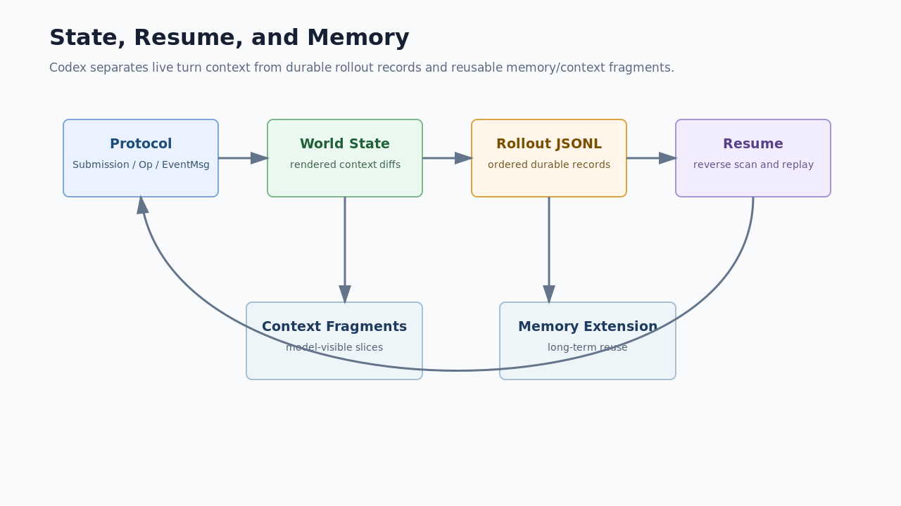

# 04. State, Protocol, And Memory

## 读完你应掌握什么

你应该能区分三类状态：当前 turn 的 live state、写入 rollout 的 durable state、未来 turn 可复用的 context/memory state。Codex 能 resume、fork、compact，不是因为 UI 记住了所有东西，而是因为 protocol、history、rollout、world state、thread-store 和 memory extension 各自守住了边界。



图中左侧是协议输入输出，中间是模型可见状态和持久化记录，右侧是 resume 的重建路径。下方的 context fragments 和 memory extension 说明长期上下文不等于完整聊天记录。

## 这个模块解决什么问题

长期会话最难的是“可恢复但不无限增长”。Codex 需要把模型历史、事件、world state、token usage、compaction、thread metadata、memory eligibility 等事实分层保存，并能在恢复时重新构造足够准确的模型上下文。

## 源码锚点

- `repo/codex/codex-rs/protocol/src/protocol.rs::Submission`
- `repo/codex/codex-rs/protocol/src/protocol.rs::EventMsg`
- `repo/codex/codex-rs/history/src/lib.rs::RolloutItem`
- `repo/codex/codex-rs/history/src/lib.rs::RolloutLine`
- `repo/codex/codex-rs/rollout/src/lib.rs::decode_rollout_line`
- `repo/codex/codex-rs/core/src/context/world_state/mod.rs::WorldStateSection`
- `repo/codex/codex-rs/core/src/session/rollout_reconstruction.rs::reconstruct_history_from_rollout`

## 核心抽象

| 抽象 | 责任 | 专家判断点 |
| --- | --- | --- |
| `Submission` | 输入操作和 trace 的持久关联 | 事件通过 submission id 关联 |
| `EventMsg` | 用户和客户端可观察事件 | 错误、完成、压缩、工具输出都应事件化 |
| `RolloutItem` | 可持久化历史项目 | 不同记录类型有不同重放语义 |
| `RolloutLine` | JSONL 行包装 | `timestamp` / `ordinal` 和 item 分离 |
| `WorldStateSection` | model-visible 环境状态的快照与 diff | 状态更新不是字符串拼接 |
| memory extension | 长期可复用知识 | 和当前 turn context 不同 |

## 核心代码片段

### Code Evidence: Submission 关联输入和 trace

图示说明：本代码片段由开篇图承接，局部代码证据不需要单独配图；无需图。

Source: `repo/codex/codex-rs/protocol/src/protocol.rs::Submission`
Line range: `repo/codex/codex-rs/protocol/src/protocol.rs:192-205`

```rust
pub struct Submission {
    /// Unique id for this Submission to correlate with Events
    pub id: String,
    /// Payload
    pub op: Op,
    /// Optional W3C trace carrier propagated across async submission handoffs.
    pub trace: Option<W3cTraceContext>,
    /// Core-provided ID of the parent turn that directly initiated this submission.
    pub parent_turn_id: Option<String>,
    /// Core-provided ID of the top-level turn that causally initiated this submission.
    pub root_turn_id: Option<String>,
}
```

这段代码说明输入不是一次性函数调用，而是可追踪的 submission。`parent_turn_id` 和 `root_turn_id` 让多 agent 或嵌套提交能保持因果关系。

### Code Evidence: RolloutItem 保存可恢复事实

图示说明：本代码片段由开篇图承接，局部代码证据不需要单独配图；无需图。

Source: `repo/codex/codex-rs/history/src/lib.rs::RolloutItem`
Line range: `repo/codex/codex-rs/history/src/lib.rs:116-134`

```rust
/// Persisted rollout item used by core history and rollout storage.
#[derive(Debug, Clone)]
pub enum RolloutItem {
    SessionMeta(SessionMetaLine),
    ResponseItem(ResponseItemEnvelope),
    InterAgentCommunication(InterAgentCommunication),
    InterAgentCommunicationMetadata {
        trigger_turn: bool,
    },
    Compacted(CompactedItem),
    TurnContext(TurnContextItem),
    TokenUsageRecord(TokenUsageRecord),
    WorldState(WorldStateItem),
    SecurityRiskScore(SecurityRiskScore),
    RetainedContext(RetainedContextEvent),
    EventMsg(EventMsg),
    RealtimeItem(RealtimeItem),
}
```

这段代码是恢复语义的入口：rollout 不是简单聊天日志，而是混合了 response item、turn context、world state、event、token usage 和 compaction 记录。

### Code Evidence: RolloutLine 是 JSONL 的行级 envelope

图示说明：本代码片段由开篇图承接，局部代码证据不需要单独配图；无需图。

Source: `repo/codex/codex-rs/history/src/lib.rs::RolloutLine`
Line range: `repo/codex/codex-rs/history/src/lib.rs:254-260`

```rust
pub struct RolloutLine {
    pub timestamp: String,
    #[serde(default, skip_serializing_if = "Option::is_none")]
    pub ordinal: Option<u64>,
    #[serde(flatten)]
    pub item: RolloutItem,
}
```

这段代码说明 JSONL 每行有时间和可选顺序号，实际业务负载通过 `RolloutItem` flatten。恢复问题要先确认 JSONL 是否能解析成这个结构。

### Code Evidence: WorldStateSection 负责 snapshot 和 diff render

图示说明：本代码片段由开篇图承接，局部代码证据不需要单独配图；无需图。

Source: `repo/codex/codex-rs/core/src/context/world_state/mod.rs::WorldStateSection`
Line range: `repo/codex/codex-rs/core/src/context/world_state/mod.rs:228-262`

```rust
pub(crate) trait WorldStateSection: Send + Sync + 'static {
    const ID: &'static str;
    type Snapshot: DeserializeOwned + Serialize;

    fn snapshot(&self) -> Self::Snapshot;

    /// Whether the section contributes comparison state to persisted rollouts.
    fn should_persist(&self) -> bool {
        true
    }

    fn matches_legacy_fragment(_role: &str, _text: &str) -> bool {
        false
    }

    fn render_diff(
        &self,
        previous: PreviousSectionState<'_, Self::Snapshot>,
    ) -> Option<Box<dyn ContextualUserFragment>>;
}
```

这段代码说明 world state 是可 snapshot、可 diff、可渲染的 section，而不是散落在 prompt 里的普通文字。

## 主流程

图示证据：本节复用开篇的状态恢复图，下面步骤按 protocol、world state、rollout、resume、memory 展开；无需图。代码证据：本节串联上方 `Submission`、`RolloutItem`、`RolloutLine`、`WorldStateSection` 片段；无需代码片段重复粘贴。

1. Entry 提交 `Submission`，每个 submission 有 id 和 trace。
2. Core 处理 `Op`，产生 `EventMsg` 给客户端。
3. 执行过程中的 response item、turn context、world state、event、token usage 写入 rollout。
4. world state 通过 section snapshot/diff 控制模型可见上下文。
5. compact 会生成 replacement history 或 retained context，避免上下文无限增长。
6. resume/fork 读取 rollout，先反向定位 checkpoint，再正向重放存活尾部。
7. memory extension 读取或写入更长期的可复用事实，但不替代当前 turn 的上下文快照。

## 失败模式与边界条件

图示证据：开篇图已经标出 durable state 和 resume 回路；无需图。代码证据：本节失败分支回到 rollout decoder、`RolloutItem` 和 `WorldStateSection` 片段；无需代码片段重复粘贴。

| 条件 | 行为 | 专家判断点 |
| --- | --- | --- |
| rollout line 不是 JSON object | `decode_rollout_line` 返回 JSON error | 持久化边界先失败，不能重建历史 |
| compaction 缺少窗口信息 | reconstruction 兼容 legacy branch | 恢复逻辑必须兼容旧记录 |
| world state 不持久化 | `should_persist=false` | 该 section 不能作为恢复事实依赖 |
| thread rollback | rollback 不撤销磁盘改动 | 上下文回滚和文件系统回滚不是同一件事 |
| memory stale | memory 影响 prompt 但不是当前事实 | 需要用源码和当前上下文复核 |

## 行为证据矩阵

| Behavior rule | Source anchor | Test anchor | Reader conclusion |
| --- | --- | --- | --- |
| submission id 关联输入和事件 | `repo/codex/codex-rs/protocol/src/protocol.rs::Submission` | source-only | 事件追踪从 submission 开始 |
| rollout 保存多种恢复事实 | `repo/codex/codex-rs/history/src/lib.rs::RolloutItem` | `repo/codex/codex-rs/core/src/session/rollout_reconstruction_tests.rs` | 恢复不等于拼聊天文本 |
| JSONL 解析在 rollout 边界处理 | `repo/codex/codex-rs/rollout/src/lib.rs::decode_rollout_line` | source-only | 格式问题应在 persistence boundary 定位 |
| world state section 可 snapshot/diff | `repo/codex/codex-rs/core/src/context/world_state/mod.rs::WorldStateSection` | `repo/codex/codex-rs/core/src/context/world_state/world_state_tests.rs` | 模型环境状态有结构化生命周期 |

## 图示

- `../../image/expert-learning/state-resume-memory-v1.png`

## 复设计练习

设计一个 JSONL 会话恢复系统。要求记录用户输入、模型输出、工具结果、上下文压缩点和当前环境状态，并说明恢复时如何选择 checkpoint、如何处理损坏行、如何避免把过期 memory 当成当前事实。

## 检查题

1. `RolloutItem` 为什么不是只有 `ResponseItem`？  
2. `WorldStateSection` 为什么要有 `snapshot` 和 `render_diff`？  
3. thread rollback 为什么不能被理解为文件系统回滚？

### 答案要点

1. 因为恢复需要 session meta、turn context、world state、event、token usage、compaction 等多类事实。
2. snapshot 用于记录比较状态，render diff 用于把变化变成模型可见上下文，避免每次全量拼接。
3. rollback 只影响模型上下文/历史，源码注释明确不尝试撤销本地文件系统改动。

## Follow-up Slots

- 可以继续拆 `thread-store` 的具体持久化实现。
- 可以补一篇 memory read/write pipeline 和普通 context fragment 的差异。
