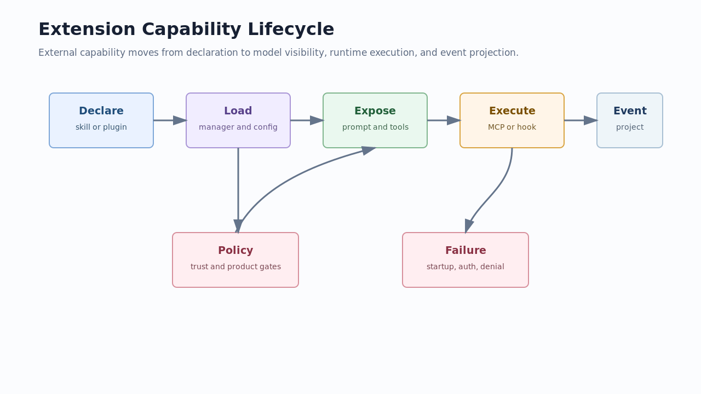

# 05. Extension System

## 读完你应掌握什么

你应该能解释一个外部能力如何进入 Codex：skill 或 plugin 先声明能力，manager/config 决定是否加载，Core 在 turn/step 中把能力注入 prompt 或 tool router，MCP/hook/connector/agent runtime 执行后再用事件和工具结果投影回模型与客户端。



这张图按“声明 -> 加载 -> 暴露 -> 执行 -> 事件”读。Policy 和 failure 是贯穿全程的约束：扩展不是绕过 Core 的后门，而是被 Core 统一纳入上下文、工具、安全和事件边界。

## 这个模块解决什么问题

扩展系统解决“Codex 如何被定制而不破坏主循环”。skills 帮模型选择知识和工作流，plugins 打包 skills/MCP/apps/hooks，MCP 暴露外部工具和资源，hooks 拦截生命周期事件，connectors 把外部应用能力投影进 runtime，multi-agent 扩展执行主体。

## 源码锚点

- `repo/codex/codex-rs/skills/src/model.rs::SkillMetadata`
- `repo/codex/codex-rs/plugin/src/manifest.rs::PluginManifest`
- `repo/codex/codex-rs/core/src/tools/spec_plan.rs::build_tool_router`
- `repo/codex/codex-rs/protocol/src/protocol.rs::McpToolCallBeginEvent`
- `repo/codex/codex-rs/protocol/src/protocol.rs::HookStartedEvent`
- `repo/codex/codex-rs/core/src/agent/registry.rs::reserve_spawn_slot`

## 核心抽象

| 抽象 | 责任 | 专家判断点 |
| --- | --- | --- |
| `SkillMetadata` | 描述一个本地 skill 的名称、描述、依赖、策略、scope | skill 是可选择的知识/工作流单元 |
| `PluginManifest` | 声明 plugin 的 skills、MCP、apps、hooks 和 UI 元数据 | plugin 是能力 bundle |
| MCP binding/tools | 把外部 server tool 接入 router | MCP 工具仍受 model visibility 和 policy 影响 |
| hook events | 生命周期拦截和异步结果 | hook 不是模型工具，但会改变输入/事件 |
| connector projection | 把 app/resource 能力映射进运行时 | connector 是外部应用状态投影 |
| agent registry | 管理 spawn slot、深度和活动 agent | multi-agent 是受限资源，不是无限 fork |

## 核心代码片段

### Code Evidence: SkillMetadata 描述 skill 的可调用条件

图示说明：本代码片段由开篇图承接，局部代码证据不需要单独配图；无需图。

Source: `repo/codex/codex-rs/skills/src/model.rs::SkillMetadata`
Line range: `repo/codex/codex-rs/skills/src/model.rs:6-36`

```rust
/// Metadata for one skill materialized on the host filesystem.
#[derive(Debug, Clone, PartialEq)]
pub struct SkillMetadata {
    pub name: String,
    pub description: String,
    pub short_description: Option<String>,
    pub interface: Option<SkillInterface>,
    pub dependencies: Option<SkillDependencies>,
    pub policy: Option<SkillPolicy>,
    /// Path to the SKILL.md file that declares this skill.
    pub path_to_skills_md: AbsolutePathBuf,
    pub scope: SkillScope,
    pub plugin_id: Option<String>,
    pub remote_plugin_id: Option<String>,
}

impl SkillMetadata {
    pub fn allows_implicit_invocation(&self) -> bool {
        self.policy
            .as_ref()
            .and_then(|policy| policy.allow_implicit_invocation)
            .unwrap_or(true)
    }
}
```

这段代码说明 skill 本身带有 policy、scope、plugin 归属和依赖信息。读者要把 skill 理解为受策略控制的能力说明，而不是普通 Markdown。

### Code Evidence: PluginManifest 打包多类扩展资源

图示说明：本代码片段由开篇图承接，局部代码证据不需要单独配图；无需图。

Source: `repo/codex/codex-rs/plugin/src/manifest.rs::PluginManifest`
Line range: `repo/codex/codex-rs/plugin/src/manifest.rs:3-38`

```rust
/// Parsed plugin metadata parameterized by its resource locator representation.
#[derive(Debug, Clone, PartialEq, Eq)]
pub struct PluginManifest<Resource> {
    pub name: String,
    pub version: Option<String>,
    pub description: Option<String>,
    pub keywords: Vec<String>,
    pub paths: PluginManifestPaths<Resource>,
    pub interface: Option<PluginManifestInterface<Resource>>,
}

/// Component resources declared by a plugin manifest.
#[derive(Debug, Clone, PartialEq, Eq)]
pub struct PluginManifestPaths<Resource> {
    pub skills: Vec<Resource>,
    pub mcp_servers: Option<PluginManifestMcpServers<Resource>>,
    pub apps: Option<Resource>,
    pub hooks: Option<PluginManifestHooks<Resource>>,
}
```

这段代码说明 plugin 是 bundle：它能携带 skills、MCP servers、apps 和 hooks。新增能力时要先判断它属于哪一种资源路径。

### Code Evidence: MCP tool call 事件保留 server、tool 和 plugin/app 归属

图示说明：本代码片段由开篇图承接，局部代码证据不需要单独配图；无需图。

Source: `repo/codex/codex-rs/protocol/src/protocol.rs::McpToolCallBeginEvent`
Line range: `repo/codex/codex-rs/protocol/src/protocol.rs:2586-2622`

```rust
pub struct McpInvocation {
    /// Name of the MCP server as defined in the config.
    pub server: String,
    /// Name of the tool as given by the MCP server.
    pub tool: String,
    /// Arguments to the tool call.
    pub arguments: Option<serde_json::Value>,
}

pub struct McpToolCallBeginEvent {
    /// Identifier so this can be paired with the McpToolCallEnd event.
    pub call_id: String,
    pub invocation: McpInvocation,
    pub connector_id: Option<String>,
    pub mcp_app_resource_uri: Option<String>,
    pub link_id: Option<String>,
    pub app_name: Option<String>,
    pub action_name: Option<String>,
    pub plugin_id: Option<String>,
    pub read_only_hint: Option<bool>,
}
```

这段代码说明 MCP 执行事件不仅有工具名，还保留 connector、app、plugin 和 read-only hint。扩展能力的可观测性要依赖这些字段。

### Code Evidence: agent spawn 有容量和深度边界

图示说明：本代码片段由开篇图承接，局部代码证据不需要单独配图；无需图。

Source: `repo/codex/codex-rs/core/src/agent/registry.rs::reserve_spawn_slot`
Line range: `repo/codex/codex-rs/core/src/agent/registry.rs:87-115`

```rust
pub(crate) fn next_thread_spawn_depth(session_source: &SessionSource) -> i32 {
    session_depth(session_source).saturating_add(1)
}

pub(crate) fn exceeds_thread_spawn_depth_limit(depth: i32, max_depth: i32) -> bool {
    depth > max_depth
}

impl AgentRegistry {
    pub(crate) fn reserve_spawn_slot(
        self: &Arc<Self>,
        max_threads: Option<usize>,
    ) -> Result<SpawnReservation> {
        if let Some(max_threads) = max_threads {
            if !self.try_increment_spawned(max_threads) {
                return Err(CodexErr::new(CodexErrorDetails::AgentLimitReached {
                    max_threads,
                }));
            }
        }
        Ok(SpawnReservation {
            state: Arc::clone(self),
            active: true,
            reserved_agent_nickname: None,
            reserved_agent_path: None,
        })
    }
}
```

这段代码说明 multi-agent 也有资源边界。专家设计协作能力时，要先考虑 spawn 深度、数量、释放和失败清理。

## 主流程

图示证据：本节复用开篇的扩展能力生命周期图，下面步骤按声明、加载、暴露、执行、事件展开；无需图。代码证据：本节串联上方 `SkillMetadata`、`PluginManifest`、`McpToolCallBeginEvent`、`reserve_spawn_slot` 片段；无需代码片段重复粘贴。

1. skill/plugin 在文件系统或 marketplace 中声明 metadata 和资源路径。
2. config 和 manager 决定哪些扩展进入当前 session/thread。
3. turn 捕获 step context 时，skills、MCP、connectors、hooks 进入上下文或 runtime。
4. `build_tool_router` 把 MCP 和 extension tool executor 合并进工具计划。
5. 模型如果调用 MCP/tool，Core 生成 begin/end event 并记录结果。
6. hooks 可以在 turn 前后运行并产生输入、事件或额外上下文。
7. multi-agent 通过 registry 管理子 agent 生命周期，受数量和深度限制。

## 失败模式与边界条件

图示证据：开篇图已经标出 policy 和 failure 是扩展生命周期旁路约束；无需图。代码证据：本节失败分支回到 skill policy、plugin manifest、MCP event 和 agent registry 片段；无需代码片段重复粘贴。

| 条件 | 行为 | 专家判断点 |
| --- | --- | --- |
| skill policy 禁止 implicit invocation | skill 不应被自动使用 | 要看 `SkillMetadata::allows_implicit_invocation` |
| plugin manifest 路径错误 | 对应资源无法加载 | plugin 是 bundle，单个资源失败可能影响部分能力 |
| MCP server startup 失败 | 工具不进入可用集合或产生 startup failure | 看 MCP startup event 和 tool exposure |
| hook 失败 | 可能产生 warning/error 或丢失额外上下文 | hook 是生命周期边界，不是普通工具 |
| agent 数量超限 | `AgentLimitReached` | 子 agent 能力受 registry 管控 |

## 行为证据矩阵

| Behavior rule | Source anchor | Test anchor | Reader conclusion |
| --- | --- | --- | --- |
| skill 有 policy 和 scope | `repo/codex/codex-rs/skills/src/model.rs::SkillMetadata` | source-only | skill 不是无条件 prompt 文本 |
| plugin manifest 打包 skills/MCP/apps/hooks | `repo/codex/codex-rs/plugin/src/manifest.rs::PluginManifestPaths` | source-only | plugin 是能力 bundle |
| MCP 执行事件保留归属字段 | `repo/codex/codex-rs/protocol/src/protocol.rs::McpToolCallBeginEvent` | source-only | 扩展执行可追踪 |
| agent spawn 受数量和深度限制 | `repo/codex/codex-rs/core/src/agent/registry.rs::reserve_spawn_slot` | `repo/codex/codex-rs/core/src/agent/registry_tests.rs` | multi-agent 不是无限并行 |

## 图示

- `../../image/expert-learning/extension-capability-lifecycle-v1.png`

## 复设计练习

设计一个“数据库查询插件”。要求说明：plugin manifest 应声明哪些资源，skill 如何描述使用场景，MCP server 如何暴露查询工具，approval/sandbox/network 如何限制风险，结果如何通过事件回到客户端。

## 检查题

1. skill 和 plugin 的最核心区别是什么？  
2. MCP tool call event 为什么要带 `plugin_id`、`connector_id`、`read_only_hint`？  
3. multi-agent 为什么需要 registry 和 spawn reservation？

### 答案要点

1. skill 是单个知识/工作流说明，plugin 是打包 skills、MCP、apps、hooks 等资源的 bundle。
2. 这些字段用于追踪能力来源、应用归属和安全语义，便于 UI、审计和策略判断。
3. registry 负责数量、深度、身份和清理边界，避免子 agent 无限扩张或状态泄漏。

## Follow-up Slots

- 可以继续拆 plugin marketplace 的同步和冲突处理。
- 可以补 MCP auth/elicitation 的完整失败路径专题。
