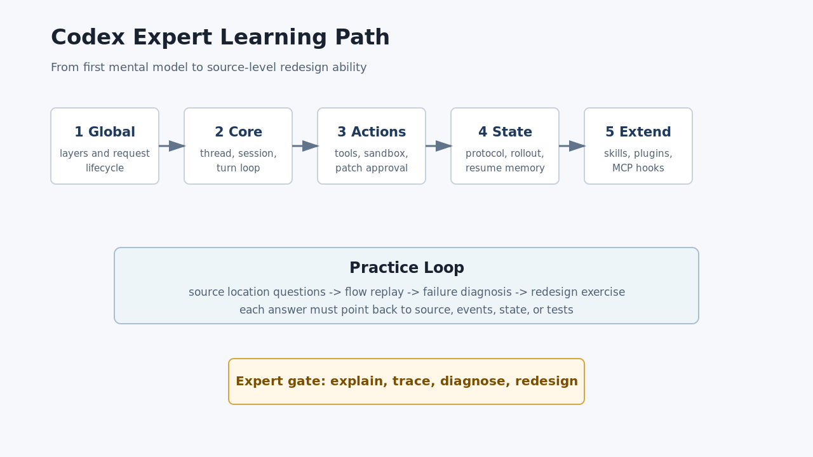

# Codex Harness 专家学习路径

本文是 `learn_codex` 的课程化入口。它面向第一次系统学习 Codex harness 的读者，但目标不是停在“知道有哪些文件”，而是让读者最终能用源码证据解释一次请求、一次 turn、一次工具调用、一次恢复和一次扩展能力接入。

本文基于本地源码快照 `repo/codex/`，版本锚点见 [../source-snapshot.md](../source-snapshot.md)。核心索引仍在 [../entry/README.md](../entry/README.md)、[../core/README.md](../core/README.md)、[../support/README.md](../support/README.md)、[../extension/README.md](../extension/README.md)。



## 学习承诺

完成这条路径后，读者应该能做到四件事：

- 解释 Codex harness 的四层结构：Entry、Core、Support、Extension。
- 从用户输入复盘到 `CodexThread`、`Session`、`run_turn`、model sampling、tool runtime、event 和 rollout。
- 判断工具执行、sandbox、approval、patch、MCP、hooks 等高风险边界。
- 设计一个简化版 agent harness，说明哪些对象负责入口、状态、工具、安全、恢复和扩展。

## 课程顺序

| 顺序 | 课程 | 核心问题 | 深读入口 |
| --- | --- | --- | --- |
| 1 | [01-global-model.md](01-global-model.md) | Codex harness 整体如何分层，一次请求跨过哪些边界 | `docs/entry/`、`docs/core/00-core-map.md` |
| 2 | [02-core-runtime-loop.md](02-core-runtime-loop.md) | 一次 turn 如何被驱动，模型和工具如何循环 | `docs/core/01-thread-lifecycle.md`、`docs/core/02-session-turn-loop.md` |
| 3 | [03-tools-safety-patch.md](03-tools-safety-patch.md) | 模型动作如何安全变成 shell、patch 或工具副作用 | `docs/core/04-tool-runtime.md` 到 `docs/core/07-apply-patch.md` |
| 4 | [04-state-protocol-memory.md](04-state-protocol-memory.md) | 长期会话如何依靠 protocol、rollout、world state、memory 恢复 | `docs/support/01-protocol-rollout-thread-store.md`、`docs/core/11-rollout-compaction-resume.md` |
| 5 | [05-extension-system.md](05-extension-system.md) | skills、plugins、MCP、hooks、connectors 如何改变能力面 | `docs/extension/01-skills-plugins-mcp-hooks.md`、`docs/core/09-extensions-inside-core.md` |
| 6 | [exercises.md](exercises.md) | 用题目验证源码定位、流程复盘、故障诊断和重设计能力 | 全部课程 |
| 7 | [expert-checklist.md](expert-checklist.md) | 判断是否达到专家口径 | 全部课程 |

## 源码锚点

学习路径的最小源码地图是：

- `repo/codex/codex-rs/Cargo.toml`：Rust workspace 成员和 crate 依赖的第一张地图。
- `repo/codex/codex-rs/core/src/codex_thread.rs`：外部调用 Core thread 的对象边界。
- `repo/codex/codex-rs/core/src/session/turn.rs`：一次 turn 的主循环和 model/tool 交互。
- `repo/codex/codex-rs/protocol/src/protocol.rs`：跨入口、Core、UI、app-server 的协议与事件边界。
- `repo/codex/codex-rs/history/src/lib.rs` 和 `repo/codex/codex-rs/rollout/src/lib.rs`：持久化历史和 rollout JSONL 边界。

## 使用方式

推荐每次只推进一个 `/goal`：

1. 先读一篇课程正文，画出自己的简化流程图。
2. 再打开课程里的 3 个关键源码片段，确认字段、枚举和分支没有被文档简化错。
3. 继续读深读入口里的专题文档。
4. 完成 [exercises.md](exercises.md) 中对应题目。
5. 用 [expert-checklist.md](expert-checklist.md) 勾掉本阶段能力项。

## 完成标准

这条路径不是 API 手册，而是专家教材。完成态需要满足：

- 每篇编号课程都有开篇 PNG 图，并且图能映射到源码锚点。
- 每篇编号课程至少包含 3 段真实 Rust 代码证据，带 `Source:` 和 `Line range:`。
- 每篇编号课程有行为证据矩阵，测试缺口必须显式标为 `source-only` 或 `test-gap`。
- 每篇编号课程有检查题和答案要点。
- 练习集覆盖源码定位、流程复盘、故障诊断和重设计。

## 校验命令

```bash
python3 scripts/check_expert_learning_docs.py
python3 /data00/home/jiangxukun/.trae/skills/source-study-docs/scripts/check_source_study_docs.py --docs-dir docs/expert-learning --source-root repo/codex --image-root image/expert-learning --complete
openspec validate build-codex-expert-learning-docs --strict
```
