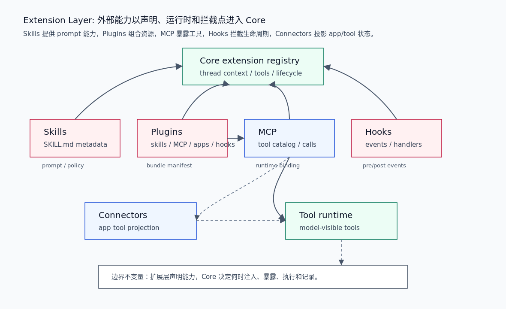

# 00. Extension 层总览

Extension 层负责把外部能力带入 Codex harness：skill 提供可触发的任务知识和 prompt 规则，plugin 组合 skills / MCP / apps / hooks，MCP 提供运行时工具与资源，hooks 拦截生命周期事件，connectors 把外部 app/tool 状态投影到可控的安装与调用模型。

## 读完你应掌握什么



开篇全局图：这张图把扩展层拆成五个面：`Skills` 解析 `SKILL.md` 元数据，`Plugins` 通过 manifest 组合资源，`MCP` 发布工具和资源 runtime，`Hooks` 在生命周期事件上运行 handler，`Connectors` 把 runtime tools 投影为 installed app state。它们最终都要通过 Core extension registry、MCP runtime 或 tool runtime 被 Core 接纳。对应源码锚点是 `repo/codex/codex-rs/skills/src/model.rs`、`repo/codex/codex-rs/plugin/src/manifest.rs`、`repo/codex/codex-rs/core-plugins/src/manifest.rs`、`repo/codex/codex-rs/codex-mcp/src/runtime.rs`、`repo/codex/codex-rs/hooks/src/engine/dispatcher.rs` 和 `repo/codex/codex-rs/connectors/src/runtime_projection.rs`。

- 能区分 skill、plugin、MCP、hook、connector 的职责。
- 能解释 plugin 为什么是资源 bundle，而不是运行时本身。
- 能从 skill/plugin 声明追到 Core 的 prompt/tool/context 注入边界。
- 能判断新增扩展能力应修改声明解析、加载管理、运行时绑定、hook 事件还是 connector policy。

## 这个模块解决什么问题

没有 Extension 层，Codex harness 的能力只能由内置 Core 代码决定。扩展层解决三个问题：

1. 能力声明：用户或 marketplace 如何声明一个 skill、plugin、MCP server、hook 或 connector。
2. 能力装载：系统如何解析、校验、合并、本地化或远程同步这些声明。
3. 能力运行：扩展如何进入模型可见 prompt、工具列表、hook 执行或 app/tool 状态。

这些能力必须被 Core 接纳和过滤，不能绕过 Core 直接执行外部动作。

## 源码锚点

- `repo/codex/codex-rs/skills/src/model.rs`：`SkillMetadata`、`SkillPolicy`、`SkillInterface`。
- `repo/codex/codex-rs/skills/src/parser.rs`：`SKILL.md` frontmatter 解析和修复。
- `repo/codex/codex-rs/plugin/src/manifest.rs`：插件 manifest 的通用资源结构。
- `repo/codex/codex-rs/core-plugins/src/manifest.rs`：本地 plugin manifest 解析、legacy/agent plugin 格式识别。
- `repo/codex/codex-rs/core-plugins/src/manager.rs`：plugin config、marketplace、remote installed plugin、load outcome 和 skill snapshots。
- `repo/codex/codex-rs/codex-mcp/src/runtime.rs`：线程级 `McpRuntimeInput` / `McpRuntime`。
- `repo/codex/codex-rs/hooks/src/types.rs`：hook payload、result、abort/continue 语义。
- `repo/codex/codex-rs/hooks/src/engine/dispatcher.rs`：handler 选择、同步/异步执行和 MCP hook 调用。
- `repo/codex/codex-rs/connectors/src/runtime_projection.rs`：MCP runtime tools 到 installed connector state 的投影。

## 核心抽象

| 抽象 | 所属面 | 职责 | 进入 Core 的方式 |
| --- | --- | --- | --- |
| `SkillMetadata` | Skills | 描述技能名称、说明、依赖、policy、scope 和 plugin 归属 | 被 skill loader 注入 prompt / skill selection |
| `PluginManifest` | Plugins | 声明插件包含的 skills、MCP servers、apps、hooks 和 UI metadata | 被 core-plugins loader 解析后拆成多个能力面 |
| `PluginsConfigInput` | Plugins | 汇总 config layer、provider、remote plugin、HTTP client 等装载输入 | 驱动 plugin manager 加载、同步和能力过滤 |
| `McpRuntimeInput` / `McpRuntime` | MCP | 线程级 MCP server 集合、tool catalog、event stream、auth 和 resource provenance | 通过 tool runtime 暴露模型可见工具和资源 |
| `HookPayload` / `HookResult` | Hooks | 描述 hook 事件输入和 continue/abort 结果 | 在 pre/post tool、session、stop 等生命周期点执行 |
| `ConnectorRuntimeTool` | Connectors | 把 MCP/tool metadata 投影成 installed connector callable 状态 | 影响 app/tool 可见性和 connector policy |

无需额外结构图：开篇 PNG 已展示这些抽象如何围绕 Core extension registry 和 tool runtime 组织。

## 核心代码片段

### 1. Skill 元数据定义了可触发能力的最小合同

Source: `repo/codex/codex-rs/skills/src/model.rs::SkillMetadata`
Line range: `repo/codex/codex-rs/skills/src/model.rs:6-36`

```rust
/// Metadata for one skill materialized on the host filesystem.
#[derive(Debug, Clone, PartialEq)]
pub struct SkillMetadata {
    pub name: String,
    pub description: String,
    pub short_description: Option<String>,
    pub interface: Option<SkillInterface>,
    pub dependencies: Option<SkillDependencies>,
    pub policy: Option<SkillPolicy>,
    /// Path to the SKILL.md file that declares this skill.
    pub path_to_skills_md: AbsolutePathBuf,
    pub scope: SkillScope,
    pub plugin_id: Option<String>,
    pub remote_plugin_id: Option<String>,
}

impl SkillMetadata {
    pub fn allows_implicit_invocation(&self) -> bool {
        self.policy
            .as_ref()
            .and_then(|policy| policy.allow_implicit_invocation)
            .unwrap_or(true)
    }

    pub fn matches_product_restriction_for_product(
        &self,
        restriction_product: Option<Product>,
    ) -> bool {
        matches_product_restriction(self.policy.as_ref(), restriction_product)
    }
}
```

这段说明 skill 是文件系统 materialized metadata，不只是 prompt 文本。它携带 policy、dependencies、scope、plugin id 和 remote plugin id，因此 selection 和注入可以按产品、隐式触发、插件归属过滤。

### 2. Plugin manifest 是多类资源的 bundle

Source: `repo/codex/codex-rs/plugin/src/manifest.rs::PluginManifest`
Line range: `repo/codex/codex-rs/plugin/src/manifest.rs:3-58`

```rust
/// Parsed plugin metadata parameterized by its resource locator representation.
///
/// Host loading uses absolute paths, while resolved packages replace them with
/// authority-bound locators before exposing the manifest to consumers.
#[derive(Debug, Clone, PartialEq, Eq)]
pub struct PluginManifest<Resource> {
    pub name: String,
    pub version: Option<String>,
    pub description: Option<String>,
    pub keywords: Vec<String>,
    pub paths: PluginManifestPaths<Resource>,
    pub interface: Option<PluginManifestInterface<Resource>>,
}

/// Component resources declared by a plugin manifest.
#[derive(Debug, Clone, PartialEq, Eq)]
pub struct PluginManifestPaths<Resource> {
    pub skills: Vec<Resource>,
    pub mcp_servers: Option<PluginManifestMcpServers<Resource>>,
    pub apps: Option<Resource>,
    pub hooks: Option<PluginManifestHooks<Resource>>,
}

/// MCP server declarations embedded in or referenced by a plugin manifest.
#[derive(Debug, Clone, PartialEq, Eq)]
pub enum PluginManifestMcpServers<Resource> {
    Path(Resource),
    Object(String),
}

/// Hook declarations embedded in or referenced by a plugin manifest.
#[derive(Debug, Clone, PartialEq, Eq)]
pub enum PluginManifestHooks<Resource> {
    Paths(Vec<Resource>),
    Inline(Vec<HooksFile>),
}
```

这段证明 plugin 是资源组合层：一个 plugin 可以声明 skills、MCP servers、apps 和 hooks。plugin 本身不是工具执行器；它的每类资源会被不同 loader/runtime 接收。

### 3. MCP runtime 持有线程级工具、资源和 auth 状态

无需图：本节关注 `McpRuntimeInput` 和 `McpRuntime` 的字段边界，开篇综合图已经展示 MCP 到 tool runtime 的路径；字段含义用源码片段更直接。

Source: `repo/codex/codex-rs/codex-mcp/src/runtime.rs::McpRuntimeInput`
Line range: `repo/codex/codex-rs/codex-mcp/src/runtime.rs:62-102`

```rust
/// Controls when one task starts its eligible MCP servers.
#[derive(Clone, Copy, Debug, PartialEq, Eq)]
pub enum McpStartupPolicy {
    /// Start configured servers when their task's MCP runtime is published.
    Eager,
    /// Start servers with cached tool definitions on first use.
    LazyWhenCached,
}

/// Everything needed to materialize one exact MCP configuration.
pub struct McpRuntimeInput {
    pub startup_policy: McpStartupPolicy,
    pub config: Arc<McpConfig>,
    pub plugins_available: bool,
    pub ready_selected_capability_roots: Vec<SelectedCapabilityRoot>,
    pub mcp_servers: HashMap<String, EffectiveMcpServer>,
    pub submit_id: String,
    pub tx_event: Option<Sender<Event>>,
    pub startup_cancellation_token: CancellationToken,
    pub runtime_context: McpRuntimeContext,
    pub codex_apps_tools_cache: ConnectorRuntimeManager<ToolInfo>,
    pub tool_catalog_cache: McpToolCatalogCache,
    pub codex_apps_tools_cache_key: ConnectorRuntimeContextKey,
    pub client_mcp_extensions: ClientMcpExtensions,
    pub auth: Option<CodexAuth>,
    pub auth_manager: Option<Arc<AuthManager>>,
    pub elicitation_reviewer: Option<ElicitationReviewerHandle>,
    pub elicitation_lifecycle: Option<ElicitationLifecycle>,
}

/// Owns all mutable MCP state for one Codex thread.
pub struct McpRuntime {
    current: ArcSwap<PublishedMcpRuntime>,
    event_stream_cancellation: Mutex<EventStreamCancellation>,
    reconnect_pending: AtomicBool,
    elicitation_router: ElicitationRequestRouter,
    resource_origins: Mutex<ResourceOrigins>,
}
```

这段说明 MCP 是线程级运行时，不是静态工具表。它同时处理启动策略、selected capability roots、server 集合、event sink、connector tool cache、client extensions、auth、elicitation 和 resource provenance。

### 4. Hook dispatcher 选择 handler 并处理同步/异步执行

Source: `repo/codex/codex-rs/hooks/src/engine/dispatcher.rs::select_handlers_and_execute_handlers`
Line range: `repo/codex/codex-rs/hooks/src/engine/dispatcher.rs:32-188`

```rust
pub(crate) fn select_handlers(
    handlers: &[ConfiguredHandler],
    event_name: HookEventName,
    matcher_input: Option<&str>,
) -> Vec<ConfiguredHandler> {
    let matcher_inputs = matcher_input.into_iter().collect::<Vec<_>>();
    select_handlers_for_matcher_inputs(handlers, event_name, &matcher_inputs)
}

pub(crate) fn select_handlers_for_matcher_inputs(
    handlers: &[ConfiguredHandler],
    event_name: HookEventName,
    matcher_inputs: &[&str],
) -> Vec<ConfiguredHandler> {
    // Check each configured handler once, even when several compatibility names
    // match the same regex. A hook like `apply_patch|Write|Edit` should run a
    // single time for one tool call, not once per matching alias.
    handlers
        .iter()
        .filter(|handler| handler.event_name == event_name)
        .filter(|handler| match event_name {
            HookEventName::PreToolUse
            | HookEventName::PermissionRequest
            | HookEventName::PostToolUse
            | HookEventName::SessionStart
            | HookEventName::SessionEnd
            | HookEventName::SubagentStart
            | HookEventName::SubagentStop
            | HookEventName::PreCompact
            | HookEventName::PostCompact => {
                if matcher_inputs.is_empty() {
                    matches_matcher(handler.matcher.as_deref(), /*input*/ None)
                } else {
                    matcher_inputs
                        .iter()
                        .any(|input| matches_matcher(handler.matcher.as_deref(), Some(input)))
                }
            }
            HookEventName::UserPromptSubmit | HookEventName::Stop | HookEventName::Interrupt => {
                true
            }
        })
        .cloned()
        .collect()
}
```

这段说明 hook 是事件匹配和 handler 执行系统。某些事件需要 matcher input，`Stop` / `Interrupt` / `UserPromptSubmit` 则直接触发。后续 `execute_handlers` 再区分 async、executor-scoped、command 和 MCP tool handler。

### 5. Connectors 把 runtime tools 投影为 installed app state

无需图：本节说明 connector projection 的输入/输出结构，开篇综合图已经展示 Connector 到 Tool runtime 的关系；代码片段中的 `ConnectorRuntimeTool` 和 `InstalledConnectorRuntime` 是更精确的数据形状证据。

Source: `repo/codex/codex-rs/connectors/src/runtime_projection.rs::installed_connector_runtime`
Line range: `repo/codex/codex-rs/connectors/src/runtime_projection.rs:10-90`

```rust
/// Connector-relevant fields from one runtime tool.
///
/// MCP owns the raw tool type and computes generic visibility/filter decisions. Connector
/// consumers adapt those fields into this view so connector policy stays out of MCP modules.
#[derive(Debug, Clone, Copy)]
pub struct ConnectorRuntimeTool<'a> {
    pub connector_id: Option<&'a str>,
    pub connector_name: Option<&'a str>,
    pub tool_name: &'a str,
    pub tool_title: Option<&'a str>,
    pub destructive_hint: Option<bool>,
    pub open_world_hint: Option<bool>,
    pub synthetic: bool,
    pub model_visible: bool,
}

/// Installed state derived from one committed connector runtime snapshot.
///
/// `enabled` and `callable` include local and managed app/tool configuration. Global feature and
/// workspace policy remain host concerns and are applied by the caller.
#[derive(Debug, Clone, PartialEq, Eq)]
pub struct InstalledConnectorRuntime {
    pub id: String,
    pub runtime_name: Option<String>,
    pub enabled: bool,
    pub callable: bool,
}

/// Projects raw runtime tools into one row per installed connector.
pub fn installed_connector_runtime<'a>(
    config_layer_stack: &ConfigLayerStack,
    tools: impl IntoIterator<Item = ConnectorRuntimeTool<'a>>,
) -> Vec<InstalledConnectorRuntime> {
    let policy = AppToolPolicyEvaluator::new(config_layer_stack);
    let mut apps = BTreeMap::<String, (Option<String>, bool)>::new();
    // ...
    apps.into_iter()
        .map(|(id, (runtime_name, callable))| InstalledConnectorRuntime {
            enabled: policy.app_enabled(&id),
            id,
            runtime_name,
            callable,
        })
        .collect()
}
```

这段说明 connector policy 被有意放在 MCP 外部：MCP 拥有原始工具，connector consumer 把相关 metadata 投影成 app 是否 enabled/callable，避免 MCP runtime 被 app policy 污染。

## 主流程


无需另加第二张流程图；本节也无需代码片段，因为扩展层主流程的关键代码证据已经在上方 `SkillMetadata`、`PluginManifest`、`McpRuntimeInput`、hook dispatcher 和 connector projection 片段中覆盖。开篇图已表达声明、装载、运行时、拦截和投影五条路径。本节按一个插件启用后的路径展开。

1. 插件 manifest 声明 skills、MCP servers、apps、hooks 和 interface metadata。
2. core-plugins loader/manager 读取本地或 marketplace 来源，解析 manifest，应用 policy、remote sync 和配置层。
3. skill 资源进入 skill loader，形成 `SkillMetadata`，用于 prompt 注入、skill selection 或显式提及。
4. MCP server 声明进入 `McpRuntimeInput`，线程级 runtime 根据 startup policy、auth、selected capability roots 和 client extensions 组织 tool catalog。
5. hooks 资源进入 hook registry / engine，在 user prompt、tool use、permission request、compact、stop 等事件上选择 handler 并执行。
6. connectors 从 MCP runtime tool metadata 中投影 installed connector state，决定 app/tool 是否 enabled/callable。
7. Core extension registry 和 tool runtime 最终决定哪些 prompt fragment、工具或 lifecycle effects 进入当前 thread / turn。

## 失败模式与边界条件


这张图也展示了扩展层的风险入口：任何扩展能力都必须经过声明解析、policy/filter 和 Core 接纳，不能从外部直接执行。

| 风险 | 所属扩展面 | 代码锚点 | 结果 |
| --- | --- | --- | --- |
| skill frontmatter 不合法 | Skills | `repo/codex/codex-rs/skills/src/parser.rs::parse_skill_frontmatter_metadata` | skill 不应进入隐式触发或 prompt 注入 |
| plugin manifest 路径含糊 | Plugins | `repo/codex/codex-rs/plugin/src/manifest.rs::PluginManifestPaths` | skills/MCP/apps/hooks 资源无法可靠解析 |
| MCP runtime 与 auth/elicitation 脱节 | MCP | `repo/codex/codex-rs/codex-mcp/src/runtime.rs::McpRuntimeInput` | 工具可见但调用失败，或需要授权时无 review 路径 |
| hook matcher 重复执行 | Hooks | `repo/codex/codex-rs/hooks/src/engine/dispatcher.rs::select_handlers_for_matcher_inputs` | 同一 tool call 被多个兼容别名重复触发 |
| connector policy 污染 MCP | Connectors | `repo/codex/codex-rs/connectors/src/runtime_projection.rs::ConnectorRuntimeTool` | app enable/callable 规则与 MCP 通用工具可见性耦合过深 |

无需代码片段：风险表中的核心结构和选择逻辑已经在上方代码证据中覆盖。

## 图示

本篇使用 `../../image/extension-points/harness-extension-layer-v1.png` 作为开篇综合图和主流程图。图片已放在开篇和主流程附近；本节只作为资产说明，不作为主要阅读路径。

## 复设计练习

设计一个 coding agent 的 Extension 层，要求支持 skill、plugin、MCP、hook 和 connector：

1. skill 元数据要包含哪些字段，如何控制隐式触发？
2. plugin manifest 如何引用多类资源，又如何避免资源路径逃逸？
3. MCP runtime 应该在线程级还是全局级持有？为什么？
4. hook handler 如何决定 continue、block 或 abort？
5. connector policy 如何影响 app/tool 可见性，又不污染 MCP runtime？

一个合理设计应该能明确“声明解析”和“运行时执行”的边界，并说明扩展能力进入模型上下文或工具列表前经过哪些过滤。

## 检查题

1. `SkillMetadata` 中的 `scope`、`plugin_id`、`remote_plugin_id` 为什么重要？
2. `PluginManifestPaths` 为什么同时允许 skills、MCP servers、apps 和 hooks？
3. `McpRuntimeInput` 为什么包含 auth、elicitation、tool catalog cache 和 selected capability roots？
4. hook dispatcher 为什么要避免 `apply_patch|Write|Edit` 这类兼容 matcher 对同一 tool call 重复执行？
5. connector runtime projection 为什么说“Connector policy stays out of MCP modules”？

### 答案要点

1. 它们决定 skill 的来源、作用范围、插件归属和远端身份，影响选择、展示、权限和调试。
2. plugin 是能力 bundle，可以同时提供 prompt 技能、工具服务、应用资源和生命周期拦截点；统一 manifest 便于 marketplace 和本地安装管理。
3. MCP runtime 是线程级能力，必须知道当前 config、授权状态、capability roots、client extensions、tool catalog 和 elicitation review 路径，才能安全暴露工具。
4. 一个 hook 可能为了兼容多个工具名写多个 alias，但同一次 tool call 只应触发一次 handler，否则会重复拦截或重复副作用。
5. MCP 负责通用工具连接和可见性，connector policy 负责 app 层 enable/callable 投影；分离后 MCP 不需要理解每个 app 的安装策略。

## Follow-up Slots

- 已落地：`docs/extension/01-skills-plugins-mcp-hooks.md` 串联 skill 选择、plugin bundle、MCP binding / prepared call、hook result 和 connector projection。
- 后续可继续拆分 plugin marketplace、MCP auth/elicitation、hook schema 和 connector policy 的专项深挖。
