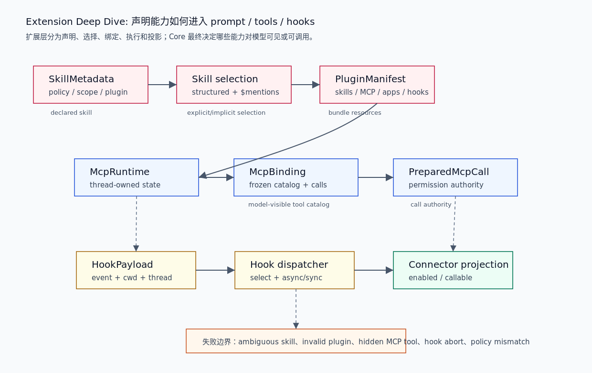

# 01. Skills / Plugins / MCP / Hooks 扩展链路

本文补足 Extension 层不应只停在 map 的部分：一个扩展能力如何被声明为 skill 或 plugin，如何在输入里被选择，如何转成 MCP runtime/tool binding，如何被 hook 生命周期拦截，以及 connector policy 如何把 tool metadata 投影成 app 可见状态。

## 读完你应掌握什么



开篇全局图：从上往下读。第一层是声明与选择：`SkillMetadata`、skill selection、`PluginManifest`。第二层是运行时工具：`McpRuntime`、`McpBinding`、`PreparedMcpCall`。第三层是生命周期和 app/tool 投影：`HookPayload`、hook dispatcher、connector projection。对应源码锚点是 `repo/codex/codex-rs/skills/src/model.rs`、`repo/codex/codex-rs/skills/src/selection.rs`、`repo/codex/codex-rs/plugin/src/manifest.rs`、`repo/codex/codex-rs/codex-mcp/src/runtime.rs`、`repo/codex/codex-rs/codex-mcp/src/binding.rs`、`repo/codex/codex-rs/hooks/src/types.rs`、`repo/codex/codex-rs/hooks/src/engine/dispatcher.rs` 和 `repo/codex/codex-rs/connectors/src/runtime_projection.rs`。

- 能区分 skill metadata、plugin bundle、MCP runtime、hook 和 connector projection。
- 能解释显式 skill 选择和文本 `$skill` mention 如何合并。
- 能说明 MCP binding 为什么要冻结 tool catalog 和 permission authority。
- 能判断 hook 的 continue/abort 语义如何影响扩展执行。
- 能解释 connector policy 为什么不放进 MCP runtime。

## 这个模块解决什么问题

Extension 层要解决的是“能力从哪里来、如何进入模型、如何被安全调用”。如果没有这层，所有能力都只能硬编码在 Core；如果这层边界不清，外部能力可能绕过 tool runtime、approval、MCP permission 或 hook 生命周期。

本文按五个阶段解释扩展链路：

1. 声明：skill 和 plugin 描述能力及其资源。
2. 选择：用户输入或结构化提及选择 skill。
3. 绑定：MCP runtime 冻结 server/tool/client/permission。
4. 拦截：hooks 在 lifecycle event 上执行 handler。
5. 投影：connectors 把 tool metadata 变成 app enabled/callable 状态。

## 源码锚点

- `repo/codex/codex-rs/skills/src/model.rs::SkillMetadata`：skill 元数据、policy、scope、plugin 归属。
- `repo/codex/codex-rs/skills/src/selection.rs::collect_explicit_skill_mentions`：结构化 skill input 和文本 `$skill` mention 合并。
- `repo/codex/codex-rs/skills/src/invocation.rs::detect_implicit_skill_invocation_for_command`：命令读文档/跑脚本时识别 implicit skill access。
- `repo/codex/codex-rs/plugin/src/manifest.rs::PluginManifest`：plugin bundle 声明 skills / MCP / apps / hooks。
- `repo/codex/codex-rs/codex-mcp/src/runtime.rs::McpRuntimeInput`：线程级 MCP runtime 输入。
- `repo/codex/codex-rs/codex-mcp/src/binding.rs::McpBinding`：冻结 model-visible tool catalog 和 prepared call。
- `repo/codex/codex-rs/codex-mcp/src/binding.rs::PreparedMcpCall`：捕获 call authority。
- `repo/codex/codex-rs/hooks/src/types.rs::HookPayload`：hook event payload 和 abort/continue 结果。
- `repo/codex/codex-rs/hooks/src/engine/dispatcher.rs::select_handlers_for_matcher_inputs`：事件匹配、handler 去重和同步/异步执行。
- `repo/codex/codex-rs/connectors/src/runtime_projection.rs::installed_connector_runtime`：runtime tool 到 installed connector 状态投影。

## 核心抽象

| 抽象 | 所属能力 | 解决的问题 | 失败风险 |
| --- | --- | --- | --- |
| `SkillMetadata` | Skills | 声明 skill 名称、说明、policy、scope、plugin 来源 | 模糊触发、错误产品范围 |
| `collect_explicit_skill_mentions` | Skills | 合并结构化 skill input 和 `$skill` 文本 mention | 重复选择、歧义选择 |
| `PluginManifest` | Plugins | 把 skills/MCP/apps/hooks 组合成 bundle | 路径解析和资源归属错误 |
| `McpRuntimeInput` | MCP | 线程级 server/tool/auth/elicitation/runtime context | 工具可见但无法授权调用 |
| `McpBinding` | MCP | 冻结某次 sampling 可见的 tool catalog 和 clients | 工具列表漂移 |
| `PreparedMcpCall` | MCP | 把 tool call 绑定到权限和 server metadata | 调用时权限来源丢失 |
| `HookPayload` / `HookResult` | Hooks | lifecycle event 输入和 continue/abort 结果 | hook 失败语义不明确 |
| `ConnectorRuntimeTool` | Connectors | 从 runtime tool 提取 app policy 相关字段 | MCP runtime 被 app policy 污染 |

无需额外图：开篇图已经展示这些抽象从声明到投影的顺序，本节表格补充每个抽象的责任。

## 核心代码片段

### 1. Skill metadata 是扩展能力的声明合同

无需图：本节证明 skill 声明数据结构，开篇图已经展示其位于声明阶段。

Source: `repo/codex/codex-rs/skills/src/model.rs::SkillMetadata`
Line range: `repo/codex/codex-rs/skills/src/model.rs:6-36`

```rust
/// Metadata for one skill materialized on the host filesystem.
#[derive(Debug, Clone, PartialEq)]
pub struct SkillMetadata {
    pub name: String,
    pub description: String,
    pub short_description: Option<String>,
    pub interface: Option<SkillInterface>,
    pub dependencies: Option<SkillDependencies>,
    pub policy: Option<SkillPolicy>,
    /// Path to the SKILL.md file that declares this skill.
    pub path_to_skills_md: AbsolutePathBuf,
    pub scope: SkillScope,
    pub plugin_id: Option<String>,
    pub remote_plugin_id: Option<String>,
}

impl SkillMetadata {
    pub fn allows_implicit_invocation(&self) -> bool {
        self.policy
            .as_ref()
            .and_then(|policy| policy.allow_implicit_invocation)
            .unwrap_or(true)
    }

    pub fn matches_product_restriction_for_product(
        &self,
        restriction_product: Option<Product>,
    ) -> bool {
        matches_product_restriction(self.policy.as_ref(), restriction_product)
    }
}
```

这段说明 skill 不只是 Markdown 文档。它带有 policy、scope、plugin id、remote plugin id 和依赖信息，后续选择和注入可以用这些字段过滤。

### 2. 显式 skill 选择流程合并路径和 `$skill` mention

无需图：本节证明 selection 算法，开篇图已经展示 selection 位于声明之后。

Source: `repo/codex/codex-rs/skills/src/selection.rs::collect_explicit_skill_mentions`
Line range: `repo/codex/codex-rs/skills/src/selection.rs:31-109`

```rust
/// Collect explicitly mentioned skills from structured and text mentions.
///
/// Structured `UserInput::Skill` selections are resolved first by path against
/// enabled skills. Text inputs are then scanned to extract `$skill-name` tokens, and we
/// iterate loaded skills in their existing order to preserve prior ordering semantics.
/// Explicit paths match either a skill's canonical identity or its logical discovery
/// path, and plain names are only used when the match is unambiguous.
pub fn collect_explicit_skill_mentions(
    inputs: &[UserInput],
    loaded_skills: &impl ExplicitSkillLookup,
    connector_slug_counts: &HashMap<String, usize>,
) -> Vec<SkillMetadata> {
    let skill_name_counts =
        build_skill_name_counts(loaded_skills.skills(), loaded_skills.disabled_paths()).0;

    let selection_context = SkillSelectionContext {
        loaded_skills,
        skill_name_counts: &skill_name_counts,
        connector_slug_counts,
    };
    let mut selected: Vec<SkillMetadata> = Vec::new();
    let mut seen_names: HashSet<String> = HashSet::new();
    let mut seen_paths: HashSet<AbsolutePathBuf> = HashSet::new();
    let mut blocked_plain_names: HashSet<String> = HashSet::new();

    for input in inputs {
        if let UserInput::Skill { name, path, .. } = input {
            blocked_plain_names.insert(name.clone());
            let Ok(path) = AbsolutePathBuf::relative_to_current_dir(path) else {
                continue;
            };
            // ...
            selected.push(skill.clone());
        }
    }

    for input in inputs {
        if let UserInput::Text { text, .. } = input {
            let mentioned_names = extract_tool_mentions(text);
            select_skills_from_mentions(
                &selection_context,
                &blocked_plain_names,
                &mentioned_names,
                &mut seen_names,
                &mut seen_paths,
                &mut selected,
            );
        }
    }
    selected
}
```

这段说明显式 skill 选择有两条来源：结构化 `UserInput::Skill` 和文本 `$skill-name`。路径优先、plain name 要求不歧义，并且用 seen sets 去重。

### 3. Plugin manifest 组合多类扩展资源

无需图：本节证明 plugin bundle 结构，开篇图已经展示 plugin 在声明阶段。

Source: `repo/codex/codex-rs/plugin/src/manifest.rs::PluginManifest`
Line range: `repo/codex/codex-rs/plugin/src/manifest.rs:3-38`

```rust
/// Parsed plugin metadata parameterized by its resource locator representation.
///
/// Host loading uses absolute paths, while resolved packages replace them with
/// authority-bound locators before exposing the manifest to consumers.
#[derive(Debug, Clone, PartialEq, Eq)]
pub struct PluginManifest<Resource> {
    pub name: String,
    pub version: Option<String>,
    pub description: Option<String>,
    pub keywords: Vec<String>,
    pub paths: PluginManifestPaths<Resource>,
    pub interface: Option<PluginManifestInterface<Resource>>,
}

/// Component resources declared by a plugin manifest.
#[derive(Debug, Clone, PartialEq, Eq)]
pub struct PluginManifestPaths<Resource> {
    pub skills: Vec<Resource>,
    pub mcp_servers: Option<PluginManifestMcpServers<Resource>>,
    pub apps: Option<Resource>,
    pub hooks: Option<PluginManifestHooks<Resource>>,
}

/// Hook declarations embedded in or referenced by a plugin manifest.
#[derive(Debug, Clone, PartialEq, Eq)]
pub enum PluginManifestHooks<Resource> {
    Paths(Vec<Resource>),
    Inline(Vec<HooksFile>),
}
```

这段说明 plugin 是资源组合层。一个 plugin 可同时带 skills、MCP servers、apps 和 hooks；后续由 loader/manager 分别把这些资源接入对应系统。

### 4. MCP binding 冻结可见工具和 prepared call

无需图：本节证明 MCP binding 的冻结边界，开篇图已经展示 `McpRuntime -> McpBinding -> PreparedMcpCall`。

Source: `repo/codex/codex-rs/codex-mcp/src/binding.rs::McpBinding`
Line range: `repo/codex/codex-rs/codex-mcp/src/binding.rs:30-97`

```rust
/// The exact tool catalog and execution handles shared by compatible sampling steps.
pub struct McpBinding {
    connections: Arc<McpConnectionSet>,
    clients: Arc<McpBindingClients>,
    config: Arc<McpConfig>,
    plugins_available: bool,
    tools: Vec<ToolInfo>,
    calls: HashMap<(String, String), PreparedMcpCall>,
}

impl McpBinding {
    pub(crate) fn new(
        connections: Arc<McpConnectionSet>,
        clients: Arc<McpBindingClients>,
        config: Arc<McpConfig>,
        plugins_available: bool,
        tools: Vec<ToolInfo>,
        calls: HashMap<(String, String), PreparedMcpCall>,
    ) -> Self {
        Self {
            connections,
            clients,
            config,
            plugins_available,
            tools,
            calls,
        }
    }

    /// Returns the frozen model-visible catalog captured for this binding.
    pub fn tools(&self) -> &[ToolInfo] {
        &self.tools
    }

    /// Binds a model-visible call to the exact client and metadata in this binding.
    pub fn prepare_call(&self, server: &str, tool: &str) -> Option<PreparedMcpCall> {
        self.calls
            .get(&(server.to_string(), tool.to_string()))
            .filter(|call| crate::tool_is_model_visible(call.tool_info()))
            .cloned()
    }
}
```

这段说明 MCP 工具不是每次调用才临时查全局状态。`McpBinding` 冻结当次 sampling 可见的工具目录、clients、config 和 prepared calls，避免工具列表和调用权限漂移。

### 5. Prepared MCP call 保留权限来源

无需图：本节证明 call authority，开篇图已经展示其位于 MCP 调用边界。

Source: `repo/codex/codex-rs/codex-mcp/src/binding.rs::PreparedMcpCall`
Line range: `repo/codex/codex-rs/codex-mcp/src/binding.rs:168-229`

```rust
/// A call bound to the exact client, tool, timeout, and server metadata seen by
/// one [`McpBinding`].
#[derive(Clone)]
pub struct PreparedMcpCall {
    connections: Arc<McpConnectionSet>,
    client: Arc<ManagedClient>,
    config: Arc<McpConfig>,
    catalog_revision: u64,
    tool_info: ToolInfo,
    server_name: String,
    server_metadata: McpServerMetadata,
    plugin_id: Option<String>,
    selected_plugin_server: bool,
}

impl PreparedMcpCall {
    pub(crate) fn new(
        connections: Arc<McpConnectionSet>,
        client: Arc<ManagedClient>,
        config: Arc<McpConfig>,
        catalog_revision: u64,
        tool_info: ToolInfo,
        server_metadata: McpServerMetadata,
        plugin_id: Option<String>,
        selected_plugin_server: bool,
    ) -> Option<Self> {
        let server_name = tool_info.server_name.clone();
        config.permission_profile_for_server(&server_name)?;
        Some(Self { connections, client, config, catalog_revision, tool_info, server_name, server_metadata, plugin_id, selected_plugin_server })
    }

    /// Returns the owner permissions validated when this immutable call was prepared.
    pub fn permission_profile(&self) -> &PermissionProfile {
        let Some(permission_profile) = self.config.permission_profile_for_server(&self.server_name)
        else {
            unreachable!("prepared MCP calls retain their immutable permission authority");
        };
        permission_profile
    }
}
```

这段说明 prepared call 创建时必须能从 config 找到 server permission profile；后续调用时 `permission_profile()` 依赖这个不变量，不重新猜权限来源。

### 6. Hook payload 和 result 固定生命周期拦截语义

无需图：本节证明 hook wire shape 和 abort/continue 语义，开篇图已经展示 hook 位于生命周期层。

Source: `repo/codex/codex-rs/hooks/src/types.rs::HookPayload`
Line range: `repo/codex/codex-rs/hooks/src/types.rs:12-98`

```rust
pub type HookFn = Arc<dyn for<'a> Fn(&'a HookPayload) -> BoxFuture<'a, HookResult> + Send + Sync>;

#[derive(Debug)]
pub enum HookResult {
    /// Success: hook completed successfully.
    Success,
    /// FailedContinue: hook failed, but other subsequent hooks should still execute and the
    /// operation should continue.
    FailedContinue(Box<dyn std::error::Error + Send + Sync + 'static>),
    /// FailedAbort: hook failed, other subsequent hooks should not execute, and the operation
    /// should be aborted.
    FailedAbort(Box<dyn std::error::Error + Send + Sync + 'static>),
}

impl HookResult {
    pub fn should_abort_operation(&self) -> bool {
        matches!(self, Self::FailedAbort(_))
    }
}

#[derive(Debug, Serialize, Clone)]
#[serde(rename_all = "snake_case")]
pub struct HookPayload {
    pub session_id: ThreadId,
    pub cwd: AbsolutePathBuf,
    #[serde(skip_serializing_if = "Option::is_none")]
    pub client: Option<String>,
    #[serde(serialize_with = "serialize_triggered_at")]
    pub triggered_at: DateTime<Utc>,
    pub hook_event: HookEvent,
}
```

这段说明 hook 不只是通知机制。`HookResult` 明确区分 success、失败但继续、失败并 abort；`HookPayload` 固定 session、cwd、client、时间和 event。

## 主流程


无需代码片段：主流程关键结构和不变量已在上方 skill selection、plugin manifest、MCP binding、prepared call 和 hook payload 片段中覆盖。

1. skill 由 `SKILL.md` frontmatter 解析为 `SkillMetadata`，携带 policy、scope、dependencies、plugin id。
2. 用户输入中的结构化 skill item 和文本 `$skill` mention 被 `collect_explicit_skill_mentions` 合并，并按路径、名称歧义、enabled 状态去重。
3. plugin manifest 把 skills、MCP servers、apps、hooks 声明在同一 bundle 中，loader 再分发给对应系统。
4. MCP runtime 根据线程配置、plugin availability、selected capability roots、auth、elicitation 和 tool catalog 构造 binding。
5. `McpBinding` 冻结某次 sampling 可见工具和 prepared call，`PreparedMcpCall` 保存 server permission authority。
6. hook 系统在生命周期事件上用 payload 执行 handler，`FailedAbort` 可中断操作，`FailedContinue` 则保留失败但继续。
7. connectors 从 runtime tools 投影 installed app state，使 app enabled/callable 规则不污染 MCP 通用 runtime。

## 失败模式与边界条件

无需图：本节使用 failure matrix 表达“失败点 -> 捕获位置 -> 可见结果 -> 恢复语义”，开篇扩展链路图已经覆盖 skill、plugin、MCP、hook 和 connector 的层级位置。

| 失败点 | 捕获位置 | 用户/模型可见结果 | 恢复语义 |
| --- | --- | --- | --- |
| skill 名称歧义 | skill selection / name counts | 不选择 plain name 或只保留明确路径 | 用户改用结构化 skill 或完整路径 |
| skill policy 禁止隐式触发 | `SkillMetadata::allows_implicit_invocation` | 不自动注入该 skill | 用户显式触发或调整 policy |
| plugin manifest 资源路径错误 | plugin manifest loader | plugin 不完整或加载失败 | 修 manifest / marketplace 包 |
| MCP tool 不可见 | `McpBinding::prepare_call` 过滤 | 模型不能调用该工具 | 检查 tool visibility / config |
| prepared call 缺 permission profile | `PreparedMcpCall::new` 返回 `None` | call 不可准备 | 修 MCP server permission profile |
| hook `FailedAbort` | hook engine / result | 当前操作中断 | 修 hook 或关闭对应 hook |
| connector policy 禁用 app | `installed_connector_runtime` | app enabled/callable 为 false | 调整 app/tool policy |

无需代码片段：失败表对应的结构和分支已在本篇代码证据中出现。

## 行为证据矩阵

| Behavior rule | Source anchor | Test anchor | Reader conclusion |
| --- | --- | --- | --- |
| Skill metadata 记录 policy、scope 和 plugin 来源 | `repo/codex/codex-rs/skills/src/model.rs::SkillMetadata` | `repo/codex/codex-rs/skills/src/model_tests.rs` | skill 选择和注入可以按来源、产品和隐式触发策略过滤。 |
| 显式 skill 选择先处理结构化路径，再处理文本 mention | `repo/codex/codex-rs/skills/src/selection.rs::collect_explicit_skill_mentions` | `repo/codex/codex-rs/skills/src/selection_tests.rs` | 结构化输入比 plain name 更可靠，文本 mention 需要歧义处理。 |
| Plugin manifest 是资源 bundle，不是 runtime | `repo/codex/codex-rs/plugin/src/manifest.rs::PluginManifest` | `repo/codex/codex-rs/plugin/src/plugin_id_tests.rs` | plugin 负责声明 skills/MCP/apps/hooks，具体执行由对应 runtime 处理。 |
| MCP binding 冻结一次 sampling 可见工具目录 | `repo/codex/codex-rs/codex-mcp/src/binding.rs::McpBinding` | `repo/codex/codex-rs/codex-mcp/src/binding_tests.rs` | 工具列表和 prepared call 不应在同一次 sampling 中漂移。 |
| Prepared MCP call 必须保留 permission authority | `repo/codex/codex-rs/codex-mcp/src/binding.rs::PreparedMcpCall` | `source-only` | MCP 调用要能回到创建时的 server permission profile。 |
| Hook result 明确 continue 与 abort 语义 | `repo/codex/codex-rs/hooks/src/types.rs::HookResult` | `repo/codex/codex-rs/hooks/src/engine/mod_tests.rs` | hook 失败不会被模糊处理，是否中断操作由结果类型决定。 |

## 图示

本篇的关键图示是 `../../image/extension-points/extension-skills-plugins-mcp-hooks-v1.png`，已在开篇和主流程附近引用。它补充 `00-extension-map.md` 的总览图，把扩展声明、选择、MCP 绑定、hook 和 connector 投影串成实际链路。

## 复设计练习

设计一个可扩展 agent runtime，要求支持 skill、plugin、MCP、hook 和 connector：

1. Skill 的 metadata 必须包含哪些字段，才能支持选择、权限和来源追踪？
2. Plugin manifest 如何组合资源，又如何避免运行时直接执行未解析资源？
3. MCP binding 为什么应该在一次 sampling step 冻结工具列表？
4. Prepared call 需要捕获哪些权限和 server metadata？
5. Hook 失败何时应继续，何时应 abort？
6. Connector policy 如何保持在 MCP runtime 外部？

## 检查题

1. `SkillMetadata` 为什么要有 `plugin_id` 和 `remote_plugin_id`？
2. 结构化 skill input 为什么优先于 `$skill-name` 文本 mention？
3. Plugin manifest 为什么不是工具 runtime？
4. `McpBinding::prepare_call` 为什么只返回 model-visible call？
5. `PreparedMcpCall::new` 为什么要检查 `permission_profile_for_server`？
6. `HookResult::FailedContinue` 和 `FailedAbort` 的差别是什么？

### 答案要点

1. 它们记录 skill 来源和远端身份，支持插件归属、调试、展示、权限和远程 marketplace 同步。
2. 结构化 input 带路径，歧义更少；文本 mention 只能靠名字匹配，必须处理重复、disabled 和 connector slug 冲突。
3. plugin 是资源 bundle，声明 skills/MCP/apps/hooks；具体运行由 skill loader、MCP runtime、hook engine 等系统负责。
4. 模型只能调用对它可见的工具；app-only 或被过滤的工具不应通过 model-visible path 调用。
5. prepared call 必须在准备阶段绑定权限来源，否则实际调用时无法证明该 server/tool 的 owner permission。
6. `FailedContinue` 表示 hook 失败但后续 hook 和原操作继续；`FailedAbort` 表示停止后续 hook 并中断操作。

## Follow-up Slots

- 深挖 plugin marketplace、remote installed plugin sync 和 provenance。
- 深挖 MCP auth elicitation、resource origins 和 event streams。
- 深挖 hooks schema、command runner、MCP hook runner 和 output spill。
