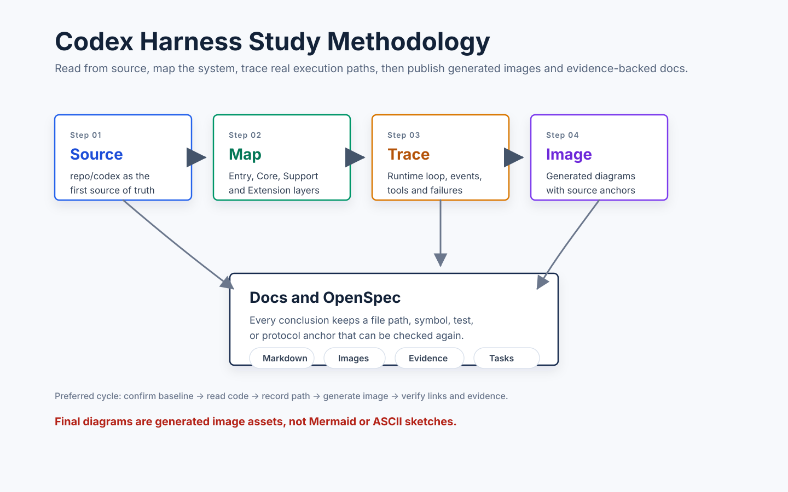

# Codex Harness 分析方法论

本文定义后续如何系统学习和分析 `openai/codex` harness。目标不是写使用教程，而是把 harness 的实现机制、设计取舍、边界条件和可验证证据沉淀成可持续维护的文档体系。



## 1. 分析目标

后续分析要回答四类问题：

- Harness 如何接收用户输入、组织上下文、驱动模型和工具执行。
- Runtime loop 如何处理事件、状态、审批、错误和恢复。
- Tool、sandbox、patch、MCP、hooks、skills 等扩展面如何接入核心循环。
- Codex 的设计思想如何在源码结构中体现，包括边界划分、持久化、恢复和安全策略。

每个结论必须能回到本地源码快照复查，避免只写概念性总结。

## 2. 版本基线

分析开始前必须确认源码快照：

- 本地路径：`repo/codex/`
- 快照记录：`docs/source-snapshot.md`
- 版本字段：来源、分支或 release、commit、获取时间、校验方式。

后续如果更新 `repo/codex/`，必须先更新 `docs/source-snapshot.md`，再复核所有受影响文档。任何没有版本锚点的“当前实现”结论都只能标为待确认。

## 3. 分层阅读模型

采用四层模型推进，不先陷入单个函数细节：

| 层级 | 关注点 | 典型输出 |
| --- | --- | --- |
| Entry | CLI、TUI、app-server、启动参数、会话入口 | 入口地图、启动路径图 |
| Core | runtime loop、模型请求、事件分发、任务状态推进 | 主循环分析、状态图 |
| Support | protocol、rollout、thread store、context、memory、配置 | 数据结构与持久化边界 |
| Extension | tools、sandbox、approval、apply_patch、MCP、skills、hooks | 工具执行链与扩展点分析 |

阅读顺序先横向建立地图，再纵向深挖关键链路。`app-server` 需要出现两次：早期作为入口/控制面概念，后期作为独立专题深入其 protocol、client、transport、daemon 边界。

## 4. 单篇专题分析模板

每篇专题文档都按同一模板沉淀：

```text
# <专题名>

## 研究问题
- 本文回答什么问题。
- 不回答什么问题。

## 源码锚点
- 入口文件：
- 核心类型/函数：
- 关键测试：

## 阅读路径
- 从哪里开始读。
- 中间经过哪些模块。
- 哪些分支或错误路径必须看。

## 机制拆解
- 输入是什么。
- 状态如何变化。
- 输出是什么。
- 失败如何处理。

## 图像资产
- 本文需要哪些图。
- 每张图的文件路径。
- 图与源码锚点的对应关系。

## 结论
- 稳定结论。
- 仍需验证的问题。

## Follow-up Slots
- 后续可以继续展开但本轮不展开的问题。
```

## 5. 源码证据规范

每个关键判断至少给出一条源码锚点：

- 文件路径，例如 `repo/codex/codex-rs/core/src/...`。
- 类型、函数、枚举、测试名或协议消息名。
- 必要时补充 `rg` 查询词或验证命令。

证据强度按以下顺序排序：

1. 测试用例和公开协议定义。
2. 核心类型、trait、状态枚举和构造函数。
3. 调用链入口和错误处理分支。
4. README、注释和配置示例。

如果证据不足，文档必须标记为“待验证”，不能写成确定结论。

## 6. 图片生成规范

这是强约束：流程图、架构图、状态图、时序图最终必须是图片文件。

- 图片根目录：`image/`
- 子目录按文档或主题拆分，例如 `image/runtime-loop/`、`image/tool-sandbox/`。
- 推荐文件命名：`<topic>-<purpose>-v<version>.svg`；需要位图交付时再导出同名 `.png`。
- 文档引用使用相对路径，例如 ``。
- 如果用 DSL 生成图片，DSL 源文件应放在同一子目录，例如 `runtime-loop-main-v1.mmd` 和 `runtime-loop-main-v1.svg`。
- 最终文档不能只保留 Mermaid、PlantUML、ASCII 图或伪代码图。

图片验收要同时检查：

- 图片文件存在。
- Markdown 引用路径有效。
- 图片表达的是实际源码链路，而不是泛化概念图。
- 图片源文件和导出图片能对应。

## 7. 阶段推进方法

采用“先地图，后链路，再专题，最后实验”的节奏：

| 阶段 | 目标 | 主要产出 |
| --- | --- | --- |
| Stage 0 | 固化项目结构、OpenSpec、源码快照和分析方法论 | `README.md`、`AGENTS.md`、`docs/methodology.md`、`docs/source-snapshot.md` |
| Stage 1 | 建立 harness 全局地图 | `docs/harness-overview.md` 和总览图片 |
| Stage 2 | 深挖 runtime loop 与事件模型 | `docs/runtime-loop-analysis.md` 和主循环图片 |
| Stage 3 | 深挖 tools、sandbox、approval、apply_patch | `docs/tool-sandbox-analysis.md`、实验草案 |
| Stage 4 | 深挖 protocol、rollout、state、memory | `docs/protocol-and-events.md`、`docs/state-and-memory.md` |
| Stage 5 | 深挖 extension points | `docs/extension-points.md` |
| Stage 6 | 基于理解做最小实验 | `examples/`、`tests/`、验证记录 |

实验不早于 Stage 3。理解链路稳定前，不用实验代码替代源码阅读。

## 8. 每轮工作流

每次推进一个专题时按以下顺序：

1. 更新或确认 OpenSpec 任务项。
2. 读取源码锚点并记录阅读路径。
3. 写 Markdown 正文草稿。
4. 列出需要的图片资产。
5. 生成图片并放入 `image/<topic>/`。
6. 在 Markdown 中引用图片。
7. 做自查：源码锚点、图片路径、结论边界、待验证项。
8. 必要时让 reviewer 只读检查文档是否偏离源码。

## 9. 完成标准

一个专题只有同时满足以下条件才算完成：

- Markdown 正文存在，且覆盖研究问题。
- 关键流程/架构/状态表达已生成图片并引用。
- 每个核心结论都有源码锚点。
- 待验证项没有被写成确定事实。
- 相关 OpenSpec task 已更新。
- 链接、图片路径和基本格式通过检查。

本轮初始化的完成标准较窄：项目结构、方法论、图片规范、OpenSpec change、源码快照记录齐备即可；不要求完成所有 harness 深度分析正文。
