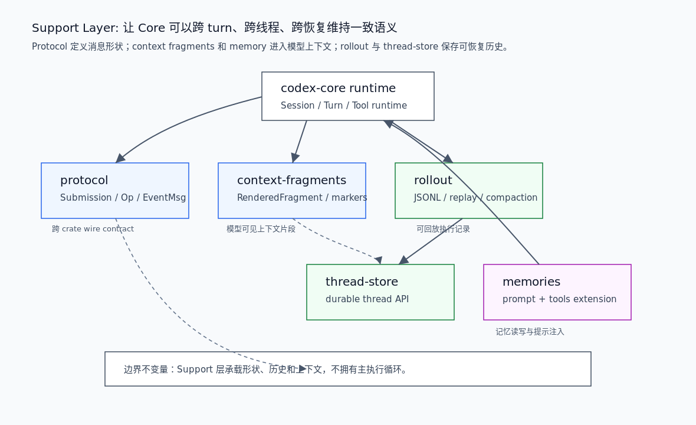

# 00. Support 层总览

Support 层承载 Codex harness 的协议、状态、持久化、上下文片段和 memory 能力。它不拥有主执行循环，但 Core 的每次 turn 都依赖它来描述输入输出、保存可恢复历史、重建模型上下文和注入长期记忆。

## 读完你应掌握什么



开篇全局图：这张图从 `codex-core runtime` 出发，展示 Support 层的五个关键支柱：`protocol` 定义 submission/event wire shape，`context-fragments` 把结构化上下文渲染成模型可见消息，`rollout` 记录 JSONL 执行历史，`thread-store` 提供 durable thread API，`memories` 通过 extension registry 注入 prompt 和工具。对应源码锚点是 `repo/codex/codex-rs/protocol/src/protocol.rs`、`repo/codex/codex-rs/history/src/lib.rs`、`repo/codex/codex-rs/rollout/src/recorder.rs`、`repo/codex/codex-rs/thread-store/src/store.rs`、`repo/codex/codex-rs/context-fragments/src/fragment.rs` 和 `repo/codex/codex-rs/ext/memories/src/extension.rs`。

- 能区分协议类型、rollout 记录、thread store 和上下文片段的职责。
- 能解释 Support 层为什么是 Core 的状态基座，而不是 Core 的替代实现。
- 能从一个 turn 的输入追到 protocol submission、rollout item、thread store persist 和 context fragment。
- 能判断 memory extension 如何进入 prompt 和 tool list。

## 这个模块解决什么问题

Core runtime 负责执行，但执行需要一组稳定支撑能力：

1. 输入输出要有跨 crate 的协议类型，不能靠临时 JSON。
2. 模型上下文要由结构化片段构造，不能只拼字符串。
3. 执行历史要可审计、可恢复、可压缩。
4. thread 持久化要有 storage-neutral API，不能把 Core 绑死到某个本地实现。
5. memory 要能作为扩展贡献 prompt 和工具，而不是散落在 turn loop 里。

Support 层把这些能力拆开，使 Core 可以专注 runtime loop。

## 源码锚点

- `repo/codex/codex-rs/protocol/src/protocol.rs`：`Submission`、`Op`、`EventMsg`、context tags、realtime payload。
- `repo/codex/codex-rs/history/src/lib.rs`：`ResponseItemEnvelope`、`CodexHarnessMetadata`、`RolloutItem`、`CompactedItem`。
- `repo/codex/codex-rs/rollout/src/lib.rs`：rollout JSONL line 解码、模块出口和 session source。
- `repo/codex/codex-rs/rollout/src/recorder.rs`：`RolloutRecorder` 和 `RolloutRecorderParams`。
- `repo/codex/codex-rs/thread-store/src/store.rs`：`ThreadStore` trait 和持久化 API。
- `repo/codex/codex-rs/context-fragments/src/fragment.rs`：`ContextualUserFragment` 与 `RenderedFragment`。
- `repo/codex/codex-rs/ext/memories/src/extension.rs`：memory extension 对 prompt、thread lifecycle、config 和 tools 的贡献。

## 核心抽象

| 抽象 | 所属 crate | 职责 | Core 如何使用 |
| --- | --- | --- | --- |
| `Submission` / `Op` / `EventMsg` | `protocol` | 表达输入队列和事件队列的稳定协议 | Core 用它接收输入、输出事件和关联 trace |
| `ResponseItemEnvelope` | `history` | 给 Responses API item 附加 harness metadata | rollout 和 resume 保留模型历史与额外状态 |
| `RolloutItem` | `history` / `rollout` | JSONL 中的可持久化事件单元 | Core 写入、恢复和压缩历史时读取 |
| `RolloutRecorder` | `rollout` | 后台写 rollout JSONL | Core 每次关键事件持久化到可恢复文件 |
| `ThreadStore` | `thread-store` | storage-neutral thread persistence API | Core 和 app-server 可用同一接口创建、恢复、fork、flush |
| `ContextualUserFragment` | `context-fragments` | 把结构化上下文变成模型可见 response item | WorldState、AGENTS、memory 等上下文都可按片段注入 |
| `MemoriesExtension` | `ext/memories` | 在 thread context 和 tool list 中贡献 memory 能力 | Core extension registry 调用 contributor |

无需额外数据图：开篇 PNG 已经展示 Support 层内部五类支撑能力的关系，本节表格补充抽象职责。

## 核心代码片段

### 1. `Submission` 是 Core 输入队列的协议边界

Source: `repo/codex/codex-rs/protocol/src/protocol.rs::Submission`
Line range: `repo/codex/codex-rs/protocol/src/protocol.rs:190-215`

```rust
/// Submission Queue Entry - requests from user
#[derive(Debug)]
pub struct Submission {
    /// Unique id for this Submission to correlate with Events
    pub id: String,
    /// Payload
    pub op: Op,
    /// Optional W3C trace carrier propagated across async submission handoffs.
    pub trace: Option<W3cTraceContext>,
    /// Core-provided ID of the parent turn that directly initiated this submission.
    ///
    /// This is only used for inter-agent communication.
    pub parent_turn_id: Option<String>,
    /// Core-provided ID of the top-level turn that causally initiated this submission.
    pub root_turn_id: Option<String>,
}

#[derive(Debug, Clone, Deserialize, Serialize, PartialEq, Eq, JsonSchema, TS)]
pub struct W3cTraceContext {
    #[serde(default, skip_serializing_if = "Option::is_none")]
    #[ts(optional)]
    pub traceparent: Option<String>,
    #[serde(default, skip_serializing_if = "Option::is_none")]
    #[ts(optional)]
    pub tracestate: Option<String>,
}
```

这段说明 Support 层的 protocol crate 不只是“类型集合”：`Submission` 携带 `id`、`op`、trace 和 parent/root turn id，使异步入口、Core 和 multi-agent 都能围绕同一个输入边界关联事件。

### 2. `RolloutItem` 固化可恢复历史的记录类型

无需图：本节解释的是 persisted item 枚举形状，开篇综合图已经覆盖 rollout 在 Support 层的位置；具体语义以枚举片段和后续风险表为准。

Source: `repo/codex/codex-rs/history/src/lib.rs::RolloutItem`
Line range: `repo/codex/codex-rs/history/src/lib.rs:116-166`

```rust
/// Persisted rollout item used by core history and rollout storage.
#[derive(Debug, Clone)]
pub enum RolloutItem {
    SessionMeta(SessionMetaLine),
    ResponseItem(ResponseItemEnvelope),
    InterAgentCommunication(InterAgentCommunication),
    InterAgentCommunicationMetadata {
        trigger_turn: bool,
    },
    Compacted(CompactedItem),
    TurnContext(TurnContextItem),
    TokenUsageRecord(TokenUsageRecord),
    WorldState(WorldStateItem),
    SecurityRiskScore(SecurityRiskScore),
    RetainedContext(RetainedContextEvent),
    EventMsg(EventMsg),
    /// Sparse, model-invisible facts used to reconstruct realtime presentation.
    RealtimeItem(RealtimeItem),
}

impl Serialize for RolloutItem {
    fn serialize<S>(&self, serializer: S) -> Result<S::Ok, S::Error>
    where
        S: Serializer,
    {
        rollout_payload::RolloutItemWire::from(self).serialize(serializer)
    }
}

impl<'de> Deserialize<'de> for RolloutItem {
    fn deserialize<D>(deserializer: D) -> Result<Self, D::Error>
    where
        D: Deserializer<'de>,
    {
        rollout_payload::RolloutItemWire::deserialize(deserializer).map(Into::into)
    }
}
```

这段证明 rollout 不只是日志字符串。它区分 session meta、模型 item、multi-agent 通信、compaction、turn context、token usage、world state、security risk、retained context、event 和 realtime presentation。恢复和压缩必须理解这些 item 的语义。

### 3. `ThreadStore` 是持久化实现的中立边界

Source: `repo/codex/codex-rs/thread-store/src/store.rs::ThreadStore`
Line range: `repo/codex/codex-rs/thread-store/src/store.rs:67-145`

```rust
/// Storage-neutral thread persistence boundary.
pub trait ThreadStore: Any + Send + Sync {
    /// Return this store as [`Any`] for implementation-owned escape hatches.
    fn as_any(&self) -> &dyn Any;

    /// Returns the history mode to use when history does not carry a persisted mode.
    ///
    /// The default is legacy so existing stores stay compatible. Stores whose durable contract is
    /// already paginated should override this instead of relying on core to infer storage behavior.
    fn default_history_mode(&self) -> ThreadHistoryMode {
        ThreadHistoryMode::Legacy
    }

    /// Creates a new live thread.
    fn create_thread(&self, params: CreateThreadParams) -> ThreadStoreFuture<'_, ()>;

    /// Stages host-owned metadata for a thread ID reserved before Core starts the thread.
    ///
    /// The entry remains in memory until the first successful metadata update for that thread.
    /// Callers must remove it if startup fails before the store opens a live thread.
    fn stage_pending_thread_metadata(
        &self,
        _thread_id: ThreadId,
        _patch: ThreadMetadataPatch,
    ) -> ThreadStoreFuture<'_, ()> {
        Box::pin(async {
            Err(ThreadStoreError::Unsupported {
                operation: "stage_pending_thread_metadata",
            })
        })
    }

    /// Reopens an existing thread for live appends.
    fn resume_thread(&self, params: ResumeThreadParams) -> ThreadStoreFuture<'_, ()>;

    /// Appends raw rollout items to a live thread.
    ///
    /// Implementations should apply the shared rollout persistence policy before writing durable
    /// replay history and before updating any implementation-owned projections.
    fn append_items(&self, params: AppendThreadItemsParams) -> ThreadStoreFuture<'_, ()>;

    /// Materializes the thread if persistence is lazy, then persists all queued items.
    ///
    /// Standard persistence must complete before returning. Turn-start persistence may complete
    /// in the background when the implementation enqueues it before returning, fences it with
    /// subsequent flush or shutdown operations, and surfaces failures through those operations.
    fn persist_thread(
        &self,
        thread_id: ThreadId,
        context: PersistContext,
    ) -> ThreadStoreFuture<'_, ()>;
```

这段说明 Support 层把存储能力抽成 trait：Core 需要 create/resume/append/persist/flush/load，但不需要知道底层是 JSONL、SQLite、内存还是远端服务。

### 4. `ContextualUserFragment` 把结构化上下文变成模型可见 item

无需图：本节证明 fragment trait 的渲染合同，开篇综合图已经说明 context-fragments 与 Core 的连接；字段和方法签名比额外图更能说明 marker / body / content kind 的边界。

Source: `repo/codex/codex-rs/context-fragments/src/fragment.rs::ContextualUserFragment`
Line range: `repo/codex/codex-rs/context-fragments/src/fragment.rs:55-119`

```rust
/// Context payload that is injected as a message fragment.
///
/// Implementations own the response role and provide the exact fragment body.
/// Marked fragments also provide start/end markers used to recognize injected
/// context later. `render()` concatenates markers and body without adding
/// separators, so implementations should include any whitespace they need
/// between tags in `body()`. Unmarked fragments should leave both markers empty,
/// in which case the default helpers render only the body and never match
/// arbitrary text.
pub trait ContextualUserFragment {
    fn role(&self) -> &'static str;

    /// Returns a stable `<feature>.<name>` classification, using `generic` for shared fragments.
    fn content_kind(&self) -> ContentItemKind;

    /// Whether this fragment must be recorded as its own response item.
    fn requires_separate_message(&self) -> bool {
        false
    }

    fn markers(&self) -> (&'static str, &'static str);

    fn body(&self) -> String;

    fn type_markers() -> (&'static str, &'static str)
    where
        Self: Sized;

    fn matches_text(text: &str) -> bool
    where
        Self: Sized,
    {
        let (start_marker, end_marker) = Self::type_markers();
        matches_marked_text(start_marker, end_marker, text)
    }

    fn render(&self) -> String {
        let (start_marker, end_marker) = self.markers();
        let body = self.body();
        if start_marker.is_empty() && end_marker.is_empty() {
            return body;
        }

        format!("{start_marker}{body}{end_marker}")
    }
}
```

这段说明“模型上下文”不是任意字符串。每个 fragment 有 role、content kind、marker、body 和识别逻辑，Core 可以把结构化环境、memory、AGENTS 等材料渲染成可追踪的 response item。

### 5. Memory 是 extension contributor，不是 turn loop 内联逻辑

Source: `repo/codex/codex-rs/ext/memories/src/extension.rs::MemoriesExtension`
Line range: `repo/codex/codex-rs/ext/memories/src/extension.rs:51-136`

```rust
impl ContextContributor for MemoriesExtension {
    fn contribute_thread_context<'a>(
        &'a self,
        _session_store: &'a ExtensionData,
        thread_store: &'a ExtensionData,
    ) -> std::pin::Pin<Box<dyn std::future::Future<Output = Vec<PromptFragment>> + Send + 'a>> {
        Box::pin(async move {
            let Some(config) = thread_store.get::<MemoriesExtensionConfig>() else {
                return Vec::new();
            };
            if !config.enabled {
                return Vec::new();
            }

            build_memory_tool_developer_instructions(&config.codex_home)
                .await
                .map(|instructions| {
                    PromptFragment::developer_policy(
                        instructions,
                        ContentItemKind("memories.instructions".to_string()),
                    )
                })
                .into_iter()
                .collect()
        })
    }
}

impl ToolContributor for MemoriesExtension {
    fn tools(
        &self,
        _session_store: &ExtensionData,
        thread_store: &ExtensionData,
    ) -> Vec<
        Arc<dyn for<'call> codex_extension_api::ToolExecutor<codex_extension_api::ToolCall<'call>>>,
    > {
        let Some(config) = thread_store.get::<MemoriesExtensionConfig>() else {
            return Vec::new();
        };
        if !config.enabled || !config.dedicated_tools {
            return Vec::new();
        }

        tools::memory_tools(
            LocalMemoriesBackend::from_codex_home(&config.codex_home),
            self.metrics_client.clone(),
        )
    }
}

pub fn install(
    registry: &mut ExtensionRegistryBuilder<Config>,
    metrics_client: Option<MetricsClient>,
) {
    let extension = Arc::new(MemoriesExtension::new(metrics_client));
    registry.thread_lifecycle_contributor(extension.clone());
    registry.config_contributor(extension.clone());
    registry.prompt_contributor(extension.clone());
    registry.tool_contributor(extension);
}
```

这段说明 memory 通过 extension registry 进入 thread lifecycle、config、prompt 和 tools 四个贡献点。它是 Support 层与 Extension 机制之间的交界：数据和 prompt 是支撑能力，贡献方式走扩展接口。

## 主流程


无需另加第二张流程图；本节也无需代码片段，因为支撑层主流程的关键代码证据已经在上方 `Submission`、`RolloutItem`、`ThreadStore`、`ContextualUserFragment` 和 `MemoriesExtension` 片段中覆盖。开篇图已经表达 Support 层如何围绕 Core runtime 提供状态、协议和持久化。本节按一次 turn 展开它的支撑路径。

1. Entry 或 Core 构造 `Submission`，用 `id`、`op`、trace 和 parent/root turn id 关联请求。
2. Core 执行 turn 时会产生 `EventMsg`、`ResponseItem`、`WorldState`、`TurnContext`、`TokenUsageRecord` 等 item。
3. `history` 将这些 item 包装为 `RolloutItem`，保留模型可见历史和 harness metadata。
4. `rollout` 将 `RolloutItem` 写成 JSONL，并提供 parse、seek、compression、search、session index 等恢复支撑。
5. `thread-store` 提供 create/resume/append/persist/flush/load/fork/revert 等持久化 API，让不同存储实现遵守同一 thread 语义。
6. `context-fragments` 把环境、用户指令、memory、world state 等支撑材料渲染为模型可见片段。
7. `ext/memories` 根据 config 和 feature gate 注入 memory prompt 或 dedicated tools，作为 turn 上下文的一部分。

## 失败模式与边界条件


这张图也能定位 Support 层失败边界：如果协议、rollout、thread-store 或 context fragment 任何一侧语义漂移，Core 的恢复和模型上下文都会不一致。

| 风险 | 所属支撑面 | 代码锚点 | 结果 |
| --- | --- | --- | --- |
| 协议字段语义漂移 | `protocol` | `repo/codex/codex-rs/protocol/src/protocol.rs::Submission` | 入口、Core、app-server 无法可靠关联 request / event / trace |
| rollout item 过滤错误 | `history` / `rollout` | `repo/codex/codex-rs/history/src/lib.rs::RolloutItem` | resume、compaction、memory job 可能丢历史或重放错误 |
| thread-store 不遵守 flush/persist 语义 | `thread-store` | `repo/codex/codex-rs/thread-store/src/store.rs::ThreadStore` | 线程恢复读到未落盘或部分落盘状态 |
| fragment marker 冲突 | `context-fragments` | `repo/codex/codex-rs/context-fragments/src/fragment.rs::ContextualUserFragment` | 注入上下文无法识别、替换或去重 |
| memory config 与 tool 注入不同步 | `ext/memories` | `repo/codex/codex-rs/ext/memories/src/extension.rs::MemoriesExtension` | 模型看到 memory 指令但没有工具，或工具暴露但提示不清 |

无需代码片段：风险表中的核心类型和分支已经在 `## 核心代码片段` 中展示。

## 图示

本篇使用 `../../image/state-memory/harness-support-layer-v1.png` 作为开篇综合图和主流程图。图片已放在开篇和主流程附近；本节只作为资产说明，不作为主要阅读路径。

## 复设计练习

设计一个最小 agent harness 的 Support 层，要求：

1. 定义输入队列和事件队列协议。
2. 定义模型历史 item 和 harness metadata 的分离方式。
3. 定义持久化记录如何支持 resume / fork / compaction。
4. 定义 storage-neutral thread store API。
5. 定义上下文片段如何标记、渲染、识别和去重。
6. 定义 memory 如何作为扩展贡献 prompt 和工具。

一个合理设计应该能说明“什么是执行状态、什么是持久化事实、什么是模型可见上下文”，并避免把这些职责塞进一个全局 session 对象。

## 检查题

1. 为什么 `Submission` 要包含 `id`、trace、parent/root turn id，而不是只有用户输入文本？
2. `RolloutItem` 为什么同时包含 `ResponseItem`、`WorldState`、`TurnContext`、`EventMsg` 和 `Compacted`？
3. `ThreadStore` trait 为什么需要 `persist_thread`、`flush_thread` 和 `shutdown_thread` 三种不同操作？
4. `ContextualUserFragment` 的 markers 和 content kind 解决了什么问题？
5. `MemoriesExtension` 为什么同时实现 context contributor 和 tool contributor？

### 答案要点

1. 因为输入会跨异步队列、事件流和 multi-agent 因果链传播；只有文本无法关联事件、trace、父 turn 和根 turn。
2. rollout 是恢复材料而不只是聊天记录；恢复需要模型历史、world state、turn context、事件、压缩结果和安全/usage 等多种事实。
3. `persist_thread` 负责把队列材料变 durable，`flush_thread` 保证已排队写入可读，`shutdown_thread` 关闭 live writer；三者对应不同生命周期和错误传播时机。
4. markers 让系统识别已经注入的上下文块，content kind 让持久化和后续处理知道片段来源与类型，避免不可追踪的字符串拼接。
5. memory 既要告诉模型可以如何使用记忆，也可能暴露 dedicated tools；两者必须由同一 config 决定，才能避免提示和工具列表不一致。

## Follow-up Slots

- 已落地：`docs/support/01-protocol-rollout-thread-store.md` 串联 `Submission` / `Op` / `EventMsg`、`RolloutItem`、rollout JSONL、`ThreadStore` 和 context fragment。
- 拆出 `docs/support/03-memory-context.md`，覆盖 memory read/write pipeline、ad-hoc note、prompt injection 和 citation。
