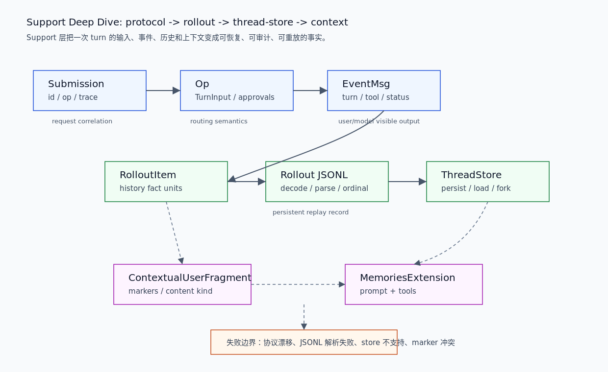

# 01. Protocol / Rollout / ThreadStore 支撑链路

本文补足 Support 层的具体链路：一次 turn 的输入如何通过 `protocol` 进入 Core，执行事实如何被包装成 `RolloutItem`，rollout JSONL 如何保持可解析，`ThreadStore` 如何提供持久化边界，context fragment 和 memory 又如何回到模型上下文。

## 读完你应掌握什么



开篇全局图：从上往下读。`Submission -> Op -> EventMsg` 是协议层输入/输出；`RolloutItem -> Rollout JSONL -> ThreadStore` 是持久化与恢复层；`ContextualUserFragment` 和 `MemoriesExtension` 是模型上下文支撑层。对应源码锚点是 `repo/codex/codex-rs/protocol/src/protocol.rs`、`repo/codex/codex-rs/history/src/lib.rs`、`repo/codex/codex-rs/rollout/src/lib.rs`、`repo/codex/codex-rs/thread-store/src/store.rs`、`repo/codex/codex-rs/context-fragments/src/fragment.rs` 和 `repo/codex/codex-rs/ext/memories/src/extension.rs`。

- 能解释 `Submission` / `Op` / `EventMsg` 分别承担什么协议职责。
- 能说明 rollout JSONL 为什么不是普通日志，而是恢复材料。
- 能区分 `RolloutRecorder` 与 `ThreadStore`：一个写记录，一个定义 durable thread API。
- 能说明 context fragment 和 memory 如何进入模型输入，而不是混在历史字符串里。

## 这个模块解决什么问题

Core runtime 是执行者，但如果没有 Support 层，它没有稳定输入协议、没有可恢复历史、没有 storage-neutral 持久化，也没有可追踪的模型上下文片段。Support 层解决的是“执行事实如何被表达和保存”的问题。

这条链路有三个关键不变量：

1. 协议对象必须能跨入口、Core、TUI、app-server 和 rollout 投影复用。
2. 持久化对象必须足够结构化，能够支持 resume、fork、compaction 和审计。
3. 模型上下文必须能标记来源、渲染内容和识别已注入片段。

## 源码锚点

- `repo/codex/codex-rs/protocol/src/protocol.rs::Submission`：输入队列单元，关联 request id、op、trace 和 turn 因果。
- `repo/codex/codex-rs/protocol/src/protocol.rs::Op`：Core submission 的行为枚举。
- `repo/codex/codex-rs/protocol/src/protocol.rs::Event` / `EventMsg`：输出事件和用户/model/tool 可见状态。
- `repo/codex/codex-rs/history/src/lib.rs::RolloutItem`：持久化事实类型。
- `repo/codex/codex-rs/rollout/src/lib.rs::decode_rollout_line`：JSONL line 解码边界。
- `repo/codex/codex-rs/rollout/src/recorder.rs::RolloutRecorder`：后台 rollout writer。
- `repo/codex/codex-rs/thread-store/src/store.rs::ThreadStore`：thread persistence trait。
- `repo/codex/codex-rs/context-fragments/src/fragment.rs::ContextualUserFragment`：上下文片段渲染合同。
- `repo/codex/codex-rs/ext/memories/src/extension.rs::MemoriesExtension`：memory prompt/tool contributor。

## 核心抽象

| 抽象 | 稳定职责 | 关键边界 | 错误影响 |
| --- | --- | --- | --- |
| `Submission` | 把一次输入和 trace/因果关系送入 Core | Entry -> Core | 事件无法关联 request |
| `Op` | 定义 Core 可处理的操作集合 | protocol -> session | 输入路由语义漂移 |
| `EventMsg` | 定义 Core 输出事件集合 | Core -> Entry / rollout | UI 和恢复投影不一致 |
| `RolloutItem` | 记录可持久化执行事实 | history -> rollout | resume/compaction 丢事实 |
| `decode_rollout_line` | JSONL 到 typed `RolloutLine` | disk -> memory | 历史无法恢复 |
| `ThreadStore` | 抽象 durable thread 操作 | Core/app-server -> storage | lazy persistence 或 fork/revert 语义不稳定 |
| `ContextualUserFragment` | 渲染模型可见上下文 | support -> model input | marker 冲突或重复注入 |
| `MemoriesExtension` | 注入 memory prompt/tools | extension registry -> context/tools | memory 提示和工具不一致 |

无需额外图：开篇图已经展示这些抽象的流向和层次，本节表格补职责和失败影响。

## 核心代码片段

### 1. `Op` 固定 Core submission 的操作集合

无需图：本节证明协议枚举形状，开篇图已经展示 `Submission -> Op` 的位置。

Source: `repo/codex/codex-rs/protocol/src/protocol.rs::Op`
Line range: `repo/codex/codex-rs/protocol/src/protocol.rs:592-725`

```rust
pub enum Op {
    /// Abort current task without terminating background terminal processes.
    /// This server sends [`EventMsg::TurnAborted`] in response.
    Interrupt,

    /// Terminate all running background terminal processes for this thread.
    /// Use this when callers intentionally want to stop long-lived background shells.
    CleanBackgroundTerminals,

    /// Start a realtime conversation stream.
    RealtimeConversationStart(ConversationStartParams),

    /// Submit turn input using the requested routing behavior.
    TurnInput {
        request: Box<TurnInputRequest>,
        mode: TurnInputMode,
        reply: oneshot::Sender<CodexResult<TurnInputSubmission>>,
    },

    /// Resume an interrupted regular turn.
    RecoverTurn {
        thread_settings: ThreadSettingsOverrides,
        start_options: TurnStartOptions,
        reply: oneshot::Sender<CodexResult<TurnInputSubmission>>,
    },

    /// Apply thread-settings overrides without starting a turn.
    ThreadSettings {
        /// Sparse thread-settings overrides to apply.
        thread_settings: ThreadSettingsOverrides,
    },

    /// Approve a command execution
    ExecApproval {
        id: String,
        turn_id: Option<String>,
        decision: ReviewDecision,
    },

    /// Resolve an MCP elicitation request.
    ResolveElicitation {
        server_name: String,
        request_id: RequestId,
        decision: ElicitationAction,
        content: Option<Value>,
        meta: Option<Value>,
    },
}
```

这段说明 Core submission 不是“用户文本”一种输入。中断、清理后台终端、realtime、turn input、恢复 turn、settings、审批、MCP elicitation 都通过同一个 `Op` 枚举进入 session 调度。

### 2. `Event` / `EventMsg` 固定 Core 输出事件

无需图：本节证明输出事件的 wire shape，开篇图已经展示 `EventMsg` 作为协议输出。

Source: `repo/codex/codex-rs/protocol/src/protocol.rs::EventMsg`
Line range: `repo/codex/codex-rs/protocol/src/protocol.rs:1338-1455`

```rust
pub struct Event {
    /// Submission `id` that this event is correlated with.
    pub id: String,
    /// Payload
    pub msg: EventMsg,
}

/// Response event from the agent
/// NOTE: Make sure none of these values have optional types, as it will mess up the extension code-gen.
#[derive(Debug, Clone, Deserialize, Serialize, Display, JsonSchema, TS)]
#[serde(tag = "type", rename_all = "snake_case")]
#[ts(tag = "type")]
#[strum(serialize_all = "snake_case")]
pub enum EventMsg {
    /// Error while executing a submission
    Error(ErrorEvent),

    /// Warning issued while processing a submission. Unlike `Error`, this
    /// indicates the turn continued but the user should still be notified.
    Warning(WarningEvent),

    /// Conversation history was compacted (either automatically or manually).
    ContextCompacted(ContextCompactedEvent),

    /// Conversation history was rolled back by dropping the last N user turns.
    ThreadRolledBack(ThreadRolledBackEvent),

    /// Agent has started a turn.
    /// v1 wire format uses `task_started`; accept `turn_started` for v2 interop.
    #[serde(rename = "task_started", alias = "turn_started")]
    TurnStarted(TurnStartedEvent),

    /// Agent has completed all actions.
    /// v1 wire format uses `task_complete`; accept `turn_complete` for v2 interop.
    #[serde(rename = "task_complete", alias = "turn_complete")]
    TurnComplete(TurnCompleteEvent),

    /// Agent text output message
    AgentMessage(AgentMessageEvent),
}
```

这段说明输出事件不仅面向 UI，也面向 rollout 和兼容层。`Event` 用 submission id 关联输入，`EventMsg` 用 tagged enum 表达错误、警告、压缩、回滚、turn start/complete、message 等事件。

### 3. `RolloutItem` 保存可恢复执行事实

无需图：本节解释的是持久化枚举，开篇图已经展示 `EventMsg -> RolloutItem`。

Source: `repo/codex/codex-rs/history/src/lib.rs::RolloutItem`
Line range: `repo/codex/codex-rs/history/src/lib.rs:116-166`

```rust
/// Persisted rollout item used by core history and rollout storage.
#[derive(Debug, Clone)]
pub enum RolloutItem {
    SessionMeta(SessionMetaLine),
    ResponseItem(ResponseItemEnvelope),
    InterAgentCommunication(InterAgentCommunication),
    InterAgentCommunicationMetadata {
        trigger_turn: bool,
    },
    Compacted(CompactedItem),
    TurnContext(TurnContextItem),
    TokenUsageRecord(TokenUsageRecord),
    WorldState(WorldStateItem),
    SecurityRiskScore(SecurityRiskScore),
    RetainedContext(RetainedContextEvent),
    EventMsg(EventMsg),
    /// Sparse, model-invisible facts used to reconstruct realtime presentation.
    RealtimeItem(RealtimeItem),
}

impl Serialize for RolloutItem {
    fn serialize<S>(&self, serializer: S) -> Result<S::Ok, S::Error>
    where
        S: Serializer,
    {
        rollout_payload::RolloutItemWire::from(self).serialize(serializer)
    }
}
```

这段说明 rollout 是 typed fact stream。模型 item、compaction、turn context、world state、event、security risk 和 realtime presentation 都能被结构化保存。

### 4. rollout JSONL 解码守住磁盘边界

无需图：本节证明 JSONL 解析边界，开篇图已经展示 rollout JSONL 的位置。

Source: `repo/codex/codex-rs/rollout/src/lib.rs::decode_rollout_line`
Line range: `repo/codex/codex-rs/rollout/src/lib.rs:38-80`

```rust
/// Decodes a persisted rollout record without Serde's flattened-envelope buffering.
///
/// With `serde_json/arbitrary_precision`, Serde's generic buffer cannot replay
/// floating-point values nested inside flattened or internally tagged fields:
/// https://github.com/serde-rs/json/issues/721
/// https://github.com/serde-rs/serde/issues/1183
///
/// Keep this JSON-specific workaround at the persistence boundary so history
/// remains format-neutral and resume and projection use the same item decoder.
pub fn decode_rollout_line(value: Value) -> serde_json::Result<RolloutLine> {
    let Value::Object(mut fields) = value else {
        return Err(serde_json::Error::custom(
            "rollout line must be a JSON object",
        ));
    };
    let timestamp = fields
        .remove("timestamp")
        .ok_or_else(|| serde_json::Error::missing_field("timestamp"))
        .and_then(serde_json::from_value)?;
    let ordinal = fields
        .remove("ordinal")
        .map(serde_json::from_value::<Option<u64>>)
        .transpose()?
        .flatten();
    let item = serde_json::from_value(Value::Object(fields))?;

    Ok(RolloutLine {
        timestamp,
        ordinal,
        item,
    })
}
```

这段说明 rollout 解码是显式边界：timestamp、ordinal 和 item 被拆开解析，避免 Serde flattened envelope 的精度/缓冲问题污染 history 层。

### 5. `ThreadStore` 抽象 durable thread 能力

无需图：本节证明 storage-neutral trait，开篇图已经展示 thread-store 作为持久化 API。

Source: `repo/codex/codex-rs/thread-store/src/store.rs::ThreadStore`
Line range: `repo/codex/codex-rs/thread-store/src/store.rs:67-145`

```rust
/// Storage-neutral thread persistence boundary.
pub trait ThreadStore: Any + Send + Sync {
    /// Return this store as [`Any`] for implementation-owned escape hatches.
    fn as_any(&self) -> &dyn Any;

    /// Returns the history mode to use when history does not carry a persisted mode.
    fn default_history_mode(&self) -> ThreadHistoryMode {
        ThreadHistoryMode::Legacy
    }

    /// Creates a new live thread.
    fn create_thread(&self, params: CreateThreadParams) -> ThreadStoreFuture<'_, ()>;

    /// Reopens an existing thread for live appends.
    fn resume_thread(&self, params: ResumeThreadParams) -> ThreadStoreFuture<'_, ()>;

    /// Appends raw rollout items to a live thread.
    ///
    /// Implementations should apply the shared rollout persistence policy before writing durable
    /// replay history and before updating any implementation-owned projections.
    fn append_items(&self, params: AppendThreadItemsParams) -> ThreadStoreFuture<'_, ()>;

    /// Materializes the thread if persistence is lazy, then persists all queued items.
    fn persist_thread(
        &self,
        thread_id: ThreadId,
        context: PersistContext,
    ) -> ThreadStoreFuture<'_, ()>;

    /// Flushes all queued items and returns once they are durable/readable.
    fn flush_thread(&self, thread_id: ThreadId) -> ThreadStoreFuture<'_, ()>;
}
```

这段说明 `ThreadStore` 不是简单读写文件。它定义 create/resume/append/persist/flush 等 live writer 生命周期，让 Core 不依赖具体存储实现。

## 主流程


无需代码片段：主流程关键类型和解码边界已在上方 `Op`、`EventMsg`、`RolloutItem`、`decode_rollout_line` 和 `ThreadStore` 片段中覆盖。

1. Entry 层构造 request，Core 将其表示为 `Submission { id, op, trace, parent_turn_id, root_turn_id }`。
2. `Op` 决定 Core 要处理的是 turn input、settings、approval、MCP elicitation、realtime 还是中断/恢复。
3. Core 执行后输出 `Event { id, msg: EventMsg }`，入口层和 app-server 可以按 submission id 投影 UI/response。
4. history 层把模型 item、事件、world state、turn context、compaction 等包装成 `RolloutItem`。
5. rollout 层把这些 item 写成 JSONL，并用 `decode_rollout_line` / `parse_rollout_line` 从磁盘恢复 typed `RolloutLine`。
6. thread-store 层把 live writer 和 durable thread API 抽象出来，支持 create/resume/append/persist/flush/load/fork/revert。
7. context-fragments 和 memory extension 在下一次 turn 构造 prompt 时把支撑事实变回模型可见上下文。

## 失败模式与边界条件

无需图：本节使用 failure matrix 表达“失败点 -> 捕获位置 -> 可见结果 -> 恢复语义”，开篇支撑链路图已经覆盖 protocol、rollout、thread-store 和 context 的层级位置。

| 失败点 | 捕获位置 | 用户/模型可见结果 | 恢复语义 |
| --- | --- | --- | --- |
| `Op` 语义与入口 request 不一致 | protocol / request processor | request error 或错误事件 | 修入口映射，不能在 Core 里猜测 |
| `EventMsg` wire 兼容断裂 | protocol tagged enum / aliases | TUI/app-server projection 失败 | 需要协议兼容或迁移 |
| rollout line 非 object 或缺 timestamp | `decode_rollout_line` | resume/search 读失败 | 该行无法作为 typed history 恢复 |
| `RolloutItem` 过滤错误 | rollout policy / history | compaction/resume 丢上下文 | 回到 typed item 与 policy 复核 |
| `ThreadStore` 不支持 paginated list | app-server thread start guard | `thread/start` invalid request | 使用 legacy history 或换支持的 store |
| context marker 冲突 | `ContextualUserFragment::matches_text` | 重复注入或无法识别 retained context | 修 marker 和 content kind |

无需代码片段：失败表中的关键 guard 已由本篇和 `00-support-map.md` 的代码证据覆盖。

## 行为证据矩阵

| Behavior rule | Source anchor | Test anchor | Reader conclusion |
| --- | --- | --- | --- |
| Core submission 不只承载用户文本，还承载审批、MCP、realtime 和控制操作 | `repo/codex/codex-rs/protocol/src/protocol.rs::Op` | `source-only` | Support 协议层是跨入口和 Core 的输入合同。 |
| Core event 用 submission id 关联输出和触发输入 | `repo/codex/codex-rs/protocol/src/protocol.rs::Event` | `source-only` | Entry/TUI/app-server 可以把异步事件投影回正确 request。 |
| rollout history 保存 typed fact，而不是普通日志 | `repo/codex/codex-rs/history/src/lib.rs::RolloutItem` | `source-only` | resume、compaction 和审计依赖结构化 item。 |
| JSONL 解码先拆外层 envelope，再解析 item | `repo/codex/codex-rs/rollout/src/lib.rs::decode_rollout_line` | `repo/codex/codex-rs/rollout/src/tests.rs` | rollout 磁盘边界显式处理 timestamp/ordinal 和 serde 兼容问题。 |
| durable thread API 与具体存储实现解耦 | `repo/codex/codex-rs/thread-store/src/store.rs::ThreadStore` | `repo/codex/codex-rs/thread-store/src/local/thread_history_materialization_tests.rs` | Core/app-server 可以依赖 create/resume/append/persist/flush 语义而不是存储细节。 |

## 图示

本篇的关键图示是 `../../image/state-memory/support-protocol-rollout-thread-store-v1.png`，已在开篇和主流程附近引用。它补充 `00-support-map.md` 的总览图，把协议、持久化和上下文支撑串成一条执行事实链路。

## 复设计练习

为一个 coding agent 设计 Support 层，要求支持 resume、fork 和 long-running thread：

1. 输入队列和事件队列的最小类型是什么？
2. 哪些执行事实必须进入 persisted history，哪些只是 UI 临时状态？
3. JSONL 解码边界如何处理版本兼容和缺字段？
4. ThreadStore trait 需要哪些方法才能支持 lazy persistence？
5. context fragment 如何避免重复注入和来源不明？

## 检查题

1. `Op` 为什么包含 approval、MCP elicitation 和 realtime，而不是只有 `TurnInput`？
2. `Event` 为什么需要 submission `id`？
3. `RolloutItem` 和普通 log line 的根本差异是什么？
4. `decode_rollout_line` 为什么先拆 timestamp/ordinal 再解析 item？
5. `ThreadStore` 为什么要把 `append_items` 和 `persist_thread` 分开？

### 答案要点

1. Core 的输入不仅是用户 turn，还包括审批响应、MCP 交互、realtime 和控制操作；统一到 `Op` 才能走同一 submission 生命周期。
2. 同一 thread 可能有多个异步 submission，事件必须能关联回触发它的 request，入口层才能正确展示和响应。
3. `RolloutItem` 是 typed 恢复事实，包含模型 item、事件、world state、token usage、compaction 等语义；普通 log 只适合诊断，不足以恢复。
4. timestamp/ordinal 是 rollout line 的外层 envelope，item 是内部业务事实；先拆 envelope 可以绕开 flattened buffering 问题并保持 history 格式中立。
5. append 是把 item 加入 live writer，persist 是按上下文把已排队内容变 durable；分开后可以支持 turn-start 背景持久化、flush 和 shutdown fencing。

## Follow-up Slots

- 拆分 `protocol-events-and-items`，单独覆盖 app-server-protocol、`TurnItem` 和 UI projection。
- 拆分 `rollout-search-and-resume`，深挖 reverse scanner、session index、model context scan 和 compaction。
- 拆分 `memory-context-pipeline`，覆盖 memories read/write、ad-hoc note、citation 和 prompt injection。
